- [Microsoft Foundry Capabilities](#microsoft-foundry-capabilities)
  - [| **Text to Video** | Generate videos from text descriptions | Content creation, marketing, education | Azure Video Generation Service | Generate videos from prompts |](#-text-to-video--generate-videos-from-text-descriptions--content-creation-marketing-education--azure-video-generation-service--generate-videos-from-prompts-)
- [Develop generative AI apps in Azure](#develop-generative-ai-apps-in-azure)
  - [Responsible AI Practices](#responsible-ai-practices)
  - [Select, deploy, and evaluate Microsoft Foundry models](#select-deploy-and-evaluate-microsoft-foundry-models)
  - [Evaluation](#evaluation)
    - [Evaluation Types](#evaluation-types)
    - [Step-by-Step Evaluation Process](#step-by-step-evaluation-process)
    - [Questions](#questions)
  - [MS Foundry - developing AI Chat App](#ms-foundry---developing-ai-chat-app)
    - [Endpoints](#endpoints)
    - [SDKs Comparison](#sdks-comparison)
      - [Authentication Options](#authentication-options)
      - [Azure Managed Identities](#azure-managed-identities)
      - [Which One to Choose?](#which-one-to-choose)
    - [APIs](#apis)
    - [Quiz](#quiz)
  - [AI using Tools](#ai-using-tools)
    - [Popular AI Tools \& Capabilities](#popular-ai-tools--capabilities)
    - [Quiz](#quiz-1)
    - [Quiz](#quiz-2)
  - [Responsible AI](#responsible-ai)
    - [Creating Custom Guardrails - Step by Step](#creating-custom-guardrails---step-by-step)
    - [Guardrail Risk Categories](#guardrail-risk-categories)
    - [Quiz](#quiz-3)
- [AI Agent on Azure](#ai-agent-on-azure)
  - [Creating an agent in the Foundry portal](#creating-an-agent-in-the-foundry-portal)
  - [Adding basic tools](#adding-basic-tools)
    - [Agent Tool Categories](#agent-tool-categories)
    - [Configured Tools (Ready-to-Use)](#configured-tools-ready-to-use)
    - [Catalog Tools (Azure \& Third-Party)](#catalog-tools-azure--third-party)
    - [Custom Tools (OpenAPI \& MCP)](#custom-tools-openapi--mcp)
    - [Comparison: Tool Selection Guide](#comparison-tool-selection-guide)
  - [Deploying your agent](#deploying-your-agent)
  - [Publishing Agents to an Endpoint](#publishing-agents-to-an-endpoint)
    - [What Publishing Creates](#what-publishing-creates)
    - [Publishing from the Foundry Portal](#publishing-from-the-foundry-portal)
    - [Post-Publishing](#post-publishing)
    - [Code for Invoking Agent](#code-for-invoking-agent)
  - [MCP Approval Workflow](#mcp-approval-workflow)
    - [Streaming MCP Approval Request](#streaming-mcp-approval-request)
    - [Comparison: conversation\_id vs thread\_id + run\_id](#comparison-conversation_id-vs-thread_id--run_id)
    - [Force Human Approval: Always \& Conditional](#force-human-approval-always--conditional)
      - [1. Always Require Approval (Every Tool Call)](#1-always-require-approval-every-tool-call)
      - [2. Conditional Approval (Based on Criteria)](#2-conditional-approval-based-on-criteria)
      - [3. Comparison: Always vs Conditional Approval](#3-comparison-always-vs-conditional-approval)
      - [4. Approval Workflow Configuration in Foundry](#4-approval-workflow-configuration-in-foundry)
      - [5. Advanced Approval Patterns](#5-advanced-approval-patterns)
      - [6. Best Practices](#6-best-practices)
    - [Configuring Approval Enforcement in Azure AI Foundry](#configuring-approval-enforcement-in-azure-ai-foundry)
    - [Agent Resumption After Approval](#agent-resumption-after-approval)
  - [Azure Blob Storage - Direct Access Pattern](#azure-blob-storage---direct-access-pattern)
    - [Query-Time Processing Pipeline](#query-time-processing-pipeline)
    - [Performance Table by Document Count](#performance-table-by-document-count)
  - [SharePoint Remote vs SharePoint Indexed](#sharepoint-remote-vs-sharepoint-indexed)
    - [Architecture Comparison](#architecture-comparison)
    - [Performance \& Feature Comparison](#performance--feature-comparison)
    - [When to Use Each](#when-to-use-each)
  - [Sequential Publishing Architecture](#sequential-publishing-architecture)
    - [Publishing Flow Diagram](#publishing-flow-diagram)
    - [Key Publishing Concepts](#key-publishing-concepts)
    - [Post-Publishing Checklist](#post-publishing-checklist)
  - [Agent Memory Management](#agent-memory-management)
    - [Cosmos DB Partition Structure](#cosmos-db-partition-structure)
    - [Setting Up User Partitioning in Cosmos DB](#setting-up-user-partitioning-in-cosmos-db)
    - [Hierarchical Partitioning: user\_id → conversation\_id](#hierarchical-partitioning-user_id--conversation_id)
    - [Does Cosmos DB Know About user\_id? - Direct Answer](#does-cosmos-db-know-about-user_id---direct-answer)
    - [Partition Key Design - Best Practices](#partition-key-design---best-practices)
    - [Cost Impact: Partition Key Decisions](#cost-impact-partition-key-decisions)
    - [Conversation ID \& User Isolation](#conversation-id--user-isolation)
    - [User Attributes Required](#user-attributes-required)
    - [Tenant Isolation: Azure Automatic vs Manual](#tenant-isolation-azure-automatic-vs-manual)
    - [Three Memory Types in Azure](#three-memory-types-in-azure)
    - [Context Window Management](#context-window-management)
    - [Q\&A: Agent Memory in Azure](#qa-agent-memory-in-azure)
  - [Declarative Agents with YAML Configuration](#declarative-agents-with-yaml-configuration)
    - [What is a Declarative Agent?](#what-is-a-declarative-agent)
    - [YAML Configuration Structure](#yaml-configuration-structure)
    - [How Tools Connect to Agents](#how-tools-connect-to-agents)
    - [YAML Configuration Components](#yaml-configuration-components)
    - [Advantages of YAML Configuration](#advantages-of-yaml-configuration)
    - [Deploying Declarative Agents](#deploying-declarative-agents)
    - [Benefits of Foundry Portal Approach](#benefits-of-foundry-portal-approach)
    - [Quiz](#quiz-4)
- [Efficient RAG: Document Intelligence → Vector Storage → Multi-Tenant Retrieval](#efficient-rag-document-intelligence--vector-storage--multi-tenant-retrieval)
  - [The RAG Challenge for Beginners](#the-rag-challenge-for-beginners)
  - [Phase 1: Document Processing \& Intelligent Chunking](#phase-1-document-processing--intelligent-chunking)
    - [What is Azure Document Intelligence?](#what-is-azure-document-intelligence)
    - [Document Intelligence Output](#document-intelligence-output)
    - [Intelligent Chunking Strategy (Hierarchy-Aware)](#intelligent-chunking-strategy-hierarchy-aware)
  - [Phase 2: Vector Storage with Metadata](#phase-2-vector-storage-with-metadata)
    - [Azure AI Search: Your Vector Database](#azure-ai-search-your-vector-database)
    - [Index Schema (What Fields to Store)](#index-schema-what-fields-to-store)
    - [Data Persistence Example](#data-persistence-example)
  - [Phase 3: Retrieval with Multi-Tenant Isolation \& RBAC](#phase-3-retrieval-with-multi-tenant-isolation--rbac)
    - [The Seven-Step Retrieval Pipeline](#the-seven-step-retrieval-pipeline)
    - [Reranking: Why It Matters](#reranking-why-it-matters)
  - [Performance Metrics](#performance-metrics)
    - [Latency Breakdown](#latency-breakdown)
    - [Precision \& Recall](#precision--recall)
    - [Cost Per Query](#cost-per-query)
  - [Best Practices](#best-practices)
    - [✅ DO](#-do)
    - [❌ DON'T](#-dont)
    - [Interview Q\&A for AI-103](#interview-qa-for-ai-103)
- [NLP in Azure](#nlp-in-azure)
  - [Azure Language in Foundry Tools](#azure-language-in-foundry-tools)
    - [Resources](#resources)
    - [Python Code Example](#python-code-example)
    - [Response Example](#response-example)
    - [Language Processing Capabilities](#language-processing-capabilities)
    - [When to Use Azure Language](#when-to-use-azure-language)
  - [Azure Language Pricing \& Architecture](#azure-language-pricing--architecture)
  - [Using a Microsoft Foundry Resource for Text Analysis](#using-a-microsoft-foundry-resource-for-text-analysis)
    - [Authentication](#authentication)
    - [Get Credentials](#get-credentials)
    - [Key-Based Authentication](#key-based-authentication)
    - [Entra ID Authentication (Production)](#entra-id-authentication-production)
  - [Language Detection](#language-detection)
    - [Key Details](#key-details)
    - [Python Example](#python-example)
    - [Quiz](#quiz-5)
  - [Entity Detection](#entity-detection)
  - [PII Detection](#pii-detection)
- [Azure Vision](#azure-vision)
  - [MultiModal req/res](#multimodal-reqres)
    - [Quiz](#quiz-6)
  - [Azure Image Generation](#azure-image-generation)
  - [Video Generation](#video-generation)
    - [Quiz](#quiz-7)
  - [Content Understanding](#content-understanding)
    - [Architecture Overview](#architecture-overview)
    - [The Processing Pipeline](#the-processing-pipeline)
    - [Confidence \& Grounding: Quality Metrics](#confidence--grounding-quality-metrics)
    - [Output Formats: Markdown vs JSON](#output-formats-markdown-vs-json)
    - [Image - Content Understanding](#image---content-understanding)
    - [Quiz](#quiz-8)
    - [Quiz: NLP \& Named Entity Recognition](#quiz-nlp--named-entity-recognition)
- [Agent Integration with M365](#agent-integration-with-m365)
  - [Understanding Agent Applications](#understanding-agent-applications)
  - [Publish Your Agent](#publish-your-agent)
    - [Metadata Configuration](#metadata-configuration)
    - [Knowledge Check](#knowledge-check)
- [Agent Driven Workflow](#agent-driven-workflow)
  - [Resource](#resource)
  - [Overview](#overview)
    - [Example: Customer Support Triage Workflow](#example-customer-support-triage-workflow)
  - [Workflow Components](#workflow-components)
    - [Component Details](#component-details)
  - [Invoking Workflow from Code](#invoking-workflow-from-code)
    - [SDK Setup](#sdk-setup)
    - [Create Conversation and Invoke Workflow](#create-conversation-and-invoke-workflow)
    - [Process Workflow Output](#process-workflow-output)
  - [Node Types \& When to Use](#node-types--when-to-use)
  - [Variable Types \& Scope](#variable-types--scope)
  - [Key Expressions \& Operations](#key-expressions--operations)
  - [Agent Workflow - Key Items to Know](#agent-workflow---key-items-to-know)
  - [Key Workflow Concepts](#key-workflow-concepts)
  - [Workflow Best Practices](#workflow-best-practices)
    - [Quiz: Agent Workflow](#quiz-agent-workflow)
- [Microsoft Agent Framework](#microsoft-agent-framework)
  - [Resources](#resources-1)
  - [Comparison: Agent Framework vs Semantic Kernel vs AutoGen](#comparison-agent-framework-vs-semantic-kernel-vs-autogen)
  - [Key Concepts](#key-concepts)
  - [Quick Decision Guide](#quick-decision-guide)
  - [Microsoft Agent Framework vs Agent Workflow](#microsoft-agent-framework-vs-agent-workflow)
  - [DefaultAzureCredential vs AzureCliCredential](#defaultazurecredential-vs-azureclicredential)
    - [Knowledge Check: Microsoft Agent Framework](#knowledge-check-microsoft-agent-framework)
- [Azure AI Search](#azure-ai-search)
  - [Azure AI Search vs Azure AI Search Index](#azure-ai-search-vs-azure-ai-search-index)
  - [When to Use Azure AI Search Index](#when-to-use-azure-ai-search-index)
  - [Multi-Tenant Segregation \& Retrieval](#multi-tenant-segregation--retrieval)
    - [Strategy 1: Separate Indexes Per Tenant (Recommended for Large Tenants)](#strategy-1-separate-indexes-per-tenant-recommended-for-large-tenants)
    - [Strategy 2: Single Index with Tenant Filter (Cost-Efficient)](#strategy-2-single-index-with-tenant-filter-cost-efficient)
    - [Strategy 3: Hybrid Approach (Recommended for Mixed Scale)](#strategy-3-hybrid-approach-recommended-for-mixed-scale)
  - [Multi-Tenant Security Best Practices](#multi-tenant-security-best-practices)
  - [Azure AI Search Pricing](#azure-ai-search-pricing)
  - [Quick Reference: Search vs Retrieval Methods](#quick-reference-search-vs-retrieval-methods)
    - [Resources](#resources-2)
- [Quiz](#quiz-9)

---

# Microsoft Foundry Capabilities

| Capability | Description | Use Case & Key Features | Azure Service | Purpose |
|------------|-------------|------------------------|----------------|---------|
| **Model Catalog** | Discover, evaluate, and deploy pre-trained models | Explore models, filter by task/region/cost | Azure AI Foundry | Discover and manage AI models |
| **Deployments** | Deploy models with various configuration options | Production inference, testing, batch processing | Azure OpenAI Service | Deploy models and manage endpoints |
| **Evaluations** | Built-in evaluation framework for model quality | Assess performance, safety, fairness, cost | Azure AI Foundry Evaluations | Built-in AI quality metrics framework |
| **Agents** | Build autonomous AI agents with tool use | Multi-step reasoning, external integrations | Azure AI Agent Service | Build and orchestrate AI agents |
| **Tracing & Observability** | Track AI application execution and performance | Debug, monitor latency, optimize costs | Application Insights + Azure Monitor | Monitor performance and token usage |
| **Governance & Compliance** | Manage access, audit, and compliance requirements | Role-based access, audit logs, encryption | Azure Policy + RBAC + Key Vault | Manage access control and security |
| **Connections & Integrations** | Connect to data sources and external services | Data retrieval, RAG pipelines, knowledge bases | Azure AI Search | Full-text & semantic search |
| **Datasets & Indexes** | Manage datasets and vector indexes | Build RAG systems, indexing, retrieval | Azure Blob Storage + Azure AI Search | Store and index datasets |
| **Project Management** | Organize resources within projects | Team collaboration, workspace isolation | Azure AI Foundry Projects | Organize resources and collaboration |
| **Direct Models** | Access Foundry-exclusive models | Advanced reasoning, vision, multimodal | Azure OpenAI Service | Access latest models (GPT-4+) |
| **Text to Speech** | Convert text to natural audio output | Voice assistants, accessibility, narration | Azure Speech Service | Generate speech from text |
| **Speech to Text** | Convert audio to text transcription | Transcription, voice commands, accessibility | Azure Speech Service | Transcribe speech to text |
| **Text to Video** | Generate videos from text descriptions | Content creation, marketing, education | Azure Video Generation Service | Generate videos from prompts |
---

# Develop generative AI apps in Azure

| Topic | Key Points |
|-------|-----------|
| **Azure AI Services** | Azure OpenAI (GPT, embeddings, DALL-E), Cognitive Services (language, vision, speech), Azure ML for training |
| **Prerequisites** | Azure subscription, development environment setup, required SDKs and tools |
| **API Setup** | Authentication, model deployment, quota management, rate limiting |
| **Application Patterns** | Prompt engineering, error handling, response generation, production scaling |

## Responsible AI Practices

| Principle | Description | Example |
|-----------|-------------|---------|
| Fairness | Ensuring AI systems treat all users equitably without bias | Ensuring hiring AI doesn't discriminate based on gender, race, or age |
| Reliability and Safety | Building dependable and secure AI systems that operate safely | Testing edge cases and validating outputs before production deployment |
| Privacy and Security | Protecting user data and securing AI applications | Encrypting sensitive data and implementing access controls |
| Inclusiveness | Making AI accessible and beneficial for all users | Supporting multiple languages and accessibility features for disabled users |
| Transparency | Making AI decision-making processes understandable | Explaining why a loan application was rejected or providing confidence scores |
| Accountability | Taking responsibility for AI system outcomes and decisions | Maintaining audit logs of all AI decisions and monitoring for errors |

---

| Items | Description |
|-----------|-------------|
| **Deployment** | Containerization, deploy to App Service/AKS, monitoring, cost optimization |
| **Integration** | Azure Functions, Cognitive Search, data pipelines, enterprise patterns |
| **Best Practices** | Prompt engineering, token optimization, performance tuning, testing & validation |

---

## Select, deploy, and evaluate Microsoft Foundry models

**1. Select Model**
- Navigate to **Discover → Models**
- Review model capabilities, supported deployment types, and requirements. 

**2. Choose Deployment Type**

| Deployment Type | Benefit | Scenario | Cost |
|-----------------|---------|----------|------|
| **Global Standard** | Pay-per-token, shared resources, auto-scaling | Production apps with variable traffic | Low (pay-as-you-go) |
| **Provisioned** | Dedicated GPU/compute reserved exclusively | High-volume, consistent workloads | Medium-High (dedicated compute) |
| **Regional Provisioned** | Dedicated GPU in specific region, low latency | Data residency + high-volume needs | Medium-High (dedicated compute) |
| **Batch** | Low cost for non-real-time processing | Document analysis, bulk processing | Very Low (bulk discounts) |
| **Data Zone** | Dedicated GPU + data residency in region | **Sovereignty & Compliance** | Medium-High (dedicated compute) |
| **Developer** | Free tier for testing | Evaluation and prototyping only | Free |

**Serverless vs Managed Compute Deployment**

| Aspect | Serverless (Global Standard| Managed Compute (Provisioned & Regional Provisioned|
|--------|------------------------------|------------------------------------------------------|
| **Infrastructure** | No infrastructure management | You reserve and manage dedicated GPU/compute |
| **Cost Model** | Pay-per-token (variable) | Fixed hourly rate (reserved capacity) |
| **Scaling** | Automatic, handles traffic spikes | Manual scaling required |
| **Latency** | Slightly higher (shared resources) | Consistent, lower latency (dedicate- [ ]|
| **Best For** | Variable/unpredictable traffic, cost-conscious | High-volume, consistent workloads |
| **DevOps Overhead** | Minimal | Higher (manage compute resources) |
| **Deployment Types** | Global Standard | Provisioned, Regional Provisioned, Data Zone |

**When to Choose:**
- **Serverless**: POCs, variable traffic, cost optimization, quick deployments
- **Managed Compute**: Production workloads, SLAs required, predictable high volume

---

**Sovereignty & Private Environment:**
- **For Sovereignty Needs**: Choose **Data Zone** deployment (keeps data and processing in specific region)
- **If LLM Not Available in Region**: 
  - Use **Azure Stack HCI** for on-premises deployment with private LLM
  - Deploy **Azure Container Instances** in private networks with custom models
  - Use **Confidential Computing** (encrypted enclaves) for sensitive workloads
  - Consider **Private Endpoints** + **Global Standard** for private connectivity 

**3. Deploy Model**
- Open model card → **Deploy**
- Choose **Default** or **Custom** settings. 

**4. Configure Deployment**
- Deployment Name
- Deployment Type
- VM SKU (for managed compute)
- Instance Count (scaling/high availability) 

**5. Accept Terms**
- Accept Azure Marketplace terms if required by the model. 

**6. Deploy & Verify**
- Click **Deploy**
- Confirm deployment status = **Succeeded**. 

**7. Test in Playground**
- Validate prompts and responses
- Tune parameters:
  - Temperature
  - Max Tokens
  - Top-P
- Test edge cases and reasoning quality. 

**8. Collect Endpoint Details**
- Endpoint URL
- Authentication (Entra ID preferred)
- Deployment Name 

**9. Integrate Application**
- Use SDK/REST API
- Authenticate → Call Endpoint → Pass Deployment Name → Receive Response. 

**10. Monitor & Scale**
- Track usage, latency, errors, and token consumption
- Scale instances/throughput as needed. 

#**Exam Shortcut (AI-103)
**Select → Deploy → Configure → Test → Get Endpoint & Auth → Integrate → Monitor**. 

---

## Evaluation

### Evaluation Types

| Evaluation Type | Purpose | Tool/Metric |
|-----------------|---------|-----------|
| **Performance** | Response time, throughput, latency | Azure Monitor, Application Insights |
| **Quality** | Accuracy, relevance, response quality | Manual review, automated scoring |
| **Safety** | Harmful content, bias detection | Content filtering, safety thresholds |
| **Cost** | Token consumption, compute costs | Cost analysis, usage reports |
| **Reliability** | Error rates, uptime, availability | Monitoring dashboards, alerting |
| **Fairness** | Bias detection, equitable treatment | Azure Responsible AI tools |
| **Security** | Data protection, compliance | Audit logs, encryption verification |

### Step-by-Step Evaluation Process

| Step | Action | Details |
|------|--------|---------|
| **1. Target** | Select model to evaluate | Go to Evaluations tab → Create → Select Model → Choose deployment (e.g., gpt-5.2) → Next |
| **2. Data** | Configure dataset | Select Synthetic generation → Generate → Set rows: 45, Model: gpt-5.2, Prompt: travel questions with safety/security tests → Next |
| **3. Configure** | Set model prompts | Define Developer prompt for model system behavior → Leave defaults → Next |
| **4. Criteria** | Select evaluators | View AI judge models → Remove Agents & Safety criteria → Enable rest → Next |
| **5. Review** | Verify & name | Check target, dataset, criteria → Name evaluation (e.g., travel-assistant-eval) → Submit |
| **6. Results** | Review outcomes | Wait for completion → View metrics table → Examine failures → Analyze results |

**Evaluation in Playground:**
- Test prompts with different parameters (Temperature, Top-P, Max Tokens)
- Validate reasoning quality and edge case handling
- Compare model responses before production deployment

### Questions

1. Which model benchmark indicates the model's ability to process prompts and return comprehensive responses quickly?
- [ ] Quality index
- [ ] Cost
- [x] Throughput

2. Which deployment type in Microsoft Foundry is best for general use while offering the largest quota?
- [ ] Data Zone Batch
- [x] Global Standard
- [ ] Developer

3. Which evaluation metric measures linguistic correctness and natural language quality?
- [x] Fluency
- [ ] Groundedness
- [ ] Relevance
  
```
Coherence - logical flow and structure of the response
Grammar - grammatical correctness (part of fluency assessment)
Relevance - how well the response addresses the query
```

---

## MS Foundry - developing AI Chat App

### Endpoints

| Aspect | Project Endpoint | Azure OpenAI Endpoint |
|--------|------------------|----------------------|
| **Definition** | Foundry-native endpoint used to access project resources and advanced Foundry capabilities | OpenAI-compatible endpoint for inference workloads |
| **URL Format** | `https://{resource-name}.services.ai.azure.com/api/projects/{project-name}` | `https://{resource-name}.openai.azure.com/openai/v1/` |
| **URL Component** | `resource-name` = Foundry project name | `resource-name` = Azure OpenAI resource name |
| **Use Cases** | Agents, Evaluations, Tracing & Observability, Project metadata & connections, Datasets & indexes | Chat, Responses API, Image generation, Existing OpenAI applications, Multi-model inference |
| **SDK** | Azure AI Projects SDK (`azure.ai.projects`) | OpenAI SDK (`openai`) |
| **Code Example** | `from azure.ai.projects import AIProjectClient`<br>`client = AIProjectClient(credential=DefaultAzureCredential(), endpoint=PROJECT_ENDPOINT)` | `from openai import OpenAI`<br>`client = OpenAI(base_url=AZURE_OPENAI_ENDPOINT, api_key=API_KEY)` |

---

### SDKs Comparison

| Aspect | Microsoft Foundry SDK | OpenAI SDK |
|--------|----------------------|-----------|
| **Definition** | SDK for Foundry-specific services and project management | Official OpenAI-compatible SDK for model inference |
| **Packages** | `pip install azure-ai-projects azure-identity openai` | `pip install openai azure-identity` |
| **Key Features** | Agent Service, Evaluations, Tracing, Governance, Project resources, Foundry Direct Models | Responses API, Chat Completions, Images API, OpenAI portability, Azure OpenAI support |
| **Import** | `from azure.ai.projects import AIProjectClient` | `from openai import OpenAI` |
| **Code Example** | `openai_client = project_client.get_openai_client(api_version="2024-10-21")` | `client = OpenAI(base_url=AZURE_OPENAI_ENDPOINT, api_key=API_KEY)` |
| **Best For** | Foundry-specific features like agents, evaluations, project management | Chat completions, image generation, existing OpenAI code |
| **Endpoint** | Project Endpoint | Azure OpenAI Endpoint |

---

#### Authentication Options

| Method | Recommended | Use Case |
|----------|------------|----------|
| Entra ID | ✅ Yes | Production |
| API Key | ⚠️ Limited | Development/Test |
| Environment Variables | ✅ Common | CI/CD & Local Dev |

#### Azure Managed Identities

| Identity Type | Purpose | Scenario | Authentication Code | Lifecycle | Cost |
|---------------|---------|----------|---------------------|-----------|------|
| **User Identity** | Manual authentication using Azure AD user credentials | Development, testing, and local debugging where a developer authenticates with their own credentials | `token_provider = get_bearer_token_provider(DefaultAzureCredential(), "https://ai.azure.com/.default")` | Tied to user account; valid as long as user exists | No additional cost |
| **System-Assigned Managed Identity** | Automatic identity created and managed by Azure for a specific resource; tied to resource lifecycle | Single resource that needs access to other Azure resources (e.g., VM accessing Key Vault, App Service accessing SQL Database) | `token_provider = get_bearer_token_provider(ManagedIdentityCredential(), "https://ai.azure.com/.default")` | Created when resource is created; deleted when resource is deleted | No additional cost |
| **User-Assigned Managed Identity** | Shared identity manually created and managed by you; can be assigned to multiple resources | Multiple resources needing the same permissions, centralized identity management, or reusing identity across resource groups/subscriptions | `token_provider = get_bearer_token_provider(ManagedIdentityCredential(client_id="<client-id>"), "https://ai.azure.com/.default")` | Independent of resources; exists until manually deleted | Minimal cost (~$0.10/month per identity) |


---

#### Which One to Choose?

| Requirement | Endpoint | SDK |
|-------------|----------|-----|
| Agents | Project Endpoint | Foundry SDK |
| Evaluations | Project Endpoint | Foundry SDK |
| Tracing | Project Endpoint | Foundry SDK |
| Simple Chat App | Azure OpenAI Endpoint | OpenAI SDK |
| Existing OpenAI Code | Azure OpenAI Endpoint | OpenAI SDK |
| Maximum Compatibility | Azure OpenAI Endpoint | OpenAI SDK |

---

### APIs

| API | Purpose | Use Case | Key Method | Structure |
|-----|---------|----------|-----------|-----------|
| **Chat Completions API** | Generate text responses from prompts | Chat apps, Q&A, conversation workflows | `client.chat.completions.create(model, messages)` | **Request:** `model`, `messages[]` (content, role) **Response:** `choices[].message.content`, `usage` (tokens) |
| **Responses API** | Advanced reasoning with structured output & caching | Complex tasks, reasoning chains, cost optimization | `client.beta.messages.create(model, messages, thinking)` | **Request:** `model`, `messages[]`, `thinking` (type, budget_tokens) **Response:** `content[].type` (text/thinking), `usage`, `cache_creation_input_tokens` |

**Chat Completions API - Request/Response:**

| Component | Details |
|-----------|---------|
| **Method** | `client.chat.completions.create(model, messages)` |
| **Request Body** | `model`: "gpt-4", `messages[]`: [{"role": "system", "content": "You are an AI assistant."}, {"role": "user", "content": "What is Azure Foundry?"}], `temperature`: 0.7, `max_tokens`: 150 |
| **Response Body** | `id`: "chatcmpl-8MljM...", `object`: "chat.completion", `choices[0].message.content`: "Azure Foundry is a platform for building and deploying AI agents with integrated tools and safety guardrails.", `usage`: {prompt_tokens: 20, completion_tokens: 25, total_tokens: 45} |
| **Status** | `finish_reason`: "stop" |

**Responses API - Request/Response (with Thinking):**

| Component | Details |
|-----------|---------|
| **Method** | `client.beta.messages.create(model, messages, thinking)` |
| **Request Body** | `model`: "gpt-4-turbo", `messages[]`: [{"role": "user", "content": "Solve this complex optimization problem..."}], `thinking`: {type: "enabled", budget_tokens: 10000}, `max_tokens`: 4000 |
| **Response Body** | `id`: "msg_8MljM...", `type`: "message", `content[]`: [{type: "thinking", thinking: "Let me work through this..."}], {type: "text", text: "Based on analysis..."}, `usage`: {input_tokens: 50, output_tokens: 120, cache_creation_input_tokens: 0, cache_read_input_tokens: 0} |
| **Status** | Complete with reasoning process |

---

### Quiz

**1. Which endpoint offers the broadest support for OpenAI APIs with Foundry Models?**

- [ ] The Foundry project endpoint
- [x] The Azure OpenAI endpoint
- [ ] The Foundry Tools endpoint

| Option | Explanation | When Used |
|--------|-------------|-----------|
| The Foundry project endpoint | Specialized for Foundry-specific services (agents, evaluations, tracing) | Project management, advanced Foundry features |
| **The Azure OpenAI endpoint** | **OpenAI-compatible, supports Chat, Images, Responses APIs** | **Chat apps, image generation, inference workloads** |
| The Foundry Tools endpoint | Non-existent endpoint (distractor) | N/A |

---

**2. Which package must you install to use the Microsoft Foundry SDK in Python?**

- [ ] Package azure-foundry
- [x] Package azure-ai-projects
- [ ] Package microsoft-foundry-sdk

| Option | Explanation | When Used |
|--------|-------------|-----------|
| Package azure-foundry | Incorrect package name | N/A |
| **Package azure-ai-projects** | **Official Microsoft Foundry SDK package** | **Agents, evaluations, project management** |
| Package microsoft-foundry-sdk | Non-existent package name (distractor) | N/A |

---

**3. Which method do you use to generate responses with the Responses API?**

- [ ] client.chat.completions.create()
- [ ] client.get_response_id()
- [x] client.responses.create()

| Option | Explanation | When Used |
|--------|-------------|-----------|
| client.chat.completions.create() | Chat Completions API method (simpler, less reasoning) | Basic chat & Q&A |
| client.get_response_id() | Non-existent method (distractor) | N/A |
| **client.responses.create()** | **Responses API method (advanced reasoning, caching)** | **Complex tasks, structured output, cost optimization** |

---

## AI using Tools

### Popular AI Tools & Capabilities

| AI Tool | Description | Azure Service |
|---------|-------------|----------------|
| **Function Calling** | Invoke external functions/APIs, structured output, action execution | Azure OpenAI Service |
| **Retrieval (RAG)** | Vector search, semantic matching, context injection for Q&A | Azure AI Search + Embeddings |
| **Vision/Image Analysis** | Image recognition, OCR, object detection, document processing | Azure Computer Vision + OpenAI |
| **Code Execution** | Python execution in sandbox, data analysis, calculations | Azure OpenAI Code Interpreter |
| **Web Search** | Real-time data retrieval, fact-checking, current information | Bing Search Integration |
| **Knowledge Base/Agents** | Graph search, FAQ retrieval, context-aware responses | Azure AI Search + Agent Service |
| **File Upload & Processing** | PDF parsing, text extraction, batch document analysis | Azure Document Intelligence |
| **Structured Output** | JSON schemas, validation, predictable response format | Azure OpenAI API |
| **Caching & Memory** | Prompt caching, conversation history, state management | Azure OpenAI Service |

---

### Quiz

**1. Which tool should you use when a model needs to answer questions from your own uploaded policy documents?**

- [ ] web_search
- [X] file_search
- [ ] code_interpreter
  
**2. In a function-calling workflow, what should your application do after the model returns a function_call item?**
- [ ] Wait for the model to run the function automatically
- [x] Run the function in your code and send a function_call_output back to the model
- [ ] Convert the function call into a web_search request
  
**3. Which statement about the code_interpreter tool is correct?**

- [x] It can run Python code in a sandboxed runtime to help solve tasks
- [ ] It can browse external websites directly during code execution
- [ ] It only supports file uploads and can't perform calculations

----

### Quiz

1. What is the primary purpose of a system message in a prompt?

- [ ] To define the model's role, behavior, and output constraints.
- [ ] To provide training data that permanently changes the model.
- [ ] To retrieve data from an external data source.

2. When should you use Retrieval Augmented Generation (RAG) instead of relying on prompt engineering alone?

- [ ] When you want the model to respond in a consistent style and format.
- [ ] When the model needs access to domain-specific or current data that it wasn't trained on.
- [ ] When you want to reduce the length of prompts sent to the model.

3. What does the temperature parameter control in a language model?

- [ ] The maximum number of tokens the model can generate.
- [ ] The randomness and creativity of the model's responses.
- [ ] The speed at which the model processes requests.

4. What does fine-tuning optimize in a language model?

- [ ] The factual accuracy of responses by connecting to external data.
- [ ] The consistency of the model's behavior, style, and output format.
- [ ] The number of tokens the model can process in a single request.

5. You're building a chat application that needs to answer questions using your company's product catalog while maintaining a specific brand voice. Which combination of strategies is most appropriate?

- [ ] Prompt engineering only, with detailed system messages.
- [ ] RAG for the product catalog data, fine-tuning for the brand voice, and prompt engineering for conversation-specific instructions
- [ ] Fine-tuning only, with the product catalog included in the training data.
  
---

## Responsible AI

### Creating Custom Guardrails - Step by Step

| Step | Action | Details | Outcome |
|------|--------|---------|---------|
| **1. Navigate** | Go to Guardrails section | In left navigation pane, select **Guardrails** | Access guardrail management |
| **2. Create** | Start new guardrail | Click **Create** on Guardrail page | Open "Create guardrail controls" page |
| **3. Add Controls** | Select Risk category | Click **Add controls** dropdown → Select risk category (Hate, Violence, Sexual, Self-harm) | Configure specific risk filters |
| **4. Set Threshold** | Adjust blocking level | Raise blocking threshold to **Highest blocking** for selected risk category | Define strictness of content filter |
| **5. Apply Filter** | Add the control | Click **Add control** to apply new content filter | Confirm and apply settings (replace existing if prompte- [ ]|
| **6. Repeat** | Add multiple filters | Repeat steps 3-5 for all risk categories (Hate, Violence, Sexual, Self-harm) | Build comprehensive guardrail |
| **7. Review** | Next step | Click **Next** after configuring all filters | Proceed to model selection |
| **8. Select Models** | Assign guardrail | Go to **Select agents and models** → Choose **Models** → Select target model (e.g., gpt-5.2) | Link guardrail to deployment |
| **9. Confirm** | Review & Submit | Read summary on **Review** section → Click **Submit** | Save and apply guardrail to model |
| **10. Verify** | Confirm application | Go to **Deployments** → Select model → Check **Details** page | Confirm guardrail is active |

### Guardrail Risk Categories

| Risk Category | Definition | Examples | Blocking Sensitivity |
|---------------|-----------|----------|----------------------|
| **Hate** | Offensive content targeting groups based on protected characteristics | Hate speech, discrimination, slurs | 4 levels (off → highest) |
| **Violence** | Content promoting, glorifying, or instructing harm | Violent crime plans, graphic violence | 4 levels (off → highest) |
| **Sexual** | Inappropriate sexual content and exploitation | Adult content, abuse material | 4 levels (off → highest) |
| **Self-harm** | Content about self-injury or suicide | Self-harm methods, suicide guidance | 4 levels (off → highest) |

### Quiz

1. Why should you consider creating an AI Impact Assessment when designing a generative AI solution?

- [ ] To make a legal case that indemnifies you from responsibility for harms caused by the solution
- [ ] To document the purpose, expected use, and potential harms for the solution
- [ ] To evaluate the cost of cloud services required to implement your solution

2. What capability of Microsoft Foundry helps mitigate harmful content generation at the Safety System level?
- [ ] DALL-E model support
- [ ] Fine-tuning
- [ ] Guardrails
  
3. Why should you consider a phased delivery plan for your generative AI solution?
- [ ] To enable you to gather feedback and identify issues before releasing the solution more broadly
- [ ] To eliminate the need to map, measure, mitigate, and manage potential harms
- [ ] To enable you to charge more for the solution

---

# AI Agent on Azure

## Creating an agent in the Foundry portal
The Foundry portal streamlines agent creation through an intuitive interface:

1. **Navigate to Microsoft Foundry** at https://ai.azure.com and sign in with your Azure credentials
2. **Select your project** from the list of available projects, or create a new one
3. **Select Build > Agents** in the left navigation menu
4, Select Create to start building a new agent
    **Enter agent details:**
    Name: Provide a descriptive name for your agent
    Description: Add a clear description of the agent's purpose
    Model: Select a deployed model from the dropdown, or deploy a new model

The portal creates your agent and opens the configuration interface where you can refine its behavior and capabilities.

## Adding basic tools

Before deployment, you can enhance your agent with tools from the tool catalog in the Tools section of the **agent configuration (also accessible via Build > Tools in the portal)**. The catalog organizes tools into three categories:

### Agent Tool Categories

| Category | Description | Setup | Examples |
|----------|-------------|-------|----------|
| **Configured** | Built-in tools ready to use immediately with zero configuration required | Toggle on/off in agent settings | Code Interpreter, File Search |
| **Catalog** | Azure & third-party tools that require minimal setup and authorization | Enable and configure in agent settings | Bing Web Search, Azure AI Search, SharePoint Online, Microsoft Graph |
| **Custom** | Your own tools defined via OpenAPI specifications or MCP (Model Context Protocol) servers | Provide OpenAPI URL or MCP server connection details | Custom APIs, internal systems, enterprise tools |

### Configured Tools (Ready-to-Use)

| Tool | Purpose | Capabilities | When to Use |
|------|---------|--------------|------------|
| **Code Interpreter** | Execute Python code in a sandboxed environment | Run calculations, data analysis, visualizations, file processing | Data analysis, mathematical reasoning, testing code logic |
| **File Search** | Search and retrieve content from uploaded files | Full-text search across PDFs, docs, and text files; context injection into prompts | Answering questions about internal documents, policies, contracts |

**Example Configuration:**
```yaml
tools:
  - type: "configured"
    name: "code_interpreter"
    enabled: true
  
  - type: "configured"
    name: "file_search"
    enabled: true
```

### Catalog Tools (Azure & Third-Party)

**What is the Catalog?**
The Catalog is Microsoft's curated collection of pre-integrated tools and services that agents can use. These tools require authentication and authorization setup but handle much of the integration complexity for you.

| Tool | Purpose | Setup Required | Integration |
|------|---------|-----------------|-------------|
| **Bing Web Search** | Search the internet for current information | Bing Search API key | Real-time data retrieval, fact-checking, current events |
| **Azure AI Search** | Search structured and unstructured data in Azure | Connection to Azure AI Search instance | Enterprise search, semantic ranking, hybrid search |
| **SharePoint Online** | Access documents and lists from SharePoint | Microsoft 365 tenant authorization | Corporate document retrieval, knowledge base access |
| **Microsoft Graph** | Access Microsoft 365 data (emails, calendar, teams) | Graph API permissions | User data integration, business process automation |

**Example Configuration:**
```yaml
tools:
  - type: "catalog"
    name: "bing_web_search"
    enabled: true
    config:
      max_results: 5
      language: "en-US"
  
  - type: "catalog"
    name: "azure_ai_search"
    enabled: true
    config:
      search_index: "my-index"
      semantic_configuration: "default"
```

### Custom Tools (OpenAPI & MCP)

Custom tools allow you to integrate your own APIs and services using OpenAPI specifications or MCP servers.

| Approach | Definition | Setup | Example |
|----------|-----------|-------|---------|
| **OpenAPI** | Integrate REST APIs defined in OpenAPI (Swagger) format | Provide OpenAPI schema URL; agent generates tool bindings automatically | Custom internal APIs, SaaS integrations, third-party REST endpoints |
| **MCP Servers** | Model Context Protocol servers for richer tool definitions | Run MCP server; agent connects via stdio/HTTP | Advanced integrations, custom protocols, specialized tools |

**Example Configuration:**
```yaml
tools:
  - type: "custom"
    name: "ticket_management"
    openapi_url: "https://api.company.com/openapi.json"
    auth_type: "bearer"
    api_key_env: "TICKET_API_KEY"
  
  - type: "custom"
    name: "custom_mcp"
    mcp_server: "stdio"
    command: "python /path/to/mcp_server.py"
```

### Comparison: Tool Selection Guide

| Scenario | Recommended Tool | Reason |
|----------|------------------|--------|
| Agent needs to perform calculations or data analysis | Code Interpreter (Configure- [ ]| No external dependencies, instant execution |
| Agent needs to answer questions from company policy docs | File Search (Configure- [ ]| Zero setup, immediate availability |
| Agent needs current weather, stock prices, or breaking news | Bing Web Search (Catalog) | Real-time internet access |
| Agent needs to search company knowledge base | Azure AI Search (Catalog) | Semantic understanding, enterprise integration |
| Agent needs to interact with custom internal API | Custom OpenAPI | Full control over API integration |

Tool capabilities and configuration are explored in detail in the Extend agent capabilities unit later in this module.

## Deploying your agent

**Pre-Deployment:** ✓ Agent tested · ✓ Tools verified · ✓ Error handling · ✓ Prompt finalized

**Deployment Architecture:**

```
┌──────────────────────────────────────────────────────────────────┐
│                    AGENT DEPLOYMENT FLOW                         │
├──────────────────────────────────────────────────────────────────┤
│                                                                  │
│  PHASE 1: DEPLOY TO PROJECT       PHASE 2: DEPLOY & PUBLISH    │
│  ┌─────────────┐                  ┌─────────────┐             │
│  │ 1. Navigate │                  │ 2. Review   │             │
│  │ 2. Verify   │────────────────▶ │ 3. Deploy   │             │
│  │ 3. Save     │   Config Ready   │ 4. Monitor  │             │
│  └─────────────┘                  └─────────────┘             │
│   (Project)                              │                     │
│   Team access                           ▼                     │
│                          ┌──────────────────────┐             │
│                          │ 5. Gen Credentials   │             │
│                          │    Auto API keys     │             │
│                          └──────────────────────┘             │
│                                    │                          │
│                    ┌───────────────┼───────────────┐          │
│                    ▼               ▼               ▼          │
│          ┌─────────────┐   ┌──────────────┐   ┌────────┐   │
│          │ SDK         │   │ REST APIs    │   │ Portal │   │
│          │ (Python/    │   │ (HTTP        │   │        │   │
│          │  Node.js)   │   │  Endpoints)  │   │        │   │
│          └─────────────┘   └──────────────┘   └────────┘   │
│                                                              │
└──────────────────────────────────────────────────────────────────┘
```

---

## Publishing Agents to an Endpoint

Publishing moves an agent from your project workspace into a managed Azure resource called an **Agent Application**. This step makes your agent externally callable through a stable endpoint.

### What Publishing Creates

| Resource | Description |
|----------|-------------|
| **Agent Application** | Azure resource with invocation URL, authentication policy, and Entra agent identity |
| **Deployment** | Running instance of a specific agent version with start/stop lifecycle management |

**Key Difference:** Deploying keeps the agent within your project. Publishing creates a dedicated endpoint that external consumers can call without needing access to your Foundry project.

### Publishing from the Foundry Portal

1. Navigate to your agent in the Foundry portal
2. Go to the agent's **Versions** tab
3. Select the agent version you want to publish
4. Select **Publish** button to initiate publishing
5. Configure Agent Application settings:
   - Application name
   - Authentication policy (Entra ID or API key)
   - Region and resource group
6. Review configuration and confirm
7. Wait for Agent Application and deployment to complete
8. Copy the generated invocation URL and authentication credentials
9. Share endpoint details with external consumers

### Post-Publishing

| Action | Details |
|--------|---------|
| **Monitor** | Track agent usage, latency, errors in Application Insights |
| **Update** | Publish new versions to update the endpoint without recreating infrastructure |
| **Control** | Start/stop deployment from portal or VS Code for cost management |
| **Access** | Share endpoint URL and credentials with external applications |

---

### Code for Invoking Agent

```Python
# Before running the sample:
#    pip install azure-ai-projects>=2.1.0

from azure.identity import DefaultAzureCredential
from azure.ai.projects import AIProjectClient

endpoint = "https://aif-sfsade-agnt-na-prod-001.services.ai.azure.com/api/projects/P001sfsadenadev001"

project_client = AIProjectClient(
    endpoint=endpoint,
    credential=DefaultAzureCredential(),
)

my_agent = "sample-agent"
my_version = "2"

openai_client = project_client.get_openai_client()

# Reference the agent to get a response
response = openai_client.responses.create(
    input=[{"role": "user", "content": "Tell me what you can help with."}],
    extra_body={"agent_reference": {"name": my_agent, "version": my_version, "type": "agent_reference"}},
)

print(f"Response output: {response.output_text}")
```

---

## MCP Approval Workflow

Model Context Protocol (MCP) approvals enable agents to request user confirmation before executing sensitive operations. Using **streaming events** with `mcp_approval_request` is more efficient than polling with `requires_action`.

### Streaming MCP Approval Request

**Key Pattern: Use `conversation_id` + streaming events**

```python
from azure.identity import DefaultAzureCredential
from azure.ai.projects import AIProjectClient

client = AIProjectClient.from_config(DefaultAzureCredential())

# Create conversation (simpler than thread_id + run_id)
conversation = client.agents.create_conversation()
conversation_id = conversation.id

# Send user message
client.agents.create_message(
    conversation_id=conversation_id,
    role="user",
    content="Execute the payment processing tool with amount $500"
)

# Stream agent response with approval events
with client.agents.create_message_stream(
    conversation_id=conversation_id,
    assistant_id="your-agent-id"
) as stream:
    for event in stream:
        # Check for MCP approval request (RECOMMENDED)
        if hasattr(event, 'delta') and event.delta.type == "mcp_approval_request":
            approval_request = event.delta.mcp_approval_request
            
            print(f"🔒 Approval Required:")
            print(f"   Request ID: {approval_request.approval_request_id}")
            print(f"   Tool: {approval_request.tool_name}")
            print(f"   Parameters: {approval_request.tool_parameters}")
            
            # Get user decision (example: approval UI)
            user_decision = input("Approve this action? (yes/no): ").strip().lower()
            
            if user_decision == "yes":
                # Submit approval
                client.agents.submit_tool_outputs(
                    conversation_id=conversation_id,
                    tool_call_id=approval_request.approval_request_id,
                    tool_outputs=[{
                        "tool_call_id": approval_request.approval_request_id,
                        "output": json.dumps({"approved": True})
                    }]
                )
                print("✅ Approval submitted")
            else:
                # Decline
                client.agents.submit_tool_outputs(
                    conversation_id=conversation_id,
                    tool_call_id=approval_request.approval_request_id,
                    tool_outputs=[{
                        "tool_call_id": approval_request.approval_request_id,
                        "output": json.dumps({"approved": False, "reason": "User declined"})
                    }]
                )
                print("❌ Approval declined")
        
        # Handle regular message completion
        elif hasattr(event, 'delta') and event.delta.type == "message_delta":
            if hasattr(event.delta, 'content'):
                print(f"Agent: {event.delta.content}")
```

### Comparison: conversation_id vs thread_id + run_id

| Aspect | conversation_id (✅ Recommende- [ ]| thread_id + run_id |
|--------|---|---|
| **Simplicity** | Single identifier | Two identifiers to manage |
| **API Pattern** | Streaming events | Polling with requires_action status |
| **MCP Approvals** | `mcp_approval_request` event | `requires_action` status check |
| **Use Case** | Single conversational flow | Granular run-level control, monitoring |
| **Learning Curve** | Simpler, fewer steps | More complex state management |
| **Recommended For** | Most agent applications | Advanced scenarios needing run history |

**When to use conversation_id:** Agent chats, multi-turn interactions, approval workflows
**When to use thread_id + run_id:** Batch processing, detailed run metrics, agent introspection

---

### Force Human Approval: Always & Conditional

**Always Require Approval** - Every tool call must be approved before execution  
**Conditional Approval** - Approval required only when specific criteria are met (e.g., amount > $1000)

#### 1. Always Require Approval (Every Tool Call)

**Configuration in Foundry Portal:**

```yaml
# Agent Configuration
agent:
  name: "Payment Processing Agent"
  model: "gpt-4"
  instructions: "Process payment requests with human approval"
  
  # Force approval for ALL tool executions
  approval_policy:
    type: "always_require"              # ← Always approve
    require_human_approval: true
    approver_role: "agent_approver"
```

**Code Implementation:**

```python
from azure.ai.projects import AIProjectClient
from azure.identity import DefaultAzureCredential
import json

client = AIProjectClient.from_config(DefaultAzureCredential())

def process_with_always_approval(user_message: str):
    """Every tool execution requires human approval"""
    
    conversation = client.agents.create_conversation()
    
    # Send user message
    client.agents.create_message(
        conversation_id=conversation.id,
        role="user",
        content=user_message
    )
    
    # Stream with always-require approval
    with client.agents.create_message_stream(
        conversation_id=conversation.id,
        assistant_id="payment-agent-id"
    ) as stream:
        for event in stream:
            # EVERY tool execution triggers approval request
            if hasattr(event, 'delta') and event.delta.type == "mcp_approval_request":
                approval_request = event.delta.mcp_approval_request
                
                print(f"🔒 APPROVAL REQUIRED (Always Policy)")
                print(f"   Tool: {approval_request.tool_name}")
                print(f"   Parameters: {approval_request.tool_parameters}")
                print(f"   This tool ALWAYS requires human approval")
                
                # Simulate approval UI - in production, use real approval workflow
                user_approval = input("Approve this action? (yes/no): ").strip().lower()
                
                if user_approval == "yes":
                    client.agents.submit_tool_outputs(
                        conversation_id=conversation.id,
                        tool_call_id=approval_request.approval_request_id,
                        tool_outputs=[{
                            "tool_call_id": approval_request.approval_request_id,
                            "output": json.dumps({
                                "approved": True,
                                "approved_by": "human_user",
                                "approval_policy": "always_require"
                            })
                        }]
                    )
                    print("✅ Approved - Tool will execute")
                else:
                    client.agents.submit_tool_outputs(
                        conversation_id=conversation.id,
                        tool_call_id=approval_request.approval_request_id,
                        tool_outputs=[{
                            "tool_call_id": approval_request.approval_request_id,
                            "output": json.dumps({
                                "approved": False,
                                "reason": "Human declined"
                            })
                        }]
                    )
                    print("❌ Declined - Tool blocked")
            
            elif hasattr(event, 'delta') and event.delta.type == "message_delta":
                print(f"Agent: {event.delta.content}")

# Example usage
process_with_always_approval("Transfer $5000 to account 12345")
```

---

#### 2. Conditional Approval (Based on Criteria)

**Configuration in Foundry Portal:**

```yaml
# Agent Configuration with Conditional Approval
agent:
  name: "Payment Processing Agent"
  model: "gpt-4"
  instructions: "Process payments with conditional approval"
  
  # Conditional approval policies
  approval_policy:
    type: "conditional"                  # ← Conditional approval
    rules:
      - name: "large_transfer"
        trigger: "tool_name == 'transfer_money'"
        condition:
          - "amount > 1000"               # ← Condition: Amount exceeds $1000
        require_approval: true
      - name: "sensitive_deletion"
        trigger: "tool_name == 'delete_records'"
        require_approval: true            # Always approve deletion
      - name: "routine_query"
        trigger: "tool_name == 'query_database'"
        require_approval: false           # No approval for queries
```

**Code Implementation:**

```python
from azure.ai.projects import AIProjectClient
from azure.identity import DefaultAzureCredential
import json

client = AIProjectClient.from_config(DefaultAzureCredential())

def evaluate_approval_needed(tool_name: str, parameters: dict) -> bool:
    """Determine if approval is required based on conditions"""
    
    approval_rules = {
        "transfer_money": {
            "require_if": lambda params: params.get("amount", 0) > 1000,
            "reason": "Amount exceeds $1000 threshold"
        },
        "delete_records": {
            "require_if": lambda params: True,  # Always require
            "reason": "Sensitive operation - delete"
        },
        "query_database": {
            "require_if": lambda params: False,  # Never require
            "reason": "Read-only operation"
        },
        "modify_permissions": {
            "require_if": lambda params: params.get("access_level") == "admin",
            "reason": "Admin-level access change"
        }
    }
    
    if tool_name not in approval_rules:
        return False  # Default: no approval needed
    
    rule = approval_rules[tool_name]
    return rule["require_if"](parameters)

def process_with_conditional_approval(user_message: str):
    """Approval required only when conditions are met"""
    
    conversation = client.agents.create_conversation()
    
    # Send user message
    client.agents.create_message(
        conversation_id=conversation.id,
        role="user",
        content=user_message
    )
    
    # Stream with conditional approval
    with client.agents.create_message_stream(
        conversation_id=conversation.id,
        assistant_id="payment-agent-id"
    ) as stream:
        for event in stream:
            if hasattr(event, 'delta') and event.delta.type == "mcp_approval_request":
                approval_request = event.delta.mcp_approval_request
                
                tool_name = approval_request.tool_name
                parameters = approval_request.tool_parameters
                
                # Evaluate if approval is needed
                needs_approval = evaluate_approval_needed(tool_name, parameters)
                
                if needs_approval:
                    print(f"🔒 APPROVAL REQUIRED (Conditional)")
                    print(f"   Tool: {tool_name}")
                    print(f"   Parameters: {parameters}")
                    
                    # Show reason why approval is needed
                    rules = {
                        "transfer_money": lambda p: f"Amount ${p.get('amount')} exceeds $1000",
                        "delete_records": "Sensitive deletion operation",
                        "modify_permissions": f"Admin access change"
                    }
                    if tool_name in rules:
                        print(f"   Reason: {rules[tool_name](parameters) if callable(rules[tool_name]) else rules[tool_name]}")
                    
                    # Request approval
                    user_approval = input("Approve? (yes/no): ").strip().lower()
                    
                    if user_approval == "yes":
                        client.agents.submit_tool_outputs(
                            conversation_id=conversation.id,
                            tool_call_id=approval_request.approval_request_id,
                            tool_outputs=[{
                                "tool_call_id": approval_request.approval_request_id,
                                "output": json.dumps({
                                    "approved": True,
                                    "approval_type": "conditional",
                                    "condition_met": True
                                })
                            }]
                        )
                        print("✅ Conditionally approved")
                    else:
                        client.agents.submit_tool_outputs(
                            conversation_id=conversation.id,
                            tool_call_id=approval_request.approval_request_id,
                            tool_outputs=[{
                                "tool_call_id": approval_request.approval_request_id,
                                "output": json.dumps({"approved": False})
                            }]
                        )
                        print("❌ Declined")
                else:
                    # Auto-approve if conditions not met
                    print(f"✅ AUTO-APPROVED: {tool_name} (No conditions triggered)")
                    client.agents.submit_tool_outputs(
                        conversation_id=conversation.id,
                        tool_call_id=approval_request.approval_request_id,
                        tool_outputs=[{
                            "tool_call_id": approval_request.approval_request_id,
                            "output": json.dumps({
                                "approved": True,
                                "auto_approved": True
                            })
                        }]
                    )
            
            elif hasattr(event, 'delta') and event.delta.type == "message_delta":
                print(f"Agent: {event.delta.content}")

# Example scenarios
print("\n=== Scenario 1: Small Transfer (No Approval) ===")
process_with_conditional_approval("Transfer $500 to account 12345")

print("\n=== Scenario 2: Large Transfer (Approval Require- [ ]===")
process_with_conditional_approval("Transfer $5000 to account 12345")

print("\n=== Scenario 3: Delete Records (Always Approval) ===")
process_with_conditional_approval("Delete all records from table XYZ")

print("\n=== Scenario 4: Query (No Approval) ===")
process_with_conditional_approval("Query all customers in database")
```

---

#### 3. Comparison: Always vs Conditional Approval

| Aspect | Always Require | Conditional |
|--------|---|---|
| **Approval For** | EVERY tool execution | Only when criteria met |
| **Use Case** | Maximum security, sensitive agents | Balance: safety + efficiency |
| **Examples** | Finance, healthcare, admin ops | Payments, data changes |
| **Threshold** | N/A (always require- [ ]| Amount, access level, operation type |
| **Speed** | Slow (manual approval every time) | Fast (auto-approve routine operations) |
| **User Experience** | Repetitive approval prompts | Minimal approval needed |
| **Best For** | Critical systems, audit compliance | Most production scenarios |

---

#### 4. Approval Workflow Configuration in Foundry

**Step 1: Define Approval Policy in Agent Configuration**

Navigate to **Foundry Portal** → Your Agent → **Settings** → **Approval Policy**

```yaml
approval_settings:
  enabled: true
  
  # Policy Type
  policy_type: "conditional"             # or "always_require"
  
  # Timeout (how long to wait for approval)
  timeout_seconds: 300                   # 5 minutes
  
  # Approval Groups
  approver_groups:
    - name: "finance_team"
      email_domain: "@company.com"
      role: "finance_approver"
    - name: "security_team"
      email_domain: "@company.com"
      role: "security_approver"
  
  # Escalation
  escalation:
    enabled: true
    escalate_after_minutes: 10
    escalate_to_role: "manager"
  
  # Audit
  audit_logging:
    enabled: true
    log_location: "Cosmos DB"
    retention_days: 90
```

**Step 2: Assign Approver Roles (Entra ID)**

```powershell
# Assign approver role to user
az role assignment create \
  --assignee user@company.com \
  --role "Agent Approver" \
  --scope /subscriptions/{subscription-id}/resourceGroups/{rg-name}
```

**Step 3: Configure Approval Notifications**

```python
# Send approval request notification
def notify_approvers(approval_request):
    """Send email/Teams notification to approvers"""
    
    notification_payload = {
        "approver_groups": ["finance_team"],
        "approval_request_id": approval_request.approval_request_id,
        "tool_name": approval_request.tool_name,
        "parameters": approval_request.tool_parameters,
        "urgency": "high",
        "timeout_seconds": 300,
        "approval_link": f"https://foundry.portal/approvals/{approval_request.approval_request_id}"
    }
    
    # Notify via Teams
    teams_client.send_message(
        channel="approval-requests",
        message=f"⏰ APPROVAL REQUIRED: {approval_request.tool_name}",
        data=notification_payload
    )
```

---

#### 5. Advanced Approval Patterns

**Pattern 1: Multi-Level Approval (Escalation)**

```python
def multi_level_approval(tool_name: str, amount: float):
    """Different approval levels based on amount"""
    
    if amount <= 100:
        return {"required": False, "level": "none"}
    elif amount <= 1000:
        return {"required": True, "level": "manager", "role": "team_lead"}
    elif amount <= 10000:
        return {"required": True, "level": "director", "role": "director"}
    else:
        return {"required": True, "level": "executive", "role": "cfo"}
```

**Pattern 2: Parallel Approval (Multiple Approvers)**

```python
def parallel_approval_required(tool_name: str, parameters: dict) -> dict:
    """Require multiple independent approvals"""
    
    if tool_name == "transfer_money" and parameters.get("amount", 0) > 50000:
        return {
            "required": True,
            "type": "parallel",
            "approvers_needed": 2,  # Need 2 simultaneous approvals
            "approver_roles": ["cfo", "compliance_officer"]
        }
    return {"required": False}
```

**Pattern 3: Sequential Approval (Approval Chain)**

```python
def sequential_approval_chain(tool_name: str) -> dict:
    """Require approvals in specific order"""
    
    if tool_name == "delete_database":
        return {
            "required": True,
            "type": "sequential",
            "chain": [
                {"step": 1, "role": "security_team", "reason": "Security review"},
                {"step": 2, "role": "compliance_team", "reason": "Compliance check"},
                {"step": 3, "role": "data_owner", "reason": "Data owner approval"}
            ]
        }
    return {"required": False}
```

---

#### 6. Best Practices

| Practice | Details |
|---|---|
| **Use Conditional Over Always** | Always approval causes user friction; use conditional for efficiency |
| **Set Reasonable Thresholds** | $1000 for transfers, "delete" for deletions - align with business risk |
| **Implement Timeout** | 5-10 minutes; escalate if not approved within timeout |
| **Enable Audit Logging** | Log all approvals/rejections for compliance |
| **Notify via Multiple Channels** | Email + Teams + In-app notifications for visibility |
| **Test Approval Flows** | Verify approval logic with test tool executions |
| **Document Approval Reasons** | Store reason why approval was required (for audits) |
| **Implement Escalation** | Auto-escalate to manager if approval delayed >10 min |

---

### Configuring Approval Enforcement in Azure AI Foundry

**Quick Setup (3 Steps):**

**Step 1: Portal Configuration**
- Navigate: Foundry → Agent → Settings
- Toggle: "Require Human Approval" = ON
- Policy: "conditional" or "always_require"
- Timeout: 300 sec | Auto-Escalate: True
- Notifications: Teams + Email

**Step 2: Entra ID Roles** (PowerShell)
```powershell
# Create role
az role definition create --role-definition '{
  "Name": "AI Agent Approver",
  "Actions": ["Microsoft.AI/projects/agents/approve"]
}'

# Assign to users
az role assignment create \
  --assignee approvers@company.com \
  --role "AI Agent Approver" \
  --scope /subscriptions/{sub}/resourceGroups/{rg}/providers/Microsoft.AI/projects/{project}
```

**Step 3: API Configuration** (Python)
```python
approval_config = {
    "require_human_approval": True,
    "approval_policy": "conditional",
    "timeout_seconds": 300,
    "approver_roles": ["agent_approver"],
    "notification_channels": ["teams", "email"]
}
client.agents.update_agent(
    agent_id="agent-id",
    approval_settings=approval_config
)
```

**Tool-Level Configuration** (YAML)
```yaml
tools:
  - name: "transfer_money"
    approval_required: true
    approval_conditions:
      - field: "amount"
        operator: ">"
        value: 1000
    approver_role: "finance_approver"
  
  - name: "delete_records"
    approval_required: true
    approval_type: "parallel"
    approvers_needed: 2
  
  - name: "query_db"
    approval_required: false
```

**Quick Reference:**

| Level | Scope | Setup |
|---|---|---|
| **Agent** | All tools | Portal + Entra ID |
| **Tool** | Specific tools | YAML config |
| **Organization** | All agents | PowerShell policy |

---

### Agent Resumption After Approval

**How It Works: Conversation State Persistence**

The agent is **NOT restarted** after approval. Instead:

| Component | Details |
|---|---|
| **conversation_id** | Persisted across entire flow (primary key) |
| **approval_request_id** | Specific ID for THIS approval (secondary key) |
| **run_id/message_id** | Internal Azure tracking for tool execution |
| **State Storage** | Cosmos DB (all messages + context preserve- [ ]|

**Flow Diagram:**
```
1. User sends message
   ↓ conversation_id = "conv-abc-123" (saved)
   ↓
2. Agent identifies tool needs approval
   ↓ approval_request_id = "apr-xyz-789" (created)
   ↓ Agent execution PAUSED (not terminated)
   ↓ Approval event sent to approver
   ↓
3. Approver approves/rejects
   ↓ Submits decision with approval_request_id
   ↓
4. Agent RESUMES from pause point
   ↓ Uses SAME conversation_id
   ↓ Uses SAME context/messages
   ↓ Executes tool with approved parameters
```

**Code Example: Agent Resumption**

```python
def agent_with_approval_flow():
    """Agent flow that pauses/resumes on approval"""
    
    # Step 1: Create conversation (persists entire session)
    conversation = client.agents.create_conversation()
    conv_id = conversation.id  # ← Key ID: remains constant
    
    print(f"Conversation created: {conv_id}")
    
    # Step 2: Send user message
    client.agents.create_message(
        conversation_id=conv_id,
        role="user",
        content="Transfer $5000 to account 12345"
    )
    
    # Step 3: Stream agent response (may pause for approval)
    with client.agents.create_message_stream(
        conversation_id=conv_id,  # ← Same ID
        assistant_id="agent-id"
    ) as stream:
        for event in stream:
            # PAUSE: Approval requested
            if event.delta.type == "mcp_approval_request":
                approval_req = event.delta.mcp_approval_request
                apr_id = approval_req.approval_request_id  # ← Approval ID
                
                print(f"⏸️  PAUSED - Awaiting approval")
                print(f"   Approval Request ID: {apr_id}")
                print(f"   Tool: {approval_req.tool_name}")
                
                # User approves (in separate process/channel)
                user_approved = get_approval_decision(apr_id)
                
                # RESUME: Submit approval, agent continues
                client.agents.submit_tool_outputs(
                    conversation_id=conv_id,  # ← SAME conv_id resumes here
                    tool_call_id=apr_id,
                    tool_outputs=[{
                        "tool_call_id": apr_id,
                        "output": json.dumps({"approved": user_approved})
                    }]
                )
                print(f"✅ RESUMED - Tool executing now")
            
            # Continue: Tool execution result
            elif event.delta.type == "message_delta":
                print(f"Agent response: {event.delta.content}")

agent_with_approval_flow()
```

**State Persistence Details:**

```python
# All messages/context stored in Cosmos DB with partition key = conversation_id
cosmos_db_structure = {
    "id": "conv-abc-123",           # Primary key (same throughout)
    "user_id": "user-123",          # Partition key
    "tenant_id": "tenant-xyz",
    "messages": [
        {"role": "user", "content": "Transfer $5000"},
        {"role": "assistant", "content": "Processing..."}
    ],
    "tool_calls": [
        {
            "id": "tool-call-1",
            "tool_name": "transfer_money",
            "status": "paused_for_approval",
            "approval_request_id": "apr-xyz-789"  # Links to approval
        }
    ],
    "created_at": "2025-01-15T10:00:00Z",
    "last_updated": "2025-01-15T10:05:00Z"
}
```

**Key IDs & Their Purpose:**

| ID | Scope | Used For | Persistence |
|---|---|---|---|
| **conversation_id** | Session-wide | Resume agent | ✅ Permanent (until archive- [ ]|
| **approval_request_id** | Single approval | Submit decision | ✅ Audit trail |
| **run_id** (if using threa- [ ]| Single run | Legacy tracking | ✅ Cosmos DB |
| **message_id** | Single message | Edit/retrieve | ✅ Cosmos DB |
| **tool_call_id** | Single tool call | Submit output | ✅ Cosmos DB |

**What Happens on Resumption:**

1. **Conversation ID used to retrieve context**
   ```python
   # Approver/system uses conversation_id to fetch all prior messages
   messages = cosmos_db.query(
       "SELECT * FROM c WHERE c.id = @conv_id",
       parameters=[{"name": "@conv_id", "value": "conv-abc-123"}],
       partition_key="user-123"
   )
   # All 50 prior messages retrieved + context maintained
   ```

2. **Tool execution resumes with SAME parameters**
   ```python
   # Agent remembers: "User asked transfer $5000"
   # Executes with original parameters (not re-evaluated)
   execute_tool(
       tool_name="transfer_money",
       parameters={"amount": 5000, "account": "12345"}  # ← Original
   )
   ```

3. **Agent completes flow**
   ```python
   # After tool execution, agent continues normally
   # No restart needed - just resume from pause point
   response = "Transfer completed successfully"
   ```

**Testing Resumption:**

```python
def test_agent_resumption():
    """Verify agent resumes with same context after approval"""
    
    conv = client.agents.create_conversation()
    conv_id = conv.id
    
    # Send message
    client.agents.create_message(
        conversation_id=conv_id,
        role="user",
        content="Transfer $5000"
    )
    
    # Get approval request
    approvals = client.agents.get_pending_approvals(conv_id)
    apr_id = approvals[0].approval_request_id
    
    # Verify context intact
    messages = client.agents.get_conversation_messages(conv_id)
    assert len(messages) > 0  # Context preserved ✅
    
    # Simulate approval delay (approval happens in background)
    time.sleep(5)
    
    # Submit approval (resumes agent)
    client.agents.submit_tool_outputs(
        conversation_id=conv_id,  # ← Resume with same ID
        tool_call_id=apr_id,
        tool_outputs=[{"tool_call_id": apr_id, "output": '{"approved": true}'}]
    )
    
    # Verify tool execution happened
    messages_after = client.agents.get_conversation_messages(conv_id)
    assert len(messages_after) > len(messages)  # New messages added ✅
    
    print("✅ Agent resumed successfully with context preserved")
```

**Best Practices:**

- ✅ Always use `conversation_id` for resumption (not thread_id)
- ✅ Store `approval_request_id` for audit trail
- ✅ Don't restart agent - submit output to same `conversation_id`
- ✅ All context auto-restored from Cosmos DB
- ✅ No manual state management needed

---

## Azure Blob Storage - Direct Access Pattern

Azure Blob Storage can serve as an agent knowledge source through **query-time processing** without pre-indexing. All chunking and embedding happens at query time, not during ingestion.

### Query-Time Processing Pipeline

```
User Query
    ↓
Retrieve Files from Blob Storage
    ↓
Chunk Documents (by sentences/paragraphs)
    ↓
Generate Embeddings (using Azure OpenAI)
    ↓
Semantic Search (find relevant chunks)
    ↓
Return Context to LLM → Agent Response
```

**Critical Detail:** All processing AT QUERY TIME (not pre-indexed)
- Chunks are NOT permanently stored
- Embeddings are NOT cached in knowledge base
- **Advantage:** Always works with latest file versions
- **Tradeoff:** Slower latency, higher compute cost

### Performance Table by Document Count

| Doc Count | Latency | Status | Recommendation |
|---|---|---|---|
| 1-100 docs | 1-3 seconds | ✅ Acceptable | Use for small datasets |
| 100-500 docs | 3-10 seconds | ⚠️ Acceptable for non-critical | Monitor response times |
| 500-1k docs | 10-30 seconds | ❌ Problematic | Consider Azure AI Search |
| 1k+ docs | 30+ seconds | ❌ Too slow | Use Azure AI Search instead |

**Guidance:** Direct Blob Storage works for <500 documents with acceptable latency. For production systems with >500 docs, use Azure AI Search (500ms-2s latency).

---

## SharePoint Remote vs SharePoint Indexed

Azure agents support two modes for accessing SharePoint content: **Remote (real-time)** and **Indexed (pre-built index)**.

### Architecture Comparison

**SharePoint Remote (Direct Query)**
```
User Query → Agent → Direct SharePoint Query → Return Results (real-time)
Latency: 5-15 seconds
RLS: Maintained (respects SharePoint permissions)
Freshness: Always latest
```

**SharePoint Indexed (Azure AI Search)**
```
Scheduled Indexing → Azure AI Search Index → User Query → Agent → Return Results (from index)
Latency: 500ms-2 seconds
RLS: Manually implemented via filters
Freshness: Depends on refresh schedule (daily, hourly, etc.)
```

### Performance & Feature Comparison

| Factor | SharePoint Remote | SharePoint Indexed |
|---|---|---|
| **Latency** | 5-15 seconds | 500ms-2 seconds |
| **Data Freshness** | Real-time | Scheduled refresh (up to 24h ol- [ ]|
| **Document Size** | Best for <500 docs | Supports 1M+ docs efficiently |
| **Row-Level Security (RLS)** | ✅ Automatic (respects SharePoint perms) | ⚠️ Manual implementation needed |
| **Advanced Search** | Keyword + metadata | Full-text + semantic search + filters |
| **Query Features** | Basic filtering | Faceted search, ranking, boosts |
| **Cost** | Low (per-query) | Medium (index storage + refresh) |
| **Setup Complexity** | Simple | Moderate (requires indexing config) |

### When to Use Each

**Use SharePoint Remote If:**
- Document count < 500
- Acceptable latency > 5 seconds
- Need real-time accuracy (no stale data)
- RLS already enforced by SharePoint
- Simple keyword search sufficient
- Cost sensitive (no dedicated infrastructure)

**Use SharePoint Indexed If:**
- Document count > 500
- SLA requires < 2 second response
- Need advanced search capabilities
- Can tolerate 1-24 hour freshness delay
- Willing to manage index refresh schedule
- Production environment with reliability requirements

---

## Sequential Publishing Architecture

Publishing an agent moves it from your Foundry project to a managed **Agent Application** endpoint. This involves distinct phases and requires separate identity configuration.

### Publishing Flow Diagram

```
Development Phase
    ↓
Step 1: Agent Application Creation
    ├─ Portal: Navigate to Agent → Versions → Publish
    └─ Toolkit: Use Azure CLI: az agent publish --name "MyAgent"
    ↓
Step 2: Choose Publishing Method
    ├─ Portal (UI-based, recommended for beginners)
    ├─ Toolkit (CLI-based, supports automation)
    └─ ARM Templates (Infrastructure-as-Code)
    ↓
Step 3: Infrastructure Setup (Automatic)
    ├─ Azure Bot Service (messaging endpoint)
    ├─ Entra ID (separate identity from dev project)
    ├─ M365 Package (Teams/Outlook manifest)
    └─ Teams Store (distribution)
    ↓
Step 4: Output States
    ├─ Scopes: "Permissions agent will have"
    ├─ Channels: Teams, Outlook, Webhook
    ├─ Endpoints: Invocation URL generated
    └─ Credentials: Client ID + Secret created
```

### Key Publishing Concepts

| Concept | Detail |
|---------|--------|
| **Agent Application** | Standalone Azure resource with invocation URL and lifecycle management (independent from Foundry project) |
| **Agent Identity** | SEPARATE Entra ID application created at publishing time (not same as your dev identity) |
| **Dev vs Prod** | Separate subscriptions recommended (different Managed Identity for each) |
| **User Isolation** | Combination: Managed Identity (agent auth) + Delegated User Token (user auth) + RLS (query filtering) |
| **Routing Layer** | Azure Bot Service acts as protocol translator (Teams ↔ Agent endpoint) |
| **Identity Reconfiguration** | ⚠️ After publishing, you must update Entra ID roles and RBAC for the agent's new identity to access databases/storage |

### Post-Publishing Checklist

1. Verify Entra ID agent identity has necessary roles (Cosmos DB, Azure Search, Storage)
2. Configure delegated user tokens for multi-tenant scenarios
3. Update RBAC: Storage Account, Cosmos DB, Search Service
4. Test agent invocation through published endpoint
5. Monitor Application Insights for errors and latency

---

## Agent Memory Management

Managing conversation history and long-term memory is critical for multi-turn agents. Azure stores conversations in Cosmos DB, but partitioning and user isolation require explicit configuration.

### Cosmos DB Partition Structure

**❌ NO - Partitioning is NOT Automatic**

Cosmos DB does **NOT** automatically know about user_id or perform partitioning by default. You must:

1. **Define the partition key at container creation** (cannot be changed later)
2. **Explicitly pass user details** when writing/querying documents
3. **Configure the partition key hierarchy** to enable user isolation

**Key Concept: Partition Key = Your Responsibility**

| Aspect | Detail |
|--------|--------|
| **Partition Key** | Cosmos DB property you define at container creation (e.g., `/user_id`) |
| **Does Cosmos DB know user_id?** | ❌ NO - You must tell it which field is the partition key |
| **Auto-partitioning?** | ❌ NO - You must explicitly pass partition key value in every insert/query |
| **Default behavior** | Without partition key, Cosmos DB performs expensive cross-partition queries |
| **When to define** | At container creation time (immutable after creation) |

### Setting Up User Partitioning in Cosmos DB

**Step 1: Define Partition Key at Container Creation**

```python
from azure.cosmos import CosmosClient, PartitionKey

cosmos_client = CosmosClient(connection_string)
database = cosmos_client.get_database_client("AgentDB")

# Create container with /user_id as partition key
conversation_container = database.create_container(
    id="conversations",
    partition_key=PartitionKey(path="/user_id"),  # ← You must specify this
    throughput=400
)
```

**Key Points:**
- Partition key path (e.g., `/user_id`) is **immutable** after creation
- Each document MUST have the partition key field
- Partition key should have **high cardinality** (many unique values for even distribution)

**Step 2: Insert Documents with Partition Key**

```python
# ✅ CORRECT - Always pass partition key value
conversation_doc = {
    "id": "conv-12345",
    "user_id": "user-abc-123",           # ← REQUIRED: Must match partition key
    "tenant_id": "tenant-xyz-789",
    "conversation_id": "conv-12345",
    "messages": [...],
    "created_at": "2025-01-15T10:30:00Z"
}

# Insert with partition key context
conversation_container.create_item(
    item=conversation_doc,
    partition_key="user-abc-123"        # ← You must explicitly pass this
)

# ❌ WRONG - Without partition key specification
conversation_container.create_item(item=conversation_do- [ ] # Inefficient!
```

**Step 3: Query Documents by User (Partition-Aware)**

```python
# ✅ CORRECT - Query with partition key (efficient)
query = "SELECT * FROM c WHERE c.conversation_id = @conv_id"
items = list(conversation_container.query_items(
    query=query,
    parameters=[{"name": "@conv_id", "value": "conv-12345"}],
    partition_key="user-abc-123"        # ← Tells Cosmos DB which partition to search
))

# ❌ WRONG - Query without partition key (expensive cross-partition query)
items = list(conversation_container.query_items(
    query="SELECT * FROM c WHERE c.conversation_id = @conv_id",
    parameters=[{"name": "@conv_id", "value": "conv-12345"}]
    # Missing partition_key → searches ALL partitions!
))

# ❌ WRONG - No filtering by user_id (security breach!)
items = list(conversation_container.query_items(
    query="SELECT * FROM c WHERE c.conversation_id = @conv_id",
    parameters=[{"name": "@conv_id", "value": "conv-12345"}],
    partition_key="different-user-456"  # ← Returns data for different user!
))
```

### Hierarchical Partitioning: user_id → conversation_id

**Multi-Level Partition Path (Recommended)**

```python
# Create container with hierarchical partition key
# This allows querying both at user level AND conversation level
conversation_container = database.create_container(
    id="conversations",
    partition_key=PartitionKey(path=["/user_id", "/tenant_id"]),  # Composite key
    throughput=400
)

# Document structure
conversation_doc = {
    "id": "conv-12345",
    "user_id": "user-abc-123",           # ← First partition level
    "tenant_id": "tenant-xyz-789",       # ← Second partition level
    "conversation_id": "conv-12345",
    "messages": [
        {"role": "user", "content": "Hello"},
        {"role": "assistant", "content": "Hi there!"}
    ]
}

# Insert (specify all partition key values)
conversation_container.create_item(
    item=conversation_doc,
    partition_key=("user-abc-123", "tenant-xyz-789")  # ← Tuple for composite key
)

# Query (must specify exact partition key hierarchy)
items = list(conversation_container.query_items(
    query="SELECT * FROM c WHERE c.conversation_id = @conv_id",
    parameters=[{"name": "@conv_id", "value": "conv-12345"}],
    partition_key=("user-abc-123", "tenant-xyz-789")  # ← Must be exact match
))
```

### Does Cosmos DB Know About user_id? - Direct Answer

| Question | Answer | Why |
|----------|--------|-----|
| **Does Cosmos DB automatically partition by user_id?** | ❌ NO | You must define partition key at container creation |
| **Does Cosmos DB "know" what user_id is?** | ✅ YES (if define- [ ]| Only if you specify `/user_id` as partition key path |
| **Can Cosmos DB infer user from context?** | ❌ NO | Partition key is a static schema definition, not runtime inference |
| **Do I need to pass user details?** | ✅ YES | Every insert/query requires partition key value |
| **Can I query without user_id?** | ✅ YES, BUT | Cross-partition query = expensive, slow, violates security |
| **What if document missing user_id field?** | ❌ ERROR | Cosmos DB rejects insert if partition key field is missing |

### Partition Key Design - Best Practices

**❌ Poor Choices (Low Cardinality)**
```python
# Don't partition by tenant_id alone if you have 5 tenants
# → Uneven distribution, some partitions overloaded
PartitionKey(path="/tenant_id")

# Don't partition by boolean
# → Only 2 partitions, highly skewed
PartitionKey(path="/is_active")
```

**✅ Good Choices (High Cardinality)**
```python
# Partition by user_id (unique per user, high cardinality)
PartitionKey(path="/user_id")

# Composite: user_id first (cardinality filter), then tenant_id
PartitionKey(path=["/user_id", "/tenant_id"])

# For very large systems, add timestamp for time-series sharding
PartitionKey(path=["/user_id", "/year_month"])  # e.g., "/2025-01"
```

### Cost Impact: Partition Key Decisions

| Scenario | Partition Key | RU Cost | Throughput |
|----------|---|---|---|
| Single tenant, 100 users | `/user_id` | ~1 RU per query | 400 RU/s for 100 partitions |
| Multi-tenant, 1000 users | `/tenant_id` first | 10-50 RU per query | ⚠️ Slow, uneven |
| Multi-tenant, 1000 users | `/user_id` first | ~1 RU per query | ✅ Fast, balanced |
| Archive old conversations | `/user_id`, `/created_year` | ~2 RU per query | ✅ Efficient TTL management |

**Rule of Thumb:** Use `user_id` as primary partition key for agent conversations. Never query without specifying the partition key value.

---

### Conversation ID & User Isolation

**How Conversations Tie to Users**

| Layer | Storage | Pattern | Security |
|-------|---------|---------|----------|
| **Document Level** | Cosmos DB | Each conversation_id tied to user_id via partition | ✅ Partition isolation |
| **Query Level** | Your code | Must filter: `user_id == auth_user_id` | ✅ Manual enforcement |
| **Retrieval Pattern** | Cosmos DB | Query with partition_key="user-abc" | ✅ Efficient, secure |

```python
# Same conversation_id, different users = DIFFERENT DATA

# User A retrieves conversation "conv-123"
conversation_a = container.query_items(
    query="SELECT * FROM c WHERE c.conversation_id = 'conv-123'",
    partition_key="user-a"  # ← Only returns user-a's data
)

# User B retrieves conversation "conv-123" 
conversation_b = container.query_items(
    query="SELECT * FROM c WHERE c.conversation_id = 'conv-123'",
    partition_key="user-b"  # ← Only returns user-b's data (empty)
)

# conversation_a ≠ conversation_b (different partition = different documents)
```

**Key Point:** Partition key enforces isolation automatically. Same conversation_id under different user_id = completely separate documents.

---

### User Attributes Required

When initiating a conversation, pass these user details:

| Attribute | Type | Required | Purpose |
|-----------|------|----------|---------|
| **user_id** | string | ✅ YES | Partition key for Cosmos DB isolation |
| **tenant_id** | string | ✅ YES | Multi-tenant filtering (SaaS) |
| **access_token** | string | ✅ YES | Authorization header for Azure resources |
| **user_context** | dict | ⚠️ Optional | Metadata (name, role, preferences) |
| **conversation_metadata** | dict | ⚠️ Optional | Custom fields (department, project_i- [ ]|

**Code Example:**

```python
# ✅ CORRECT - All required attributes passed
conversation = client.agents.create_conversation(
    user_id="user-abc-123",          # ← Partition key
    tenant_id="tenant-xyz-789",      # ← Multi-tenant filter
    access_token=auth_token,         # ← User's delegated token
    user_context={
        "name": "John Doe",
        "role": "engineer",
        "email": "john@company.com"
    },
    conversation_metadata={
        "project_id": "proj-456",
        "department": "engineering"
    }
)

# ❌ WRONG - Missing required attributes
conversation = client.agents.create_conversation(
    user_id="user-abc-123"  # Missing tenant_id, access_token
)
```

---

### Tenant Isolation: Azure Automatic vs Manual

| Security Layer | Azure Handles? | Manual Implementation | Details |
|---|---|---|---|
| **Encryption at Rest** | ✅ YES | N/A | Azure-managed keys (default) |
| **Network Isolation** | ✅ YES | N/A | VNet integration, private endpoints |
| **RBAC on Storage** | ✅ YES | N/A | Entra ID roles on storage accounts |
| **Row-Level Security (RLS)** | ❌ NO | YOU MUST | Filter conversations by tenant_id in query |
| **Query Authorization** | ❌ NO | YOU MUST | Verify `user_id == auth_user_id` before retrieval |
| **Audit Logging** | ✅ Partial | YOU SHOULD | Log all data access events |

**Security Implementation:**

```python
# ❌ WRONG - No tenant/user filtering (security breach!)
conversations = container.query_items(
    query="SELECT * FROM c WHERE c.conversation_id = @conv_id",
    parameters=[{"name": "@conv_id", "value": "conv-123"}]
)

# ✅ CORRECT - Filter by user_id AND tenant_id
conversations = container.query_items(
    query="SELECT * FROM c WHERE c.conversation_id = @conv_id AND c.user_id = @user_id AND c.tenant_id = @tenant_id",
    parameters=[
        {"name": "@conv_id", "value": "conv-123"},
        {"name": "@user_id", "value": auth_user_id},
        {"name": "@tenant_id", "value": auth_tenant_id}
    ],
    partition_key=auth_user_id  # ← Add partition key context
)
```

---

### Three Memory Types in Azure

**Episodic Memory** (What Happened)
- **Storage:** Cosmos DB (conversation container)
- **Partition:** user_id + tenant_id
- **Data:** Full conversation history, decisions, events
- **Query Pattern:** `WHERE conversation_id = X AND user_id = Y`
- **Use:** Context awareness, follow-up questions, decision history

**Semantic Memory** (What I Know)
- **Storage:** Azure AI Search + Cosmos DB
- **Index:** Vector embeddings of user facts, preferences
- **Data:** User profile, preferences, metadata
- **Query Pattern:** Vector search + keyword filtering by user_id
- **Use:** Personalization, recommendations, user facts

**Procedural Memory** (How to Do It)
- **Storage:** Azure Blob Storage + Azure AI Search
- **Format:** Guides, procedures, FAQs, knowledge articles
- **Access:** Full-text search + user_id path-based access
- **Query Pattern:** Full-text search filtered by /users/{user_id}/
- **Use:** Guidance, tutorials, step-by-step instructions

---

### Context Window Management

**Azure automatically stores ALL messages in Cosmos DB, but does NOT automatically limit what gets sent to the LLM.**

**Problem:** 100-message conversation = huge token cost to LLM + slower response

**Solution:** Implement manual context management in your agent code

**Four Strategies:**

1. **Sliding Window** - Send last N messages only
   ```python
   # Only send last 10 messages to LLM, store all in Cosmos DB
   recent_messages = messages[-10:]
   response = client.agents.create_message(
       conversation_id=conversation_id,
       messages=recent_messages  # ← Truncated for LLM
   )
   ```

2. **Summarization** - Compress old messages
   ```python
   if len(messages) > 20:
       # Summarize messages 0-15, keep messages 16-20 verbatim
       summary = summarize_messages(messages[:15])
       context_messages = [summary_msg] + messages[15:]
   ```

3. **Semantic Filtering** - Keep only relevant messages
   ```python
   # Embed user query, find semantically similar messages
   query_embedding = embed_text(user_query)
   similar_messages = search_by_similarity(query_embedding, messages)
   # Only pass relevant messages to LLM
   ```

4. **Conversation Restart** - Archive old, start fresh
   ```python
   # Archive conversation after 50 messages
   if len(messages) > 50:
       archive_conversation(conversation_id)
       new_conversation = create_conversation(user_id)
   ```

**Key Point:** `No auto-truncation: You must implement context management logic manually`

---

### Q&A: Agent Memory in Azure

**Q1: Where is Conversation Persisted in Azure?**

Azure stores conversations in a three-tier architecture:

| Tier | Service | Purpose | Retention |
|------|---------|---------|-----------|
| **Primary** | Cosmos DB (conversations container) | Active conversation, all messages | Until manually archived |
| **Metadata** | Table Storage (optional) | Conversation metadata, timestamps | Indexed for faster lookup |
| **Archive** | Blob Storage | Old conversations (>6 months) | Long-term cold storage |

```python
# Cosmos DB structure for conversation storage
conversation_doc = {
    "id": "conv-12345",
    "user_id": "user-abc",           # Partition key
    "tenant_id": "tenant-xyz",       # Tenant isolation
    "conversation_id": "conv-12345",
    "messages": [
        {"role": "user", "content": "...", "timestamp": "..."},
        {"role": "assistant", "content": "...", "timestamp": "..."}
    ],
    "created_at": "2025-01-15T10:30:00Z",
    "updated_at": "2025-01-15T11:45:00Z"
}
```

---

**Q2: How to Manage Long-Term Memory (Episodic, Semantic, Procedural)?**

```python
# Episodic Memory - Store conversation event
def store_episodic_memory(user_id, conversation_id, event):
    doc = {
        "id": f"episodic-{uuid.uuid4()}",
        "user_id": user_id,
        "type": "episodic",
        "conversation_id": conversation_id,
        "event": event,  # Decision, error, milestone
        "timestamp": datetime.utcnow().isoformat()
    }
    cosmos_container.create_item(item=doc, partition_key=user_id)

# Semantic Memory - Store user fact
def store_semantic_memory(user_id, fact, embedding):
    doc = {
        "id": f"semantic-{uuid.uuid4()}",
        "user_id": user_id,
        "type": "semantic",
        "fact": fact,  # "User prefers email notifications"
        "embedding": embedding,  # Vector from Azure OpenAI
        "timestamp": datetime.utcnow().isoformat()
    }
    search_client.upload_documents([doc])  # → Azure AI Search

# Procedural Memory - Store guide
def store_procedural_memory(user_id, guide_text):
    blob_path = f"procedures/{user_id}/guide-{uuid.uuid4()}.md"
    blob_client.upload_blob(name=blob_path, data=guide_text)

# Retrieve Episodic Memory
def retrieve_episodic(user_id, conversation_id, limit=10):
    query = "SELECT * FROM c WHERE c.conversation_id = @conv AND c.type = 'episodic' ORDER BY c.timestamp DESC"
    return list(cosmos_container.query_items(
        query=query,
        parameters=[{"name": "@conv", "value": conversation_id}],
        partition_key=user_id,
        max_item_count=limit
    ))

# Retrieve Semantic Memory (vector search)
def retrieve_semantic(user_id, query_embedding):
    search_results = search_client.search(
        search_text="",
        vectors=[query_embedding],
        filter=f"user_id eq '{user_id}'",
        top=5
    )
    return search_results

# Retrieve Procedural Memory
def retrieve_procedural(user_id, search_term):
    blobs = blob_client.list_blobs(name_starts_with=f"procedures/{user_id}/")
    # Full-text search across retrieved guides
    return [b for b in blobs if search_term.lower() in b.name]
```

---

**Q3: How is conversation_id Tied to User Level?**

Partition key architecture ensures isolation at storage level:

```python
# SAME conversation_id, different users = DIFFERENT DATA

# Create conversation for user-a
doc_a = {"conversation_id": "conv-123", "user_id": "user-a", "data": "..."}
cosmos_container.create_item(item=doc_a, partition_key="user-a")

# Create conversation for user-b with SAME conversation_id
doc_b = {"conversation_id": "conv-123", "user_id": "user-b", "data": "..."}
cosmos_container.create_item(item=doc_b, partition_key="user-b")

# When user-a retrieves "conv-123"
result_a = cosmos_container.query_items(
    query="SELECT * FROM c WHERE c.conversation_id = 'conv-123'",
    partition_key="user-a"  # ← Searches ONLY user-a's partition
)
# Returns: doc_a only

# When user-b retrieves "conv-123"
result_b = cosmos_container.query_items(
    query="SELECT * FROM c WHERE c.conversation_id = 'conv-123'",
    partition_key="user-b"  # ← Searches ONLY user-b's partition
)
# Returns: doc_b only
```

**Result:** User A never sees User B's data, even with the same conversation_id, because partition keys isolate storage.

---

**Q4: Is Tenant Isolation Handled Automatically by Azure?**

**Partial YES:**

| Layer | Azure Automatic | Your Responsibility |
|-------|---|---|
| **Encryption** | ✅ YES (at-rest, in-transit) | ❌ NONE |
| **Network** | ✅ YES (VNet isolation available) | ❌ NONE (if using private endpoints) |
| **RBAC** | ✅ YES (Entra ID roles) | ✅ Configure roles correctly |
| **RLS (Row-Level Security)** | ❌ NO | ✅ YOU filter by tenant_id |
| **Authorization** | ❌ NO | ✅ YOU verify user tokens |

**Implementation:**

```python
# ✅ CORRECT - Always filter by tenant_id
conversations = cosmos_container.query_items(
    query="SELECT * FROM c WHERE c.tenant_id = @tid AND c.user_id = @uid",
    parameters=[
        {"name": "@tid", "value": user_tenant_id},
        {"name": "@uid", "value": user_id}
    ],
    partition_key=user_id
)

# ❌ WRONG - Missing tenant filter
conversations = cosmos_container.query_items(
    query="SELECT * FROM c WHERE c.user_id = @uid",
    parameters=[{"name": "@uid", "value": user_id}],
    partition_key=user_id
)
# Could return data from other tenants if user_id exists across tenants!
```

---

**Q5: Is Storage Automatic or Manual? Context Window?**

| Aspect | Automatic | Manual |
|--------|-----------|--------|
| **Store messages in Cosmos DB** | ✅ YES | - |
| **Persist across sessions** | ✅ YES | - |
| **Truncate for LLM** | ❌ NO | ✅ YOU MUST |
| **Summarize old messages** | ❌ NO | ✅ YOU MUST |
| **Filter by relevance** | ❌ NO | ✅ YOU MUST |

**Problem Example:**

```python
# Conversation with 200 messages
# ALL 200 get sent to LLM (60,000+ tokens!) = expensive & slow

# ❌ WRONG
response = client.agents.create_message(
    conversation_id=conversation_id,
    messages=all_200_messages  # ← All sent to LLM!
)

# ✅ CORRECT - Filter before sending to LLM
recent_messages = all_200_messages[-20:]  # Last 20 only
response = client.agents.create_message(
    conversation_id=conversation_id,
    messages=recent_messages  # ← Only 20 sent
)
# ALL 200 still stored in Cosmos DB for history
```

---

**Q6: What User Attributes Must I Pass?**

```python
# ✅ MINIMAL but SUFFICIENT
conversation = client.agents.create_conversation(
    user_id="user-abc-123",              # Required: Partition key
    tenant_id="tenant-xyz-789"           # Required: Multi-tenant filter
)

# ✅ RECOMMENDED
conversation = client.agents.create_conversation(
    user_id="user-abc-123",
    tenant_id="tenant-xyz-789",
    access_token=user_auth_token,        # Required: Authorization
    user_context={                        # Recommended: Personalization
        "name": "John Doe",
        "email": "john@company.com",
        "role": "engineer"
    }
)

# ⚠️ FULL CONTEXT (for advanced scenarios)
conversation = client.agents.create_conversation(
    user_id="user-abc-123",
    tenant_id="tenant-xyz-789",
    access_token=user_auth_token,
    user_context={
        "name": "John Doe",
        "email": "john@company.com",
        "role": "engineer",
        "preferences": {"language": "en", "timezone": "UTC"}
    },
    conversation_metadata={
        "project_id": "proj-456",
        "source": "web_app",
        "session_id": "sess-789"
    }
)
```

---

**Q7: Best Practices & Cost Estimates**

**Best Practices:**
1. **Partition by user_id**, not tenant_id (higher cardinality)
2. **Always specify partition_key in queries** (avoids cross-partition scans)
3. **Implement sliding window** for context (100 messages → last 20 to LLM)
4. **Archive old conversations** (>6 months) to Blob Storage
5. **Audit all multi-tenant queries** (filter by both user_id AND tenant_id)
6. **Use delegated tokens** for RLS, not Managed Identity alone
7. **Monitor RU consumption** - adjust throughput based on patterns

**Cost Estimate (per 100 users):**

| Scale | Cosmos DB RU/s | Monthly Cost | Notes |
|-------|---|---|---|
| Light (10 conversations/user/month) | 400 | ~$23 | Dev/test |
| Medium (50 conversations/user/month) | 1,000 | ~$58 | Production |
| Heavy (200 conversations/user/month) | 4,000 | ~$232 | Enterprise SaaS |
| Very Heavy (1000+ conversations/user/month) | Auto-scale to 20k | ~$600+ | With auto-scale |

**Optimization Tips:**
- Use on-demand pricing for bursty workloads (pay-per-RU)
- Enable time-to-live (TTL) on archived conversations (auto-deletion)
- Batch writes for conversations (reduce RU cost by 30-40%)
- Use composite partition keys (user_id + month) for very large systems

---

## Declarative Agents with YAML Configuration

### What is a Declarative Agent?

A **declarative agent** is an agent defined entirely through configuration files (YAML/JSON) rather than imperative code. Instead of writing Python/Node.js code to build an agent step-by-step, you declare the agent's complete specification upfront.

### YAML Configuration Structure

**Single Agent:**
```yaml
agent:
  name: "Customer Support Agent"
  model: "gpt-4.5"
  instructions: "Help customers and create support tickets."
  
  tools:
    - type: "configured"
      name: "code_interpreter"
    - type: "catalog"
      name: "bing_web_search"
    - type: "custom"
      name: "ticket_api"
      openapi_url: "https://api.company.com/openapi.json"
  
  parameters:
    temperature: 0.7
    max_tokens: 2048
  
  guardrails:
    - type: "content_filter"
      level: "high"
```

**Multiple Agents with Shared Tools:**
```yaml
tools:
  web_search:
    type: "catalog"
    name: "bing_web_search"
  
  code_interpreter:
    type: "configured"
    name: "code_interpreter"
  
  ticket_api:
    type: "custom"
    openapi_url: "https://api.company.com/openapi.json"

agents:
  - name: "Support Agent"
    model: "gpt-4.5"
    tools:
      - $ref: "#/tools/ticket_api"
      - $ref: "#/tools/web_search"
  
  - name: "Data Agent"
    model: "gpt-5.2"
    tools:
      - $ref: "#/tools/code_interpreter"
  
  - name: "Research Agent"
    model: "gpt-4.5"
    tools:
      - $ref: "#/tools/web_search"
      - $ref: "#/tools/code_interpreter"
```

### How Tools Connect to Agents

**Connection Pattern:**
- Define tools centrally in `tools:` section with configuration (type, endpoints, auth)
- Each agent references needed tools using `$ref: "#/tools/[tool-id]"`
- Different agents use different tool combinations based on their purpose
- Shared tools maintain single configuration, multiple agents can reference the same tool

### YAML Configuration Components

| Component | Description | Example |
|-----------|-------------|---------|
| **name** | Agent identifier | "Customer Support Agent" |
| **description** | Agent purpose | "Handles customer inquiries" |
| **model** | LLM model to use | "gpt-4.5", "gpt-5.2" |
| **instructions** | System prompt/behavior | Multi-line text defining agent behavior |
| **tools** | Available tools (configured, catalog, custom) | Code Interpreter, Web Search, Custom APIs |
| **parameters** | Model settings (temperature, tokens, top_p) | temperature: 0.7, max_tokens: 2048 |
| **guardrails** | Safety and compliance settings | Content filters, rate limits, authentication |

### Advantages of YAML Configuration

| Advantage | Benefit |
|-----------|---------|
| **Version Control** | Track changes, rollback, PR reviews in Git |
| **Infrastructure as Code** | Reproducible, automated deployments, CI/CD integration |
| **Code-Free Configuration** | Non-developers can modify prompts and tools |
| **Reusability** | Share agent templates across projects |
| **Quick Iteration** | Update YAML and redeploy instantly |
| **Auditability** | Complete configuration history and compliance tracking |

### Deploying Declarative Agents

| Step | Action | Command/Details |
|------|--------|-----------------|
| **1. Define** | Create agent YAML file | `agent-config.yaml` with complete agent specification |
| **2. Validate** | Check YAML syntax | Use schema validator or Azure Foundry CLI |
| **3. Deploy** | Deploy via CLI or SDK | `az foundry agent deploy --config agent-config.yaml` |
| **4. Update** | Modify YAML and redeploy | Changes reflected automatically on redeployment |
| **5. Monitor** | Track agent performance | Use Application Insights, Azure Monitor |

---

### Benefits of Foundry Portal Approach

- Visual, no-code agent configuration
- Guided workflow through all setup steps
- Powerful capabilities for sophisticated automation
- Clear status indicators and connection info
- Easy integration into applications


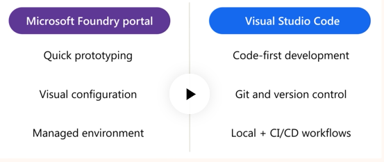

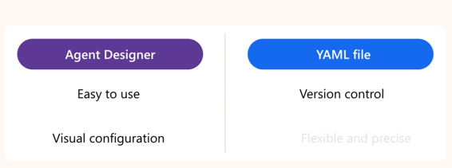

----
### Quiz

**1. What is the primary benefit of using Microsoft Foundry Agent Service compared to building agents with standard APIs?**
- [ ] It provides access to more powerful AI models
- [ ] It requires no Azure subscription
- [ ] It handles tool calling, state management, and infrastructure automatically
- [ ] It only works with the Azure portal

**2. How does Microsoft Foundry Agent Service handle conversation state?**
- [ ] By requiring developers to manually manage conversation history
- [ ] Through external database connections
- [ ] Through the Responses API which automatically manages conversation context
- [ ] Using local file storage on the client device

**3. Which of the following is NOT a recommended security practice for AI agents?**
- [ ] Using role-based access controls
- [ ] Implementing prompt filtering and validation
- [ ] Maintaining comprehensive logging and traceability
- [ ] Allowing agents unrestricted access to all enterprise data

**4. What happens when an agent determines it needs a tool to respond to a user request?**
- [ ] The agent asks the user for permission to use the tool
- [ ] The agent stops processing and waits for developer input
- [ ] The agent automatically invokes the tool, processes results, and incorporates them into its response
- [ ] The agent sends the request to a separate processing queue

---

# Efficient RAG: Document Intelligence → Vector Storage → Multi-Tenant Retrieval

## The RAG Challenge for Beginners

```
PROBLEM: You have thousands of PDFs, Excel files, Word docs, and PowerPoints.
         Users ask questions. How do you find relevant documents and generate answers?

┌────────────────────────────────────────────────────────────────┐
│                    THE RAG PIPELINE                            │
├────────────────────────────────────────────────────────────────┤
│                                                                │
│  DOCUMENT                 CHUNKING & METADATA                │
│  ├─ PDF           ┌─→   ├─ Preserve layout                   │
│  ├─ Excel         │     ├─ Add tenant_id (multi-tenant)      │
│  ├─ Word          ├─→   ├─ Add rbac_tags (access control)   │
│  └─ PowerPoint    │     └─ Store with confidence scores      │
│                   │                                            │
│                   └─→   EMBEDDING & VECTOR STORAGE            │
│                         └─ Azure AI Search (vector D- [ ]       │
│                                                                │
│                         ↓                                      │
│                                                                │
│                    USER QUERY                                 │
│                         ↓                                      │
│                    TENANT + RBAC FILTER                       │
│                         ↓                                      │
│                    VECTOR SEARCH                              │
│                         ↓                                      │
│                    RERANKING (LLM)                            │
│                         ↓                                      │
│                    GENERATE RESPONSE (GPT-4)                  │
│                                                                │
└────────────────────────────────────────────────────────────────┘
```

---

## Phase 1: Document Processing & Intelligent Chunking

### What is Azure Document Intelligence?

Azure Document Intelligence is like a smart reader that:
- ✅ Reads PDFs, Excel, Word, PowerPoint
- ✅ Preserves layout (table structure, positions, headers)
- ✅ Identifies content type (heading, table, paragraph, form)
- ✅ Gives you structured output with confidence scores

### Document Intelligence Output

**Example: Sales Report with Hierarchy**

```
DOCUMENT:
┌────────────────────────────┐
│  Sales Report Q4 2024      │  ← H1 Main Heading (level: 1)
├────────────────────────────┤
│  Regional Performance:     │  ← H2 Subheading (level: 2)
│                            │
│  Region  Sales    Growth   │  ← Table (belongs to H2)
│  ────────────────────────  │
│  North   $500M    +12%     │
│  South   $300M    +8%      │
│  East    $400M    +15%     │
│  West    $350M    -2%      │
└────────────────────────────┘

DOCUMENT INTELLIGENCE OUTPUT:
────────────────────────────
H1 Heading: "Sales Report Q4 2024"
  Level: 1
  Location: Page 1, y=20 (bounding box: x=50, y=20, width=200, height=30)
  Confidence: 99%

H2 Subheading: "Regional Performance"
  Level: 2
  Location: Page 1, y=100 (bounding box: x=50, y=100, width=150, height=20)
  Confidence: 98%

Table:
  Parent H2: "Regional Performance"
  Location: Page 1, y=140 (bounding box: x=50, y=140, width=300, height=200)
  Headers: [Region, Sales, Growth]
  Rows: [
    {Region: North, Sales: $500M, Growth: +12%},
    {Region: South, Sales: $300M, Growth: +8%},
    {Region: East, Sales: $400M, Growth: +15%},
    {Region: West, Sales: $350M, Growth: -2%}
  ]
  Confidence: 97%

KEY INSIGHT: Document Intelligence provides:
  ✅ Heading levels (H1, H2, H3) for hierarchy
  ✅ Bounding box coordinates (y-position) to infer relationships
  ✅ Confidence scores for each element
  ✅ Reading order (top-to-bottom)
```

### Intelligent Chunking Strategy (Hierarchy-Aware)

```
NAIVE APPROACH (Loses Context & Causes Retrieval Failure):
──────────────────────────────────────────────────────────
CHUNK 1: "Sales Report Q4 2024"  ← Isolated heading
CHUNK 2: "Table: Region | Sales | Growth..."  ← No context about Q4!

Query: "What were Q4 2024 regional sales?"
Problem: Table chunk loses temporal context → Lower embedding relevance ❌


CORRECT APPROACH (Build Hierarchy):
───────────────────────────────────
Step 1: Parse Document Intelligence output in spatial order (top-to-bottom)
Step 2: Track heading hierarchy (H1, H2, H3)
Step 3: Add hierarchy context to each chunk
Step 4: Use bounding boxes to infer parent-child relationships

CHUNKS CREATED:
───────────────
CHUNK 1 (H1 - Main Title):
  Content: "Sales Report Q4 2024"
  Metadata: {
    type: heading,
    level: 1,
    confidence: 0.99,
    doc_id: "doc-xyz-123"
  }

CHUNK 2 (H2 - Subheading):
  Content: "Regional Performance"
  Metadata: {
    type: heading,
    level: 2,
    parent_h1: "Sales Report Q4 2024",
    confidence: 0.98,
    doc_id: "doc-xyz-123"
  }

CHUNK 3 (Table WITH Full Hierarchy):
  Content: {
    h1_context: "Sales Report Q4 2024",
    h2_context: "Regional Performance",
    table: {
      headers: ["Region", "Sales", "Growth"],
      rows: [
        {Region: North, Sales: $500M, Growth: +12%},
        {Region: South, Sales: $300M, Growth: +8%},
        {Region: East, Sales: $400M, Growth: +15%},
        {Region: West, Sales: $350M, Growth: -2%}
      ]
    }
  }
  Metadata: {
    type: table,
    hierarchy_path: ["Sales Report Q4 2024", "Regional Performance"],
    parent_h1: "Sales Report Q4 2024",
    parent_h2: "Regional Performance",
    timeframe: "Q4_2024",
    section: sales_data,
    is_structured: true,
    confidence: 0.97,
    doc_id: "doc-xyz-123",
    tenant_id: "tenant-1",
    rbac_tags: ["team:sales", "role:analyst"],
    upload_date: "2024-01-15T10:30:00Z"
  }

RETRIEVAL SUCCESS:
──────────────────
Query: "What were Q4 2024 regional sales?"
  ✅ Finds CHUNK 3
  ✅ Embedding captures: "Sales Report Q4 2024" + "Regional Performance" + table
  ✅ Metadata has explicit timeframe: "Q4_2024"
  ✅ FULL CONTEXT PRESERVED! ✓
```

**Key Rules for Chunking**:

```
┌────────────────────────────────────────────────────────────┐
│                CHUNKING BEST PRACTICES                     │
├────────────────────────────────────────────────────────────┤
│                                                            │
│  1. BUILD HIERARCHY CONTEXT                              │
│     ├─ Parse Document Intelligence in spatial order     │
│     ├─ Track H1, H2, H3 hierarchy levels               │
│     ├─ Add hierarchy_path to each chunk                 │
│     ├─ Include parent headings in content               │
│     └─ Link chunks by doc_id                            │
│                                                            │
│  2. PRESERVE STRUCTURE                                   │
│     ├─ Keep tables as JSON (not flattened text)        │
│     ├─ Keep paragraphs + headers together              │
│     └─ Don't split list items                           │
│                                                            │
│  3. SIZE MATTERS                                         │
│     ├─ Aim for 300-500 tokens per chunk                │
│     ├─ Don't artificially split long documents         │
│     └─ Respect page/section boundaries                 │
│                                                            │
│  4. ADD RICH METADATA                                    │
│     ├─ hierarchy_path: ["Sales Report Q4 2024", ...]  │
│     ├─ parent_h1, parent_h2 (for context lookup)       │
│     ├─ tenant_id (for multi-tenant isolation)          │
│     ├─ rbac_tags (for access control)                   │
│     ├─ section (sales_data, summary, etc.)             │
│     ├─ confidence (from Document Intelligence)          │
│     └─ upload_date (for filtering recent docs)         │
│                                                            │
│  5. PRESERVE COORDINATES & LAYOUT                        │
│     ├─ Keep bounding box info (for rendering)          │
│     ├─ Track page numbers                               │
│     ├─ Store layout information                          │
│     └─ Use y-coordinates to infer hierarchy             │
│                                                            │
└────────────────────────────────────────────────────────────┘
```

---

## Phase 2: Vector Storage with Metadata

### Azure AI Search: Your Vector Database

```
┌────────────────────────────────────────────────────────────┐
│           CHUNK STORAGE IN AZURE AI SEARCH                 │
├────────────────────────────────────────────────────────────┤
│                                                            │
│  CHUNK INPUT:                                             │
│  ├─ Content: "Sales Report Q4 2024..."                   │
│  ├─ Metadata: {tenant_id, rbac_tags, section, ...}      │
│  └─ Layout: {page, coordinates, ...}                    │
│         ↓                                                 │
│  GENERATE EMBEDDING (Azure OpenAI)                       │
│  └─ Convert text → Vector [0.051, -0.041, 0.129, ...]  │
│         ↓                                                 │
│  STORE IN AZURE AI SEARCH                                │
│  ├─ Vector field (indexed with HNSW for fast search)    │
│  ├─ Metadata fields (all filterable)                    │
│  ├─ Content field (searchable)                          │
│  └─ Coordinates field (for rendering)                   │
│                                                            │
└────────────────────────────────────────────────────────────┘
```

### Index Schema (What Fields to Store)

```
┌────────────────────────────────────────────────────────────┐
│              AZURE AI SEARCH SCHEMA                        │
├────────────────────────────────────────────────────────────┤
│                                                            │
│  CORE FIELDS:                                             │
│  ├─ chunk_id (unique identifier)                         │
│  ├─ content (searchable text)                            │
│  └─ content_vector (embeddings for search)               │
│                                                            │
│  MULTI-TENANT FIELDS:                                     │
│  ├─ tenant_id (FILTERABLE - critical!)                   │
│  │  └─ Filter: tenant_id eq 'tenant-1'                  │
│  └─ rbac_tags (FILTERABLE - critical!)                   │
│     └─ Filter: rbac_tags/any(t: t eq 'team:sales')      │
│                                                            │
│  METADATA FIELDS (all filterable):                        │
│  ├─ section: "sales_data", "summary", etc.              │
│  ├─ doc_type: "report", "invoice", etc.                │
│  ├─ confidence: 0.97 (quality score)                     │
│  ├─ upload_date: "2024-01-15"                           │
│  ├─ page_number: 1                                       │
│  └─ is_structured: true/false                            │
│                                                            │
└────────────────────────────────────────────────────────────┘
```

### Data Persistence Example

```
WHAT GETS STORED:
─────────────────

Chunk ID: doc-xyz-123-chunk-002
Content: "Region | Sales | Growth\n
          North | $500M | +12%\n
          South | $300M | +8%..."
Vector: [0.041, -0.032, 0.118, ..., 0.204]  (1536 dimensions)

Metadata:
├─ tenant_id: "tenant-1"
├─ rbac_tags: ["team:sales", "role:analyst", "dept:business"]
├─ section: "sales_data"
├─ doc_type: "report"
├─ confidence: 0.97
├─ upload_date: "2024-01-15T10:30:00Z"
├─ page_number: 1
└─ is_structured: true

Layout:
├─ bounding_box: {x: 50, y: 120, width: 200, height: 80}
└─ coordinates: [page: 1, location: "middle"]
```

---

## Phase 3: Retrieval with Multi-Tenant Isolation & RBAC

### The Seven-Step Retrieval Pipeline

```
┌──────────────────────────────────────────────────────────────┐
│                   RETRIEVAL PIPELINE                         │
├──────────────────────────────────────────────────────────────┤
│                                                              │
│  STEP 1: USER CONTEXT                                       │
│  ┌──────────────────────────────────────────────────┐      │
│  │ User: user-42                                    │      │
│  │ Tenant: tenant-1                                 │      │
│  │ Roles: ["team:sales", "role:analyst"]           │      │
│  └──────────────────────────────────────────────────┘      │
│         ↓                                                   │
│  STEP 2: TENANT ISOLATION (CRITICAL!)                      │
│  ┌──────────────────────────────────────────────────┐      │
│  │ Filter: tenant_id eq 'tenant-1'                 │      │
│  │                                                  │      │
│  │ Result:                                          │      │
│  │ ✅ tenant-1 docs: VISIBLE                       │      │
│  │ ❌ tenant-2 docs: BLOCKED                       │      │
│  │ ❌ tenant-3 docs: BLOCKED                       │      │
│  │                                                  │      │
│  │ Why: Security! Prevent cross-tenant leaks       │      │
│  └──────────────────────────────────────────────────┘      │
│         ↓                                                   │
│  STEP 3: RBAC VALIDATION (SECURITY!)                       │
│  ┌──────────────────────────────────────────────────┐      │
│  │ User roles: ["team:sales", "role:analyst"]     │      │
│  │                                                  │      │
│  │ Document 1: rbac_tags: ["team:sales"]          │      │
│  │ → ✅ ACCESSIBLE (user has "team:sales")        │      │
│  │                                                  │      │
│  │ Document 2: rbac_tags: ["role:director"]       │      │
│  │ → ❌ BLOCKED (user lacks director role)        │      │
│  │                                                  │      │
│  │ Filter: rbac_tags/any(t: user.roles contains t)│      │
│  └──────────────────────────────────────────────────┘      │
│         ↓                                                   │
│  STEP 4: GENERATE QUERY EMBEDDING                          │
│  ┌──────────────────────────────────────────────────┐      │
│  │ Query: "Show me regional sales for Q4"         │      │
│  │   ↓                                              │      │
│  │ Azure OpenAI Embeddings API                     │      │
│  │   ↓                                              │      │
│  │ Vector: [0.051, -0.041, 0.129, ..., 0.215]    │      │
│  │ (Cost: 500ms)                                   │      │
│  └──────────────────────────────────────────────────┘      │
│         ↓                                                   │
│  STEP 5: VECTOR SEARCH + FILTERS                           │
│  ┌──────────────────────────────────────────────────┐      │
│  │ Search for: Most similar vectors to [0.051...] │      │
│  │                                                  │      │
│  │ Apply filters:                                  │      │
│  │ ├─ tenant_id eq 'tenant-1' ✅                   │      │
│  │ ├─ rbac_tags intersects ["team:sales", ...]   │      │
│  │ ├─ confidence ge 0.95                          │      │
│  │ └─ section eq 'sales_data'                     │      │
│  │                                                  │      │
│  │ Result: Top-50 candidates (Cost: 200ms)        │      │
│  └──────────────────────────────────────────────────┘      │
│         ↓                                                   │
│  STEP 6: LLM RERANKING (PRECISION BOOST)                   │
│  ┌──────────────────────────────────────────────────┐      │
│  │ Before reranking:                               │      │
│  │ ├─ Doc 1: "Weather in northern hemisphere"     │      │
│  │ │  Similarity score: 0.85                      │      │
│  │ ├─ Doc 2: "North region sales +12%"           │      │
│  │ │  Similarity score: 0.84                      │      │
│  │ └─ ...40+ more documents                       │      │
│  │                                                  │      │
│  │ After LLM reranking:                            │      │
│  │ ├─ Doc 2: "North region sales +12%"           │      │
│  │ │  LLM score: 0.98 ✅ HIGHLY RELEVANT         │      │
│  │ ├─ Doc 3: "East region sales +15%"            │      │
│  │ │  LLM score: 0.96 ✅ HIGHLY RELEVANT         │      │
│  │ ├─ Doc 1: "Weather northern hemisphere"       │      │
│  │ │  LLM score: 0.15 ❌ NOT RELEVANT            │      │
│  │ └─ ...reranked by relevance                    │      │
│  │                                                  │      │
│  │ Cost: 1000ms (worth it!)                       │      │
│  │ Quality gain: Precision 65% → 92%              │      │
│  └──────────────────────────────────────────────────┘      │
│         ↓                                                   │
│  STEP 7: INJECT INTO LLM PROMPT                            │
│  ┌──────────────────────────────────────────────────┐      │
│  │ Take top-5 reranked docs                        │      │
│  │                                                  │      │
│  │ Prompt: "Based on these documents:             │      │
│  │ [doc 1], [doc 2], [doc 3], [doc 4], [doc 5]  │      │
│  │                                                  │      │
│  │ Answer: Show me regional sales for Q4"         │      │
│  │                                                  │      │
│  │ Azure OpenAI GPT-4 generates response          │      │
│  │ (Cost: 3000ms)                                 │      │
│  └──────────────────────────────────────────────────┘      │
│         ↓                                                   │
│  RESULT: High-quality, secure, multi-tenant response! ✅   │
│                                                              │
└──────────────────────────────────────────────────────────────┘
```

### Reranking: Why It Matters

```
PRECISION IMPROVEMENT WITH RERANKING:
────────────────────────────────────

WITHOUT RERANKING (Vector Similarity Only):
Top-5 Results:
1. "Northern hemisphere weather" (similarity: 0.85) ❌
2. "North sales +12%" (similarity: 0.84) ✅
3. "The northern lights" (similarity: 0.83) ❌
4. "East region sales" (similarity: 0.82) ✅
5. "West region sales" (similarity: 0.81) ✅

Precision: 60% (3 out of 5 relevant)

WITH LLM RERANKING (Semantic Understanding):
Top-5 Results:
1. "East region sales" (LLM score: 0.98) ✅
2. "North sales +12%" (LLM score: 0.96) ✅
3. "West region sales" (LLM score: 0.94) ✅
4. "Northern hemisphere weather" (LLM score: 0.15) ❌
5. "The northern lights" (LLM score: 0.08) ❌

Precision: 100% (3 out of 3 relevant)

Cost Trade-off:
├─ Extra latency: +1 second
├─ Extra cost: +$0.002 per query
└─ Quality gain: +40pp precision (WORTH IT!)
```

---

## Performance Metrics

### Latency Breakdown

```
┌──────────────────────────────────────────────────┐
│         LATENCY: ~4.7 SECONDS TOTAL              │
├──────────────────────────────────────────────────┤
│                                                  │
│  Query Embedding         500ms  ███████         │
│  Vector Search + Filter  200ms  ██               │
│  LLM Reranking         1000ms  ████████████     │
│  LLM Response Gen      3000ms  █████████████████│
│  ─────────────────────────────────────────      │
│  TOTAL                 4700ms                   │
│                                                  │
│  Bottleneck: LLM generation (60% of latency)   │
│  Optimization: Parallel processing, caching     │
│                                                  │
└──────────────────────────────────────────────────┘
```

### Precision & Recall

```
┌──────────────────────────────────────────────────┐
│     QUALITY METRICS: Vector vs Reranking         │
├──────────────────────────────────────────────────┤
│                                                  │
│  Pure Vector Search:                            │
│  ├─ Precision: 65% (keyword bias)              │
│  ├─ Recall: 45% (misses semantic matches)      │
│  └─ Use: Quick searches, low stakes             │
│                                                  │
│  With LLM Reranking:                            │
│  ├─ Precision: 92% (understands meaning)       │
│  ├─ Recall: 78% (finds semantic matches)       │
│  └─ Use: Mission-critical Q&A                   │
│                                                  │
│  Quality Gain: +27pp precision, +33pp recall   │
│                                                  │
└──────────────────────────────────────────────────┘
```

### Cost Per Query

```
┌──────────────────────────────────────────────────┐
│        COST BREAKDOWN PER QUERY                  │
├──────────────────────────────────────────────────┤
│                                                  │
│  Embedding (OpenAI)      $0.00001  (negligible) │
│  Vector search           $0        (include- [ ]  │
│  Reranking (LLM)         $0.002    (optional)   │
│  Response generation     $0.05     (main cost)  │
│  ─────────────────────────────────────────      │
│  TOTAL PER QUERY         ~$0.052               │
│                                                  │
│  For 1M queries/month: ~$52,000/month          │
│                                                  │
│  To reduce: Use smaller embedding model,       │
│  batch reranking, cache results                │
│                                                  │
└──────────────────────────────────────────────────┘
```

---

## Best Practices

### ✅ DO

```
┌────────────────────────────────────────────────────────────┐
│                     BEST PRACTICES                         │
├────────────────────────────────────────────────────────────┤
│                                                            │
│  ✅ PRESERVE STRUCTURE                                    │
│     └─ Keep tables as JSON, not flattened text           │
│     └─ Store lists with context                           │
│     └─ Maintain page/section boundaries                   │
│                                                            │
│  ✅ METADATA FIRST                                        │
│     └─ Add tenant_id (mandatory for multi-tenant)        │
│     └─ Add rbac_tags (mandatory for access control)      │
│     └─ Add section, doc_type, confidence scores          │
│                                                            │
│  ✅ FILTER BY TENANT                                      │
│     └─ Always filter tenant_id FIRST                     │
│     └─ Prevents cross-tenant data leaks                   │
│     └─ Security is non-negotiable                         │
│                                                            │
│  ✅ VALIDATE RBAC                                         │
│     └─ Check rbac_tags before returning results          │
│     └─ User-specific access control                      │
│     └─ Compliance requirement                             │
│                                                            │
│  ✅ USE RERANKING FOR QUALITY                             │
│     └─ Improves precision 65% → 92%                      │
│     └─ Improves recall 45% → 78%                         │
│     └─ Cost: +1s, +$0.002/query (worth it)               │
│                                                            │
│  ✅ HNSW ALGORITHM                                        │
│     └─ Fastest vector search                              │
│     └─ Scales to millions of documents                    │
│     └─ Default recommendation                             │
│                                                            │
└────────────────────────────────────────────────────────────┘
```

### ❌ DON'T

```
┌────────────────────────────────────────────────────────────┐
│                  ANTI-PATTERNS                             │
├────────────────────────────────────────────────────────────┤
│                                                            │
│  ❌ DON'T FLATTEN TABLES                                  │
│     └─ Table as text: "Region North Sales $500M +12%"   │
│     └─ Problem: Can't query structure                     │
│     └─ Solution: Store as JSON                            │
│                                                            │
│  ❌ DON'T SKIP TENANT ISOLATION                           │
│     └─ Problem: SECURITY BREACH                          │
│     └─ Cross-tenant data visible                         │
│     └─ Solution: Always filter tenant_id                 │
│                                                            │
│  ❌ DON'T RETURN RESULTS WITHOUT RBAC CHECK               │
│     └─ Problem: COMPLIANCE VIOLATION                     │
│     └─ Unauthorized access                               │
│     └─ Solution: Validate rbac_tags                      │
│                                                            │
│  ❌ DON'T USE FIXED-SIZE CHUNKING                         │
│     └─ Problem: Split semantic units                     │
│     └─ Example: Table split across chunks                │
│     └─ Solution: Semantic chunking                       │
│                                                            │
│  ❌ DON'T IGNORE CONFIDENCE SCORES                        │
│     └─ Low confidence = low quality extraction           │
│     └─ Filter: confidence ge 0.95                        │
│     └─ Solution: Always check confidence                 │
│                                                            │
│  ❌ DON'T STORE SECRETS IN VECTORS                        │
│     └─ Embeddings can be decoded (partially)             │
│     └─ Use Azure Key Vault instead                       │
│     └─ Solution: Separate secrets from vectors           │
│                                                            │
└────────────────────────────────────────────────────────────┘
```

---

### Interview Q&A for AI-103

**Q: How do you preserve document layout in RAG for PDFs with tables?**
A: Use Azure Document Intelligence to extract text with coordinates and structure metadata. Store tables as JSON, not flattened text. Keep bounding box information for rendering.

**Q: How do you prevent cross-tenant data leaks in RAG?**
A: Always filter by `tenant_id eq 'user.tenant'` BEFORE returning search results. This is a security-first filter.

**Q: How do you implement RBAC in a multi-user RAG system?**
A: Add `rbac_tags` array to each chunk. Filter with: `rbac_tags/any(tag: user.roles contains tag)`. Only users with matching roles can access documents.

**Q: Why use reranking instead of just vector similarity?**
A: Vector similarity only catches keyword matches. Reranking uses LLM to understand semantic relevance, improving precision 65% → 92% and recall 45% → 78%.

**Q: What's the latency breakdown for a single query?**
A: Embedding (500ms) + search (200ms) + rerank (1000ms) + generate (3000ms) = ~4.7s total.

---

# NLP in Azure

## Azure Language in Foundry Tools

Azure Language in Foundry Tools is designed to help you extract information from text. It provides functionality for natural language processing tasks.

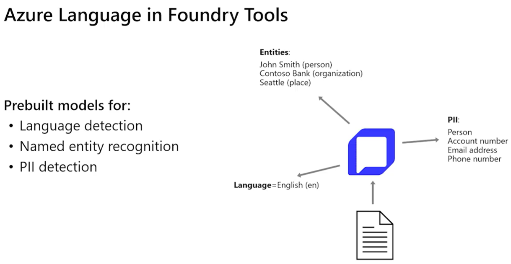

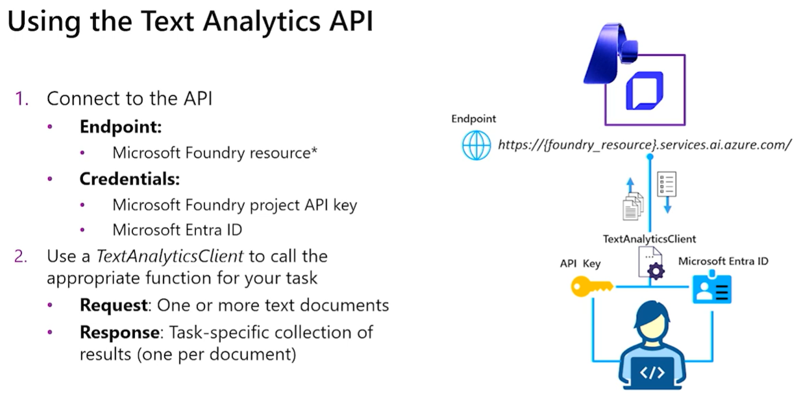

### Resources

**https://github.com/MicrosoftLearning/mslearn-ai-language**

**https://github.com/MicrosoftLearning/mslearn-ai-language/blob/main/Instructions/Exercises/01-analyze-text.md**

### Python Code Example

```python
from azure.ai.textanalytics import TextAnalyticsClient
from azure.identity import DefaultAzureCredential

credential = DefaultAzureCredential()
# Initialize client (using authentication method from above)
client = TextAnalyticsClient(endpoint=endpoint, credential=credential)


# Prepare documents for language detection
documents = [
    {"id": "1", "text": "Hello, this is a test document in English."},
    {"id": "2", "text": "Bonjour, ceci est un document de test en français."}
]

# Detect language for each document
response = client.detect_language(documents)

# Parse results
for result in response:
    print(f"Document ID: {result.id}")
    print(f"Language: {result.primary_language.name}")
    print(f"Confidence Score: {result.primary_language.confidence_score}")
```

### Response Example

```
Document ID: 1
Language: English
Confidence Score: 0.99

Document ID: 2
Language: French
Confidence Score: 0.98
```

### Language Processing Capabilities

| Capability | Purpose | Use Case | Code Example |
|------------|---------|----------|--------------|
| **Language Detection** | Determine the language in which text is written | Multi-language support, content routing, localization | `client.detect_language(documents=["Hello World!"])` |
| **Named Entity Recognition (NER)** | Detect references to entities (people, locations, time periods, organizations, etc.) | Information extraction, text analysis, entity linking | `client.recognize_entities(documents=["John works at Microsoft"])` |
| **PII Extraction** | Identify and redact personal details in text | Data protection, compliance, secure text processing | `client.recognize_pii_entities(documents=["Call me at 555-1234"])` |

### When to Use Azure Language

- Extract key information from documents or user input
- Identify and protect sensitive personal information
- Support multi-language applications
- Perform text classification and analysis
- Build knowledge bases from unstructured text

---

## Azure Language Pricing & Architecture

| Aspect | Details |
|---|---|
| **Does it use LLM?** | ❌ NO. Uses specialized NLP models (not generative AI) — optimized for accuracy, speed, and cost |
| **Model Type** | Rule-based + ML models (not large language models like GPT) |
| **Pricing Model** | **Per-unit billing** (e.g., per 1000 text records) — NOT per token like LLMs |
| **Cost Advantage** | Much cheaper than LLMs for NLP tasks like NER, PII detection, language detection |
| **Performance** | Faster inference; deterministic results; no hallucination risk |
| **Use Case** | Extraction, classification, sentiment — NOT generation or open-ended reasoning |

**Pricing Example (approximate):**
- **Language Detection:** $1 per 1,000 records
- **Named Entity Recognition:** $2-3 per 1,000 records
- **PII Detection:** $2-3 per 1,000 records
- **Sentiment Analysis:** $1 per 1,000 records

**vs. LLM (e.g., GPT-4):** $0.03-0.06 per 1,000 tokens (higher cost for generation tasks)

**When to Use Azure Language vs LLM:**

| Task | Best Choice | Reason |
|---|---|---|
| Extract named entities | **Azure Language** ✅ | Specialized, cheaper, faster |
| Detect language | **Azure Language** ✅ | Simple, deterministic, optimal cost |
| Redact PII | **Azure Language** ✅ | Reliable, no hallucinations |
| Generate summaries | **LLM (GPT-4)** ✅ | Requires generative capability |
| Answer questions | **LLM (GPT-4)** ✅ | Requires reasoning, context understanding |
| Extract structured data | **Azure Language** ✅ | Faster, more reliable for fixed patterns |

---

## Using a Microsoft Foundry Resource for Text Analysis

Provision a Microsoft Foundry resource in your Azure subscription to call Azure Language APIs using the resource's endpoint and credentials.

### Authentication

| Method | Use Case | Installation |
|--------|----------|--------------|
| **API Key** | Development, testing | `pip install azure-ai-textanalytics` |
| **Entra ID** | Production (Recommende- [ ]| `pip install azure-identity azure-ai-textanalytics` |

### Get Credentials

**Foundry Portal:** Admin tab → Operate page
- Project key: Found on default home page
- Resource endpoint: `https://{resource-name}.services.ai.azure.com`
- Project endpoint: `https://{resource-name}.services.ai.azure.com/api/projects/{project-name}`

### Key-Based Authentication

```python
from azure.core.credentials import AzureKeyCredential
from azure.ai.textanalytics import TextAnalyticsClient

credential = AzureKeyCredential("YOUR_FOUNDRY_RESOURCE_KEY")
client = TextAnalyticsClient(endpoint="YOUR_ENDPOINT", credential=credential)
```

### Entra ID Authentication (Production)

```python
from azure.identity import DefaultAzureCredential
from azure.ai.textanalytics import TextAnalyticsClient

credential = DefaultAzureCredential()
client = TextAnalyticsClient(endpoint="YOUR_ENDPOINT", credential=credential)
```

**Note:** SDKs for C#, JavaScript, and other languages follow similar patterns.

---

## Language Detection

Evaluates text and returns language identifiers with confidence scores (0-1).

### Key Details

| Aspect | Details |
|--------|---------|
| **Use Cases** | Content stores, chat applications, multi-language routing, content classification |
| **Returns** | ISO 639-1 code (e.g., "en", "fr") + confidence score |
| **Limits** | 5,120 chars/document, 1,000 documents per batch |
| **Input** | JSON with document `id` and `text` fields |
| **Code** | `client.detect_language(documents=["Hello!", "Bonjour!"])` |

### Python Example

```python
from azure.ai.textanalytics import TextAnalyticsClient
from azure.core.credentials import AzureKeyCredential

client = TextAnalyticsClient(endpoint="YOUR_ENDPOINT", 
                             credential=AzureKeyCredential("YOUR_KEY"))

documents = ["Hello, this is English.", "Bonjour, c'est français."]
response = client.detect_language(documents)

for result in response:
    print(f"Language: {result.primary_language.name}")
    print(f"Confidence: {result.primary_language.confidence_score}")
```

---

### Quiz

1. How should you create an application that analyzes news articles and extracts key people, places, and dates that are mentioned for indexing?

- [ ] Use a generative AI model with a custom function tool that matches strings using a regular expression.
- [ ] Use Azure Language in Foundry Tools to extract PII entities.
- [ ] Use Azure Language in Foundry Tools to extract named entities.
  
1. You want to publish extracts from customer testimonials on a web site. You need to remove personal details from the text before publishing it. What should you do?

- [ ] Use Azure Language in Foundry Tools to find and redact PII entities.
- [ ] Use Azure Language in Foundry Tools to detect the language and publish only the testimonials in English.
- [ ] Use a gpt-4.1 model to create new AI-generated customer reviews.

## Entity Detection

```python
# Get entities
entities = ai_client.recognize_entities(documents=[text])[0].entities
if len(entities) > 0:
    print("\nEntities")
    for entity in entities:
        print('\t{} ({})'.format(entity.text, entity.category))
```

## PII Detection

```python
# Get PII
pii_result = ai_client.recognize_pii_entities(documents=[text])[0]
pii_entities = pii_result.entities
if len(pii_entities) > 0:
    print("\nPII Entities")
    for pii_entity in pii_entities:
        print('\t{} ({})'.format(pii_entity.text, pii_entity.category)) 
    print("Redacted Text:\n {}".format(pii_result.redacted_text))
```
---

# Azure Vision

## MultiModal req/res

**Chat Completions API - Image Request:**

```json
{
  // Use gpt-4-vision for image analysis without extended thinking
  "model": "gpt-4-vision",
  "messages": [
    {
      "role": "user",
      // Mix text and image content in single message
      "content": [
        {
          "type": "text",
          "text": "What is in this image?"
        },
        {
          "type": "image_url",
          "image_url": {
            "url": "https://example.com/image.jpg",
            // detail: "low" (256x256px), "high" (full resolution), or omit for auto
            "detail": "high"
          }
        }
      ]
    }
  ],
  "max_tokens": 1024
}
```

**Chat Completions API - Image Response:**

```json
{
  "id": "chatcmpl-123",
  "choices": [
    {
      "message": {
        // Plain text response without thinking block
        "content": "This image shows a landscape with mountains, a lake, and trees. The sky is clear with blue tones. There appears to be a sunset/sunrise."
      },
      "finish_reason": "stop"
    }
  ],
  // Token usage metrics for cost tracking
  "usage": {
    "prompt_tokens": 1250,
    "completion_tokens": 45,
    "total_tokens": 1295
  }
}
```

**Responses API - Image Request (with Thinking):**

```json
{
  // Use gpt-4-turbo or gpt-4o with thinking capability for complex analysis
  "model": "gpt-4-turbo",
  "messages": [
    {
      "role": "user",
      "content": [
        {
          "type": "text",
          "text": "Analyze this medical image and provide detailed findings"
        },
        {
          "type": "image_url",
          "image_url": {
            "url": "https://example.com/medical-image.jpg",
            "detail": "high"
          }
        }
      ]
    }
  ],
  // Enable extended thinking for reasoning through complex problems
  "thinking": {
    "type": "enabled",
    "budget_tokens": 5000  // Max tokens for internal reasoning, separate from output
  },
  "max_tokens": 2000
}
```

**Responses API - Image Response (with Thinking):**

```json
{
  "id": "msg-123",
  // Content array contains both thinking and text blocks
  "content": [
    {
      // Internal reasoning process (not visible to user by default)
      "type": "thinking",
      "thinking": "Looking at this medical image, I need to analyze key features carefully. The image shows... I'll examine each region systematically..."
    },
    {
      // Final analysis output shown to user
      "type": "text",
      "text": "The image analysis reveals: 1) Clear visualization of... 2) Notable findings include... 3) Recommendations would be..."
    }
  ],
  // Usage includes both input/output tokens and cache metrics
  "usage": {
    "input_tokens": 1850,
    "output_tokens": 280,
    "cache_creation_input_tokens": 0,
    "cache_read_input_tokens": 0
  }
}
```

**Use Cases:**
- Chat Completions: Image analysis, visual Q&A, OCR, document processing
- Responses API: Complex vision tasks with step-by-step reasoning, thinking enabled

---

### Quiz

1. Which kind of model can you use to respond to visual input?

- [ ] Only OpenAI GPT models
- [ ] Embedding models
- [ ] Multimodal models

1. How can you submit a prompt that asks a model to analyze an image?

- [ ] Submit one prompt with an image-based message followed by another prompt with a text-based message.
- [ ] Submit a prompt that contains a multi-part user message, containing both text content and image content.
- [ ] Submit the image as the system message and the instruction or question as the user message.

1. How can you include an image in a message?

- [ ] As a URL or as binary data
- [ ] Only as a URL
- [ ] Only as binary data

----

## Azure Image Generation

**Chat Completions API - Text Request:**

```json
{
  // Base GPT model for text-only conversations
  "model": "gpt-4-turbo",
  "messages": [
    {
      "role": "system",
      "content": "You are a helpful Azure certification expert"
    },
    {
      "role": "user",
      "content": "Explain the difference between prebuilt and custom analyzers"
    }
  ],
  // Set max_tokens to control response length
  "max_tokens": 500,
  // Temperature controls randomness: 0 (deterministi- [ ]to 1 (creative)
  "temperature": 0.7
}
```

**Chat Completions API - Text Response:**

```json
{
  "id": "chatcmpl-456",
  "object": "chat.completion",
  "created": 1692234567,
  // Array of completion choices
  "choices": [
    {
      "index": 0,
      // Role is always "assistant" for model response
      "message": {
        "role": "assistant",
        // Model's generated text content
        "content": "Prebuilt analyzers are pre-configured models for common document types like invoices and receipts. Custom analyzers allow you to define specific field schemas tailored to your unique document structure..."
      },
      "finish_reason": "stop"
    }
  ],
  // Token consumption for billing and cost tracking
  "usage": {
    "prompt_tokens": 42,
    "completion_tokens": 156,
    "total_tokens": 198
  }
}
```

**DALL-E Image Generation Request:**

```json
{
  // DALL-E 3 or DALL-E 2 model
  "model": "dall-e-3",
  // Detailed, specific prompt for better results (best practice #1)
  "prompt": "Golden retriever running in a sunny meadow, professional photography, vibrant colors, high detail",
  // Size options: 1024x1024, 1792x1024 (DALL-E 3), 512x512, 1024x1024 (DALL-E 2)
  "size": "1024x1024",
  // Quality: standard (faster, cheaper) or hd (higher detail, more expensive)
  "quality": "hd",
  // Style: vivid (diverse, dramati- [ ]or natural (realistic)
  "style": "natural",
  // Number of images: DALL-E 3 supports 1 only, DALL-E 2 supports 1-10
  "n": 1,
  // Response format: url (default) or b64_json (base64 encoded)
  "response_format": "url"
}
```

**DALL-E Image Generation Response:**

```json
{
  "created": 1699564200,
  "data": [
    {
      // Image URL - EXPIRES AFTER 1 HOUR (download immediately)
      "url": "https://oaidalleapiprodscus.blob.core.windows.net/private/...",
      // DALL-E 3 auto-enhances and returns revised prompt
      "revised_prompt": "A professional photograph of a golden retriever joyfully running through a sunlit meadow with vibrant wildflowers..."
    }
  ]
}
```

**Image Generation Best Practices:**

| Practice | Description | Example |
|----------|-------------|---------|
| **Detailed Prompts** | More specific prompts = better results | Instead of "a dog", use "golden retriever running in a sunny meadow, professional photography" |
| **Quality Selection** | Use `hd` for marketing, `standard` for drafts | `quality: "hd"` costs more but higher detail |
| **Size Optimization** | Choose size based on use case | `1024x1024` for web, `1792x1024` for banners |
| **Error Handling** | Handle content policy violations gracefully | Check prompt against guidelines before sending |
| **Image Persistence** | URLs expire after 1 hour | Download and store images immediately |
| **Rate Limits** | Respect API rate limits | DALL-E 3: 5 req/min, DALL-E 2: 50 req/min |

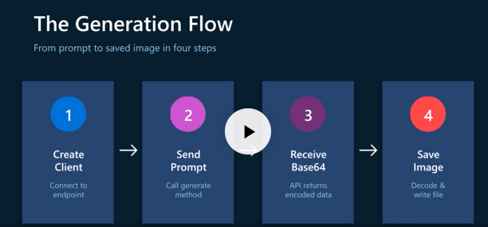

---

## Video Generation

Generate videos from text prompts using GPT-4o model. Videos are returned as MP4 files with URLs expiring after 24 hours.

**Video Generation API:**

| Aspect | Details |
|--------|---------|
| **Method** | `client.videos.generations.create(model, prompt, duration, quality)` |
| **Parameters** | `model`: "gpt-4o", `prompt`: text description, `duration`: 5-60 sec, `quality`: "standard"/"hd" |
| **Response** | `url`: video link (24h expiry), `created`: timestamp, `data[]`: video objects |
| **Use Cases** | Marketing videos, product demos, educational content, concept visualization |

**OpenAI SDK Example:**

```python
from openai import OpenAI

client = OpenAI(api_key="your-api-key")

response = client.videos.generations.create(
    model="gpt-4o",
    prompt="Serene forest with sunlight, gentle breeze moving leaves",
    duration=10,
    quality="hd"
)

video_url = response.data[0].url
print(f"Video: {video_url}")  # Download within 24 hours
```

**Azure OpenAI SDK Example:**

```python
from azure.ai.projects import AIProjectClient
from azure.identity import DefaultAzureCredential

client = AIProjectClient(
    credential=DefaultAzureCredential(),
    endpoint="https://{resource}.services.ai.azure.com"
)

openai_client = client.get_openai_client(api_version="2024-12-01-preview")

response = openai_client.videos.generations.create(
    model="gpt-4o",
    prompt="Futuristic cityscape with flying cars at night",
    duration=15
)

print(f"Video: {response.data[0].url}")
```

**Best Practices:**

| Practice | Note |
|----------|------|
| **Detailed Prompts** | Use cinematic descriptions: "overhead shot of car accelerating, dynamic lighting" |
| **Quality Trade-off** | `hd` = slower, `standard` = faster |
| **Download Promptly** | URLs expire after 24 hours—download and store immediately |
| **Duration** | Start with 5-10 seconds for testing, max 60 seconds |
| **Content Policy** | Avoid violence, explicit content per OpenAI guidelines |


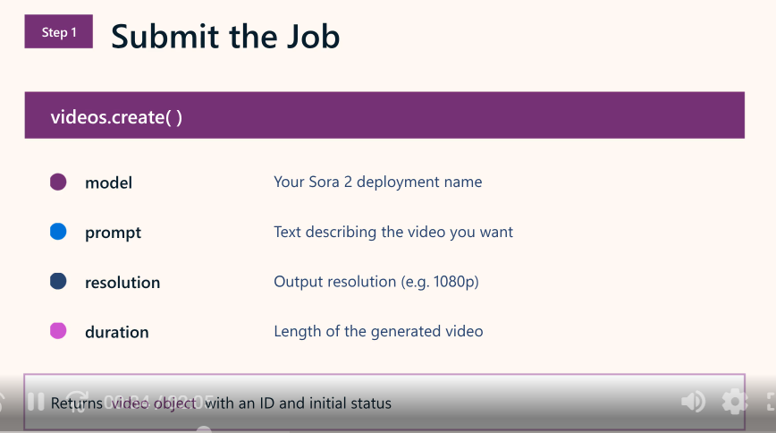

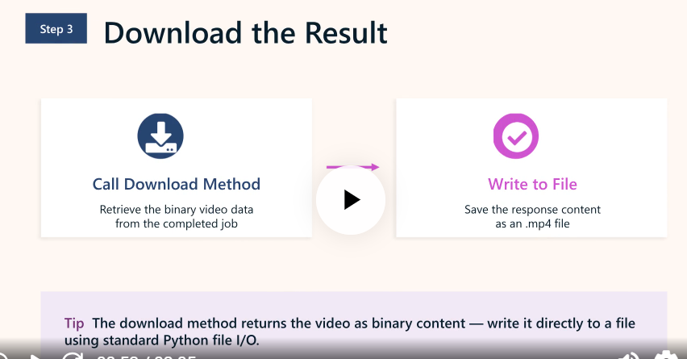

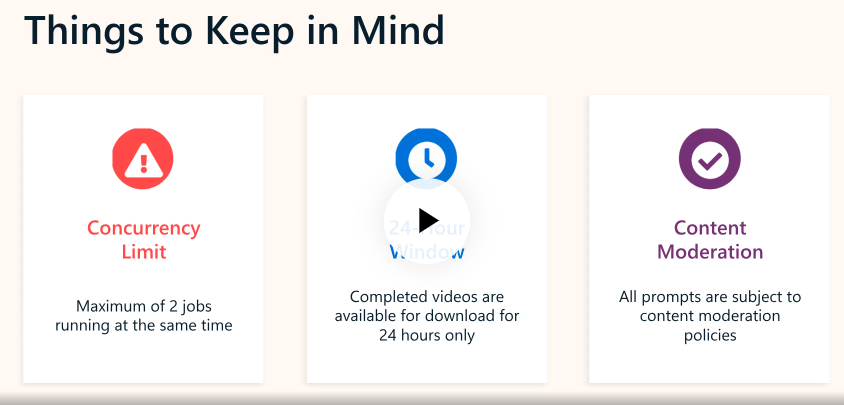

### Quiz

1. What video durations does Sora 2 support?
- [ ] 1 to 20 seconds in 1-second increments
- [x] 4, 8, or 12 seconds
- [ ] Any duration up to 60 seconds

1. What is required when using a reference image with Sora 2?
- [ ] The image must be smaller than 1 MB
- [x] The image resolution must match the target video size
- [ ] The image must contain at least one human face

1. What is the remix feature used for in Sora 2?

- [ ] Combining multiple videos into one
- [x] Making targeted adjustments to an existing video without regenerating from scratch
- [ ] Adding background music to generated videos

----

## Content Understanding

Analyze and extract meaningful information from multimodal content (images, documents, videos, text) using Azure's AI services.

### Architecture Overview

```
┌─────────────────────────────────────────────────────────────────┐
│                     INPUT SOURCES                               │
│  (Documents, Images, Videos, Text)                              │
└────────────────────────────┬────────────────────────────────────┘
                             │
┌────────────────────────────▼────────────────────────────────────┐
│                   ANALYZER SELECTION                            │
│  ┌─────────────────────────────────────────────────────────┐   │
│  │  - AI Models (Which models to use)                      │   │
│  │  - Field Schema (What data to extract)                  │   │
│  │  - Prebuilt vs Custom analyzers                         │   │
│  └─────────────────────────────────────────────────────────┘   │
└────────────────────────────┬────────────────────────────────────┘
                             │
┌────────────────────────────▼────────────────────────────────────┐
│                 PROCESSING PIPELINE                             │
│  ┌─────────────────┬──────────────────┬───────────────────┐   │
│  │   1. NORMALIZE  │    2. EXTRACT    │   3. OUTPUT       │   │
│  │  ┌───────────┐  │  ┌────────────┐  │  ┌─────────────┐ │   │
│  │  │OCR/Trans- │  │  │Field Ex-   │  │  │Markdown/   │ │   │
│  │  │cription   │  │  │traction    │  │  │JSON Format │ │   │
│  │  │Layout Dtc │  │  │Schema Mtch │  │  │            │ │   │
│  │  └───────────┘  │  └────────────┘  │  └─────────────┘ │   │
│  └─────────────────┴──────────────────┴───────────────────┘   │
└────────────────────────────┬────────────────────────────────────┘
                             │
┌────────────────────────────▼────────────────────────────────────┐
│              QUALITY METRICS (Trust Signals)                    │
│  ┌──────────────────────────┬────────────────────────────────┐  │
│  │ Confidence Score (0-1)   │ Grounding (Source Location)    │  │
│  │ Extraction reliability   │ Pinpoint data location         │  │
│  └──────────────────────────┴────────────────────────────────┘  │
└────────────────────────────┬────────────────────────────────────┘
                             │
┌────────────────────────────▼────────────────────────────────────┐
│                    OUTPUT DELIVERY                              │
│  ┌──────────────────────────────────────────────────────────┐  │
│  │  Search Scenarios (Markdown) │ Workflows (JSON)         │  │
│  │  Indexing & Retrieval        │ Programmatic Integration │  │
│  └──────────────────────────────────────────────────────────┘  │
└──────────────────────────────────────────────────────────────────┘
```

**Content Understanding Capabilities:**

| Service | Purpose | Key Features | Use Case |
|---------|---------|--------------|----------|
| **Computer Vision** | Image analysis | Object detection, OCR, scene understanding, face analysis | Product classification, visual search, accessibility |
| **Document Intelligence** | Document processing | Extract tables, forms, key-value pairs, layout analysis | Invoice processing, contract review, form automation |
| **Video Indexer** | Video analysis | Scene detection, transcription, object tracking, speaker identification | Video search, accessibility, content moderation |
| **Language Service** | Text analysis | Entity extraction, sentiment, key phrases, PII detection | Content classification, data privacy, insights |
| **Azure AI Search** | Content indexing | Full-text & semantic search across documents/images/videos | Enterprise search, knowledge discovery |

**Python SDK - Image Understanding:**

```python
from azure.cognitiveservices.vision.computervision import ComputerVisionClient
from azure.identity import DefaultAzureCredential

client = ComputerVisionClient(
    endpoint="https://{resource}.cognitiveservices.azure.com/",
    credentials=DefaultAzureCredential()
)

# Analyze image
url = "https://example.com/image.jpg"
results = client.analyze_image_by_url(url, visual_features=["Objects", "Brands", "Faces"])

for obj in results.objects:
    print(f"Object: {obj.object_property}, Confidence: {obj.confidence}")
```

**Python SDK - Document Understanding:**

```python
from azure.ai.documentintelligence import DocumentIntelligenceClient
from azure.identity import DefaultAzureCredential

client = DocumentIntelligenceClient(
    endpoint="https://{resource}.cognitiveservices.azure.com/",
    credential=DefaultAzureCredential()
)

# Extract invoice data
with open("invoice.pdf", "rb") as doc:
    response = client.begin_analyze_document(
        "prebuilt-invoice",
        analyze_request={"bytes_source": doc.read()}
    ).result()

for field, value in response.documents[0].fields.items():
    print(f"{field}: {value.value}")
```

**Python SDK - Video Analysis:**

```python
from azure.ai.videoindexer import VideoIndexerClient
from azure.identity import DefaultAzureCredential

client = VideoIndexerClient(
    endpoint="https://{resource}.videoindexer.ai",
    credential=DefaultAzureCredential()
)

# Index video
video_url = "https://example.com/video.mp4"
insights = client.upload_url(
    video_url=video_url,
    video_name="sample_video",
    wait_for_index=True
)

print(f"Scenes: {len(insights.videos[0].insights['scenes'])}")
print(f"Transcript: {insights.videos[0].insights['transcript']}")
```

**Best Practices:**

| Practice | Details |
|----------|---------|
| **Choose Right Service** | Use Computer Vision for images, Document Intelligence for forms/invoices, Video Indexer for videos |
| **Pre-process Content** | Ensure good quality: clear images, readable text, good lighting |
| **Handle Errors** | Implement retry logic for API calls; validate content before processing |
| **Store Results** | Use Azure Blob Storage for documents, Azure Search for indexing results |
| **Cost Optimization** | Batch process similar items; use appropriate tier (Free, Standar- [ ]|
| **Security** | Use Entra ID authentication (production), store keys in Key Vault, enable encryption |

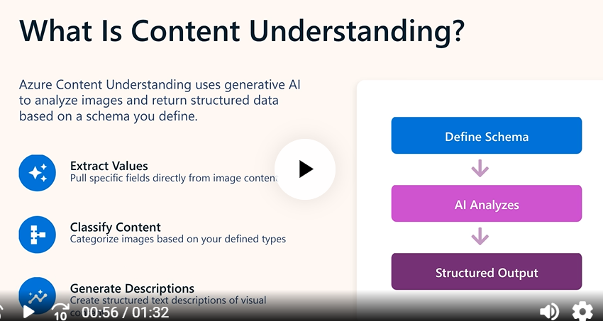

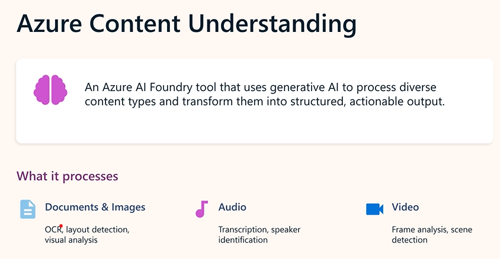

**The Analyzer: Heart of Content Understanding**

An analyzer defines how your content is processed by specifying which AI models to use and what data fields to extract. It acts as the central orchestrator between the AI models (which models to apply) and the field schema (what data to extract from the content).

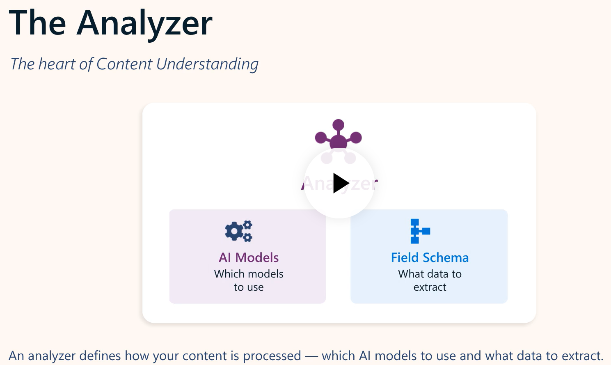

**Types of Analyzers: Prebuilt vs Custom**

Azure Document Intelligence provides two analyzer types:

- **Prebuilt Analyzers**: Ready-to-use solutions for common scenarios like invoice processing, receipt extraction, and call center analytics. No custom configuration needed.
- **Custom Analyzers**: Define your own schema and extraction rules for specific business needs. Gives you full control over the structure and fields extracted.

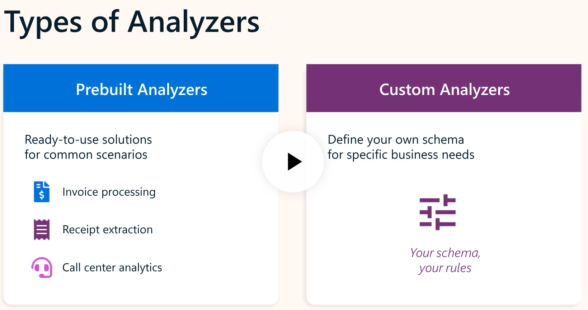

---

### The Processing Pipeline

Document Intelligence processes content through three sequential stages:

| Stage | Operation | Details |
|-------|-----------|---------|
| **1. Normalize** | Input preparation | OCR scanning, transcription, layout detection — converts raw documents into structured data |
| **2. Extract** | Data extraction | Field extraction, key-value pairs identification, schema matching — applies the analyzer rules |
| **3. Output** | Result formatting | Markdown or JSON, structured data, ready to use — outputs clean, processable results |

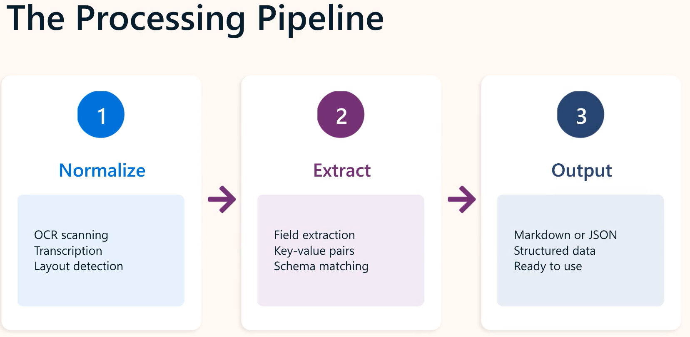

---

### Confidence & Grounding: Quality Metrics

Every extracted value includes built-in trust signals to help you validate extraction accuracy:

| Metric | Purpose | Details |
|--------|---------|---------|
| **Confidence Score** | Reliability measure | Numeric value between 0 and 1 indicating how confident the model is in the extraction accuracy |
| **Grounding** | Source traceability | Points back to the specific region in the source content where the value was extracted — enables verification |

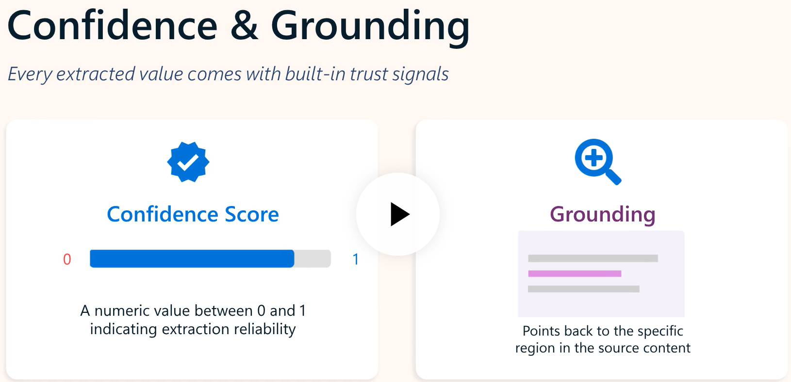

---

### Output Formats: Markdown vs JSON

Clean, structured data ready for your applications. Choose the format that best fits your workflow:

| Format | Use Case | Details |
|--------|----------|---------|
| **Markdown** | Search scenarios | Optimized for indexing and retrieval across documents; ideal for semantic search and discovery |
| **JSON** | Automation workflows | Structured key-value pairs for programmatic integration; suitable for APIs and data pipelines |

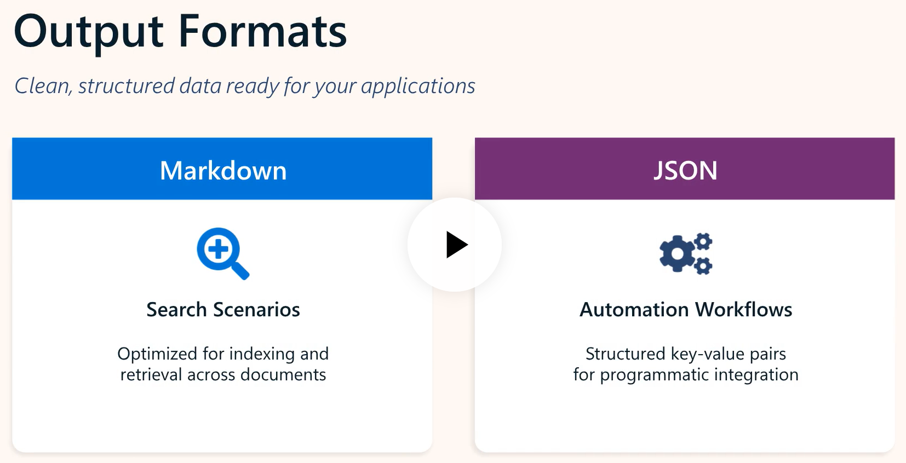

---

### Image - Content Understanding

**Supported Image Formats:**


**JPEG** , **PNG**, **BMP**, **TIFF**, **HEIF**, **PDF**

**Prebuilt Image Analyzers:**

| Analyzer | Purpose | Extracts | Use Case |
|----------|---------|----------|----------|
| **prebuilt-image** | General-purpose image analysis | Content, figures, descriptions | Scene understanding, visual search |
| **prebuilt-receipt** | Receipt processing | Vendor, items, totals, dates | Expense tracking, retail analytics |
| **prebuilt-invoice** | Invoice analysis | Line items, amounts, vendor info | Invoice automation, AP automation |
| **prebuilt-idDocument** | Identity document extraction | Name, ID number, expiry, DOB | KYC verification, document processing |

**Define Field Schema for Images:**

To extract specific information from images, define a field schema with extraction methods:

| Method | Description | Example |
|--------|-------------|---------|
| **extract** | Pull values directly as they appear in the image | Extract text from labels, signs, or printed content |
| **classify** | Categorize content from predefined options | Classify image as "damaged", "undamaged", "acceptable", "reject" |
| **generate** | Create values based on image analysis | Generate scene description, summary, or analysis |

**Example Schema for Product Images:**

| Component | Configuration | Details |
|-----------|---------------|---------|
| **Analyzer Base** | prebuilt-image | Foundation analyzer for general image analysis |
| **ProductName** | extract | Extract product name/label text directly |
| **Condition** | classify | Categorize as new, used, or damaged |
| **Description** | generate | Generate scene description from image analysis |

**Analyze Image:**

```python
from azure.ai.contentunderstanding import ContentUnderstandingClient
from azure.ai.contentunderstanding.models import AnalysisInput, AnalysisResult
from azure.core.credentials import AzureKeyCredential
from azure.identity import DefaultAzureCredential
import json

# Initialize client with endpoint and credentials
credential = DefaultAzureCredential()  # or AzureKeyCredential(key)
client = ContentUnderstandingClient(
    endpoint="https://{resource}.cognitiveservices.azure.com/",
    credential=credential,
    api_version="2025-11-01"
)

# Load and analyze image
with open("product_image.jpg", "rb") as f:
    file_bytes = f.read()

try:
    poller = client.begin_analyze(
        analyzer_id="your-analyzer-id",
        inputs=[AnalysisInput(data=file_bytes)]
    )
    result: AnalysisResult = poller.result()
    
    # Display results
    result_str = json.dumps(result.as_dict(), indent=2)
    print(result_str)
    
except Exception as ex:
    print(f"Error: {ex}")
```

**Analysis Response Structure:**

```
{
  "contents": [
    {
      "markdown": "Product label showing 'Contoso Widget Pro' with serial number...",
      "fields": {
        "ProductName": {
          "type": "string",
          "valueString": "Contoso Widget Pro",
          "confidence": 0.95,
          "source": "D(1,100,50,300,50,300,80,100,80)"
        },
        "Condition": {
          "type": "string",
          "valueString": "new",
          "confidence": 0.89
        },
        "Description": {
          "type": "string",
          "valueString": "A silver electronic device in retail packaging with product label visible"
        }
      }
    }
  ]
}
```

| Field | Content | Use |
|-------|---------|-----|
| **markdown** | Text representation of image | Search, RAG scenarios, indexing |
| **fields** | Extracted values matching schema | Structured data with confidence scores |
| **source** | Grounding information (location in image) | Verification, visual confirmation |

**Using Confidence Scores:**

| Confidence Range | Recommendation | Action |
|------------------|-----------------|--------|
| **0.9 - 1.0** | High confidence | Automated processing, direct use |
| **0.7 - 0.9** | Medium confidence | Consider human review for critical apps |
| **< 0.7** | Low confidence | Manual verification required |

Build automation workflows that route low-confidence extractions to human reviewers while processing high-confidence results automatically.

---

### Quiz

1. What is the purpose of grounding in Content Understanding?

- [ ] To connect Content Understanding to Azure storage
- [ ] To identify the specific regions in content where each value was extracted
- [ ] To filter out harmful content from images

1. What does a confidence score of 0.95 indicate for an extracted field?

- [ ] The extraction failed and needs manual review
- [ ] The value can be trusted for automated processing
- [ ] The field was classified rather than extracted

1. Which prebuilt analyzer would you use to extract vendor names and item totals from a purchase receipt?

- [ ] prebuilt-image
- [ ] prebuilt-invoice
- [ ] prebuilt-receipt

---

### Quiz: NLP & Named Entity Recognition

**Question 1: How should you create an application that analyzes news articles and extracts key people, places, and dates mentioned for indexing?**

- [ ] Use a generative AI model with a custom function tool that matches strings using a regular expression
- [ ] Use Azure Language in Foundry Tools to extract PII entities
- [x] Use Azure Language in Foundry Tools to extract named entities

**Answer:** Azure Language in Foundry Tools has built-in **Named Entity Recognition (NER)** to automatically extract entities like people, places, locations, and dates. This is more accurate and efficient than regex patterns or PII extraction.

---

**Question 2: You want to publish extracts from customer testimonials on a web site. You need to remove personal details from the text before publishing it. What should you do?**

- [x] Use Azure Language in Foundry Tools to find and redact PII entities
- [ ] Use Azure Language in Foundry Tools to detect the language and publish only the testimonials in English
- [ ] Use a gpt-4.1 model to create new AI-generated customer reviews

**Answer:** **PII (Personally Identifiable Information) redaction** using Azure Language is the correct approach to identify and remove sensitive personal details (names, phone numbers, emails, etc.) before publishing. This protects privacy while keeping testimonial content intact.

---

# Agent Integration with M365

## Understanding Agent Applications

When you publish an agent in Microsoft Foundry, three key resources are created:

| Component | Description |
|---|---|
| **Dedicated Invocation URL** | A stable endpoint that remains consistent as you update agent versions. Allows reliable integration and prevents breaks when rolling out new versions. |
| **Agent Identity** | A distinct Microsoft Entra identity separate from your development project. Enables independent authentication and secure resource access. |
| **User Data Isolation** | Ensures inputs and interactions from one user aren't visible to other users. Critical for multi-tenant scenarios and data privacy compliance. |

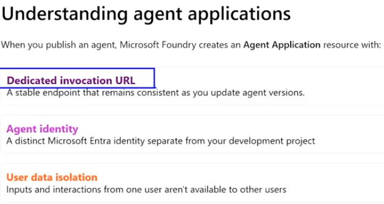

---

## Publish Your Agent

A 6-step publishing workflow with metadata configuration:

| Step | Action | Details |
|---|---|---|
| **1** | Select Agent Version | Choose which version of your agent to publish |
| **2** | Start Publishing Process | Initiate the deployment pipeline |
| **3** | Configure Azure Bot Service | Set up the bot service connection for M365 integration |
| **4** | Complete Metadata | Fill in agent details (Name, Description, Icons, Publisher info, Privacy policy, Terms of use) |
| **5** | Choose Publish Scope | **Shared Scope** (appears in "Your agents" in Teams Store - best for testing/small teams) OR **Organization Scope** (appears in "Built by your org" - requires admin approval, best for production) |
| **6** | Prepare & Download Package | Generate deployment package ready for distribution or immediate use |

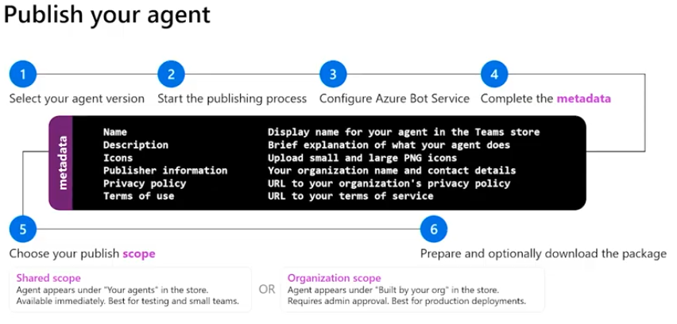

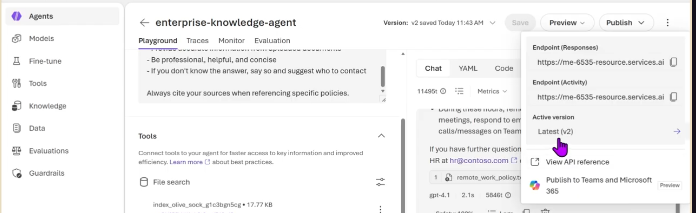

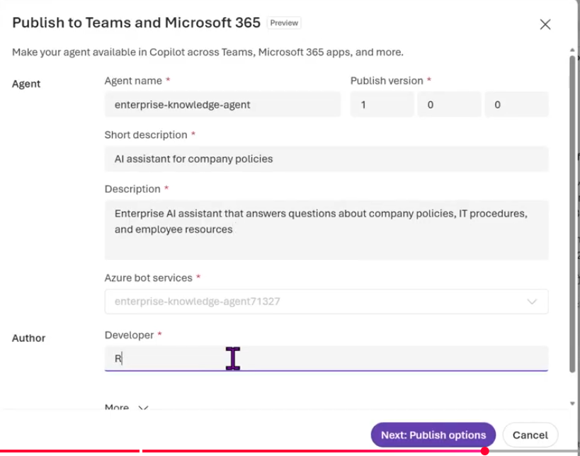

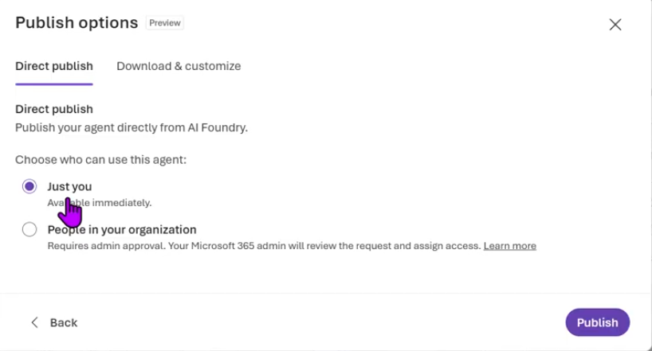

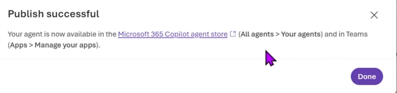

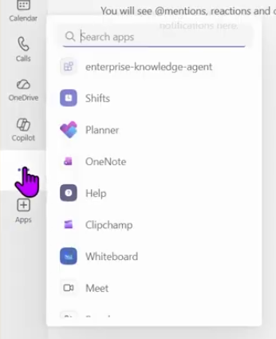

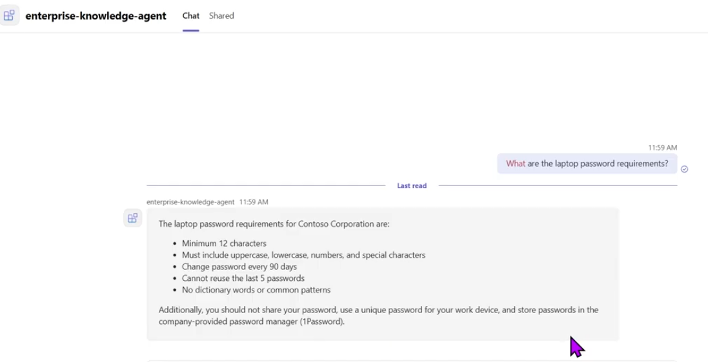

**Copilot**

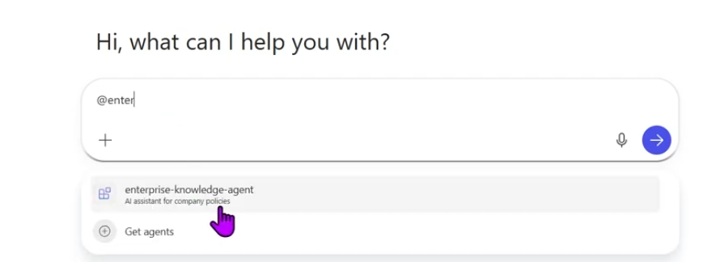

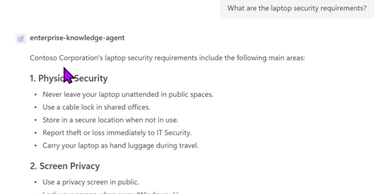


### Metadata Configuration

**Required Fields:**
- **Name**: Displayed in Teams Store
- **Description**: Brief explanation of agent functionality
- **Icons**: PNG images (small & large versions)
- **Publisher Information**: Organization name and contact details
- **Privacy Policy**: URL to organization's privacy policy
- **Terms of Use**: URL to organization's terms of service

---

### Knowledge Check

**Question 1: What Azure resource does the Foundry portal automatically create when you publish an agent to Microsoft Teams?**

- [ ] Azure Functions
- [x] Azure Bot Service
- [ ] Azure Cosmos DB
- [ ] Azure Logic Apps

**Answer:** Azure Bot Service is automatically created to enable M365 integration and communication with Teams.

---

**Question 2: What is a key benefit of an Agent Application created when publishing an agent?**

- [ ] It ensures all agents share the same identity and data
- [x] It provides a stable endpoint and isolates user interactions
- [ ] It automatically retrains the agent with new data
- [ ] It replaces the need for Azure Bot Service

**Answer:** The Agent Application provides a dedicated invocation URL (stable endpoint) and ensures user data isolation, so each user's interactions remain private and the endpoint remains consistent across agent version updates.

----

# Agent Driven Workflow

## Resource

**https://github.com/MicrosoftLearning/mslearn-ai-agents/blob/main/Instructions/Exercises/06-build-workflow-ms-foundry.md**

## Overview

Workflows are UI-based tools in Microsoft Foundry that define sequences of actions involving AI agents. They enable orchestration of multiple agents to handle complex business processes.

### Example: Customer Support Triage Workflow

A typical workflow processes incoming support tickets through multiple agents:

1. **Collect Incoming Support Tickets** - Workflow starts with predefined array of customer support issues, each representing an individual ticket.

2. **Process Tickets One at a Time** - For-each loop iterates over array, handling each ticket independently using same workflow logic.

3. **Classify Each Ticket with AI Agent** - Triage Agent classifies issue as Billing, Technical, or General with confidence score.

4. **Handle Uncertainty with Conditional Logic** - If confidence score below threshold, workflow requests additional info for that ticket.

5. **Route Based on Issue Category**:
   - Billing issues → flagged for escalation, removed from automated path
   - Technical & General issues → continue through automated handling

6. **Generate Recommended Response** - Resolution Agent drafts category-appropriate support response for non-billing tickets.

---

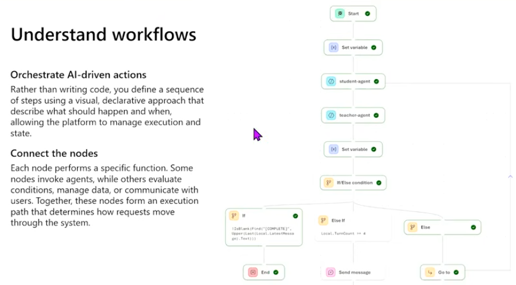

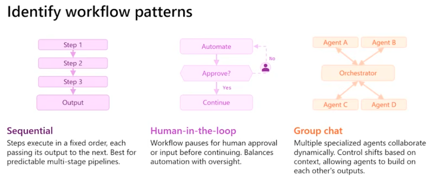

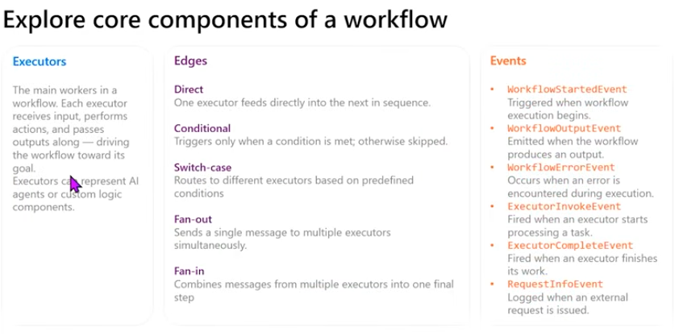

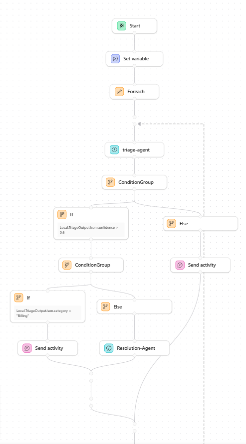

---

## Workflow Components

| # | Node Type | Purpose | Input/Configuration | Output Variables | Condition/Details |
|---|---|---|---|---|---|
| **1** | Set Variable | Initialize support tickets array | Variable name: `SupportTickets` | `Local.SupportTickets` | Contains 3 sample support tickets as string array |
| **2** | For-Each Loop | Process each ticket independently | Loop over: `Local.SupportTickets` | `Local.CurrentTicket` (loop value) | Iterates through all tickets with same logic |
| **3** | Triage Agent | Classify issue (Billing/Technical/General) with confidence score | Input: `Local.CurrentTicket` | `TriageOutputText` (message)<br>`TriageOutputJson` (structured dat- [ ]| Categories: Billing (charges, refunds, payouts), Technical (API, bugs), General (how-to, features) |
| **4** | Confidence Check (If/Else) | Verify classification confidence | Condition: `Local.TriageOutputJson.confidence > 0.6` | Routes to True/False branch | If True → routing logic; If False → request more info |
| **5** | Category Router (If/Else) | Route billing vs non-billing issues | Condition: `Local.TriageOutputJson.category = "Billing"` | Routes to True/False branch | If True → escalate; If False → continue to Resolution Agent |
| **6** | Resolution Agent | Draft professional support response | Input: `Local.TriageOutputText` (triage result) | `ResolutionOutputText` (final response) | For Technical: suggest troubleshooting; For General: provide guidance. Keep under 5 sentences |

### Component Details

**Set Variable Node:**
```json
[
  "The API returns a 403 error when creating invoices, but our API key hasn't changed.",
  "Is there a way to export all invoices as a CSV?",
  "I was charged twice for the same invoice last Friday and my customer is also seeing two receipts. Can someone fix this?"
]
```

**Triage Agent - Response Schema:**
```json
{
  "name": "category_response",
  "schema": {
    "type": "object",
    "properties": {
      "customer_issue": { "type": "string" },
      "category": { "type": "string" },
      "confidence": { "type": "number" }
    },
    "required": ["customer_issue", "category", "confidence"]
  }
}
```

**Triage Agent - Classification Categories:**
- **Billing:** Charges, refunds, duplicate payments, missing payouts, subscription pricing
- **Technical:** API errors, integrations, webhooks, platform bugs
- **General:** How-to questions, feature availability, data exports, UI navigation

**Triage Agent - Important Rules:**
- Questions about exporting/viewing invoices = General, NOT Billing
- Billing ONLY applies when money was charged, refunded, or paid incorrectly

**Resolution Agent - Response Guidelines:**
- **Technical Issues:** Suggest 1-2 high-level troubleshooting steps; avoid asking for logs/credentials
- **General Issues:** Provide concise explanation; keep under 5 sentences
- **Tone:** Professional, calm, supportive, clear and concise (no emojis)

---

## Invoking Workflow from Code

### SDK Setup

```python
from azure.identity import DefaultAzureCredential
from azure.ai.projects import AIProjectClient

with (
    DefaultAzureCredential() as credential,
    AIProjectClient(endpoint=endpoint, credential=credential) as project_client,
    project_client.get_openai_client() as openai_client,
):
```

### Create Conversation and Invoke Workflow

```python
# Specify workflow
workflow = {"name": "ContosoPay-Customer-Support-Triage"}

# Create conversation and run workflow
conversation = openai_client.conversations.create()

stream = openai_client.responses.create(
    conversation=conversation.id,
    extra_body={"agent_reference": {"name": workflow["name"], "type": "agent_reference"}},
    input="Start",
    stream=True,
)
```

### Process Workflow Output

```python
# Process events from workflow run
for event in stream:
    if event.type == "response.completed":
        response = openai_client.responses.retrieve(event.response.id)
        print(response.output_text)

# Clean up
openai_client.conversations.delete(conversation_id=conversation.id)
```

---

## Node Types & When to Use

| Node Type | Purpose | When to Use | Input | Output | Example |
|---|---|---|---|---|---|
| **Set Variable** | Initialize or assign data | Start of workflow, create arrays/objects | Manual values or expression | Variable (e.g., `Local.TicketArray`) | Create ticket list from external source |
| **For-Each Loop** | Iterate over collections | Process multiple items with same logic | Array/collection variable | Loop iteration variable | Process each ticket in support queue |
| **If/Else** | Conditional branching | Route workflow based on conditions | Boolean expression | True/False branch | Check if confidence > 0.6 |
| **Agent Invocation** | Call AI agent for task | Classify, generate, analyze content | Prompt text + agent selection | `OutputText` (message), `OutputJson` (structure- [ ]| Call Triage Agent to classify issue |
| **Deliver Message** | Output/send result | Final responses, escalations, logs | Message text (can use variables) | None (end point) | Send escalation message to support team |
| **Switch/Case** | Multi-path branching | Route based on multiple category values | Expression (category fiel- [ ]| Multiple branches | Route by category (Billing/Technical/General) |

---

## Variable Types & Scope

| Variable Type | Scope | Persistence | Example | Access Pattern |
|---|---|---|---|---|
| **Local Variables** | Workflow-wide | Throughout entire execution | `Local.SupportTickets` | `Local.VariableName` |
| **Loop Variables** | Loop iteration only | Within For-Each loop | `Local.CurrentTicket` (inside loop) | Reference inside loop; undefined outside |
| **Agent Output** | Workflow-wide | After agent execution | `TriageOutputJson.confidence` | Reference in conditions and expressions |
| **Input Variables** | From caller | Available to workflow | User message, API input | Reference anywhere in workflow |
| **Global Variables** | Org-wide (if configure- [ ]| Across multiple workflows | API keys, shared config | `Global.VariableName` |

---

## Key Expressions & Operations

| Operation | Syntax | Example | Use Case |
|---|---|---|---|
| **Numeric Comparison** | `> < >= <= ==` | `Local.TriageOutputJson.confidence > 0.6` | Threshold checks |
| **String Comparison** | `= == != contains` | `Local.TriageOutputJson.category = "Billing"` | Category routing |
| **Property Access** | `Variable.PropertyName` | `Local.TriageOutputJson.category` | Extract from structured data |
| **Array Access** | `Variable[index]` | `Local.SupportTickets[0]` | Get first item |
| **String Interpolation** | `"{Variable}"` | `"Ticket: {Local.CurrentTicket}"` | Build dynamic messages |
| **Null Check** | `isEmpty()` | `isEmpty(Local.Optional)` | Handle optional values |

---

## Agent Workflow - Key Items to Know

| Item | Description | Critical Detail |
|---|---|---|
| **Response Format** | JSON Schema for structured output | Define required properties; use `"strict": true` for enforcement |
| **Confidence Score** | 0-1 value indicating classification certainty | Use threshold (e.g., 0.6) to identify low-quality results |
| **System Prompt** | Instructions that define agent behavior | Clear categories, rules, and tone guidance |
| **Input Message** | The data passed to agent for processing | Use variables (e.g., `Local.CurrentTicket`) not hardcoded text |
| **Output Variables** | Store agent results for downstream use | Create separate text and JSON output variables |
| **Streaming** | Real-time output as workflow executes | Monitor console for flow; useful for debugging |
| **Error Handling** | No built-in retry; use If/Else for edge cases | Implement conditional logic for failure paths |
| **State Isolation** | Each loop iteration has separate state | Variables from iteration N don't affect iteration N+1 |
| **Sequential Execution** | Agents run one at a time | First agent completes before second starts |
| **Conversation Context** | Maintain context across multiple calls | Store previous outputs for downstream agent reference |

---

## Key Workflow Concepts

| Concept | Description |
|---|---|
| **Node Types** | Set Variable, For-Each, If/Else, Agent Invocation, Deliver Message, Switch/Case |
| **Variables** | Local variables persist throughout workflow execution (e.g., `Local.SupportTickets`) |
| **Streaming** | Workflow output streams to console in real-time |
| **Conditional Routing** | If/Else nodes route workflow based on conditions (confidence threshold, category type) |
| **Agent Integration** | Multiple agents work sequentially in workflow pipeline |
| **State Management** | Each iteration maintains separate state for loop variables |
| **Response Formats** | JSON Schema enforces structured agent outputs |

---

## Workflow Best Practices

✅ **Do:**
- Use descriptive variable names (`SupportTickets` not `data`)
- Define JSON schemas for agent outputs
- Test workflow with sample data in Preview mode
- Use confidence thresholds to catch low-quality classifications
- Separate concerns (triage agent vs resolution agent)

❌ **Avoid:**
- Complex nested If/Else logic (flatten with multiple conditions)
- Hardcoding values in workflow (use variables instead)
- Missing error handling for edge cases
- Duplicate agent invocations

---

### Quiz: Agent Workflow

**Question 1: Which type of node in a Foundry workflow is used to invoke an AI agent?**

- [ ] Logic node
- [x] Agent node
- [ ] Data transformation node

**Answer:** Agent node is used to call AI agents for tasks like classification, content generation, or analysis. It's configured with agent selection, input message variable, and output variables.

---

**Question 2: Which node type would you use to handle multiple items in a workflow without duplicating nodes?**

- [ ] If/Else node
- [x] For-Each node
- [ ] Send message node

**Answer:** For-Each node iterates over arrays/collections, executing the same logic for each item. This eliminates the need to duplicate nodes and keeps workflows DRY (Don't Repeat Yourself). Each iteration maintains separate state via loop variables (e.g., `Local.CurrentTicket`).

----
# Microsoft Agent Framework

**Microsoft Agent Framework** = Azure AI-native framework for production agents with approval workflows, compliance, and M365 integration.

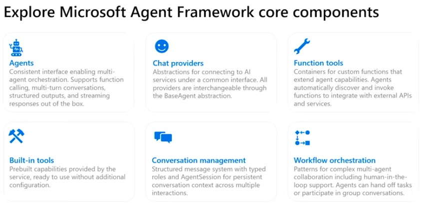

---
## Resources

**https://github.com/MicrosoftLearning/mslearn-ai-agents/blob/main/Instructions/Exercises/07-agent-framework.md**

---

## Comparison: Agent Framework vs Semantic Kernel vs AutoGen

| Aspect | Agent Framework | Semantic Kernel | AutoGen |
|---|---|---|---|
| **Focus** | Enterprise agents + approvals | Multi-LLM orchestration | Multi-agent conversation |
| **Deployment** | Azure AI Foundry | Any cloud/on-prem | Local or any cloud |
| **Key Feature** | Human approval gates, audit trails | Plugin architecture | Agent group chat |
| **State Persistence** | Cosmos DB (built-in) | Custom storage | In-memory |
| **Governance** | ✅ Role-based approval | Partial | None |
| **Best For** | Enterprise compliance workflows | LLM coordination | Research/experiments |

---

## Key Concepts

| Item | Details |
|---|---|
| **Agent Identity** | Distinct Entra ID for secure resource access |
| **Approval Workflows** | Human-in-the-loop pause before sensitive operations |
| **Grounding** | RAG integration for knowledge-based responses |
| **Conversation State** | conversation_id + Cosmos DB stores all context |
| **M365 Integration** | Native Teams/Outlook; stable endpoint URL |
| **Response Format** | JSON Schema + strict mode for compliance |

---

## Quick Decision Guide

| Use Case | Framework |
|---|---|
| Enterprise workflows with approvals, compliance, M365 | **Agent Framework** ✅ |
| Multi-LLM orchestration, plugins, flexible deployment | **Semantic Kernel** ✅ |
| Multi-agent research, conversations, Python-first | **AutoGen** ✅ |

---

## Microsoft Agent Framework vs Agent Workflow

| Aspect | Microsoft Agent Framework | Agent Workflow |
|---|---|---|
| **What is it?** | Broader Azure AI framework for building agents | UI-based tool within Foundry for defining agent sequences |
| **Scope** | Entire agent development (agents, tools, approvals, M365 integration) | Orchestration layer (node-based workflow logi- [ ]|
| **How Used** | SDK-based programming + Foundry portal | Drag-drop nodes in Foundry (visual builder) |
| **Example** | Create agent with tool calling, approval gates, Entra ID | Create workflow: Set Variable → For-Each → Agent → If/Else → Deliver Message |
| **Relationship** | **Framework (container)** | **Component (inside framework)** |

**Simple Rule:**
- **Agent Framework** = Full agent system (orchestration + agents + tools + safety)
- **Agent Workflow** = How to sequence multiple agents together

---

## DefaultAzureCredential vs AzureCliCredential

| Credential | When to Use | Behavior |
|---|---|---|
| **DefaultAzureCredential** | Local dev + production (recommende- [ ]| Tries: Env vars → Managed Identity → Azure CLI → VS Code → Azure PowerShell (tries multiple) |
| **AzureCliCredential** | Local dev only (after `az login`) | Uses Azure CLI cached login token; fails if not logged in |

**Simple Rule:**
- **DefaultAzureCredential** = Production + flexible dev (no setup needed on first run if ENV vars set)
- **AzureCliCredential** = Quick local testing only (requires `az login` first)

---

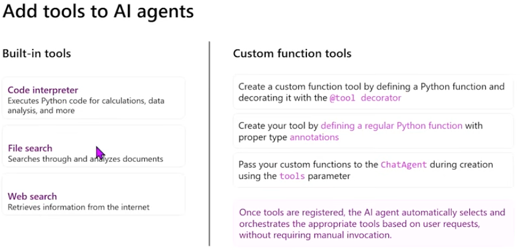

---

### Knowledge Check: Microsoft Agent Framework

**Question 1: What are the key steps to create a Microsoft Foundry Agent using the Microsoft Agent Framework?**

- [ ] Deploy a custom AI model before creating an agent definition in the Azure portal
- [ ] Initialize the agent by defining a model in the AgentThread constructor
- [x] Create an AzureAIAgentClient, define a ChatAgent with instructions and tools, and create an AgentThread

**Answer:** The correct pattern is:
1. Create `AzureAIAgentClient` (connects to Azure AI services)
2. Define `ChatAgent` (with system instructions and tools)
3. Create `AgentThread` (manages conversation state and execution)

---

**Question 2: Which component in the Microsoft Agent Framework manages conversation state and stores messages?**

- [x] AgentThread
- [ ] ChatAgent
- [ ] AzureAIAgentClient

**Answer:** `AgentThread` manages conversation state, stores all messages, and maintains context across multiple agent interactions. ChatAgent defines behavior; AzureAIAgentClient is the connection/client.

---

# Azure AI Search

## Azure AI Search vs Azure AI Search Index

| Aspect | Azure AI Search (Service) | Azure AI Search Index |
|---|---|---|
| **What is it?** | Cloud service for full-text and semantic search | Data structure within Azure AI Search service |
| **Scope** | Infrastructure + APIs + Tools for searching | Container holding indexed documents and fields |
| **Analogy** | Database server (the whole system) | Database table (the data structure) |
| **Creation** | Create resource in Azure portal | Define schema and create within the service |
| **Example** | `SearchClient(endpoint, credential)` | `{"name": "employee-index", "fields": [...]}` |
| **Relationship** | **Service (container)** | **Index (inside service)** |

**Simple Rule:**
- **Azure AI Search** = Cloud search service (API, management, indexing)
- **Search Index** = Data structure (schema + documents inside service)

---

## When to Use Azure AI Search Index

**Use Azure AI Search Index for:**

| Scenario | Reason |
|---|---|
| **Large Document Sets (>500)** | Scales to millions of docs; <2s latency vs 30s+ for Blob Storage |
| **Full-Text Search** | Fast keyword-based retrieval with ranking |
| **Semantic Search** | AI-powered understanding of query intent & relevance |
| **Hybrid Search** | Combines keyword + vector search (embeddings) |
| **RAG Systems** | Knowledge retrieval for LLM context injection |
| **Multi-Tenant Apps** | Built-in filtering for tenant isolation |
| **Complex Filtering** | Date ranges, categories, numeric ranges, facets |
| **Real-Time Indexing** | Continuous updates without reindexing all data |

**DON'T use Azure AI Search for:**
- ❌ Simple lookups (<100 documents) → Use direct Blob Storage
- ❌ Transactional operations → Use Cosmos DB
- ❌ Complex joins → Use Azure SQL DB

---

## Multi-Tenant Segregation & Retrieval

### Strategy 1: Separate Indexes Per Tenant (Recommended for Large Tenants)

**Architecture:** Each tenant gets own index

```python
# Create per-tenant index
index_name = f"index-tenant-{tenant_id}"
index_schema = {
    "name": index_name,
    "fields": [
        {"name": "id", "type": "Edm.String", "key": True},
        {"name": "tenant_id", "type": "Edm.String"},  # Redundant but useful for validation
        {"name": "content", "type": "Edm.String", "searchable": True},
        {"name": "created_by", "type": "Edm.String"},
    ]
}

admin_client.create_index(index_schema)
```

**Pros:** ✅ Complete data isolation, ✅ Easy compliance, ✅ Per-tenant performance tuning  
**Cons:** ❌ Multiple indexes overhead, ❌ Higher cost

---

### Strategy 2: Single Index with Tenant Filter (Cost-Efficient)

**Architecture:** Single index; filter by tenant_id on retrieval

```python
from azure.search.documents import SearchClient

client = SearchClient(endpoint, index_name, credential)

# Index document with tenant_id
doc = {
    "id": "doc-123",
    "tenant_id": "tenant-001",  # ← Tenant identifier
    "content": "Confidential report...",
    "department": "Finance"
}
client.upload_documents([doc])

# Retrieve: Search only tenant's documents
results = client.search(
    search_text="financial",
    filter=f"tenant_id eq '{tenant_id}'"  # ← Tenant filter
)
```

**Pros:** ✅ Single index, ✅ Lower cost, ✅ Flexible scaling  
**Cons:** ❌ Filter must be applied every query (risk if forgotten), ❌ Less isolation

---

### Strategy 3: Hybrid Approach (Recommended for Mixed Scale)

**Architecture:** Shared index for small tenants; separate indexes for large tenants

```python
def get_search_index(tenant_id, tenant_size):
    if tenant_size == "large":  # >50k docs
        return f"index-tenant-{tenant_id}"  # Dedicated index
    else:  # small/medium
        return "shared-index"  # Shared index with filter

# Usage
index = get_search_index(tenant_id, tenant_size)
results = client.search(
    search_text=query,
    filter=f"tenant_id eq '{tenant_id}'" if index == "shared-index" else None
)
```

**Pros:** ✅ Cost-efficient, ✅ Scalable, ✅ Performance for large tenants  
**Cons:** ⚠️ Operational complexity

---

## Multi-Tenant Security Best Practices

| Practice | Implementation | Why |
|---|---|---|
| **Tenant Validation** | Verify `tenant_id` matches authenticated user before returning results | Prevent unauthorized data leakage |
| **Row-Level Security (RLS)** | Always add tenant filter in search query: `filter="tenant_id eq '{tenant_id}'"` | Guard against accidental cross-tenant retrieval |
| **Encrypted Index Keys** | Use Azure Key Vault for index keys | Protect API keys from exposure |
| **Query Audit Logging** | Log all search queries with user ID and tenant ID | Compliance & debugging |
| **Field-Level Access** | Hide sensitive fields in index schema for certain roles | Finance data only for Finance users |

---

## Azure AI Search Pricing

| Tier | Cost | Use Case |
|---|---|---|
| **Free** | $0 (limited: 50MB, 10k docs) | Dev/testing only |
| **Basic** | ~$70/month | Small apps (<100k docs) |
| **Standard** | ~$250/month | Medium apps (100k-1M docs) |
| **Storage** | +$0.10/GB/month | Indexed documents |
| **Semantic Search** | +$1000/month | AI-powered ranking |

**Cost Optimization:**
- Use Strategy 2 (single index + filters) for <10 tenants
- Use Strategy 1 (separate indexes) for >50 tenants with >50k docs each
- Avoid duplicate indexing; reuse for similar content

---

## Quick Reference: Search vs Retrieval Methods

| Method | Latency | Cost | Best For |
|---|---|---|---|
| **Direct Blob Storage** | 10-30s | $0.01/GB | <500 docs, dev/testing |
| **Azure AI Search (Keyword)** | 500ms-2s | $250+/month | 100k+ docs, full-text search |
| **Azure AI Search (Semantic)** | 1-3s | +$1000/month | Complex intent, RAG systems |
| **Cosmos DB Query** | 100-500ms | Variable | Transactional + retrieval hybrid |

---

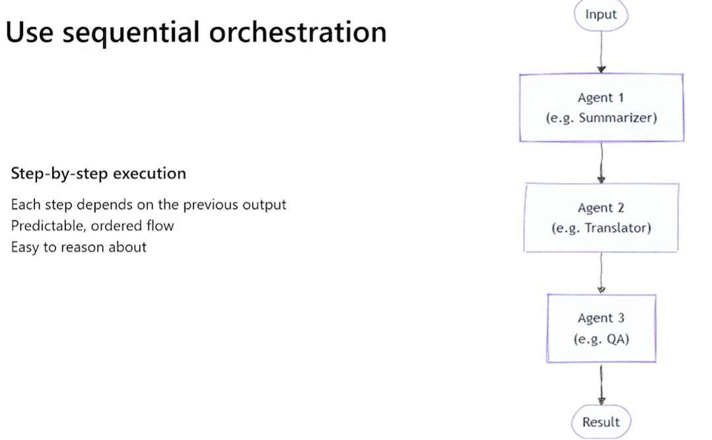

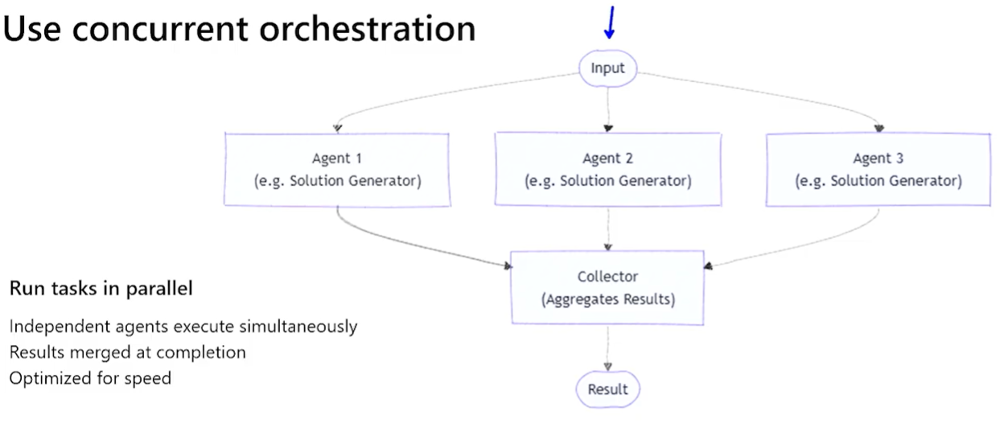

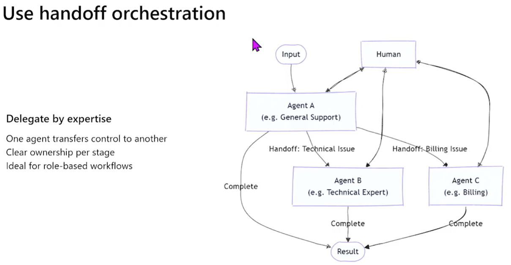

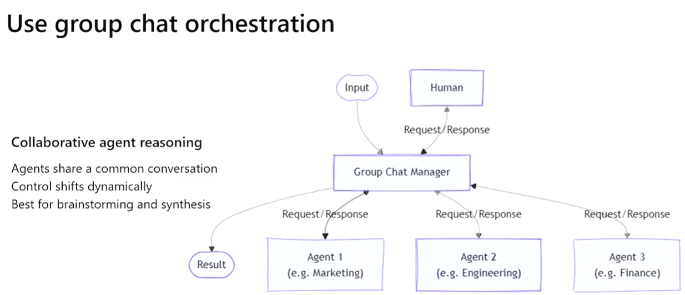

### Resources

**https://github.com/MicrosoftLearning/mslearn-ai-agents/blob/main/Instructions/Exercises/08-agent-framework-multi-agents.md**

---


# Quiz

1. Centrally managing Azure AI search credentials for multiple agents:
- [ ]Enable role-based access control (RBAC)
- [ ]Disable key-based access control
- [ ]Add a connection to the Azure AI search resource (Correct)
- [ ]Create a managed private endpoint

2. Setting the project property for a fine-tuned speech-to-text model:
- [ ]The project URL
- [ ]The custom speech project ID (Correct)
- [ ]The project ID
- [ ]The custom speech endpoint URL

3. Expected behavior when a custom speech-to-text model expires:
- [ ]Speech recognition requests will return a 4xx error
- [ ]Speech recognition requests will continue to use the expired model
- [ ]Speech recognition requests will fall back to the most recent base model (Correct)
- [ ]The custom model will be deleted automatically

4. RBAC role assignment for developers to perform model inference:
- [ ]Cognitive services user
- [ ]Cognitive services OpenAI user (Correct)
- [ ]Contributor
- [ ]Cognitive services data reader

5. Configuring an Open API tool to automatically include an API key:
- [ ]A header parameter defined for each operation
- [ ]An Azure key vault connection
- [ ]An API key security scheme (Correct)
- [ ]A bearer token security scheme

6. Reducing costs and latency for a high-volume chat app with mixed queries:
- [ ]Route all requests to a smaller model
- [ ]Use a model cascade that routes requests to different models (Correct)
- [ ]Increase the value of the max tokens parameter
- [ ]Route all requests to the most capable model

7. Identifying the cause of increased operational costs in a high-traffic agent:
- [ ]Latency
- [ ]Evaluation metrics
- [ ]Run success rate
- [ ]Token usage (Correct)

8. Generating markdown output from PDF vendor invoices:
- [ ]Configure output=figures
- [ ]Configure content=markdown
- [ ]Increase the confidence threshold
- [ ]Set the outputcontentformat=contentformatdomarkdown value (Correct)

9. Observability capability to inspect individual agent runs, LLM calls, and timing:
- [ ]Token usage
- [ ]Monitoring
- [ ]Safety metrics
- [ ]Tracing (Correct)

10. Mitigating risks from hidden instructions in uploaded images:
- [ ]Yes (Prompt shields for user prompts meet the goal)
- [ ]No (Correct: Prompt shields for user prompts do not protect against document-based hidden instructions)

11. Configuring to process mixed-format documents while preserving structure and markdown:
- [ ]An Azure language text analysis deployment
- [ ]A generative chat completion request
- [ ]An Azure OpenAI multimodal model call
- [ ]An Azure content understanding analyzer (Correct)

12. Observability signal to determine if retrieved content negatively affects responses:
- [ ]Indexer status and failure history
- [ ]Latency breakdown traces
- [ ]Prediction drift metrics
- [ ]Groundedness evaluation metrics (Correct)

13. Addressing embedded malicious instructions in images for an OCR application:
- [ ]Image moderation
- [ ]Prompt shields for documents (Correct)
- [ ]Protected material text
- [ ]Prompt shields for user prompts

14. Automatically classifying and blocking harmful uploaded images:
- [ ]Apply keyword scanning to OCR output
- [ ]Enable prompt shields
- [ ]Use block lists
- [ ]Implement image moderation (Correct)

15. Components to use for end-to-end tracing in an external Python service:
- [ ]Log analytics workspace
- [ ]Application insights and Open Telemetry (Correct)
- [ ]Azure Monitor Agent
- [ ]Microsoft Sentinel

16. Retrieval approach for complex multi-turn conversations and parallel chunks:
- [ ]Iterative retrieval
- [ ]Agentic retrieval augmented generation (RAG) (Correct)
- [ ]Chain of thought
- [ ]Classic retrieval augmented generation (RAG)

17. (Duplicate question in video) Recommended retrieval approach:
- [ ]Iterative retrieval
- [ ]Agentic retrieval augmented generation (RAG) (Correct)
- [ ]Chain of thought
- [ ]Classic retrieval augmented generation (RAG)

18. Handling HTTP 429 rate limit errors during load testing:
- [ ]Create a new thread and retry immediately
- [ ]Reduce the number of registered tools
- [ ]Implement a retry policy that uses exponential backoff and jitter (Correct)
- [ ]Split uploaded content into smaller files

19. Removing a competitor's logo while preserving the rest of an image:
- [ ]Apply a mask-based inpainting edit to the logo area (Correct)
- [ ]Increase prompt guidance strength
- [ ]Modify the original prompt to exclude brand names
- [ ]Rerun the prompt with a different random seed

20. Ensuring generated images maintain product identity from user-supplied photos:
- [ ]Set the input_fidelity parameter to high
- [ ]Apply a groundedness detection filter
- [ ]Include a prompt and input image in the request (Correct)
- [ ]Decrease the temperature paramete
