- [BigQuery Commands](#bigquery-commands)
  - [General Commands](#general-commands)
  - [Feature Engineering](#feature-engineering)
  - [Use case](#use-case)
    - [Step 1: Prepare Mock Data](#step-1-prepare-mock-data)
      - [SQL Query](#sql-query)
      - [Console Response](#console-response)
    - [Step 2: Build \& Train the Model (with Feature Engineering)](#step-2-build--train-the-model-with-feature-engineering)
      - [SQL Query](#sql-query-1)
      - [Console Response](#console-response-1)
    - [Step 3: Extract \& Audit Feature Engineering](#step-3-extract--audit-feature-engineering)
      - [A. Inspect Preprocessing Properties (ML.FEATURE\_INFO)](#a-inspect-preprocessing-properties-mlfeature_info)
        - [SQL Query](#sql-query-2)
        - [Console Response](#console-response-2)
      - [B. Audit Feature Transformations (ML.TRANSFORM)](#b-audit-feature-transformations-mltransform)
        - [SQL Query](#sql-query-3)
        - [Console Response](#console-response-3)
    - [Step 4: Evaluate Model Performance](#step-4-evaluate-model-performance)
      - [SQL Query](#sql-query-4)
      - [Console Response](#console-response-4)
    - [Step 5: Execute Predictions](#step-5-execute-predictions)
      - [SQL Query](#sql-query-5)
      - [Console Response](#console-response-5)
  - [ML.PREDICT Values](#mlpredict-values)
- [Vertex AI Pipeline](#vertex-ai-pipeline)
  - [Overview \& Core Concepts](#overview--core-concepts)
  - [Architecture Components](#architecture-components)
  - [Pipeline Use Case: Customer Churn Prediction](#pipeline-use-case-customer-churn-prediction)
    - [Step 1: Data Preparation Component](#step-1-data-preparation-component)
    - [Step 2: Feature Engineering \& Training Component](#step-2-feature-engineering--training-component)
    - [Step 3: Model Evaluation Component](#step-3-model-evaluation-component)
    - [Step 4: Conditional Deployment Component](#step-4-conditional-deployment-component)
    - [Step 5: Execute the Pipeline](#step-5-execute-the-pipeline)
  - [Key Pipeline Features](#key-pipeline-features)
  - [Input \& Output: Data Flow Between Components](#input--output-data-flow-between-components)
  - [Quiz](#quiz)
- [AI Develop Option](#ai-develop-option)
  - [Comparison Matrix](#comparison-matrix)
  - [Detailed Analysis: Scenarios, Pros, and Cons](#detailed-analysis-scenarios-pros-and-cons)
- [Evaluation](#evaluation)
  - [What is a Confusion Matrix?](#what-is-a-confusion-matrix)
  - [Precision vs. Recall vs. F1-Score](#precision-vs-recall-vs-f1-score)
  - [When to Use Which?](#when-to-use-which)
- [Apache Beam \& Dataflow](#apache-beam--dataflow)
  - [Overview \& Core Concepts](#overview--core-concepts-1)
  - [Key Concepts](#key-concepts)
    - [1. **Pipeline**](#1-pipeline)
    - [2. **PCollection**](#2-pcollection)
    - [3. **Transform (PTransform)**](#3-transform-ptransform)
    - [4. **Windowing** (Streaming Only)](#4-windowing-streaming-only)
    - [5. **Aggregation**](#5-aggregation)
  - [Dataflow Architecture Components](#dataflow-architecture-components)
  - [Use Case: Real-time Sensor Data Processing Pipeline](#use-case-real-time-sensor-data-processing-pipeline)
    - [Step 1: Define the Pipeline](#step-1-define-the-pipeline)
    - [Step 2: Read Data from Source](#step-2-read-data-from-source)
    - [Step 3: Transform \& Process Data](#step-3-transform--process-data)
    - [Step 4: Write Results to Sink](#step-4-write-results-to-sink)
    - [Step 5: Run on Dataflow](#step-5-run-on-dataflow)
  - [Comparison: Batch vs. Streaming](#comparison-batch-vs-streaming)
    - [Batch Example:](#batch-example)
    - [Streaming Example:](#streaming-example)
  - [Best Practices](#best-practices)
    - [Example: Dead-Letter Pattern](#example-dead-letter-pattern)
- [Production ML System](#production-ml-system)
  - [Google Cloud Dataproc](#google-cloud-dataproc)
    - [Overview \& Purpose](#overview--purpose)
    - [Core Components](#core-components)
    - [When to Use Dataproc](#when-to-use-dataproc)
    - [Dataproc vs. BigQuery vs. Dataflow](#dataproc-vs-bigquery-vs-dataflow)
    - [Quick Start Example: Word Count in PySpark](#quick-start-example-word-count-in-pyspark)
    - [Common Dataproc Workflows](#common-dataproc-workflows)
    - [Key Advantages](#key-advantages)
  - [Static vs. Dynamic Training](#static-vs-dynamic-training)
    - [Quick Overview](#quick-overview)
    - [Comparison Table](#comparison-table)
    - [When to Choose Static Training](#when-to-choose-static-training)
    - [When to Choose Dynamic Training](#when-to-choose-dynamic-training)
    - [Implementation Patterns](#implementation-patterns)
      - [Static Training Pattern](#static-training-pattern)
      - [Dynamic Training Pattern](#dynamic-training-pattern)
    - [Decision Tree: Static or Dynamic?](#decision-tree-static-or-dynamic)
    - [Monitoring \& Best Practices](#monitoring--best-practices)
  - [Architecture Diagrams \& Trade-offs](#architecture-diagrams--trade-offs)
    - [Static Training Architecture (GCP Services)](#static-training-architecture-gcp-services)
    - [Dynamic Training Architecture (GCP Services)](#dynamic-training-architecture-gcp-services)
    - [GCP Services Quick Reference](#gcp-services-quick-reference)
    - [Quick Trade-offs Comparison](#quick-trade-offs-comparison)
    - [When to Choose](#when-to-choose)
  - [ML Drift in Production](#ml-drift-in-production)
    - [Types of Drift](#types-of-drift)
    - [Real-World Examples](#real-world-examples)
    - [Drift Detection Strategy](#drift-detection-strategy)
  - [TensorFlow Data Validation (TFDV)](#tensorflow-data-validation-tfdv)
    - [TFDV Drift Detection Approach](#tfdv-drift-detection-approach)
    - [1. StatisticsGen](#1-statisticsgen)
    - [2. SchemaGen](#2-schemagen)
    - [3. ExampleValidator](#3-examplevalidator)
    - [End-to-End Example: TFDV Workflow](#end-to-end-example-tfdv-workflow)
    - [Integration with Vertex AI Pipelines](#integration-with-vertex-ai-pipelines)
- [Vertex AI](#vertex-ai)
  - [Vertex AI ML Model Building Capabilities](#vertex-ai-ml-model-building-capabilities)
  - [Vertex AI Quiz](#vertex-ai-quiz)
  - [Agent Platform](#agent-platform)
    - [Quiz](#quiz-1)
    - [Feedback Loop Definition](#feedback-loop-definition)
    - [Examples by Model Type](#examples-by-model-type)
    - [Consequences \& Mitigation](#consequences--mitigation)
  - [Model Training](#model-training)
    - [Distributed Training](#distributed-training)
      - [Data Parallelism](#data-parallelism)
        - [Synchronous AllReduce Architecture](#synchronous-allreduce-architecture)
        - [Asynchronous Architecture](#asynchronous-architecture)
      - [Model Parallelism](#model-parallelism)
      - [TensorFlow Distributed Training Strategies](#tensorflow-distributed-training-strategies)
  - [tf.data](#tfdata)
    - [Key Features](#key-features)
    - [Core Operations](#core-operations)
    - [Simple Example](#simple-example)
    - [Production Example: Image Pipeline](#production-example-image-pipeline)
    - [Why Use tf.data?](#why-use-tfdata)
  - [Inference](#inference)
    - [Quiz](#quiz-2)
  - [Hybrid Cloud ML](#hybrid-cloud-ml)
    - [Kubeflow](#kubeflow)
      - [🔗 Component Communication: Input/Output via kfp.dsl](#-component-communication-inputoutput-via-kfpdsl)
        - [**Data Flow Mechanism**](#data-flow-mechanism)
        - [**Key Concepts**](#key-concepts-1)
        - [**Communication Pattern**](#communication-pattern)
        - [**Pipeline Connection Syntax**](#pipeline-connection-syntax)
        - [**Data Types \& Behavior**](#data-types--behavior)
        - [**Complete Example: 3-Component Pipeline**](#complete-example-3-component-pipeline)
        - [**Metadata: Attach Info to Artifacts**](#metadata-attach-info-to-artifacts)
    - [TensorFlow Lite](#tensorflow-lite)
    - [Kubeflow vs. TensorFlow Lite Comparison](#kubeflow-vs-tensorflow-lite-comparison)
    - [Quiz](#quiz-3)
  - [ALL QUIZ \& ANSWERS](#all-quiz--answers)
- [MLOps](#mlops)
  - [MLOps Critical Steps](#mlops-critical-steps)
    - [Core MLOps Steps with GCP Services](#core-mlops-steps-with-gcp-services)
  - [MLOps Workflow on GCP (End-to-End)](#mlops-workflow-on-gcp-end-to-end)
  - [Key MLOps Principles (Best Practices)](#key-mlops-principles-best-practices)
  - [Example: MLOps Pipeline on Vertex AI](#example-mlops-pipeline-on-vertex-ai)
  - [Quick MLOps Checklist](#quick-mlops-checklist)
  - [Quiz](#quiz-4)
  - [MLOps on Vertex AI](#mlops-on-vertex-ai)
    - [Vertex Explainable AI (XAI)](#vertex-explainable-ai-xai)
    - [Monitoring ML](#monitoring-ml)
  - [Step-by-Step Implementation on GCP](#step-by-step-implementation-on-gcp)
    - [1. Data Preparation \& Training](#1-data-preparation--training)
    - [2. Hyperparameter Tuning](#2-hyperparameter-tuning)
    - [3. Model Training](#3-model-training)
    - [4. Experimenting](#4-experimenting)
    - [5. Model Evaluation](#5-model-evaluation)
    - [5. Model Evaluation](#5-model-evaluation-1)
    - [6. Explainability (XAI)](#6-explainability-xai)
    - [7. Monitoring ML](#7-monitoring-ml)
    - [8. Deploying ML Model](#8-deploying-ml-model)
  - [Complete MLOps Pipeline Flow (Sequential Order)](#complete-mlops-pipeline-flow-sequential-order)
- [Vertex AI Dataset vs Feature Store](#vertex-ai-dataset-vs-feature-store)
  - [Vertex AI Dataset](#vertex-ai-dataset)
  - [Feature Store](#feature-store)
  - [Comparison](#comparison)
  - [All Vertex AI Services - Comprehensive Reference](#all-vertex-ai-services---comprehensive-reference)
  - [GCP MLOps Tools Quick Reference](#gcp-mlops-tools-quick-reference)
  - [Key GCP Services Summary](#key-gcp-services-summary)
  - [Quiz](#quiz-5)
- [End-to-End MLOps Pipeline: Kubeflow + Vertex AI (GCP Operations)](#end-to-end-mlops-pipeline-kubeflow--vertex-ai-gcp-operations)
  - [Overview](#overview)
  - [Architecture: From Code to Production](#architecture-from-code-to-production)
  - [Step-by-Step GCP Operations](#step-by-step-gcp-operations)
    - [Step 1: Retrieve GCP Project ID and Create GCS Bucket](#step-1-retrieve-gcp-project-id-and-create-gcs-bucket)
    - [Step 2: Upload Data to Cloud Storage](#step-2-upload-data-to-cloud-storage)
    - [Step 3: Initialize Vertex AI and AI Platform](#step-3-initialize-vertex-ai-and-ai-platform)
- [Get service account (for pipeline execution)](#get-service-account-for-pipeline-execution)
    - [Step 4: Create Pipeline Configuration](#step-4-create-pipeline-configuration)
    - [Step 5: Build Kubeflow Pipeline Components](#step-5-build-kubeflow-pipeline-components)
  - [🔗 Component Communication: Kubeflow Key Concepts](#-component-communication-kubeflow-key-concepts)
    - [**Component Communication Flow**](#component-communication-flow)
    - [**6 Pipeline Components Summary**](#6-pipeline-components-summary)
    - [Step 6: Compile and Build Pipeline](#step-6-compile-and-build-pipeline)
    - [Step 7: Submit Pipeline to Vertex AI Pipelines](#step-7-submit-pipeline-to-vertex-ai-pipelines)
    - [Step 8: Upload Pipeline Artifacts to GCS](#step-8-upload-pipeline-artifacts-to-gcs)
    - [Step 9: Test Deployed Endpoint](#step-9-test-deployed-endpoint)
    - [Step 10: Monitor and Maintain](#step-10-monitor-and-maintain)
  - [Quick Reference: GCP Services Used](#quick-reference-gcp-services-used)
  - [Checklist: Deploy MLOps Pipeline End-to-End](#checklist-deploy-mlops-pipeline-end-to-end)
- [Vertex AI Feature Store](#vertex-ai-feature-store)
  - [Critical Role: When \& Where Feature Store Matters Most](#critical-role-when--where-feature-store-matters-most)
  - [What is Feature Store?](#what-is-feature-store)
  - [Why Do We Need Feature Store?](#why-do-we-need-feature-store)
  - [How Feature Store Works (Architecture)](#how-feature-store-works-architecture)
  - [Feature Store Components](#feature-store-components)
  - [Feature Store Hierarchy \& Relationships](#feature-store-hierarchy--relationships)
    - [Correlation: Feature Store → Entity → Entity Type → Feature View](#correlation-feature-store--entity--entity-type--feature-view)
    - [Key Relationships Explained](#key-relationships-explained)
    - [Can Multiple Entity Types be Present in 1 Feature Store?](#can-multiple-entity-types-be-present-in-1-feature-store)
  - [Step-by-Step Configuration in GCP](#step-by-step-configuration-in-gcp)
    - [Step 1: Create Feature Repository](#step-1-create-feature-repository)
    - [Step 2: Create Entity Type](#step-2-create-entity-type)
    - [Step 3: Create Feature View (Offline Source)](#step-3-create-feature-view-offline-source)
    - [Step 4: Ingest Features (Offline → Online Store)](#step-4-ingest-features-offline--online-store)
      - [**Offline vs Online Store Architecture**](#offline-vs-online-store-architecture)
      - [**How Latest Data is Fetched**](#how-latest-data-is-fetched)
      - [**How to Keep Data Fresh**](#how-to-keep-data-fresh)
    - [Step 5: Retrieve Features for Training](#step-5-retrieve-features-for-training)
    - [Step 6: Retrieve Features for Real-Time Serving](#step-6-retrieve-features-for-real-time-serving)
    - [Step 7: Monitor Feature Quality \& Drift](#step-7-monitor-feature-quality--drift)
  - [Feature Store vs. Manual Feature Engineering](#feature-store-vs-manual-feature-engineering)
  - [Complete Feature Store Workflow Example](#complete-feature-store-workflow-example)
  - [Feature Store Architecture Diagram](#feature-store-architecture-diagram)
  - [Joining Multiple Entities for Training](#joining-multiple-entities-for-training)
  - [Purpose of Timestamps in Feature Store](#purpose-of-timestamps-in-feature-store)
  - [Entity Versioning \& Best Practices](#entity-versioning--best-practices)
- [GenAI](#genai)
  - [LLM Quiz](#llm-quiz)
  - [MLOps](#mlops-1)
    - [QUIZ](#quiz-6)
    - [LLM Evaluation](#llm-evaluation)
      - [1. **Lexical Similarity**](#1-lexical-similarity)
      - [2. **Linguistic Quality**](#2-linguistic-quality)
      - [3. **Task-Specific Metrics**](#3-task-specific-metrics)
      - [4. **Safety \& Fairness**](#4-safety--fairness)
      - [5. **Groundedness**](#5-groundedness)
      - [6. **User-Centric Metrics**](#6-user-centric-metrics)
    - [Evaluation Metrics](#evaluation-metrics)
      - [Pointwise Evaluation](#pointwise-evaluation)
      - [Pairwise Evaluation](#pairwise-evaluation)
    - [Evaluation Dataset](#evaluation-dataset)
    - [Auto side-by-side(SxS) comparison](#auto-side-by-sidesxs-comparison)
    - [Quiz](#quiz-7)
  - [Create GenAI App](#create-genai-app)
  - [Prompt Quiz](#prompt-quiz)
  - [RAG QUIZ](#rag-quiz)
- [Responsible AI](#responsible-ai)
  - [QUIZ](#quiz-8)
  - [Fairness \& Bias](#fairness--bias)
    - [Bias Types with Examples](#bias-types-with-examples)
      - [1. **Selection Bias**](#1-selection-bias)
      - [2. **Measurement Bias**](#2-measurement-bias)
      - [3. **Aggregation Bias**](#3-aggregation-bias)
      - [4. **Implicit Bias** (Evaluation Bias)](#4-implicit-bias-evaluation-bias)
      - [5. **Group Attribution Bias**](#5-group-attribution-bias)
      - [6. **Automation Bias**](#6-automation-bias)
    - [Summary Table](#summary-table)
    - [Fairness Techniques](#fairness-techniques)
    - [GCP Tools](#gcp-tools)
    - [5-Step Implementation](#5-step-implementation)
    - [Quick Example: Threshold Adjustment](#quick-example-threshold-adjustment)
    - [Fairness Metrics](#fairness-metrics)
    - [Quiz](#quiz-9)
    - [Identify Bias with TFDV](#identify-bias-with-tfdv)
      - [How TFDV Identifies Bias](#how-tfdv-identifies-bias)
      - [TFDV Bias Detection Workflow](#tfdv-bias-detection-workflow)
      - [Quick Example](#quick-example)
      - [Key Alerts TFDV Raises for Bias](#key-alerts-tfdv-raises-for-bias)
      - [What-if tool](#what-if-tool)
      - [TFMA(TF Model Analysis)](#tfmatf-model-analysis)
      - [Threshold Calibration](#threshold-calibration)
    - [QUIZ](#quiz-10)
  - [Interpretability \& Transparency](#interpretability--transparency)
    - [Model-Agnostic Interpretability \& Transparency](#model-agnostic-interpretability--transparency)
      - [Key Techniques](#key-techniques)
      - [Techniques: Pros, Cons \& When to Use](#techniques-pros-cons--when-to-use)
      - [Quick Decision Guide](#quick-decision-guide)
      - [GCP Tools for Model-Agnostic Explanations](#gcp-tools-for-model-agnostic-explanations)
  - [Model Specific](#model-specific)
    - [Techniques: Pros, Cons \& When to Use](#techniques-pros-cons--when-to-use-1)
  - [XRAI](#xrai)
    - [How XRAI Works](#how-xrai-works)
    - [Benefits](#benefits)
    - [When to Use XRAI](#when-to-use-xrai)
    - [Example](#example)
  - [Concept-based and example-based explanations](#concept-based-and-example-based-explanations)
    - [TCAV](#tcav)
      - [How TCAV Works](#how-tcav-works)
      - [Benefits](#benefits-1)
      - [When to Use TCAV](#when-to-use-tcav)
      - [Example](#example-1)
    - [ACE](#ace)
      - [How ACE Works](#how-ace-works)
      - [Benefits](#benefits-2)
      - [When to Use ACE](#when-to-use-ace)
      - [Example](#example-2)
  - [Interpretability Tools](#interpretability-tools)
    - [Vertex Explainable AI](#vertex-explainable-ai)
  - [Data \& Model Transparency](#data--model-transparency)
    - [Data card](#data-card)
    - [Model card](#model-card)
  - [QUIZ](#quiz-11)
  - [Privacy \& Safety](#privacy--safety)
    - [De-Identification Techniques](#de-identification-techniques)
    - [k-anonymity \& l-diversity](#k-anonymity--l-diversity)
    - [Randomization Technique](#randomization-technique)
    - [DP-SGD](#dp-sgd)
    - [Federated Learning](#federated-learning)
      - [How It Works](#how-it-works)
      - [Benefits](#benefits-3)
      - [Key Challenges](#key-challenges)
      - [When to Use Federated Learning](#when-to-use-federated-learning)
      - [Example](#example-3)
      - [GCP Implementation](#gcp-implementation)
    - [GCP System Security](#gcp-system-security)
  - [Quiz](#quiz-12)
  - [AI Safety](#ai-safety)
    - [Safety Evaluation](#safety-evaluation)
      - [Adversarial Testing](#adversarial-testing)
    - [Safety in GCP](#safety-in-gcp)
  - [QUIZ](#quiz-13)
  - [GCP Service Enablement Roles \& Permissions](#gcp-service-enablement-roles--permissions)
- [GCP APIs](#gcp-apis)
- [Speech-to-Text API: Synchronous vs Asynchronous Recognition](#speech-to-text-api-synchronous-vs-asynchronous-recognition)
- [Cloud Data Fusion](#cloud-data-fusion)
  - [Overview](#overview-1)
  - [Purpose \& Key Benefits](#purpose--key-benefits)
    - [Primary Purposes:](#primary-purposes)
    - [Key Benefits:](#key-benefits)
  - [Core Components](#core-components-1)
  - [Typical Use Cases](#typical-use-cases)
    - [1. **Data Warehouse Population**](#1-data-warehouse-population)
    - [2. **Real-time Data Replication**](#2-real-time-data-replication)
    - [3. **Data Lake Ingestion**](#3-data-lake-ingestion)
    - [4. **API Data Integration**](#4-api-data-integration)
    - [5. **Log Aggregation \& Processing**](#5-log-aggregation--processing)
    - [6. **Master Data Management (MDM)**](#6-master-data-management-mdm)
  - [Architecture \& Workflow](#architecture--workflow)
    - [Pipeline Execution Flow:](#pipeline-execution-flow)
  - [Key Features](#key-features-1)
    - [Connectors \& Data Sources](#connectors--data-sources)
    - [Transformation Capabilities](#transformation-capabilities)
    - [Scheduling \& Triggers](#scheduling--triggers)
  - [Comparison with Alternatives](#comparison-with-alternatives)
  - [Integration with Machine Learning Pipelines](#integration-with-machine-learning-pipelines)
  - [Common Pipeline Example: E-commerce Analytics](#common-pipeline-example-e-commerce-analytics)
  - [Pricing \& Considerations](#pricing--considerations)
  - [Best Practices](#best-practices-1)
  - [Related GCP Services](#related-gcp-services)
- [TPU (Tensor Processing Unit)](#tpu-tensor-processing-unit)
  - [What is TPU?](#what-is-tpu)
    - [TPU Generations](#tpu-generations)
  - [TPU vs GPU](#tpu-vs-gpu)
  - [Choose TPU When](#choose-tpu-when)
  - [Choose GPU When](#choose-gpu-when)
  - [Quick Decision Tree](#quick-decision-tree)
  - [Scenario Comparison](#scenario-comparison)
  - [TPU on GCP](#tpu-on-gcp)
  - [Cost Example](#cost-example)
  - [Hybrid Strategy](#hybrid-strategy)
  - [Key Takeaways](#key-takeaways)
  - [Preemptible vs Non-Preemptible TPU](#preemptible-vs-non-preemptible-tpu)
    - [When to Choose Preemptible](#when-to-choose-preemptible)
    - [When to Choose Non-Preemptible](#when-to-choose-non-preemptible)
    - [Quick Decision](#quick-decision)
    - [Hybrid Strategy](#hybrid-strategy-1)
- [Log Loss (Cross-Entropy Loss)](#log-loss-cross-entropy-loss)
  - [What is Log Loss?](#what-is-log-loss)
  - [Why Use Log Loss?](#why-use-log-loss)
    - [Example](#example-4)
  - [When to Use Log Loss](#when-to-use-log-loss)
  - [Quick Comparison](#quick-comparison)
  - [Common Use Cases](#common-use-cases)
  - [In GCP/Vertex AI](#in-gcpvertex-ai)
  - [Key Takeaways](#key-takeaways-1)
- [Matrix Factorization Model](#matrix-factorization-model)
  - [What is Matrix Factorization?](#what-is-matrix-factorization)
  - [How It Works](#how-it-works-1)
  - [When to Use](#when-to-use)
  - [Key Advantages](#key-advantages-1)
  - [Key Disadvantages](#key-disadvantages)
  - [Common Algorithms](#common-algorithms)
  - [GCP Implementation](#gcp-implementation-1)
  - [Key Takeaways](#key-takeaways-2)
- [Quick Bytes](#quick-bytes)
- [Q\&A Section](#qa-section)
  - [Question 1](#question-1)
  - [Answer 1](#answer-1)
  - [Question 2](#question-2)
  - [Answer 2](#answer-2)
  - [Question 3](#question-3)
  - [Answer 3](#answer-3)
  - [Question 4](#question-4)
  - [Answer 4](#answer-4)
  - [Question 5](#question-5)
  - [Answer 5](#answer-5)
  - [Question 6](#question-6)
  - [Answer 6](#answer-6)
  - [Question 7](#question-7)
  - [Answer 7](#answer-7)
  - [Question 8](#question-8)
  - [Answer 8](#answer-8)
  - [Question 9](#question-9)
  - [Answer 9](#answer-9)
  - [Question 10](#question-10)
  - [Answer 10](#answer-10)
  - [Question 11](#question-11)
  - [Answer 11](#answer-11)
  - [Question 12](#question-12)
  - [Answer 12](#answer-12)
  - [Answer 2](#answer-2-1)
  - [Question 3](#question-3-1)
  - [Answer 3](#answer-3-1)
  - [Question 4](#question-4-1)
  - [Answer 4](#answer-4-1)
  - [Question 5](#question-5-1)
  - [Answer 5](#answer-5-1)
  - [Question 6](#question-6-1)
  - [Answer 6](#answer-6-1)
  - [Question 7](#question-7-1)
  - [Answer 7](#answer-7-1)
  - [Question 8](#question-8-1)
  - [Answer 8](#answer-8-1)
  - [Question 9](#question-9-1)
  - [Answer 9](#answer-9-1)
  - [Question 10](#question-10-1)
  - [Answer 10](#answer-10-1)
  - [Question 11](#question-11-1)
  - [Answer 11](#answer-11-1)
  - [Question 12](#question-12-1)
  - [Answer 12](#answer-12-1)
  - [Question 13](#question-13)
  - [Answer 13](#answer-13)
  - [Question 14](#question-14)
  - [Answer 14](#answer-14)
  - [Question 15](#question-15)
  - [Answer 15](#answer-15)
  - [Question 16](#question-16)
  - [Answer 16](#answer-16)
  - [Question 17](#question-17)
  - [Answer 17](#answer-17)
  - [Question 18](#question-18)
  - [Answer 18](#answer-18)
  - [Question 19](#question-19)
  - [Answer 19](#answer-19)
  - [Question 20](#question-20)
  - [Answer 20](#answer-20)
  - [Question 21](#question-21)
  - [Answer 21](#answer-21)
  - [Question 22](#question-22)
  - [Answer 22](#answer-22)
  - [Question 23](#question-23)
  - [Answer 23](#answer-23)
  - [Question 24](#question-24)
  - [Answer 24](#answer-24)


# BigQuery Commands

## General Commands

BigQuery ML (BQML) enables users to create, train, and evaluate machine learning models using standard SQL queries. Below are the primary BQML statements and evaluation functions along with their descriptions and implementations. [1, 2] 

| Command / Statement | Description | SQL Example |
|---|---|---|
| CREATE MODEL | Creates and trains a machine learning model on your BigQuery data. | CREATE MODEL my_dataset.mymodel OPTIONS(model_type='linear_reg') AS SELECT feature1, feature2, label FROM my_dataset.training_data; |
| CREATE OR REPLACE MODEL | Overwrites an existing model with the same name with a newly trained model. | CREATE OR REPLACE MODEL my_dataset.mymodel OPTIONS(model_type='logistic_reg', input_label_cols=['label']) AS SELECT * FROM my_dataset.data; |
| ML.PREDICT | Uses a trained machine learning model to predict outcomes on new or existing data. | SELECT * FROM ML.PREDICT(MODEL my_dataset.mymodel, (SELECT feature1, feature2 FROM my_dataset.new_data)); |
| ML.EVALUATE | Evaluates the model's predictive performance against testing data or generates training evaluation metrics. | SELECT * FROM ML.EVALUATE(MODEL my_dataset.mymodel, (SELECT feature1, feature2, label FROM my_dataset.test_data)); |
| ML.EXPLAIN_PREDICT | Explains the prediction results by providing feature attributions for supported models. | SELECT * FROM ML.EXPLAIN_PREDICT(MODEL my_dataset.mymodel, (SELECT feature1 FROM my_dataset.new_data)); |
| ML.TRAINING_INFO | Returns information about the training iterations, including loss, duration, and learning rate. | SELECT * FROM ML.TRAINING_INFO(MODEL my_dataset.mymodel); |
| ML.WEIGHTS | Retrieves the weights learned by the model during training (useful for logistic/linear regression). | SELECT * FROM ML.WEIGHTS(MODEL my_dataset.mymodel); |
| ML.FEATURE_INFO | Returns statistics about the features used in the model, such as average, min, max, and data types. | SELECT * FROM ML.FEATURE_INFO(MODEL my_dataset.mymodel); |
| ML.ROC_CURVE | Returns the ROC (Receiver Operating Characteristic) curve metrics for binary classification models. | SELECT * FROM ML.ROC_CURVE(MODEL my_dataset.mymodel); |
| DROP MODEL | Deletes a trained model from your BigQuery dataset. | DROP MODEL IF EXISTS my_dataset.mymodel; |

---

## Feature Engineering

Here is the updated table including the core TRANSFORM clause used for manual feature engineering, the ML.TRANSFORM extraction function, and common built-in preprocessing functions. [1, 2, 3, 4] 

| Command / Statement / Function | Description | SQL Example |
|---|---|---|
| TRANSFORM (Clause) | Embeds preprocessing logic within CREATE MODEL to prevent training-serving skew. | CREATE MODEL ... TRANSFORM(ML.STANDARD_SCALER(age) OVER() AS s_age) ... AS SELECT ...; |
| ML.TRANSFORM | Views transformed data applied by the model's TRANSFORM clause. | SELECT * FROM ML.TRANSFORM(MODEL my_model, TABLE my_data); |
| ML.STANDARD_SCALER | Normalizes numerical features (mean 0, std dev 1). | ML.STANDARD_SCALER(col) OVER() |
| ML.MIN_MAX_SCALER | Scales numerical features to a 0-1 range. | ML.MIN_MAX_SCALER(col) OVER() |
| ML.QUANTILE_BUCKETIZE | Buckets numerical data based on quantiles. | ML.QUANTILE_BUCKETIZE(col, 5) OVER() |
| ML.FEATURE_CROSS | Generates feature interactions for categorical variables. | ML.FEATURE_CROSS(STRUCT(col1, col2)) |
| ML.POLYNOMIAL_EXPAND | Creates polynomial features to capture non-linear relationships. | ML.POLYNOMIAL_EXPAND(STRUCT(col1), 2) |
| ML.ONE_HOT_ENCODER | Converts strings to binary indicators. | ML.ONE_HOT_ENCODER(col) OVER() |
| ML.HASH_BUCKETIZE | Hashes high-cardinality strings into buckets. | ML.HASH_BUCKETIZE(col, 100) |

---

## Use case

### Step 1: Prepare Mock Data
This step initializes your sandbox environment with a table containing customer browsing attributes and purchase flags. [3] 
#### SQL Query

```
CREATE OR REPLACE TABLE my_dataset.customer_data AS SELECT 25 AS age, 'Mobile' AS device, 120 AS time_spent, 1 AS will_buy UNION ALL
SELECT 45 AS age, 'Desktop' AS device, 450 AS time_spent, 1 AS will_buy UNION ALL
SELECT 19 AS age, 'Mobile' AS device, 15 AS time_spent, 0 AS will_buy UNION ALL
SELECT 60 AS age, 'Desktop' AS device, 30 AS time_spent, 0 AS will_buy UNION ALL
SELECT 32 AS age, 'Tablet' AS device, 210 AS time_spent, 1 AS will_buy UNION ALL
SELECT 50 AS age, 'Mobile' AS device, 45 AS time_spent, 0 AS will_buy;
```

#### Console Response

| Input Rows Processed | Total Rows in Table | Status |
|---|---|---|
| 6 | 6 | Table successfully created. |

------------------------------
### Step 2: Build & Train the Model (with Feature Engineering)
This query builds a Logistic Regression classifier. It packages data scaling and numerical bucketization directly within a TRANSFORM block so preprocessing logic travels with the model.
#### SQL Query

```
CREATE OR REPLACE MODEL my_dataset.purchase_prediction_model
OPTIONS(
  model_type='logistic_reg', 
  input_label_cols=['will_buy']
) AS
SELECT 
  will_buy,
  device,
  ML.STANDARD_SCALER(time_spent) OVER() AS scaled_time,
  ML.QUANTILE_BUCKETIZE(age, 3) OVER() AS bucketed_ageFROM 
  my_dataset.customer_data;
```

#### Console Response

| Training Run [4] | Iterations | Total Training Time | Model Type |
|---|---|---|---|
| Run 1 | 5 | 12 seconds | Logistic Regression |

------------------------------
### Step 3: Extract & Audit Feature Engineering

#### A. Inspect Preprocessing Properties (ML.FEATURE_INFO)
This extracts base descriptive statistics calculated across your raw source columns.
##### SQL Query

```
SELECT * FROM ML.FEATURE_INFO(MODEL my_dataset.purchase_prediction_model);
```

##### Console Response

| input_column_name [5] | data_type | min | max | mean | stddev | null_count |
|---|---|---|---|---|---|---|
| age | INT64 | 19.0 | 60.0 | 38.5 | 15.68 | 0 |
| device | STRING | null | null | null | null | 0 |
| time_spent | INT64 | 15.0 | 450.0 | 161.67 | 164.82 | 0 |

#### B. Audit Feature Transformations (ML.TRANSFORM)
This runs mock records through the preprocessing graph without invoking a mathematical prediction to audit structural output.
##### SQL Query

```
SELECT * FROM ML.TRANSFORM(
  MODEL my_dataset.purchase_prediction_model, 
  (SELECT 28 AS age, 'Mobile' AS device, 300 AS time_spent)
);
```

##### Console Response

| age | device | time_spent | scaled_time | bucketed_age |
|---|---|---|---|---|
| 28 | Mobile | 300 | 0.8392 | 1 |

------------------------------
### Step 4: Evaluate Model Performance
This computes classification validation matrices like accuracy, log loss, and ROC AUC scores.
#### SQL Query

```
SELECT * FROM ML.EVALUATE(
  MODEL my_dataset.purchase_prediction_model, 
  TABLE my_dataset.customer_data
);
```

#### Console Response

| precision | recall | accuracy | f1_score | log_loss | roc_auc |
|---|---|---|---|---|---|
| 1.0000 | 1.0000 | 1.0000 | 1.0000 | 0.2314 | 1.0000 |

------------------------------
### Step 5: Execute Predictions
This uses raw feature inputs to predict customer purchasing behavior. It automatically applies the transformations established in Step 2.
#### SQL Query

```
SELECT 
  predicted_will_buy,
  predicted_will_buy_probs,
  device,
  age,
  time_spent
  FROM ML.PREDICT(
  MODEL my_dataset.purchase_prediction_model,
  (
    SELECT 22 AS age, 'Mobile' AS device, 500 AS time_spent UNION ALL
    SELECT 35 AS age, 'Desktop' AS device, 10 AS time_spent
  )
);
```

#### Console Response

| predicted_will_buy [6, 7] | predicted_will_buy_probs (JSON Format) | device | age | time_spent |
|---|---|---|---|---|
| 1 | [{"label": 1, "prob": 0.89}, {"label": 0, "prob": 0.11}] | Mobile | 22 | 500 |
| 0 | [{"label": 0, "prob": 0.94}, {"label": 1, "prob": 0.06}] | Desktop | 35 | 10 |

------------------------------

## ML.PREDICT Values

Here is the breakdown of the exact columns returned by ML.PREDICT based on the model type:

| Column Name | Data Type | Model Type | Description | Example Output |
|---|---|---|---|---|
| predicted_[LABEL] | Matches label type | All Models | The final predicted value or class label. | 1 or 450000.00 |
| predicted_[label]_probs | ARRAY<STRUCT> | Classification | A list of all possible classes and their probability scores. | [{"label": 1, "prob": 0.89}] |
| predicted_[label]_lower_bound | FLOAT64 | Regression | The lower limit of the prediction interval. | 425000.00 |
| predicted_[label]_upper_bound | FLOAT64 | Regression | The upper limit of the prediction interval. | 475000.00 |
| [Your Input Columns] | Matches input types | All Models | All raw features passed into the query are appended back. | 22 (age), Mobile (device) |

------------------------------

# Vertex AI Pipeline

## Overview & Core Concepts

Vertex AI Pipelines is a managed service that orchestrates machine learning workflows. It automates the execution of multi-step ML processes, enabling reproducible, scalable, and auditable pipelines. Pipelines are defined using Kubeflow Pipelines (KFP) SDK and executed on Vertex AI. [1, 2, 3] 

**Key Benefits:**
* **Reproducibility**: Define workflows once, execute consistently.
* **Orchestration**: Chain multiple ML tasks (data prep → training → evaluation → deployment).
* **Scalability**: Automatically scales compute resources.
* **MLOps**: Full tracking of metadata, versions, lineage, and model artifacts.
* **Conditional Logic**: Execute steps conditionally based on metrics or parameters.

------------------------------

## Architecture Components

| Component | Purpose | Description |
|---|---|---|
| **Component** | Reusable ML task | Self-contained Python function that performs a specific operation (e.g., data loading, training). |
| **Pipeline** | Orchestration wrapper | Combines multiple components into a directed acyclic graph (DAG). |
| **Task** | Execution unit | Runtime instance of a component within a pipeline execution. |
| **Artifact** | Data exchange | Outputs from one task passed as inputs to downstream tasks (e.g., trained model, preprocessed dataset). |
| **Parameter** | Pipeline input | Configurable value passed at runtime (e.g., learning rate, batch size, dataset path). |
| **Condition** | Control flow | Routes execution based on metric thresholds or comparisons (e.g., deploy only if accuracy > 0.90). |

------------------------------

## Pipeline Use Case: Customer Churn Prediction

**Scenario**: Build an automated ML pipeline that prepares customer data, trains a churn prediction model, evaluates it, and conditionally deploys only if accuracy exceeds 0.92.

### Step 1: Data Preparation Component

```python
from kfp import dsl
from kfp.v2.dsl import (component, Output, Artifact, Dataset, Model, Input)
import pandas as pd

@component(
    base_image='python:3.9',
    packages_to_install=['pandas', 'google-cloud-storage']
)
def prepare_data(
    gcs_input_path: str,
    output_dataset: Output[Dataset]
) -> None:
    """Load data from GCS, handle missing values, and save preprocessed dataset."""
    from google.cloud import storage
    import pandas as pd
    
    # Load raw data from GCS
    client = storage.Client()
    bucket_name, blob_name = gcs_input_path.replace('gs://', '').split('/', 1)
    bucket = client.bucket(bucket_name)
    blob = bucket.blob(blob_name)
    df = pd.read_csv(blob.open('r'))
    
    # Basic preprocessing
    df['tenure'] = df['tenure'].fillna(df['tenure'].median())
    df['monthly_charges'] = df['monthly_charges'].fillna(df['monthly_charges'].mean())
    df = df.dropna(subset=['churn'])
    
    # Save to output artifact
    df.to_csv(output_dataset.path, index=False)
    print(f"Prepared dataset with {len(df)} records")
```

### Step 2: Feature Engineering & Training Component

```python
@component(
    base_image='python:3.9',
    packages_to_install=['pandas', 'scikit-learn', 'joblib']
)
def train_model(
    input_dataset: Input[Dataset],
    learning_rate: float,
    output_model: Output[Model],
    metrics: Output[Artifact]
) -> None:
    """Train a logistic regression churn model and export metrics."""
    import pandas as pd
    from sklearn.model_selection import train_test_split
    from sklearn.linear_model import LogisticRegression
    from sklearn.preprocessing import StandardScaler
    import joblib
    import json
    
    # Load preprocessed data
    df = pd.read_csv(input_dataset.path)
    
    # Feature engineering
    df['tenure_squared'] = df['tenure'] ** 2
    df['charge_ratio'] = df['monthly_charges'] / (df['total_charges'] + 1)
    
    # Prepare features and labels
    X = df.drop('churn', axis=1)
    y = df['churn']
    
    # Scale features
    scaler = StandardScaler()
    X_scaled = scaler.fit_transform(X)
    
    # Train-test split
    X_train, X_test, y_train, y_test = train_test_split(
        X_scaled, y, test_size=0.2, random_state=42
    )
    
    # Train model
    model = LogisticRegression(
        max_iter=1000,
        random_state=42,
        C=1/learning_rate
    )
    model.fit(X_train, y_train)
    
    # Calculate metrics
    train_accuracy = model.score(X_train, y_train)
    test_accuracy = model.score(X_test, y_test)
    
    # Save model
    joblib.dump(model, output_model.path)
    
    # Save metrics
    metrics_dict = {
        'train_accuracy': float(train_accuracy),
        'test_accuracy': float(test_accuracy)
    }
    with open(metrics.path, 'w') as f:
        json.dump(metrics_dict, f)
    
    print(f"Model trained. Train Accuracy: {train_accuracy:.4f}, Test Accuracy: {test_accuracy:.4f}")
```

### Step 3: Model Evaluation Component

```python
@component(
    base_image='python:3.9',
    packages_to_install=['pandas', 'scikit-learn', 'joblib']
)
def evaluate_model(
    input_model: Input[Model],
    input_dataset: Input[Dataset],
    evaluation_metrics: Output[Artifact]
) -> float:
    """Evaluate the trained model and return accuracy as output metric."""
    import pandas as pd
    import joblib
    import json
    from sklearn.metrics import accuracy_score, precision_score, recall_score, f1_score
    
    # Load model and test data
    model = joblib.load(input_model.path)
    df = pd.read_csv(input_dataset.path)
    
    # Prepare features
    X = df.drop('churn', axis=1)
    y = df['churn']
    
    # Make predictions
    y_pred = model.predict(X)
    
    # Calculate comprehensive metrics
    accuracy = accuracy_score(y, y_pred)
    precision = precision_score(y, y_pred, zero_division=0)
    recall = recall_score(y, y_pred, zero_division=0)
    f1 = f1_score(y, y_pred, zero_division=0)
    
    # Save evaluation results
    eval_dict = {
        'accuracy': float(accuracy),
        'precision': float(precision),
        'recall': float(recall),
        'f1_score': float(f1)
    }
    with open(evaluation_metrics.path, 'w') as f:
        json.dump(eval_dict, f)
    
    print(f"Model Evaluation - Accuracy: {accuracy:.4f}, Precision: {precision:.4f}, Recall: {recall:.4f}")
    return accuracy
```

### Step 4: Conditional Deployment Component

```python
@component(
    base_image='python:3.9',
    packages_to_install=['google-cloud-aiplatform', 'joblib']
)
def deploy_model(
    input_model: Input[Model],
    accuracy_threshold: float,
    model_accuracy: float,
    deployment_status: Output[Artifact]
) -> str:
    """Conditionally deploy model to Vertex AI if accuracy meets threshold."""
    import json
    
    status = "not_deployed"
    reason = ""
    
    if model_accuracy >= accuracy_threshold:
        # Deploy logic (pseudo-code)
        status = "deployed"
        reason = f"Model deployed successfully. Accuracy: {model_accuracy:.4f} >= {accuracy_threshold}"
    else:
        status = "rejected"
        reason = f"Model accuracy ({model_accuracy:.4f}) below threshold ({accuracy_threshold})"
    
    # Save deployment status
    status_dict = {'status': status, 'reason': reason, 'accuracy': model_accuracy}
    with open(deployment_status.path, 'w') as f:
        json.dump(status_dict, f)
    
    print(f"Deployment Status: {reason}")
    return status
```

### Step 5: Execute the Pipeline

```python
from kfp.v2 import dsl, compiler
from kfp.v2.dsl import Condition

@dsl.pipeline(
    name='customer-churn-prediction-pipeline',
    description='End-to-end ML pipeline for customer churn prediction with conditional deployment'
)
def churn_pipeline(
    gcs_input_path: str = 'gs://your-bucket/raw_data.csv',
    learning_rate: float = 0.01,
    accuracy_threshold: float = 0.92
):
    """Define pipeline workflow with all components and their dependencies."""
    
    # Task 1: Data Preparation
    prep_task = prepare_data(gcs_input_path=gcs_input_path)
    
    # Task 2: Model Training (depends on prep_task)
    train_task = train_model(
        input_dataset=prep_task.outputs['output_dataset'],
        learning_rate=learning_rate
    )
    
    # Task 3: Model Evaluation (depends on train_task)
    eval_task = evaluate_model(
        input_model=train_task.outputs['output_model'],
        input_dataset=prep_task.outputs['output_dataset']
    )
    
    # Task 4: Conditional Deployment (depends on eval_task)
    with Condition(
        eval_task.outputs['Output'] >= accuracy_threshold,
        name='check_accuracy_threshold'
    ):
        deploy_task = deploy_model(
            input_model=train_task.outputs['output_model'],
            accuracy_threshold=accuracy_threshold,
            model_accuracy=eval_task.outputs['Output']
        )

# Compile pipeline to YAML
compiler.Compiler().compile(
    pipeline_func=churn_pipeline,
    package_path='churn_pipeline.yaml'
)

# Execute pipeline on Vertex AI
from google.cloud.aiplatform import pipeline_jobs

job = pipeline_jobs.PipelineJob(
    display_name='customer-churn-run',
    template_path='churn_pipeline.yaml',
    pipeline_root='gs://your-bucket/pipeline-root',
    parameter_values={
        'gcs_input_path': 'gs://your-bucket/customer_data.csv',
        'learning_rate': 0.01,
        'accuracy_threshold': 0.92
    }
)
job.run(sync=True)
```

**Pipeline Execution Flow:**
```
[Data Prep] → [Train Model] → [Evaluate Model] → [Condition: Accuracy ≥ 0.92?]
                                                        ↓ YES → [Deploy Model]
                                                        ↓ NO → [Stop]
```

------------------------------

## Key Pipeline Features

| Feature | Description | Use Case |
|---|---|---|
| **Component Reusability** | Define components once, use across multiple pipelines. | Share preprocessing logic across different ML projects. |
| **Artifact Lineage** | Track data flow from source to predictions. | Debug training failures by tracing artifact versions. |
| **Parameter Sweeps** | Submit multiple pipeline runs with different hyperparameters. | Grid search or random search for optimal parameters. |
| **Conditional Execution** | Route based on metric comparisons (if-else logic). | Deploy model only if accuracy > threshold. |
| **Scheduled Runs** | Automate pipeline execution on a schedule (hourly, daily). | Retrain model daily with fresh data. |
| **Experiment Tracking** | Compare multiple pipeline runs and their metrics. | Choose best model version across runs. |
| **Notification Hooks** | Trigger alerts or webhooks on pipeline completion. | Send Slack notification when training finishes. |

------------------------------

## Input & Output: Data Flow Between Components

**How It Works:**

* **Output**: Component writes data to a GCS path provided by KFP. Persists artifacts like datasets, models, or metrics.
* **Input**: Downstream component reads from the upstream component's output path. Connected via `.outputs['artifact_name']` reference.

**Example Data Flow:**

```python
# Component 1: Produces output
@component(base_image='python:3.9')
def prepare_data(output_dataset: Output[Dataset]) -> None:
    df = pd.DataFrame({'col1': [1, 2, 3]})
    df.to_csv(output_dataset.path, index=False)  # Write to auto-generated GCS path

# Component 2: Consumes output from Component 1
@component(base_image='python:3.9')
def train_model(input_dataset: Input[Dataset], output_model: Output[Model]) -> None:
    df = pd.read_csv(input_dataset.path)  # Read from upstream output
    model.fit(df)
    joblib.dump(model, output_model.path)  # Write trained model

# Pipeline: Chain components
@dsl.pipeline(name='my-pipeline')
def my_pipeline():
    task1 = prepare_data()
    task2 = train_model(
        input_dataset=task1.outputs['output_dataset']  # Reference Task 1's output
    )
```

**Key Points:**
* KFP automatically manages GCS paths (e.g., `gs://bucket/pipeline-root/task-123/outputs/output_dataset`).
* Large data (datasets, models) use `Output[Type]` / `Input[Type]` artifacts; small metrics use `return` statements.
* Data dependency creates task ordering—Task 2 waits for Task 1 to complete.
* Artifacts persist in GCS for full pipeline lineage and auditability.

---
## Quiz


1.Select the correct machine learning workflow.

- [x] Data preparation, model development, model serving
- [ ] Data preparation, model evaluation, model training
- [ ] Model training, data preparation, model serving
- [ ] Model serving, data preparation, model development

2.Which of the following provides a toolkit to automate, monitor, and govern machine learning systems by orchestrating the workflow in a serverless manner?

- [x] Vertex AI Pipelines
- [ ] Vertex AI Feature Store
- [ ] Responsible AI
- [ ] Explainable AI

3.A farm uses the machine learning technology of Google to detect defective apples in their crop, like those with irregular sizes or scratches. The goal is to identify only the apples that are actually bad so that no good apples are wasted. Which metric should the model focus on?

**Answer: Precision**

**Why?**

| Aspect | Explanation |
|--------|-------------|
| **The Goal** | Identify ONLY apples that are actually bad. Minimize false alarms (False Positives). |
| **Cost of Error** | If a GOOD apple is marked as defective, it gets discarded → WASTE & LOSS OF PROFIT. |
| **What Precision Measures** | Out of all apples marked as "defective," how many are ACTUALLY defective? |
| **Formula** | Precision = TP / (TP + FP) = True Bad Apples / All Apples Flagged as Bad |
| **Simple Example** | If model marks 100 apples as bad, but only 95 are actually bad → Precision = 95/100 = 95%. The 5 good apples wasted cost money. |
| **Decision** | High Precision = minimize throwing away good apples. **We want to be VERY SURE before marking an apple as bad.** |

**Key Insight for Beginners:** "Better safe than sorry" doesn't apply here. The farm says: **"Better to miss a few bad apples than to waste good ones."** They prioritize not discarding good products, so **Precision is correct**.

---

4.A hospital uses the machine learning technology of Google to help pre-diagnose cancer by feeding historical patient medical data to the model. The goal is to identify as many potential cases as possible. Which metric should the model focus on?

**Answer: Recall**

**Why?**

| Aspect | Explanation |
|--------|-------------|
| **The Goal** | Identify AS MANY potential cancer cases as possible. Minimize missed cases (False Negatives). |
| **Cost of Error** | If a PATIENT WITH CANCER is marked as healthy, they don't get treatment → LIFE-THREATENING. |
| **What Recall Measures** | Out of all patients who actually have cancer, how many does the model catch? |
| **Formula** | Recall = TP / (TP + FN) = Actual Cancer Cases Caught / All Actual Cancer Cases |
| **Simple Example** | If 100 patients actually have cancer, but model catches only 95 → Recall = 95/100 = 95%. The 5 missed patients miss critical treatment. |
| **Decision** | High Recall = catch as many cancer patients as possible. **We want to catch EVERY possible case, even if some are false alarms.** |

**Key Insight for Beginners:** "Better safe than sorry" APPLIES HERE. The hospital says: **"Better to have false alarms (unnecessary tests) than to miss a cancer patient."** Missing one case is catastrophic, so **Recall is correct**.

**Comparison: Farm vs. Hospital**

| Scenario | Metric | Why | Cost if Wrong |
|----------|--------|-----|----------------|
| **Farm (Apple Sorting)** | **Precision** | "Don't waste good apples" | Lose profit from discarded good apples |
| **Hospital (Cancer Screening)** | **Recall** | "Don't miss sick patients" | Patient doesn't get life-saving treatment |

---

1. Which stage of the machine learning workflow includes model training and evaluation?
- [ ] Model serving
- [x] Model development
- [ ] Data preparation
------------------------------

# AI Develop Option

* BigQuery ML (BQML): Machine learning natively built directly inside the BigQuery data warehouse using standard SQL syntax. 
* AutoML: A low-code tool that automates feature engineering, model selection, hyperparameter tuning, and training for tabular, image, text, and video data. 
* Vertex AI: Google Cloud's unified AI platform that acts as the umbrella ecosystem orchestrating data prep, training, tuning, deployment, pipelines, and MLOps. 
* Custom Training: Fully custom model development where you write your own training scripts (e.g., PyTorch, TensorFlow, [Scikit-learn](http://scikit-learn.org/)) and execute them on managed cloud infrastructure. 

------------------------------
## Comparison Matrix

| Attribute | BigQuery ML (BQML) | AutoML | Vertex AI (Platform) | Custom Training |
|---|---|---|---|---|
| Primary Audience | Data Analysts & Analytics Engineers | Software Developers & Domain Experts | Data Scientists & ML Engineers | Core ML Researchers & Expert Data Scientists |
| Required Skills | Standard SQL | Basic GCP UI navigation | Python / R and ML concepts | Advanced Python, ML Frameworks, Docker |
| Supported Data Types | Tabular, Time-series | Tabular, Image, Text, Video | All types (via orchestration) | All types |
| Model Customization | Moderate (via hyperparameter knobs) | Minimal (black-box automation) | Complete (controls entire lifecycle) | Infinite (line-by-line code control) |

------------------------------
## Detailed Analysis: Scenarios, Pros, and Cons

| Pathway | When to Use It (Scenarios) | Pros | Cons |
|---|---|---|---|
| BigQuery ML | • Your data already resides in BigQuery. • You need rapid prototyping on structured datasets. • Your team consists primarily of SQL analysts without Python expertise. | • Zero data movement or export fees. • Extremely fast setup and execution. • Seamlessly integrates into existing SQL pipelines and dashboards. | • Limited to built-in algorithms. • Not ideal for unstructured data (images/images, video). • Less granular control over deep neural network layers. |
| AutoML | • You lack deep machine learning expertise. • You have high-quality labelled data (images/images, text, tables). • You need a high-performing baseline model under tight deadlines. | • State-of-the-art results without writing training code. • Automatic feature engineering and hyperparameter tuning. • One-click deployment to an API endpoint. | • Can be highly expensive to run training loops. • Explaining model decisions can be difficult (black box). • Cannot export the core model architecture for modifications. |
| Vertex AI | • You are managing a large-scale enterprise AI ecosystem. • You need unified tracking for metadata, model versions, and experiments. • You need to build reproducible production pipelines (MLOps). | • Single pane of glass for all AI assets. • Excellent lineage tracking and compliance auditing. • Integrates BQML, AutoML, and Custom Training into one roof. | • High initial platform learning curve. • Feature overlap can confuse beginners. • Requires understanding infrastructure permissions (IAM). |
| Custom Training | • You are utilizing a cutting-edge, proprietary, or custom framework. • You need strict optimizations for GPU/TPU resource allocations. • You are tweaking exact loss functions or model weight math. | • Ultimate flexibility over code and dependencies. • High cost-optimization potential for bespoke workloads. • Can use any containerized open-source library. | • Massive development time and maintenance overhead. • High risk of training-serving skew if not coded correctly. • Requires deep engineering knowledge of distributed systems. |

------------------------------

# Evaluation

## What is a Confusion Matrix?
A Confusion Matrix is a summary table used to evaluate the performance of a classification model. It compares the model’s predicted categories against the actual real-world labels.
It breaks down performance into four categories:

* True Positive (TP): Model predicted Yes, actual was Yes.
* True Negative (TN): Model predicted No, actual was No.
* False Positive (FP): Model predicted Yes, actual was No (False Alarm).
* False Negative (FN): Model predicted No, actual was Yes (Missed Target).

------------------------------
## Precision vs. Recall vs. F1-Score

| Metric | Focus | Real-World Scenario | Cost of Error |
|---|---|---|---|
| Precision | Minimizing False Positives (False Alarms). | Email Spam Filter | High: If a crucial work email is incorrectly marked as spam (FP), you miss vital business information. |
| Recall | Minimizing False Negatives (Missed Targets). | Cancer Detection | High: If a patient has cancer but the model misses it and says they are healthy (FN), they miss lifesaving treatment. |
| F1-Score | Balancing both Precision and Recall. | Credit Card Fraud | Equal: You cannot afford to miss fraud (Recall), but you also cannot lock thousands of legitimate accounts by accident (Precision). |

------------------------------
## When to Use Which?

* Use Precision when the cost of a false alarm is highly disruptive or damaging. You want to be absolutely sure when you predict Yes. 
* Use Recall when the cost of missing a positive case is catastrophic or dangerous. You want to catch every possible Yes, even if it means raising some false alarms. 
* Use F1-Score when you have an imbalanced dataset (e.g., 99% normal transactions and 1% fraud) and you need a single baseline metric that penalizes both types of errors equally.

------------------------------

# Apache Beam & Dataflow

## Overview & Core Concepts

**Apache Beam** is an open-source unified programming model for batch and streaming data processing pipelines. **Google Cloud Dataflow** is the managed service that executes Apache Beam pipelines on Google Cloud.

| Aspect | Description |
|--------|-------------|
| **Model** | Write once, run anywhere (batch/streaming) |
| **Processing** | Handles bounded (batch) and unbounded (streaming) data |
| **Scalability** | Auto-scales workers based on workload |
| **Languages** | Python SDK, Java SDK, SQL support |
| **Cost** | Pay per vCPU-hour + data shuffling costs |

## Key Concepts

### 1. **Pipeline**
The entire data processing workflow containing sources, transformations, and sinks.

### 2. **PCollection**
An immutable distributed dataset (batch or streaming) that flows through the pipeline.

### 3. **Transform (PTransform)**
Operations applied to PCollections:
- **ParDo**: Parallel Do - applies function to each element
- **GroupByKey**: Groups elements by key
- **Flatten**: Merges multiple PCollections
- **Partition**: Splits a PCollection into multiple outputs

### 4. **Windowing** (Streaming Only)
Divides unbounded data into finite chunks:
- **Fixed Windows**: 5-minute intervals
- **Sliding Windows**: 10-minute windows, every 5 minutes
- **Session Windows**: Gap-based grouping

### 5. **Aggregation**
Operations like Sum, Count, Mean, Max applied per window.

## Dataflow Architecture Components

```
Source (PubSub/GCS/BigQuery)
    ↓
Read Transform
    ↓
Transformations (ParDo, GroupByKey, etc.)
    ↓
Aggregations & Windowing
    ↓
Write Transform
    ↓
Sink (BigQuery/Cloud Storage/PubSub)
```

## Use Case: Real-time Sensor Data Processing Pipeline

**Scenario**: Process IoT sensor data from multiple devices, aggregate temperature readings by location every 5 minutes, and store results in BigQuery for analysis.

### Step 1: Define the Pipeline

```python
import apache_beam as beam
from apache_beam.options.pipeline_options import PipelineOptions
from apache_beam.transforms.window import FixedWindows
import json
from datetime import datetime

# Configure pipeline options for Dataflow
options = PipelineOptions(
    runner='DataflowRunner',  # Use 'DirectRunner' for local testing
    project='your-gcp-project',
    region='us-central1',
    temp_location='gs://your-bucket/temp/',
    num_workers=2,
    max_num_workers=10,
    machine_type='n1-standard-2'
)

# Create the pipeline
p = beam.Pipeline(options=options)
```

**Explanation**:
- `DataflowRunner`: Executes on Google Cloud Dataflow (managed service)
- `DirectRunner`: Runs locally for testing/debugging
- `num_workers`: Starting worker count
- `max_num_workers`: Auto-scaling upper limit

### Step 2: Read Data from Source

```python
# Read from Cloud Pub/Sub (streaming)
sensor_data = (
    p 
    | 'Read from PubSub' >> beam.io.ReadFromPubSub(
        topic='projects/your-project/topics/sensor-data'
    )
)

# Parse JSON messages
parsed_data = (
    sensor_data
    | 'Parse JSON' >> beam.Map(
        lambda msg: json.loads(msg.decode('utf-8'))
    )
)
```

**Explanation**:
- Reads unbounded stream from Cloud Pub/Sub
- Each message contains: `{"device_id": "D1", "temperature": 25.5, "timestamp": 1234567890}`
- `beam.Map` applies Python function to each element

### Step 3: Transform & Process Data

```python
# Extract and clean data
filtered_data = (
    parsed_data
    | 'Filter Valid Readings' >> beam.Filter(
        lambda x: 15 < x['temperature'] < 45  # Valid range
    )
    | 'Add Processing Timestamp' >> beam.Map(
        lambda x: {
            **x,
            'processing_time': datetime.utcnow().isoformat()
        }
    )
)

# Group by device location (assuming device_id maps to location)
grouped_by_location = (
    filtered_data
    | 'Extract Location' >> beam.Map(
        lambda x: (x['device_id'], x)  # Create (key, value) pair
    )
    | 'Window into 5min intervals' >> beam.WindowInto(
        FixedWindows(5 * 60)  # 5-minute windows
    )
    | 'Group by Location' >> beam.GroupByKey()
)

# Calculate aggregates (average temperature per location)
aggregated = (
    grouped_by_location
    | 'Calculate Averages' >> beam.ParDo(
        CalculateAveragesFn()
    )
)
```

**CalculateAveragesFn** implementation:

```python
class CalculateAveragesFn(beam.DoFn):
    def process(self, element):
        location_id, readings = element
        readings_list = [r for r in readings]
        
        if not readings_list:
            return
        
        avg_temp = sum(r['temperature'] for r in readings_list) / len(readings_list)
        max_temp = max(r['temperature'] for r in readings_list)
        min_temp = min(r['temperature'] for r in readings_list)
        
        yield {
            'location_id': location_id,
            'avg_temperature': round(avg_temp, 2),
            'max_temperature': max_temp,
            'min_temperature': min_temp,
            'reading_count': len(readings_list),
            'window_time': datetime.utcnow().isoformat()
        }
```

**Explanation**:
- `ParDo`: Parallel Do - custom processing logic for each group
- `FixedWindows(5 * 60)`: 5-minute tumbling windows
- Computes average, min, max, and count per location per window

### Step 4: Write Results to Sink

```python
# Write to BigQuery
output = (
    aggregated
    | 'Write to BigQuery' >> beam.io.WriteToBigQuery(
        table='your-project:sensor_dataset.temperature_aggregates',
        schema='location_id:STRING, avg_temperature:FLOAT, max_temperature:FLOAT, min_temperature:FLOAT, reading_count:INTEGER, window_time:TIMESTAMP',
        write_disposition=beam.io.BigQueryDisposition.WRITE_APPEND,
        create_disposition=beam.io.BigQueryDisposition.CREATE_IF_NEEDED
    )
)

# Optional: Also write to Cloud Storage for backup
backup = (
    aggregated
    | 'Format for GCS' >> beam.Map(
        lambda x: json.dumps(x)
    )
    | 'Write to GCS' >> beam.io.WriteToText(
        file_path_prefix='gs://your-bucket/sensor-data-backup/output',
        file_name_suffix='.json'
    )
)
```

**Explanation**:
- `WriteToBigQuery`: Append aggregated results to BigQuery table
- `WRITE_APPEND`: Adds new rows (doesn't overwrite)
- `CREATE_IF_NEEDED`: Auto-creates table if missing
- Optional backup to Cloud Storage in JSON format

### Step 5: Run on Dataflow

```python
# Execute the pipeline
result = p.run()

# For streaming pipelines, this runs until manually stopped
# For batch pipelines, waits until completion
result.wait_until_finish()

print("Pipeline execution completed!")
```

**Local Testing** (before deploying):

```python
# Change to DirectRunner for local testing
options = PipelineOptions(runner='DirectRunner')
p = beam.Pipeline(options=options)

# Use mock data instead of Pub/Sub
test_data = [
    '{"device_id": "D1", "temperature": 25.5}',
    '{"device_id": "D2", "temperature": 26.1}',
    '{"device_id": "D1", "temperature": 24.8}'
]

sensor_data = p | 'Create Test Data' >> beam.Create(test_data)
# ... rest of pipeline ...
result = p.run()
result.wait_until_finish()
```

## Comparison: Batch vs. Streaming

| Feature | Batch | Streaming |
|---------|-------|-----------|
| **Data Type** | Bounded (fixed size) | Unbounded (continuous) |
| **Latency** | High (minutes/hours) | Low (seconds/milliseconds) |
| **Use Case** | Historical analysis, ETL jobs | Real-time alerts, live dashboards |
| **Cost** | Lower (fewer workers) | Higher (continuous workers) |
| **Example Source** | Cloud Storage, BigQuery | Pub/Sub, Cloud Logging |
| **Windowing** | Not needed | Required (Fixed/Sliding/Session) |

### Batch Example:
```python
# Read from Cloud Storage
data = p | 'Read CSV' >> beam.io.ReadFromText('gs://bucket/data.csv')
```

### Streaming Example:
```python
# Read from Cloud Pub/Sub
data = p | 'Read PubSub' >> beam.io.ReadFromPubSub(topic='projects/p/topics/t')
```

## Best Practices

| Practice | Reason |
|----------|--------|
| **Use DirectRunner for testing** | Faster feedback before cloud deployment |
| **Set appropriate window sizes** | Too small = more state; Too large = higher latency |
| **Monitor worker CPU/memory** | Auto-scaling works best when resources are properly sized |
| **Use dead-letter queues** | Capture malformed/errored records for debugging |
| **Enable autoscaling** | Handles traffic spikes automatically |
| **Optimize ParDo functions** | Keep transformations lightweight and stateless |
| **Use proper serialization** | Avoid large objects; serialize custom classes |
| **Set max_num_workers limit** | Prevent runaway costs during spikes |

### Example: Dead-Letter Pattern

```python
# Separate valid and invalid records
class ParseJsonWithErrorHandling(beam.DoFn):
    def process(self, element):
        try:
            record = json.loads(element)
            if 'device_id' in record and 'temperature' in record:
                yield beam.pvalue.TaggedOutput('valid', record)
            else:
                yield beam.pvalue.TaggedOutput('invalid', element)
        except json.JSONDecodeError as e:
            yield beam.pvalue.TaggedOutput('error', {'raw': element, 'error': str(e)})

results = (
    sensor_data
    | 'Parse with Errors' >> beam.ParDo(ParseJsonWithErrorHandling()).with_outputs(
        'valid', 'invalid', 'error', main='valid'
    )
)

valid_records = results['valid']
invalid_records = results['invalid']
error_records = results['error']

# Store errors for investigation
error_records | 'Write Errors' >> beam.io.WriteToText('gs://bucket/errors/')
```

------------------------------

# Production ML System

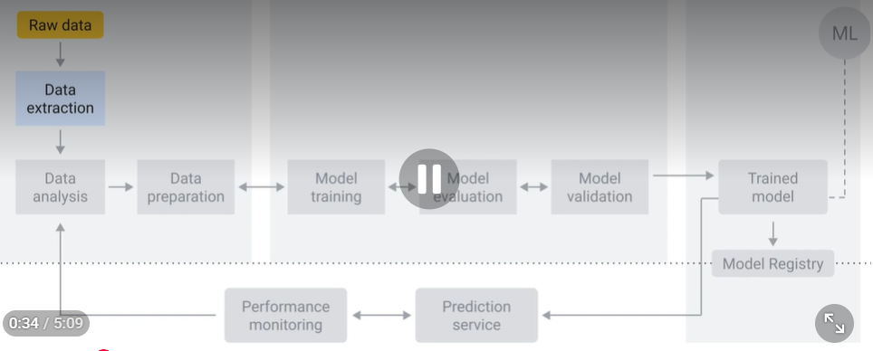

## Google Cloud Dataproc

### Overview & Purpose

**Google Cloud Dataproc** is a managed Apache Spark and Apache Hadoop service on Google Cloud. It enables data engineers to run big data analytics and machine learning workloads at scale with minimal infrastructure management.

| Aspect | Details |
|--------|---------|
| **What It Does** | Manages Apache Spark, Hadoop, Hive, and Pig clusters with automatic scaling |
| **Primary Use** | Large-scale distributed data processing (ETL, analytics, ML preprocessing) |
| **Key Benefit** | Spin up a cluster in ~90 seconds instead of 5-10 minutes with traditional Hadoop |
| **Data Processing** | MapReduce, Spark SQL, PySpark, Scala, Hive queries on massive datasets |
| **Integration** | Works seamlessly with BigQuery, Cloud Storage, and Vertex AI |

---

### Core Components

| Component | Purpose |
|-----------|---------|
| **Master Node** | Orchestrates jobs, manages YARN resource allocation, runs NameNode (HDFS) |
| **Worker Nodes** | Execute distributed tasks in parallel across data shards |
| **Auto-scaling** | Automatically adds/removes workers based on job demand |
| **HDFS Storage** | Distributed file system for intermediate data during processing |
| **Spark Cluster** | In-memory computation engine for fast iterative analytics |

---

### When to Use Dataproc

**Use Dataproc when you have:**

| Scenario | Example |
|----------|---------|
| Large datasets (TB-PB scale) | Process 100GB+ logs for anomaly detection |
| Batch ETL pipelines | Daily extract-transform-load from multiple sources |
| Complex transformations | Multi-step aggregations, joins across large tables |
| Legacy Hadoop/Spark code | Migrate existing MapReduce or PySpark jobs to cloud |
| Machine learning preprocessing | Feature engineering on 50GB+ training data |
| Interactive exploration | Jupyter notebooks for data analysis on clusters |

---

### Dataproc vs. BigQuery vs. Dataflow

| Feature | Dataproc | BigQuery | Dataflow |
|---------|----------|----------|----------|
| **Type** | Managed Spark/Hadoop | Data warehouse + SQL analytics | Unified streaming/batch engine |
| **Setup Time** | ~90 seconds | Instant (serverless) | ~5 minutes |
| **Scaling** | Manual + auto-scaling | Automatic (serverless) | Automatic (serverless) |
| **Best For** | Complex Spark jobs, ML preprocessing | SQL queries, dashboards | Streaming pipelines, ETL |
| **Cost Model** | Per vCPU-hour (running cluster) | Per TB scanned | Per vCPU-hour (resources used) |
| **Data Volume** | Unlimited (parallel processing) | Petabytes (SQL optimized) | Unlimited (streaming or batch) |

---

### Quick Start Example: Word Count in PySpark

```python
from pyspark.sql import SparkSession

# Create Spark session
spark = SparkSession.builder.appName("WordCount").getOrCreate()

# Read text file from Cloud Storage
text_rdd = spark.sparkContext.textFile("gs://your-bucket/documents/*.txt")

# Word count logic (MapReduce pattern)
word_counts = (
    text_rdd
    .flatMap(lambda line: line.split())  # Split into words
    .map(lambda word: (word, 1))          # Create (word, 1) pairs
    .reduceByKey(lambda a, b: a + b)     # Sum counts per word
    .sortByKey(ascending=False)           # Sort by frequency
)

# Save results to Cloud Storage
word_counts.saveAsTextFile("gs://your-bucket/word-counts/")

# Or write to BigQuery
word_counts_df = word_counts.toDF(["word", "count"])
word_counts_df.write.format("bigquery") \
    .option("table", "your-project:dataset.word_counts") \
    .save()
```

---

### Common Dataproc Workflows

1. **ETL Pipeline**: Extract from Cloud Storage → Transform with Spark → Load to BigQuery
2. **ML Feature Engineering**: Process raw data at scale → Export features for training
3. **Log Analysis**: Parse TB of logs → Aggregate metrics → Visualize in Looker
4. **Data Migration**: Move on-premises Hadoop jobs to Dataproc without code changes

---

### Key Advantages

- **Fast Provisioning**: Cluster ready in ~90 seconds
- **Cost-Efficient**: Pay only for cluster resources used; delete cluster when done
- **Easy Integration**: Direct connectors to BigQuery, Cloud Storage, Pub/Sub
- **Familiar Tools**: Use Spark, Hadoop, Hive—no new languages to learn
- **Auto-Scaling**: Handles traffic spikes automatically
- **Preemptible VMs**: Reduce costs by 70% for fault-tolerant workloads

---

## Static vs. Dynamic Training

### Quick Overview

**Static Training**: Train once on a fixed dataset, then deploy the model. Model parameters never change after deployment until you manually retrain.

**Dynamic Training**: Continuously update the model as new data arrives. The model adapts in real-time to changing patterns without manual retraining.

---

### Comparison Table

| Aspect | Static Training | Dynamic Training |
|--------|-----------------|-----------------|
| **Definition** | Train once on historical data; deploy fixed model | Continuously learn from new data; update model in real-time |
| **Retraining Frequency** | Manual (weekly, monthly, or as-needed) | Automatic (real-time, hourly, or daily) |
| **Data Source** | Historical/batch data (Cloud Storage, BigQuery) | Streaming data (Pub/Sub, logs, sensors) |
| **Model Update** | Replace entire model with new version | Incrementally update weights/parameters |
| **Complexity** | Simple; straightforward training pipeline | Complex; requires monitoring and feedback loops |
| **Latency** | High (hours/days to detect drift) | Low (minutes/seconds to adapt) |
| **Cost** | Lower (runs only when scheduled) | Higher (continuous computation) |
| **Drift Adaptation** | Poor (doesn't respond to data shifts) | Good (adapts to new patterns automatically) |
| **Implementation** | Batch training jobs, cron-scheduled retraining | Online learning, streaming pipelines, feedback loops |
| **Tool Examples** | BigQuery ML, Vertex AI Training, Dataproc jobs | Vertex AI Online Predictions, Dataflow streaming |
| **Risk** | Model performance degrades if data changes | Model can learn from noisy/bad data if not monitored |

---

### When to Choose Static Training

**Use Static Training when:**

| Scenario | Example | Why |
|----------|---------|-----|
| **Data changes slowly** | Monthly sales forecasting where trends shift quarterly | Model retraining every month is sufficient |
| **Budget constraints** | Startup with limited compute budget | One-time batch training is cheaper than continuous updates |
| **Stable patterns** | Credit risk scoring (customer profiles stable) | Data distribution doesn't change significantly |
| **Regulatory requirements** | Healthcare/finance models requiring audit trails | Need to document exactly which data trained the model |
| **Low traffic/urgency** | Internal analytics dashboards updated daily | No need for real-time predictions |
| **Simple use cases** | Customer segmentation, historical analysis | Complexity not justified by business value |

---

### When to Choose Dynamic Training

**Use Dynamic Training when:**

| Scenario | Example | Why |
|----------|---------|-----|
| **Real-time decisions needed** | Fraud detection flagging suspicious transactions | Must adapt to emerging fraud patterns immediately |
| **Data changes rapidly** | Stock price prediction (market volatility) | Model must learn new patterns as they emerge |
| **Continuous data stream** | Recommendation engine (user behavior constantly evolving) | New user interactions arrive every second |
| **Concept drift is high** | COVID-19 era e-commerce (shopping behavior shifted) | Historical patterns no longer apply |
| **Performance SLA is tight** | Production ML system serving millions (99.9% uptime) | Can't afford downtime for batch retraining |
| **Feedback loop available** | Click prediction (you know if prediction was correct) | Can continuously improve with user feedback |

---

### Implementation Patterns

#### Static Training Pattern

```python
# Run on schedule (e.g., daily cron job)
from kfp.v2 import dsl
from kfp.v2.dsl import component

@component
def train_static_model(dataset_path: str, model_output: Output[Model]):
    """Train model on fixed historical data, save to registry"""
    import joblib
    from sklearn.ensemble import RandomForestClassifier
    
    # Load historical data
    df = pd.read_csv(dataset_path)
    X, y = df.drop('target', axis=1), df['target']
    
    # Train on complete dataset
    model = RandomForestClassifier(n_estimators=100, random_state=42)
    model.fit(X, y)
    
    # Save to model registry (version: daily_retrain_2024-07-11)
    joblib.dump(model, model_output.path)
    print(f"Model trained and saved. Accuracy: {model.score(X, y):.4f}")

# Deploy with Vertex AI Model Registry
# → Predictions use this fixed model until next scheduled retraining
```

#### Dynamic Training Pattern

```python
# Continuous streaming + online learning
import apache_beam as beam
from apache_beam.transforms.window import FixedWindows

@beam.DoFn
class OnlineLearningFn(beam.DoFn):
    """Update model weights as new data arrives"""
    
    def process(self, element):
        # element = {'features': [...], 'label': 1, 'prediction': 0}
        features = element['features']
        true_label = element['label']
        prediction = element['prediction']
        
        # Detect prediction error (feedback signal)
        if prediction != true_label:
            # Incrementally update model (SGDClassifier supports partial_fit)
            from sklearn.linear_model import SGDClassifier
            model = self.load_latest_model()
            model.partial_fit([features], [true_label])
            self.save_updated_model(model)
            
            yield {
                'model_updated': True,
                'feedback': f'Corrected prediction from {prediction} to {true_label}'
            }

# Pipeline: Real-time predictions + online learning
predictions = (
    p
    | 'Read Predictions' >> beam.io.ReadFromPubSub('predictions-topic')
    | 'Online Learning' >> beam.ParDo(OnlineLearningFn())
    | 'Log Updates' >> beam.io.WriteToBigQuery(
        table='your-project:logs.model_updates'
    )
)
```

---

### Decision Tree: Static or Dynamic?

```
Does your data change frequently (daily/hourly)?
    ├─ YES → Need real-time adaptation?
    │   ├─ YES → DYNAMIC TRAINING ✓
    │   └─ NO → Schedule static retraining more often (daily/hourly jobs)
    │
    └─ NO → Can you afford continuous computation?
        ├─ YES → Want continuous learning? → DYNAMIC TRAINING ✓
        └─ NO → STATIC TRAINING ✓ (cost-effective)
```

---

### Monitoring & Best Practices

| Aspect | Static Training | Dynamic Training |
|--------|-----------------|-----------------|
| **Monitor For** | Model performance degradation (drift detection) | Model divergence from ground truth (quality degradation) |
| **Alert Threshold** | Accuracy drops > 2% → Trigger manual retraining | Loss increases > 5% → Stop learning, rollback to previous model |
| **Retraining Trigger** | Schedule-based (weekly) or drift-based | Automatic (continuous) with quality gates |
| **Validation** | Test on held-out validation set before deployment | Online evaluation on live predictions vs. feedback |
| **Rollback Strategy** | Replace with previous model version in registry | Freeze weights if quality degrades; manual override available |
| **Version Control** | Tag each trained model with date + accuracy metrics | Checkpoint model every 1000 samples or hourly |

---

## Architecture Diagrams & Trade-offs

### Static Training Architecture (GCP Services)

```
┌────────────────────────────────────────────────────────────────────────────┐
│                        STATIC TRAINING (BATCH)                             │
└────────────────────────────────────────────────────────────────────────────┘

  ┌─────────────────────┐
  │  SOURCES            │
  │ ┌─────────────────┐ │
  │ │ Cloud Storage   │ │
  │ │ BigQuery        │ │
  │ │ Firestore       │ │
  │ └─────────────────┘ │
  └──────────┬──────────┘
             │
             ▼
  ┌─────────────────────────────────────┐
  │ Cloud Scheduler (Weekly/Monthly)    │
  │ Trigger batch job                   │
  └──────────┬──────────────────────────┘
             │
             ▼
  ┌─────────────────────────────────────┐
  │ Data Preprocessing                  │
  │ ├─ Dataproc (Spark) OR              │
  │ └─ Vertex AI Data Labeling          │
  └──────────┬──────────────────────────┘
             │
             ▼
  ┌─────────────────────────────────────┐
  │ Model Training                      │
  │ ├─ Vertex AI Training OR            │
  │ ├─ BigQuery ML OR                   │
  │ └─ Custom Training Container        │
  └──────────┬──────────────────────────┘
             │
             ▼
  ┌─────────────────────────────────────┐
  │ Evaluation (Held-out Test Set)      │
  │ ├─ Metrics computed                 │
  │ └─ Performance validated            │
  └──────────┬──────────────────────────┘
             │
             ▼
  ┌─────────────────────────────────────┐
  │ Vertex AI Model Registry            │
  │ ├─ Version control (v1.2.3)         │
  │ ├─ Metadata tracking                │
  │ └─ Metrics logged                   │
  └──────────┬──────────────────────────┘
             │
             ▼ (If metrics ✓)
  ┌─────────────────────────────────────┐
  │ Production Serving                  │
  │ ├─ Vertex AI Endpoints OR           │
  │ └─ BigQuery ML Online Predictions   │
  └──────────┬──────────────────────────┘
             │
             ▼
  ┌─────────────────────────────────────┐
  │ Cloud Monitoring                    │
  │ ├─ Drift detection                  │
  │ ├─ Performance alerts               │
  │ └─ Audit logs (Cloud Logging)       │
  └─────────────────────────────────────┘
```

---

### Dynamic Training Architecture (GCP Services)

```
┌──────────────────────────────────────────────────────────────────────────────┐
│                        DYNAMIC TRAINING (STREAMING)                          │
└──────────────────────────────────────────────────────────────────────────────┘

  ┌──────────────────────────┐
  │ REAL-TIME SOURCES        │
  │ ├─ Cloud Pub/Sub         │
  │ ├─ Cloud Logging         │
  │ └─ Firestore (real-time) │
  └──────────┬───────────────┘
             │ (Continuous 24/7)
             ▼
  ┌──────────────────────────────────────┐
  │ Dataflow (Streaming Pipeline)        │
  │ ├─ Parse & validate                  │
  │ ├─ Feature engineering               │
  │ └─ Windowed aggregation              │
  └──────────┬───────────────────────────┘
             │ (No batching)
             ▼
  ┌──────────────────────────────────────┐
  │ Vertex AI Online Predictions         │
  │ ├─ Real-time model serving           │
  │ ├─ <100ms latency                    │
  │ └─ Latest model weights              │
  └──────────┬───────────────────────────┘
             │
    ┌────────┴─────────┐
    │                  │
    ▼                  ▼
 PREDICTIONS      FEEDBACK
    │              COLLECTION
    │         ┌──────────────────┐
    │         │ Ground Truth      │
    │         │ ├─ User feedback  │
    │         │ ├─ A/B test data  │
    │         │ └─ Actual labels  │
    │         └────────┬──────────┘
    │                  │
    └────────┬─────────┘
             ▼
  ┌──────────────────────────────────────┐
  │ Online Learning Loop (Dataflow)      │
  │ ├─ Compare prediction vs. ground     │
  │ │  truth                             │
  │ ├─ SGDClassifier.partial_fit()       │
  │ └─ Update model weights              │
  └──────────┬───────────────────────────┘
             │
             ▼ (Every N samples or hourly)
  ┌──────────────────────────────────────┐
  │ Cloud Storage                        │
  │ ├─ Model checkpoints                 │
  │ ├─ Weight snapshots                  │
  │ └─ Version: auto-increment           │
  └──────────┬───────────────────────────┘
             │
             ▼
  ┌──────────────────────────────────────┐
  │ Monitoring (Real-time)               │
  │ ├─ Live prediction metrics           │
  │ ├─ Data drift sensors                │
  │ ├─ Quality gates (Acc > 92%)         │
  │ └─ BigQuery for feedback logging     │
  └──────────┬───────────────────────────┘
             │
             ▼ (If quality fails)
  ┌──────────────────────────────────────┐
  │ Safety Gates & Rollback              │
  │ ├─ Freeze model updates              │
  │ ├─ Revert to last stable checkpoint  │
  │ ├─ Cloud Logging alerts              │
  │ └─ Manual review trigger             │
  └──────────────────────────────────────┘
```

---

### GCP Services Quick Reference

| Component | Static | Dynamic | Purpose |
|-----------|--------|---------|---------|
| **Data Ingestion** | Cloud Storage, BigQuery | Cloud Pub/Sub, Logging | Source data |
| **Scheduling** | Cloud Scheduler | N/A (continuous) | Trigger jobs |
| **Processing** | Dataproc, Vertex AI | Dataflow (streaming) | Transform data |
| **Training** | Vertex AI Training, BQML | Dataflow (online learning) | Model updates |
| **Model Registry** | Vertex AI Model Registry | Cloud Storage checkpoints | Version control |
| **Serving** | Vertex AI Endpoints, BigQuery ML | Vertex AI Online Predictions | Real-time inference |
| **Feedback** | Manual retrain | Pub/Sub → BigQuery | Ground truth |
| **Monitoring** | Cloud Monitoring | Cloud Monitoring + BigQuery | Quality checks |
| **Logs/Audit** | Cloud Logging | Cloud Logging | Debugging |

---

---

### Quick Trade-offs Comparison

| Aspect | Static | Dynamic |
|--------|--------|---------|
| **Latency to Adapt** | 170+ hours (weeks) | <1 minute |
| **Monthly Cost** | ~$115 | ~$4,250 (37x costlier) |
| **Model Consistency** | ✓ Locked version | ✗ Mutating weights |
| **Drift Handling** | ✗ Slow (manual) | ✓ Auto-adaptive |
| **Ops Complexity** | Simple (3 tools) | Complex (7+ tools, 24/7) |
| **QA Rigor** | High (2-4 weeks) | Lower (real-time risk) |
| **Explainability** | ✓ Fixed logic | ✗ Black box updates |
| **Team Requirements** | Solo/small team | Large team + MLOps |

---

### When to Choose

| Scenario | Pick | Reason |
|----------|------|--------|
| **MVP/Budget startup** | Static | Fast, cheap, simple |
| **Healthcare/Finance** | Static | Compliance, auditability required |
| **Fraud detection** | Dynamic | Real-time adaptation needed |
| **Recommendations** | Dynamic | Immediate feedback loop |
| **Stable monthly data** | Static | No drift, retraining sufficient |
| **Volatile hourly data** | Dynamic | Continuous adaptation needed |
| **Small data team** | Static | Less operational burden |
| **Enterprise + MLOps** | Dynamic | Resources available |

---

## ML Drift in Production

**Drift** occurs when the statistical properties of input data or the relationship between features and target change over time, causing model performance degradation.

### Types of Drift

| Type | Definition | Example | Impact | Detection |
|------|-----------|---------|--------|-----------|
| **Data Drift** (Covariate Shift) | Distribution of input features changes, but feature-target relationship remains same. | E-commerce: User age distribution shifts younger (TikTok adoption) while purchase behavior stays similar. | Predictions become less accurate; model makes decisions on unseen feature ranges. | Monitor feature statistics (min, max, mean, stddev) weekly. Alert if mean age drops >10%. |
| **Label Drift** (Prior Shift) | Distribution of target variable changes while features stay same. | Fraud detection: Transaction fraud rate increases from 1% to 5% due to new scam tactics. | Model underestimates fraud risk; FP/FN ratios become unreliable. | Track label distribution. Alert if positive class rate changes >2%. |
| **Concept Drift** | Relationship between features and target changes fundamentally. | COVID-19 impact on e-commerce: "Users working from home" (feature) now correlates with electronics purchases instead of office supplies. | Model logic becomes invalid; high false positives/negatives. | Compare prediction vs. actual outcomes. Alert if accuracy drops >5%. |
| **Feature Drift** | New features become important or old features lose predictive power. | Recommendation engine: User engagement patterns shift; "time spent" becomes more predictive than "click count". | Model ignores critical signals; stale features waste compute. | Track feature importance scores. Alert if top-5 features change. |

### Real-World Examples

**Example 1: Data Drift — Housing Price Prediction**
```
Training data (2020): Houses avg price $300k, avg age 25 years
Production data (2024): Houses avg price $500k, avg age 20 years

Problem: Model trained on $300k prices predicts poorly on $500k houses
Solution: Retrain on recent data or scale predictions by price ratio
```

**Example 2: Concept Drift — Loan Approval Model**
```
Training logic (2022): "Income > $50k AND credit_score > 700 = approve"
New pattern (2024): Rising interest rates mean "income > $100k needed" to approve safely

Problem: Old thresholds approve too many risky loans now
Solution: Retrain model to learn new decision boundaries
```

**Example 3: Label Drift — Email Spam Filter**
```
Training: 5% of emails are spam
Production: 20% of emails are spam (new attack campaign)

Problem: Model was tuned for 5% baseline; now misses spam
Solution: Adjust decision threshold or retrain on new spam types
```

### Drift Detection Strategy

1. **Monitor continuously**: Track feature distributions, label distributions, and model performance metrics
2. **Set thresholds**: Alert when drift indicators exceed acceptable limits (e.g., accuracy drops 3%)
3. **Trigger action**: Retrain static models or escalate online learning in dynamic models
4. **Version control**: Keep track of which training data and model version caused what drift


---

## TensorFlow Data Validation (TFDV)

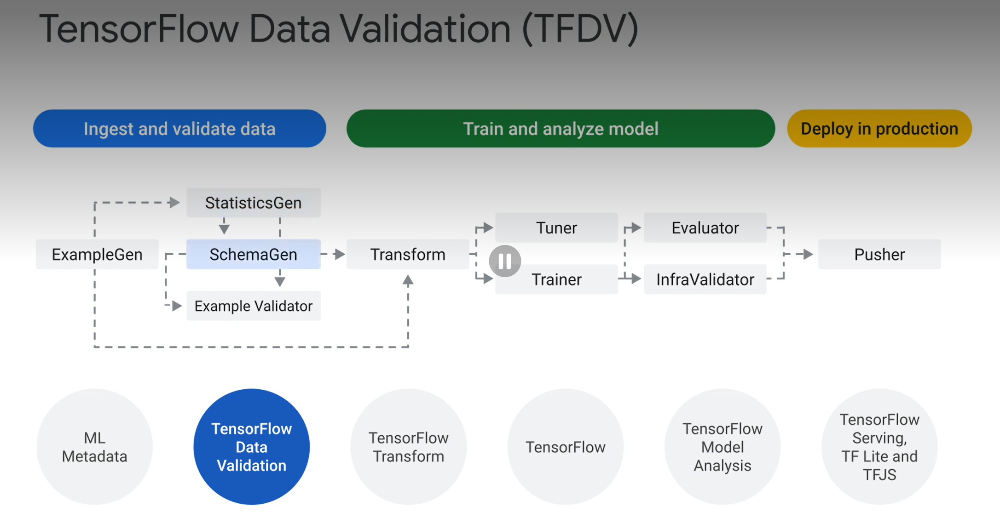

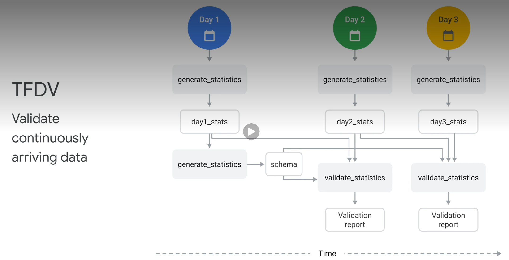

**TensorFlow Data Validation (TFDV)** is a Google tool that validates data quality and detects anomalies in ML pipelines. It consists of three key components:

---
### TFDV Drift Detection Approach

**How TFDV Detects Drift:**
- **Compares statistics**: TFDV computes and compares statistical summaries (mean, stddev, min, max, histograms) across consecutive runs
- **No data persistence**: TFDV itself does NOT persist raw data—it stores lightweight **protobuf statistics** generated by StatisticsGen from each dataset
- **Baseline comparison**: Each new dataset's statistics are compared against a baseline (training data), flagging anomalies if distributions diverge beyond thresholds
- **Workflow**: StatisticsGen → SchemaGen (infer schema) → ExampleValidator (validate against schema & detect drift) → Alert or Flag
- **Storage**: Statistics are cached; only statistical summaries stored, not full datasets, making it lightweight for production monitoring

---

### 1. StatisticsGen

**Purpose**: Computes descriptive statistics from datasets to understand feature distributions and enable drift detection.

| Aspect | Details |
|--------|---------|
| **What It Does** | Calculates mean, stddev, min, max, histograms, value frequencies for all features. |
| **Key Goal** | Detect data quality issues and drift before training. |
| **Output** | Statistical summaries (protobuf format) for comparison across datasets. |

**Example**:
```
Input Dataset: customer_data.csv
- 1M records with features: age, income, purchase_amount

StatisticsGen Output:
{
  "age": {"min": 18, "max": 85, "mean": 35.2, "stddev": 12.5},
  "income": {"min": 20000, "max": 250000, "mean": 75000},
  "purchase_amount": {"min": 10, "max": 50000, "mean": 1250}
}
```

---

### 2. SchemaGen

**Purpose**: Automatically infers the schema (data types, ranges, categories) from training data to enforce data contract.

| Aspect | Details |
|--------|---------|
| **What It Does** | Auto-detects data types (INT, STRING, FLOAT), value ranges, required fields, and categorical values. |
| **Key Goal** | Define expected data structure to validate incoming data against. |
| **Output** | Schema protobuf that serves as the "source of truth" for data validation. |

**Example**:
```
Input: Training data statistics (from StatisticsGen)

SchemaGen Output (Auto-inferred schema):
{
  "age": {"type": "INT", "min": 18, "max": 85, "required": true},
  "income": {"type": "FLOAT", "min": 20000, "max": 250000},
  "device": {"type": "STRING", "categories": ["mobile", "desktop", "tablet"]},
  "purchase_amount": {"type": "FLOAT", "min": 10, "max": 50000}
}
```

---

### 3. ExampleValidator

**Purpose**: Validates incoming data against the schema to detect anomalies and unexpected values.

| Aspect | Details |
|--------|---------|
| **What It Does** | Compares new data against established schema; flags anomalies like missing values, out-of-range data, unknown categories. |
| **Key Goal** | Catch data quality issues before they reach the model (prevents garbage in, garbage out). |
| **Output** | Validation report showing anomalies, data quality score, and alerts. |

**Example**:
```
Production Data (new batch):
{
  "age": 150,           ← Violates schema (max: 85)
  "income": null,       ← Violates required field
  "device": "xbox",     ← Unknown category (schema: mobile/desktop/tablet)
  "purchase_amount": -500  ← Violates schema (min: 10)
}

ExampleValidator Output:
✗ ANOMALY: age=150 exceeds max (85)
✗ ANOMALY: income is NULL but required
✗ ANOMALY: device="xbox" not in allowed categories
✗ ANOMALY: purchase_amount=-500 below min (10)
Data Quality Score: 25% (4 anomalies detected)
Recommendation: BLOCK this batch from training
```

---

### End-to-End Example: TFDV Workflow

**Scenario**: E-commerce company building a purchase prediction model.

**Step 1: StatisticsGen on Training Data**
```
Training Dataset: 100k clean customer records
↓
StatisticsGen computes:
- age: mean=35, stddev=12, min=18, max=80
- income: mean=$75k, stddev=$20k
- device: 60% mobile, 35% desktop, 5% tablet
```

**Step 2: SchemaGen Creates Contract**
```
Schema inferred from training statistics:
- age: INT, range [18-85], required
- income: FLOAT, range [$20k-$300k]
- device: STRING, categories: ["mobile", "desktop", "tablet"]
```

**Step 3: ExampleValidator on Production Data**
```
New production batch (50k records):
✓ 95% records pass all schema checks
✗ 5% records have anomalies detected:
   - 2% have age > 85 (probably data entry errors)
   - 1% have device="smartwatch" (new device type not in training data)
   - 2% have missing income values

Action: Flag anomalies, investigate, update schema if needed, retrain model
```

---

### Integration with Vertex AI Pipelines

TFDV fits into production ML workflows:

```
Raw Data → StatisticsGen → SchemaGen → ExampleValidator → Decision
           (compute stats)  (infer schema)  (validate data)
                                                   ↓
                                         Pass? ──→ Train Model
                                         Fail? ──→ Alert & Block
```

**Key Benefits:**
1. **Early Detection**: Catch data issues before they corrupt models
2. **Automated Monitoring**: Continuously validate production data
3. **Schema Evolution**: Track schema changes over time
4. **Drift Awareness**: Compare production stats against training baseline

---

---

# Vertex AI

## Vertex AI ML Model Building Capabilities

**Vertex AI** is Google Cloud's unified AI platform that provides end-to-end ML model building, training, and deployment services. Key capabilities include:

| Capability | Description |
|---|---|
| **AutoML** | Automated machine learning that handles feature engineering, model selection, and hyperparameter tuning for tabular, image, text, and video data without writing code. |
| **Custom Training** | Write your own training code in Python, R, or other languages using TensorFlow, PyTorch, scikit-learn, and deploy on managed infrastructure with GPU/TPU support. |
| **Vertex AI Workbench** | Managed Jupyter notebooks for interactive data exploration, model development, and experimentation with pre-installed libraries and GCP integrations. |
| **Training Pipelines** | Kubeflow-based orchestration to define, schedule, and monitor multi-step ML workflows with artifact versioning and conditional execution. |
| **Model Registry** | Centralized model management with versioning, metadata tracking, evaluation metrics, and lineage for reproducibility and compliance. |
| **Endpoint Deployment** | Deploy trained models to scalable REST/gRPC endpoints with automatic scaling, traffic splitting for A/B testing, and monitoring. |
| **Feature Store** | Centralized repository for storing, managing, and retrieving ML features with versioning, ensuring consistency between training and serving. |
| **Model Evaluation** | Built-in evaluation tools for classification, regression, and NLP tasks with confusion matrices, ROC curves, and feature importance analysis. |
| **Explainable AI** | Feature attributions (Shapley values) to understand which inputs drive model predictions; helps debug and validate models. |
| **Batch Prediction** | Run offline predictions on large datasets and write results to BigQuery or Cloud Storage for analytics. |
| **Online Prediction** | Real-time inference serving with sub-100ms latency for production applications. |

**Key Advantages:**
* Unified interface for AutoML, custom training, and managed infrastructure
* Built-in MLOps: experiment tracking, model versioning, audit logging
* Seamless integration with BigQuery, Dataflow, and other GCP services
* Supports both code-first and no-code approaches

---

## Vertex AI Quiz

1. **In the Feature Store, timestamps are an attribute of the feature values, not a separate resource type.**

- [ ] False
- [x] **True** ✓

---

2. **Vertex AI has a unified data preparation tool that supports image, tabular, text, and video content. Where are uploaded datasets stored in Vertex AI?**

- [ ] A Google Cloud database that acts as an input for both AutoML and custom training jobs.
- [ ] A Google Cloud database that acts as an output for both AutoML and custom training jobs.
- [ ] A Google Cloud Storage bucket that acts as an output for both AutoML, custom training jobs, serialized training jobs.
- [x] **A Google Cloud Storage bucket that acts as an input for both AutoML and custom training jobs.** ✓

---

3. **When you use the data to train a model, Vertex AI examines the source data type and feature values and infers how it will use that feature in model training. This is called the ______________ for that feature.**

- [ ] Duplication
- [ ] Translation
- [ ] Transmutation
- [x] **Transformation** ✓

---

4. **What is the responsibility of model evaluation and validation components?**

- [ ] To ensure that the models are not good after moving them into a staging environment.
- [x] **To ensure that the models are good before moving them into a production/staging environment.** ✓
- [ ] To ensure that the models are not good before moving them into a staging environment.
- [ ] To ensure that the models are good after moving them into a production/staging environment.

---

5. **Which type of training do you use if your dataset doesn't change over time?**

- [ ] Online training
- [ ] Real-time training
- [x] **Static training** ✓
- [ ] Dynamic training

---

6. **Which type of logging should be enabled in the online prediction that logs the stderr and stdout streams from your prediction nodes to Cloud Logging and can be useful for debugging?**

- [ ] Access logging
- [x] **Container logging** ✓
- [ ] Request-response logging
- [ ] Cloud logging

---

7. **What percent of system code does the ML model account for?**

- [ ] 50%
- [x] **5%** ✓
- [ ] 25%
- [ ] 90%

**Insight:** Only ~5% of production ML systems is actual model code. The remaining 95% includes data pipeline, feature engineering, model serving infrastructure, monitoring, and logging—highlighting the importance of MLOps.

---

8. **Match the three types of data ingest with an appropriate source of training data.**

- [x] **Streaming (Pub/Sub), structured batch (BigQuery), unstructured batch (Cloud Storage)** ✓
- [ ] Streaming (BigQuery), structured batch (Pub/Sub), unstructured batch (Cloud Storage)
- [ ] Streaming batch (Dataflow), structured batch (BigQuery), stochastic (App Engine)

---

## Agent Platform

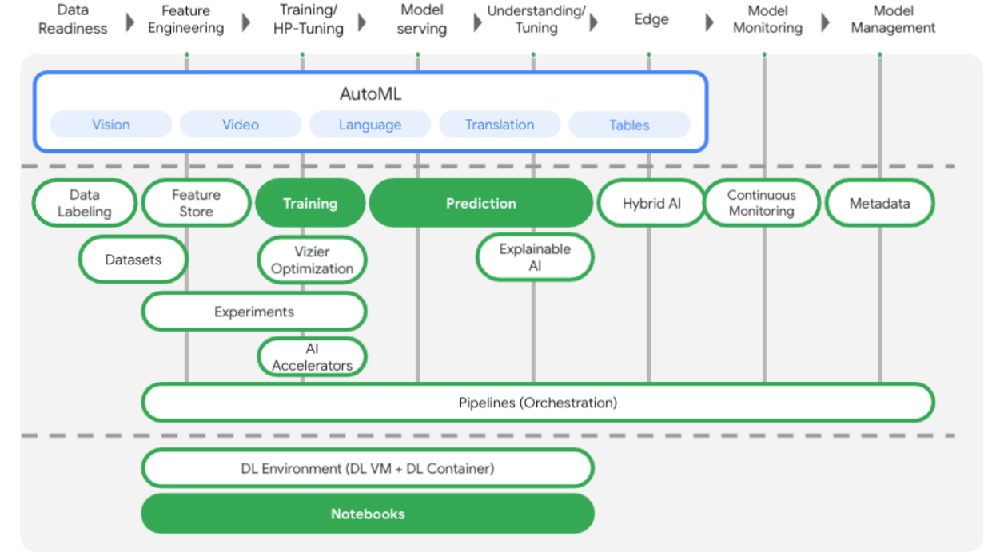

---

### Quiz

1. Which of the following tools help software users manage dependency issues?

- [x] Maven, Gradle, and Pip
- [ ] Monolithic programs
- [ ] Polylithic programs
- [ ] Modular programs

2. Suppose you are building an ML-based system to predict the likelihood that a customer will leave a positive review. The user interface that customers leave reviews on changed a few months ago, but you don't know about this. Which of these is a potential consequence of mismanaging this data dependency?
- [ ] Change in model serving signature
- [ ] Change in ability of model to be part of a streaming ingest
- [x] Losses in prediction quality

3. What is training skew caused by?
- [ ] The prediction environment is slower than the training environment.
- [ ] The Cloud Storage you load your data from in the training environment is physically closer than the Cloud Storage you load your data from in the production environment.
- [ ] Starting and stopping of the processing when training the model.
- [x] Your development and production environments are different, or different code is used in the training environment than in the development environment.

4. Which of the following models are susceptible to a feedback loop? Check all that apply.

**Correct Answers:**
- [x] **Traffic-forecasting model** (predictions change behavior → affects actual congestion)
- [x] **Book-recommendation model** (recommends popular books → increases popularity → amplifies bias)
- [x] **University-ranking model** (ranks by selectivity → attracts more applicants → increases selectivity → reinforces ranking)

**Incorrect:** Housing prices (features independent), face detection (static data source), election forecasting (after polls close)

---

### Feedback Loop Definition

**Feedback Loop**: Model predictions influence real-world outcomes → new data generated → model retrained → predictions become self-reinforcing or distorted → cycle repeats.

**Key Question**: Can my model's predictions influence the data it will be retrained on?

---

### Examples by Model Type

| Model | Feedback Loop Exists? | Why |
|-------|----------------------|-----|
| **Traffic Forecasting** | ✓ YES | Prediction of congestion → users avoid exit → less congestion → model learns wrong pattern |
| **Book Recommendations** | ✓ YES | Recommend popular books → more purchases → ranked higher → recommended more (winner-takes-all) |
| **University Ranking** | ✓ YES | Rank by selectivity → attracts applicants → selectivity increases → stays ranked high |
| **Housing Prices** | ✗ NO | Features (size, location) don't change based on predictions |
| **Face Smiling Detection** | ✗ NO | Training data from static source (stock photos), unaffected by predictions |
| **Election Results** | ✗ NO | Prediction made after voters already voted; can't influence outcome |

---

### Consequences & Mitigation

**Problems:**
- Bias amplification (disadvantaged groups get worse opportunities)
- Winner-takes-all monopolies (early winners dominate forever)
- Model learns correlations from distorted data, not true patterns

**Solutions:**
- **Randomization**: Inject randomness in recommendations to break cycles
- **Balanced Data**: Include diverse sources and historical data
- **Monitoring**: Track if output clusters (always recommending same items)
- **Offline Testing**: Use holdout data unaffected by predictions
- **Causal Understanding**: Model true causation, not just correlation

---

5. What is the shift in the actual relationship between the model inputs and the output called?

- [x] Concept drift
- [ ] Prediction drift
- [ ] Label drift
- [ ] Data drift

6. Which component identifies anomalies in training and serving data and can automatically create a schema by examining the data?
- [ ] Data identifier
- [ ] Data ingestion
- [x] Data validation
- [ ] Data transform

7.Gradual drift is used for which of the following?
- [ ] A new concept that occurs within a short time
- [ ] A new concept that rapidly replaces an old one over a short period of time
- [ ] An old concept that may reoccur after some time
- [x] An old concept that incrementally changes to a new concept over a period of time
  
-------------------
## Model Training

**Model Training** is the process of feeding labeled data into an algorithm to learn patterns and adjust model weights to minimize prediction errors. The cycle repeats: forward pass → compute loss → backward pass (gradients) → update weights.

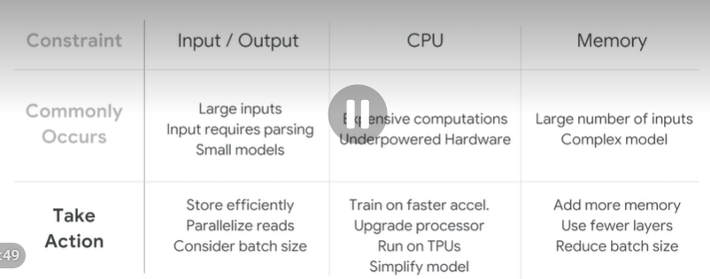

### Distributed Training

**Distributed Training** splits model training across multiple machines/GPUs to reduce time and handle massive datasets. Workers train in parallel, compute gradients independently, and a coordinator aggregates the updates.

**Two Core Strategies:**

| Approach | How It Works | Use Case |
|----------|-------------|----------|
| **Data Parallelism** | Each worker trains the full model on a different data shard; gradients are averaged and synced | Large datasets (TB-scale), standard model size |
| **Model Parallelism** | Split model layers/parameters across workers; forward/backward passes coordinated across machines | Huge models that don't fit on single GPU |

**Key Benefits:**
- ✓ 10-100x faster training with 10-100 workers
- ✓ Train on datasets larger than single machine memory
- ✓ Fault tolerance through checkpointing

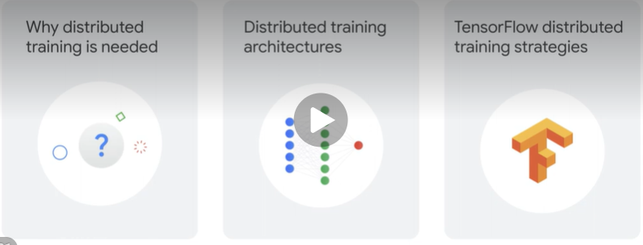

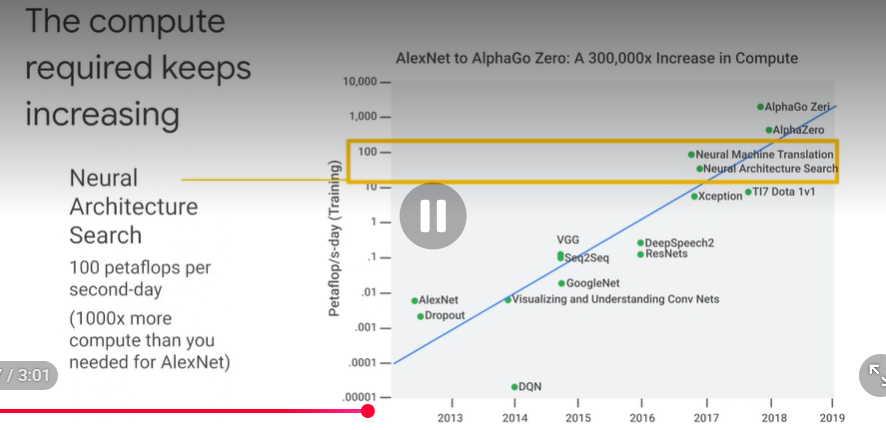

#### Data Parallelism

**Data Parallelism** divides training data across multiple workers. Each worker trains a full copy of the model on its data shard, computes gradients, and synchronizes updates with other workers. This is the most common distributed training approach because the model architecture stays unchanged.

**How It Works:**
1. Split dataset into N shards (one per worker)
2. Each worker loads the full model
3. Forward pass on local data → compute loss → backward pass → compute gradients
4. All workers synchronize gradients (average/aggregate)
5. Update model weights globally
6. Repeat until convergence

**Two Synchronization Strategies:**

| Aspect | **Synchronous (AllReduce)** | **Asynchronous (Parameter Server)** |
|--------|------------------------|--------------------------------|
| **How It Works** | All workers train in lockstep; wait for slowest worker before syncing | Workers update parameters independently without waiting for others |
| **Gradient Sync** | Block until all workers compute gradients, then aggregate | Non-blocking; workers push gradients to parameter server anytime |
| **Speed** | Slower (bottlenecked by slowest worker) | Faster (no waiting) |
| **Staleness** | Fresh gradients only | Stale gradients (workers use old weights) |
| **Convergence** | Stable, predictable | May diverge or oscillate due to stale data |
| **Implementation** | AllReduce pattern (MPI, Ring, Tree) | Parameter server(s) + async updates |
| **Hardware** | Works best with uniform clusters | Handles heterogeneous clusters well |
| **Example** | PyTorch DDP, TensorFlow Mirrored Strategy | TensorFlow PS Strategy, Hogwild! |
| **Use Case** | Production (stable results, homogeneous setup) | Research (speed over convergence guarantee) |
| **Latency** | High (waits for all workers) | Low (no synchronization barriers) |
| **Network Overhead** | One synchronization per iteration | Continuous gradient updates (more traffic) |

**Example Scenario (4 workers, 1000 samples):**

```
Synchronous:
Worker 1: Process 250 samples → compute gradients → WAIT
Worker 2: Process 250 samples → compute gradients → WAIT
Worker 3: Process 250 samples → compute gradients → WAIT
Worker 4: Process 250 samples → compute gradients → WAIT ← slowest
[Aggregate gradients] → [Update weights] → Next iteration

Asynchronous:
Worker 1: Process 250 → gradients → push to server (instant)
Worker 2: Process 250 → gradients → push to server (instant)
Worker 3: Process 250 → gradients → push to server (instant)
Worker 4: Process 250 → gradients → push to server (instant)
[All happen in parallel, no waiting]
```

**When to Choose:**
- **Synchronous**: Production ML, need stable convergence, uniform hardware
- **Asynchronous**: Fast iteration, heterogeneous clusters, research phase

##### Synchronous AllReduce Architecture

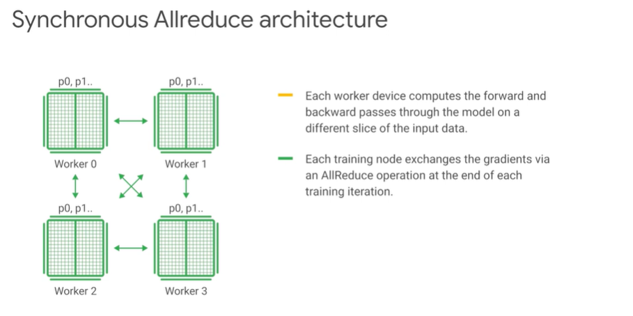

##### Asynchronous Architecture

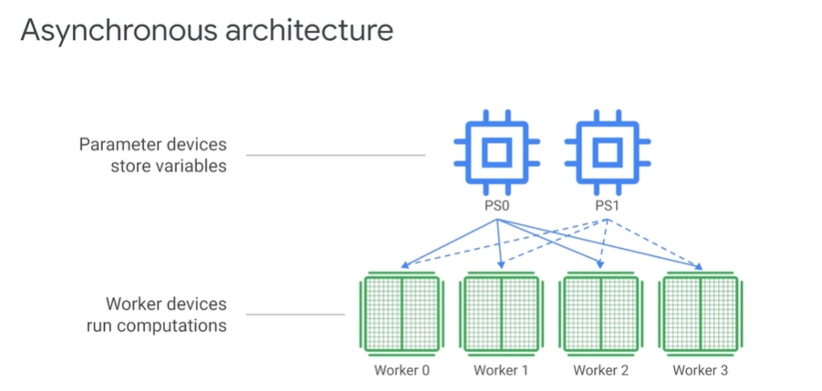

---------------------

#### Model Parallelism

**Model Parallelism** splits the model itself across multiple machines. Different layers or components of the model run on different devices. Unlike data parallelism (where each worker has a full copy), here each worker owns a different part of the model.

**When to Use:**
- Model is too large to fit on a single GPU/device
- Example: LLMs with billions of parameters (GPT-3: 175B parameters)
- Requires more coordination than data parallelism

**How It Works:**
1. Split model into N partitions (by layers or components)
2. Each worker holds a subset of the model
3. Forward pass: Data flows through worker 1 → worker 2 → ... → worker N
4. Backward pass: Gradients flow backward through all workers
5. Each worker updates its model partition
6. Repeat next batch

**Example: Training a Neural Network with 4 Layers on 2 GPUs**

```
Model Architecture:
[Input] → [Layer 1] → [Layer 2] → [Layer 3] → [Layer 4] → [Output]

Model Parallelism Setup:
GPU 1                          GPU 2
[Layer 1]                      [Layer 3]
[Layer 2]     ←→ Network ←→    [Layer 4]

Forward Pass:
Input → GPU1 Layer1 → GPU1 Layer2 → (send activation to GPU2) → 
GPU2 Layer3 → GPU2 Layer4 → Output

Backward Pass:
GPU2 compute gradients for Layer3, Layer4 → (send gradients to GPU1) → 
GPU1 compute gradients for Layer1, Layer2 → Update weights
```

**Comparison: Data Parallelism vs. Model Parallelism**

| Aspect | **Data Parallelism** | **Model Parallelism** |
|--------|----------------------|----------------------|
| **Split What** | Dataset (samples) | Model (layers/parameters) |
| **Each Worker Has** | Full copy of model | Subset of model |
| **Communication** | Gradient aggregation per iteration | Activations/gradients between layers |
| **Best For** | Large datasets + standard-size models | Huge models that don't fit on 1 device |
| **Scalability** | Linear (N workers → N× speedup) | Sublinear (communication overhead high) |
| **Network Overhead** | Moderate (sync at iteration end) | High (continuous activation/gradient flow) |
| **Setup Complexity** | Simple | Complex (layer partitioning logic) |
| **Latency Impact** | Slow workers block all others | One slow layer blocks entire forward pass |
| **Example Use Case** | ImageNet training (large data, ResNet model) | BERT-Large, GPT-3 (billions of parameters) |
| **Implementation** | PyTorch DDP, TensorFlow Mirrored | PyTorch model.to(device), custom forward() |

**Real-World Example: Training GPT-3 Style Model**

```
Problem: GPT-3 has 175 billion parameters
         1 V100 GPU has ~32GB memory
         175B params × 4 bytes/param = 700GB needed!
         (One GPU can't fit it)

Solution: Model Parallelism
         GPU 1: Layers 1-24
         GPU 2: Layers 25-48
         GPU 3: Layers 49-72
         GPU 4: Layers 73-96

During Forward Pass:
1. Input batch (1024 tokens) → GPU 1
2. GPU 1 computes layers 1-24, sends output to GPU 2
3. GPU 2 computes layers 25-48, sends output to GPU 3
4. GPU 3 computes layers 49-72, sends output to GPU 4
5. GPU 4 computes layers 73-96, produces logits
6. Loss computed, backward pass repeats in reverse

Speed: ~4× slower than single GPU (due to communication)
       But only way to train 175B model
```

**Challenges:**
- ❌ Pipeline bubbles: Some GPUs idle while waiting for others
- ❌ High network bandwidth required
- ❌ Difficult to debug and code
- ❌ Poor scaling (more GPUs = more idle time)

**Diagram: Model Parallelism Data Flow**

```
┌─────────────────────────────────────────────────────────────────┐
│                    FORWARD PASS (Left to Right)                 │
└─────────────────────────────────────────────────────────────────┘

Input Batch [32, 512]
     ↓
┌──────────────────┐
│   GPU 1          │
│ ┌──────────────┐ │
│ │ Embedding    │ │
│ ├──────────────┤ │  Output: [32, 768]
│ │ Transformer  │ ├─────────────────────→ GPU 2
│ │ Layers 1-12  │ │
│ └──────────────┘ │
└──────────────────┘
                         ┌──────────────────┐
                         │   GPU 2          │
                         │ ┌──────────────┐ │
                         │ │ Transformer  │ │  Output: [32, 768]
                         │ │ Layers 13-24 ├─┼──→ GPU 3
                         │ └──────────────┘ │
                         └──────────────────┘
                                               ┌──────────────────┐
                                               │   GPU 3          │
                                               │ ┌──────────────┐ │
                                               │ │ Transformer  │ │  Output: [32, 768]
                                               │ │ Layers 25-36 ├─┼──→ GPU 4
                                               │ └──────────────┘ │
                                               └──────────────────┘
                                                                       ┌──────────────────┐
                                                                       │   GPU 4          │
                                                                       │ ┌──────────────┐ │
                                                                       │ │ Output Head  │ │  Logits: [32, 50257]
                                                                       │ │ Layers 37-48 │ │
                                                                       │ └──────────────┘ │
                                                                       └──────────────────┘

┌─────────────────────────────────────────────────────────────────┐
│                 BACKWARD PASS (Right to Left)                   │
└─────────────────────────────────────────────────────────────────┘

Loss computed on GPU 4
     ↑
GPU 4 gradients → GPU 3 gradients → GPU 2 gradients → GPU 1 gradients
Update layer params on each GPU locally
```

**Optimization: Pipeline Parallelism (to reduce idle time)**

Instead of waiting for each GPU to finish its layers:

```
Micro-batch 1: GPU1 → GPU2 → GPU3 → GPU4 (forward)
               GPU1 ← GPU2 ← GPU3 ← GPU4 (backward)

While GPU4 is processing forward pass of Micro-batch 1,
GPU3 can already start backward pass of Micro-batch 0
→ Reduces GPU idle time (pipeline overlap)
```
------------------------

#### TensorFlow Distributed Training Strategies

**TensorFlow distributed training strategies** provide abstractions to scale model training across multiple GPUs, TPUs, and machines. Each strategy handles data distribution, gradient synchronization, and variable management automatically.

**Overview: TensorFlow's Main Strategies**

| Strategy | Type | Hardware | Best For | Complexity |
|----------|------|----------|----------|-----------|
| **MirroredStrategy** | Data Parallelism | Multiple GPUs (single machine) | Standard distributed training, most common | Low |
| **MultiWorkerMirroredStrategy** | Data Parallelism | Multiple GPUs across machines | Multi-machine data parallel training | Medium |
| **TPUStrategy** | Data Parallelism | TPU pods | Massive scale training (>1000 TPUs) | Medium |
| **ParameterServerStrategy** | Asynchronous DP | CPUs + GPUs (multi-machine) | Large models, fault tolerance needed | High |
| **CentralStorageStrategy** | Data Parallelism | Single machine with many GPUs | Legacy (replaced by MirroredStrategy) | Low |

---

**1. MirroredStrategy**

**Purpose**: Synchronous data parallelism on a single machine with multiple GPUs.

| Aspect | Details |
|--------|---------|
| **How It Works** | Each GPU holds a copy of the model. Data is split across GPUs. After each forward-backward pass, gradients are synchronized (averaged) via AllReduce. |
| **Synchronization** | Synchronous (all-reduce barrier) |
| **Communication** | Local GPU bus (fast) |
| **Placement** | Variables replicated on all GPUs |
| **Gradient Aggregation** | NCCL (Nvidia) or gloo (multi-vendor) |
| **Speedup** | Near-linear: N GPUs ≈ N× faster |
| **When to Use** | Standard case: training on 2-8 GPUs on one machine |

**Code Example:**
```python
import tensorflow as tf

strategy = tf.distribute.MirroredStrategy()

with strategy.scope():
    model = tf.keras.Sequential([...])
    model.compile(optimizer='adam', loss='sparse_categorical_crossentropy')

model.fit(dataset, epochs=10)
# Each GPU trains on batch_size/num_gpus samples automatically
```

---

**2. MultiWorkerMirroredStrategy**

**Purpose**: Synchronous data parallelism across multiple machines (each with GPUs).

| Aspect | Details |
|--------|---------|
| **How It Works** | Data parallelism (each worker has full model copy). Gradients synchronized across workers via AllReduce over network. All-reduce coordination via leader election or coordinator. |
| **Synchronization** | Synchronous (cross-machine AllReduce barrier) |
| **Communication** | Network (Ethernet, InfiniBand) - slower than local GPU bus |
| **Placement** | Model replicated on each worker |
| **Gradient Aggregation** | NCCL over network (or gloo) |
| **Speedup** | Sub-linear due to network latency |
| **When to Use** | Large dataset requiring 10-100 machines |

**Code Example:**
```python
import tensorflow as tf
import os

os.environ['TF_CONFIG'] = json.dumps({
    'cluster': {
        'worker': ['machine1:12355', 'machine2:12355']
    },
    'task': {'type': 'worker', 'index': 0}
})

strategy = tf.distribute.MultiWorkerMirroredStrategy()

with strategy.scope():
    model = tf.keras.Sequential([...])
    model.compile(optimizer='adam', loss='...')

model.fit(dataset, epochs=10)
```

---

**3. TPUStrategy**

**Purpose**: Distributed training on Google Cloud TPUs (Tensor Processing Units).

| Aspect | Details |
|--------|---------|
| **How It Works** | Data parallelism on TPU pod. Each TPU core trains on different data. Gradients synchronized within TPU (extremely fast interconnect). |
| **Synchronization** | Synchronous |
| **Communication** | TPU pod interconnect (terabits/sec - fastest) |
| **Placement** | Variables replicated across TPU cores |
| **Best For** | Massive scale: 8-1000+ TPUs, billion+ parameter models |
| **Speedup** | Near-linear: 8 TPUs ≈ 8× faster |
| **When to Use** | Production-scale training on GCP (BERT, GPT training) |

**Code Example:**
```python
import tensorflow as tf

resolver = tf.distribute.cluster_resolver.TPUClusterResolver()
tf.config.experimental_connect_to_cluster(resolver)
tf.tpu.experimental.initialize_tpu_system(resolver)

strategy = tf.distribute.TPUStrategy(resolver)

with strategy.scope():
    model = tf.keras.Sequential([...])
    model.compile(optimizer='adam', loss='...')

model.fit(dataset, epochs=10)
```

---

**4. ParameterServerStrategy**

**Purpose**: Asynchronous data parallelism with dedicated parameter servers. Handles stragglers and fault tolerance.

| Aspect | Details |
|--------|---------|
| **How It Works** | Multiple worker nodes compute gradients on data shards. Parameter server(s) hold model weights. Workers push gradients asynchronously; no synchronization barrier. Parameter server applies updates. |
| **Synchronization** | Asynchronous (no waiting for other workers) |
| **Communication** | Network (workers ↔ parameter servers) |
| **Placement** | Model (parameters) on parameter servers; data replicated across workers |
| **Gradient Update** | Non-blocking (stale gradient problem) |
| **Fault Tolerance** | High (parameter server checkpoints weights) |
| **Speedup** | Faster than synchronous (no stragglers), but stale gradients → convergence issues |
| **When to Use** | Heterogeneous clusters, very large models, fault tolerance critical |

**Code Example:**
```python
import tensorflow as tf

strategy = tf.distribute.ParameterServerStrategy(
    cluster_resolver=cluster_resolver
)

with strategy.scope():
    model = tf.keras.Sequential([...])
    model.compile(optimizer='adam', loss='...')

# Coordinator orchestrates workers and parameter servers
coordinator = tf.distribute.experimental.coordinator.ClusterCoordinator(strategy)
coordinator.join()
```

---

**5. CentralStorageStrategy** (Legacy)

**Purpose**: Synchronous data parallelism on single machine with many GPUs and shared CPU memory.

| Aspect | Details |
|--------|---------|
| **How It Works** | All variables stored on CPU (shared memory). Each GPU pulls variables, computes gradients, pushes back to CPU. CPU applies updates. |
| **Synchronization** | Synchronous |
| **Communication** | PCIe/CPU bandwidth (slow) |
| **Best For** | Legacy code; superseded by MirroredStrategy |
| **When to Use** | Deprecated - use MirroredStrategy instead |

---

**Comprehensive Comparison Table**

| Feature | Mirrored | MultiWorker Mirrored | TPU | Parameter Server |
|---------|----------|----------------------|-----|------------------|
| **Machines** | 1 | Many | 1 TPU Pod | Many |
| **GPUs/Device** | Multiple | Multiple per machine | Multiple TPU cores | CPUs + GPUs |
| **Data Parallelism** | ✓ | ✓ | ✓ | ✓ |
| **Model Parallelism** | ✗ | ✗ | ✗ | ✗ |
| **Synchronous** | ✓ | ✓ | ✓ | ✗ |
| **Network Bottleneck** | None (local bus) | Yes (Ethernet) | None (TPU interconnect) | Yes (PS comm) |
| **Fault Tolerance** | Low | Medium | Medium | High |
| **Speedup (10 devices)** | 9-9.5× | 6-8× | 9-9.5× | 8-9.5× |
| **Training Time** | Fast | Medium | Fastest | Medium |
| **Convergence** | Stable | Stable | Stable | May oscillate |
| **Setup Difficulty** | Easy | Medium | Medium | Hard |
| **Cost (AWS/GCP)** | Moderate | Moderate | Expensive (TPU) | Moderate |

---

**Quick Decision Guide**

```
Choosing TensorFlow Distribution Strategy:

Do you have multiple GPUs on ONE machine?
├─ YES → MirroredStrategy
│        (MirroredStrategy)
│
└─ NO → Do you have access to Google Cloud TPUs?
        ├─ YES → TPUStrategy
        │        (TeraFLOPS performance, overkill for most)
        │
        └─ NO → Do you need to train across multiple machines?
                ├─ YES → Does fault tolerance matter?
                │        ├─ YES → ParameterServerStrategy
                │        │        (async, handles stragglers)
                │        │
                │        └─ NO → MultiWorkerMirroredStrategy
                │                (synchronous, simpler, faster convergence)
                │
                └─ NO → Single machine, single GPU
                        (No distribution needed; use standard tf.keras)
```

---

**Real-World Example: Choosing Strategy for Different Scenarios**

| Scenario | Best Strategy | Why |
|----------|---------------|-----|
| Training ResNet on 4 V100 GPUs (single workstation) | **MirroredStrategy** | Simple, local communication, near-linear speedup |
| Training BERT on 32 TPU cores | **TPUStrategy** | Designed for TPU, massive parallelism, best perf |
| Training on 100 machines across data centers | **MultiWorkerMirroredStrategy** | Synchronous, converges reliably, network coordinated |
| Training unstable infrastructure (spot VMs, network flaky) | **ParameterServerStrategy** | Asynchronous, fault-tolerant, continues despite stragglers |
| Distributed inference serving on multiple edge devices | **No strategy (custom)** | Inference ≠ training; use tf.lite or TFServing |

---

## tf.data

**tf.data** is TensorFlow's API for building efficient input pipelines that load, preprocess, and batch data for training and inference.

### Key Features

| Aspect | Description |
|--------|-------------|
| **Purpose** | Loads data from various sources (files, databases, APIs) and applies transformations without loading entire dataset into memory |
| **Performance** | Optimizes data loading through prefetching, parallel processing, and caching to maximize GPU/TPU utilization |
| **Flexibility** | Works with images, text, numerical data, and custom formats from GCS, local files, BigQuery, and databases |

### Core Operations

| Operation | Purpose | Example |
|-----------|---------|---------|
| **tf.data.Dataset.from_tensor_slices()** | Create dataset from NumPy arrays or tensors | `tf.data.Dataset.from_tensor_slices((X_train, y_train))` |
| **tf.data.Dataset.from_generator()** | Create dataset from Python generator function | Load large files chunk-by-chunk |
| **tf.data.Dataset.list_files()** | Read files matching a pattern | `tf.data.Dataset.list_files('gs://bucket/*.jpg')` |
| **TextLineDataset** | Read text files line-by-line | CSV, logs, text data |
| **.map()** | Apply function to each element (preprocessing, augmentation) | `dataset.map(lambda x: x / 255.0)` scale images |
| **.shuffle()** | Randomize element order | `dataset.shuffle(buffer_size=1000)` |
| **.batch()** | Group elements into batches | `dataset.batch(32)` |
| **.cache()** | Store dataset in memory/disk for faster reuse | Speeds up epoch 2+ during training |
| **.prefetch()** | Load next batch while GPU processes current batch | `dataset.prefetch(tf.data.AUTOTUNE)` |
| **.repeat()** | Cycle through dataset multiple epochs | `dataset.repeat(5)` for 5 epochs |

### Simple Example

```python
import tensorflow as tf

# Create dataset from NumPy arrays
X = [[1, 2], [3, 4], [5, 6]]
y = [0, 1, 0]

dataset = tf.data.Dataset.from_tensor_slices((X, y))
dataset = dataset.shuffle(buffer_size=3)
dataset = dataset.batch(2)
dataset = dataset.prefetch(tf.data.AUTOTUNE)

for features, labels in dataset:
    print(f"Batch: {features.numpy()}, Labels: {labels.numpy()}")
```

### Production Example: Image Pipeline

```python
def load_and_preprocess_image(path, label):
    image = tf.io.read_file(path)
    image = tf.image.decode_jpeg(images/image, channels=3)
    image = tf.image.resize(images/image, [224, 224])
    image = image / 255.0  # Normalize
    return image, label

dataset = tf.data.Dataset.list_files('gs://bucket/images/*.jpg')
dataset = dataset.shuffle(10000)
dataset = dataset.map(load_and_preprocess_image, num_parallel_calls=tf.data.AUTOTUNE)
dataset = dataset.batch(32)
dataset = dataset.prefetch(tf.data.AUTOTUNE)

model.fit(dataset, epochs=10)
```

### Why Use tf.data?

- **Memory Efficient**: Loads data on-the-fly (no need to load entire dataset)
- **Parallel Processing**: Preprocesses multiple samples simultaneously
- **Prefetching**: GPU trains while CPU loads next batch (no idle time)
- **Seamless Integration**: Works directly with `model.fit()`, `model.evaluate()`, `model.predict()`
- **Scalability**: Works with small local files to massive cloud datasets (GCS, BigQuery)

-----------------------------
## Inference 

**GCP Inference Options** summarize how to serve trained models for predictions. Below are the main approaches:

| Option | Method | Use Case | Latency |
|--------|--------|----------|---------|
| **Vertex AI Online Prediction** | REST API endpoint on Vertex AI | Real-time predictions, high frequency | <100ms |
| **BigQuery ML Predictions** | SQL queries on BigQuery | Batch predictions on structured data | Minutes |
| **TensorFlow SavedModel** | Direct model file serving | Self-hosted on VMs or Kubernetes | Depends on setup |
| **TF Serving** | Microservice with gRPC/HTTP | Production-grade model serving, versioning | <50ms |
| **Cloud Functions** | Serverless function | Low-frequency, auto-scaling predictions | Seconds (cold start) |
| **Edge TPU / TensorFlow Lite** | On-device inference | Mobile/edge devices, offline inference | <10ms |

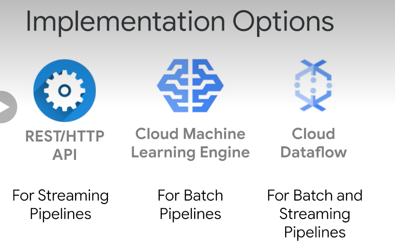

**Image-9**: Three main implementation options for inference in GCP:
- **REST/HTTP API**: For streaming pipelines via REST endpoints
- **Cloud Machine Learning Engine**: For batch predictions on structured data
- **Cloud Dataflow**: For both batch and streaming predictions at scale

---

**Tensorflow SavedModel** - Encapsulates trained model with weights, signatures, and assets for portable inference across platforms.

**TF Serving** - Microservice framework (gRPC/HTTP) for high-performance model serving with versioning, canary deployments, and A/B testing support.

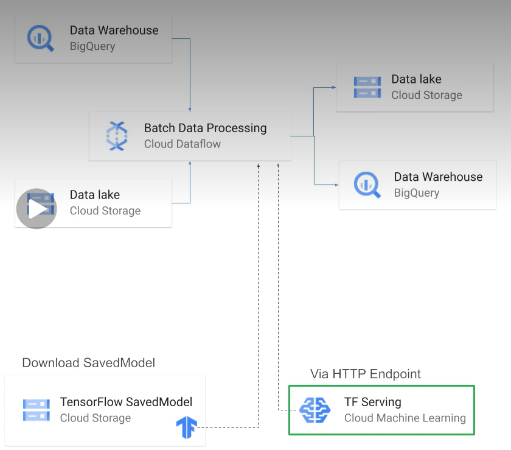

**Image-10**: Complete inference pipeline architecture showing data flow from BigQuery/Cloud Storage through Cloud Dataflow (batch processing) to either TensorFlow SavedModel (stored in Cloud Storage) or TF Serving (HTTP endpoint). Demonstrates two inference paths: download SavedModel locally or access via HTTP through TF Serving.

---

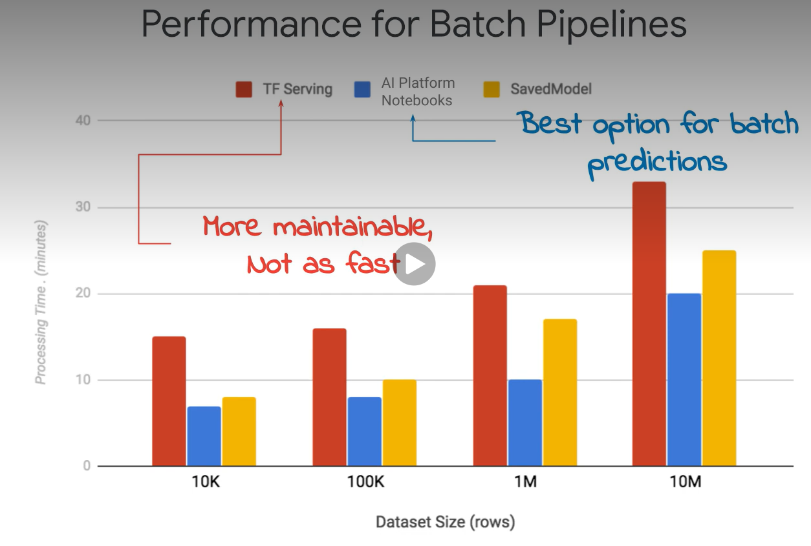

**Image-12**: Performance comparison for batch predictions across different dataset sizes (10K to 10M rows). Shows TF Serving, AI Platform Notebooks, and SavedModel. SavedModel is best for batch predictions as it has lowest processing time. TF Serving is more maintainable but slower for batch workloads.

---

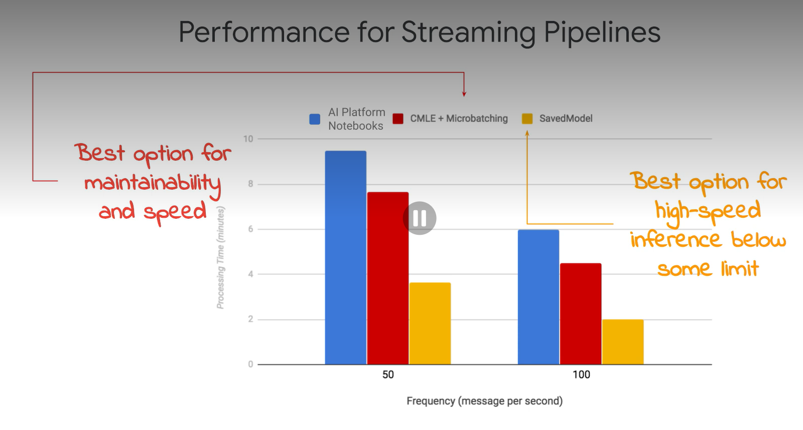

**Image-13**: Performance comparison for streaming predictions at different message frequencies (50-100 msgs/sec). AI Platform Notebooks best for maintainability and speed combined. SavedModel best for high-speed inference below latency limits. CMLE + Microbatching balances speed and efficiency for real-time scenarios.

----
### Quiz

1. If each of your examples is large in terms of size and requires parsing, and your model is relatively simple and shallow, your model is likely to be:
- [ ] Latency-bound, so you should use faster hardware
- [x] I/O bound, so you should look for ways to store data more efficiently and ways to parallelize the reads.
- [ ] CPU-bound, so you should use GPUs or TPUs.


2. What does high-performance machine learning determine?
- [ ] Training a model
- [ ] Deploying a model
- [x] Time taken to train a model
- [ ] Reliability of a model

3. Which of the following indicates that ML training is CPU bound?
- [ ] If I/O is complex, but the model involves lots of complex/expensive computations.
- [ ] If you are running a model on powered hardware.
check
- [x] If I/O is simple, but the model involves lots of complex/expensive computations.
- [ ] If you are running a model on accelerated hardware.

4. For the fastest I/O performance in TensorFlow… (check all that apply)

- [x] Read TF records into your model.
- [x] Read in parallel threads.
- [x] Optimize TensorFlow performance using the Profiler
- [x] Prefetch the data


-------

## Hybrid Cloud ML

**Hybrid Cloud ML** combines on-premises infrastructure with Google Cloud services to run ML workloads across environments. Choose it when:

| Scenario | Why Hybrid Cloud |
|----------|------------------|
| **Data Residency Requirements** | Sensitive data must stay on-premises due to compliance/regulations; only send processed data/models to cloud |
| **Legacy System Integration** | Existing on-premises Hadoop/Spark clusters that you want to extend with cloud ML services |
| **Burst Capacity Needs** | Handle peak ML workloads by expanding to cloud during high-demand periods; run routine jobs on-premises |
| **Bandwidth Constraints** | Limited cloud connectivity; run computationally heavy training on-premises, use cloud for serving/APIs |
| **Cost Optimization** | Leverage existing on-premises hardware for preprocessing; scale non-critical tasks to cheaper cloud VMs |

**In Nutshell:** Use Hybrid Cloud when you need to keep compute or data on-premises for compliance/performance, but want cloud's scalability for overflow workloads or managed ML services.

---

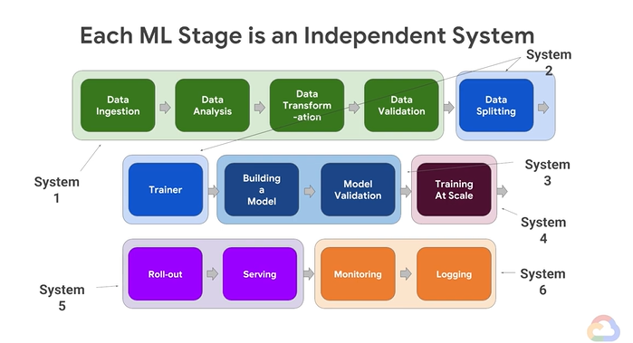

### Kubeflow

**Kubeflow** is an open-source ML platform built on Kubernetes that orchestrates end-to-end ML workflows. It provides tools for model training, hyperparameter tuning, serving, and pipeline management in a containerized environment.

| Aspect | Details |
|--------|---------|
| **What It Does** | Automates ML workflows on Kubernetes clusters (on-premises or cloud) |
| **Key Components** | KFP (Pipelines), TFJob, PyTorchJob, Katib (hyperparameter tuning), KServe (model serving) |
| **Use Case** | Hybrid cloud ML, complex pipelines requiring Kubernetes orchestration, on-premises ML infrastructure |
| **Benefits** | Cloud-agnostic, containerized reproducibility, multi-framework support (TensorFlow, PyTorch, MXNet) |
| **vs. Vertex AI** | Kubeflow = open-source + on-premises; Vertex AI = managed Google Cloud service |

**Key Takeaway**: Use Kubeflow when you need ML orchestration on Kubernetes in hybrid/on-premises environments. Use Vertex AI Pipelines for managed GCP-native ML workflows.

------

#### 🔗 Component Communication: Input/Output via kfp.dsl

Kubeflow components communicate through **artifacts** (files) and **parameters** (values). Here's how:

##### **Data Flow Mechanism**

```
Component A (Produces)          Component B (Consumes)
┌─────────────────────┐        ┌─────────────────────┐
│ Output[Dataset]     │        │ Input[Dataset]      │
│ output.path = GCS   │───────→│ input.path = GCS    │
│ writes: train.csv   │  PATH   │ reads: train.csv    │
└─────────────────────┘        └─────────────────────┘
       ↓                              ↓
  GCS Bucket                    Component B's container
  (Persistent Storage)          (runs with mounted GCS)
```

##### **Key Concepts**

| Concept | Purpose | Example |
|---------|---------|---------|
| **Input[T]** | Read-only artifact from previous component | `Input[Dataset]`, `Input[Model]` |
| **Output[T]** | Write artifact for next component | `Output[Dataset]`, `Output[Model]` |
| **Artifact Types** | Built-in types for ML workflows | `Dataset`, `Model`, `Metrics`, `ClassificationMetrics` |
| **Path Access** | Get artifact location (GCS URI) | `artifact.path` returns "gs://bucket/path" |
| **Metadata** | Store key-value info with artifact | `model.metadata["framework"] = "sklearn"` |

##### **Communication Pattern**

**1. Producer Component (Component A):**
```python
def component_a(output_data: Output[Dataset]):
    # Write to artifact location (automatically on GCS)
    import pandas as pd
    df = pd.DataFrame({"col1": [1, 2, 3]})
    
    # output_data.path points to GCS path
    output_uri = output_data.path + ".csv"
    df.to_csv(output_uri, index=False)
    
    # KFP handles upload to cloud storage automatically
    print(f"Data written to: {output_uri}")
```

**Result:** File saved to `gs://bucket/pipeline_root/component_a/output_data.csv`

**2. Consumer Component (Component B):**
```python
def component_b(input_data: Input[Dataset]):
    # Read from artifact location (automatically from GCS)
    import pandas as pd
    
    # input_data.path automatically points to previous component's output
    df = pd.read_csv(input_data.path + ".csv")
    
    # KFP handles download from cloud storage automatically
    print(f"Data read from: {input_data.path}")
    return df
```

**Result:** File automatically fetched from `gs://bucket/pipeline_root/component_a/output_data.csv`

##### **Pipeline Connection Syntax**

```python
# In pipeline definition:

# Step 1: Component A produces data
component_a_op = component_a()

# Step 2: Component B consumes data from Component A
# The OUTPUT from A becomes INPUT to B
component_b_op = component_b(
    input_data=component_a_op.outputs["output_data"]
    #          └─ Reference to A's output
)

# Pattern: 
# component_op.outputs["output_name"] 
#   ↓
# next_component(input_param=component_op.outputs["output_name"])
```

##### **Data Types & Behavior**

**1. Artifact Types (Files stored in GCS):**
```python
from kfp.dsl import Dataset, Model, Metrics

# Dataset: CSV, JSON, Parquet (train/test data)
data: Output[Dataset]  # Writes to GCS

# Model: Pickle, SavedModel (trained model)
model: Output[Model]   # Writes to GCS (can be large ~100MB+)

# Metrics: JSON metrics for monitoring
metrics: Output[Metrics]  # Logs metrics to KFP UI
```

**2. Parameter Types (Values passed directly):**
```python
# Scalars - passed as JSON values
train_size: float = 0.8
model_name: str = "RandomForest"
epochs: int = 100

# NO GCS involved - these are small configuration values
```

##### **Complete Example: 3-Component Pipeline**

```python
from kfp import dsl
from kfp.dsl import component, Input, Output, Dataset

# === COMPONENT 1: Download ===
@component(base_image="python:3.9", packages_to_install=["pandas", "gcsfs"])
def download_component(
    gcs_path: str,  # PARAMETER: small config value
    raw_data: Output[Dataset]  # ARTIFACT OUTPUT: file in GCS
):
    import pandas as pd
    df = pd.read_csv(gcs_path)
    raw_data_uri = raw_data.path + ".csv"
    df.to_csv(raw_data_uri)
    print(f"Downloaded to: {raw_data_uri}")

# === COMPONENT 2: Preprocess ===
@component(base_image="python:3.9", packages_to_install=["pandas"])
def preprocess_component(
    raw_data: Input[Dataset],  # ARTIFACT INPUT: from Component 1
    train_ratio: float,  # PARAMETER: config value
    processed_data: Output[Dataset]  # ARTIFACT OUTPUT: for Component 3
):
    import pandas as pd
    
    # Read from Component 1's output
    df = pd.read_csv(raw_data.path + ".csv")
    
    # Process...
    train_df = df.sample(frac=train_ratio)
    
    # Write output for Component 3
    output_uri = processed_data.path + ".csv"
    train_df.to_csv(output_uri)

# === COMPONENT 3: Train ===
@component(base_image="python:3.9", packages_to_install=["pandas", "sklearn"])
def train_component(
    processed_data: Input[Dataset],  # ARTIFACT INPUT: from Component 2
    model: Output[Model]  # ARTIFACT OUTPUT: pickle file
):
    import pandas as pd
    from sklearn.ensemble import RandomForestRegressor
    import pickle
    
    # Read from Component 2's output
    df = pd.read_csv(processed_data.path + ".csv")
    
    # Train...
    rf = RandomForestRegressor()
    rf.fit(df.drop("target", axis=1), df["target"])
    
    # Write output for deployment
    with open(model.path + ".pkl", "wb") as f:
        pickle.dump(rf, f)

# === PIPELINE: Connect all components ===
@dsl.pipeline(pipeline_root="gs://my-bucket/pipeline")
def my_pipeline(gcs_path: str, train_ratio: float):
    
    # Step 1: Download
    download_op = download_component(gcs_path=gcs_path)
    
    # Step 2: Preprocess (uses output from download)
    preprocess_op = preprocess_component(
        raw_data=download_op.outputs["raw_data"],  # ← INPUT from Component 1
        train_ratio=train_ratio
    )
    
    # Step 3: Train (uses output from preprocess)
    train_op = train_component(
        processed_data=preprocess_op.outputs["processed_data"]  # ← INPUT from Component 2
    )
```

**Data Flow:**
```
GCS File
   ↓
[Component 1: Download] 
   ↓ outputs["raw_data"] (GCS path)
   ├→ stored in: gs://bucket/pipeline/component1/raw_data.csv
   ↓
[Component 2: Preprocess] inputs["raw_data"]
   ↓ outputs["processed_data"] (GCS path)
   ├→ stored in: gs://bucket/pipeline/component2/processed_data.csv
   ↓
[Component 3: Train] inputs["processed_data"]
   ↓ outputs["model"] (GCS path)
   └→ stored in: gs://bucket/pipeline/component3/model.pkl
```

##### **Metadata: Attach Info to Artifacts**

```python
@component(base_image="python:3.9", packages_to_install=["sklearn", "pickle"])
def train_component(train_data: Input[Dataset], model: Output[Model]):
    import pickle
    from sklearn.ensemble import RandomForestRegressor
    import sklearn
    
    # ... training code ...
    
    # Attach metadata to model artifact
    model.metadata["model_name"] = "RandomForestRegressor"
    model.metadata["framework"] = "sklearn"
    model.metadata["framework_version"] = sklearn.__version__
    model.metadata["hyperparams"] = {"n_estimators": 100, "max_depth": 10}
    
    # Save model
    with open(model.path + ".pkl", "wb") as f:
        pickle.dump(rf, f)

# In next component, access metadata:
@component(base_image="python:3.9")
def deploy_component(model: Input[Model]):
    # Access metadata attached by previous component
    framework = model.metadata.get("framework")  # "sklearn"
    version = model.metadata.get("framework_version")  # "1.3.2"
    print(f"Deploying {framework} v{version} model")
```

-----

### TensorFlow Lite

**TensorFlow Lite** is a lightweight framework for deploying ML models on mobile, embedded, and edge devices. It converts full-size models into optimized `.tflite` files that run efficiently on devices with limited resources (memory, compute, battery).

| Aspect | Details |
|--------|---------|
| **What It Does** | Optimizes and deploys ML models for on-device inference (mobile, IoT, embedded systems) |
| **Model Format** | Converts TensorFlow/PyTorch models → `.tflite` format (binary optimized for size/speed) |
| **Key Features** | Quantization (reduce precision for smaller models), pruning (remove unnecessary weights), optimized operators |
| **Deployment Targets** | Android, iOS, Linux (Raspberry Pi), microcontrollers (TensorFlow Lite Micro) |
| **Use Case** | Real-time inference without cloud connectivity, privacy-preserving (data stays on device), low latency |
| **Benefits** | Small model size (<50MB), low memory footprint, sub-100ms latency, works offline |
| **Trade-off** | Lower accuracy than full models due to quantization; pre-trained models only (no training on device) |

**When to Use TensorFlow Lite:**

| Scenario | Example |
|----------|---------|
| **Mobile Apps** | Image recognition in camera app, text classification without internet |
| **Privacy-Critical** | Healthcare app processing patient data locally without sending to cloud |
| **Offline Required** | Translation app working without network connectivity |
| **Edge Devices** | Object detection on IoT cameras, predictive maintenance on factory equipment |
| **Low Latency** | Real-time pose estimation, hand gesture recognition in games |

**Example: Converting TensorFlow Model to TensorFlow Lite:**

```python
import tensorflow as tf

# Load trained TensorFlow model
model = tf.keras.models.load_model('trained_model.h5')

# Convert to TensorFlow Lite format
converter = tf.lite.TFLiteConverter.from_keras_model(model)
converter.optimizations = [tf.lite.Optimize.DEFAULT]  # Quantization
tflite_model = converter.convert()

# Save optimized .tflite file
with open('model.tflite', 'wb') as f:
    f.write(tflite_model)

# Deploy on mobile app (Android/iOS)
```

---

### Kubeflow vs. TensorFlow Lite Comparison

| Aspect | Kubeflow | TensorFlow Lite |
|--------|----------|-----------------|
| **Purpose** | ML pipeline orchestration and training | On-device model inference |
| **Deployment Target** | Kubernetes clusters (on-premises/cloud) | Mobile, embedded, edge devices |
| **Use Case** | Build, train, serve, monitor ML workflows | Deploy models to phones, IoT devices |
| **Architecture** | Distributed, server-side infrastructure | Lightweight, client-side (device) |
| **Model Size** | Full-size models (100MB-10GB+) | Optimized lightweight models (<50MB) |
| **Training** | ✓ Full training supported | ✗ Inference only (no training on device) |
| **Latency** | Minutes to hours (batch processing) | <100ms (real-time on-device) |
| **Connectivity Required** | Required (cloud/on-premises infrastructure) | Not required (offline capable) |
| **Cost** | High (compute clusters, infrastructure) | Low (device-side only, no server costs) |
| **Data Privacy** | Data sent to servers for processing | Data stays on device (private) |
| **Scalability** | Scales to thousands of parallel jobs | Limited by device hardware |
| **Framework Support** | TensorFlow, PyTorch, MXNet | TensorFlow, PyTorch (via ONNX) |
| **Setup Complexity** | High (requires Kubernetes expertise) | Low (SDKs available, simple integration) |
| **Example** | Train 1M models daily, serve predictions via API | Image recognition in mobile camera app |

**Quick Decision Guide:**
- **Use Kubeflow** if you need to orchestrate complex ML workflows with training, evaluation, and serving at scale
- **Use TensorFlow Lite** if you need to run pre-trained models on edge devices without cloud connectivity

-----

### Quiz

1. Which of these are reasons that you may not be able to perform machine learning solely on Google Cloud? Check all that apply.

- [x] You need to run inference on the edge.
- [ ] TensorFlow is not supported on Google Cloud.
- [x] You are tied to on-premises or multi-cloud infrastructure due to business reasons.

2. Which of the following determines the correct property of Tensorflow Lite? Select TWO correct answers.

- [x] Quantization
- [x] Lower precision arithmetic
- [ ] Increased code footprint
- [ ] Higher precision arithmetic

3. A key principle behind Kubeflow is portability so that you can:

- [x] Move your model from on-premises to Google Cloud.
- [ ] Convert your model from CUDA to XLA.
- [ ] Migrate your model from TensorFlow to PyTorch.

4. To copy the input data into TensorFlow, which of the following syntaxes is correct?
- [ ] inferenceInterface.feed(inputName, floatValues, inputSize; inputSize);
- [x] inferenceInterface.feed(inputName, floatValues, 1, inputSize, inputSize, 3);
- [ ] inferenceInterface.feed(floatValues, 1, inputSize, inputSize, 3);
- [ ] inferenceInterface.feed(inputName, floatValues, 1, inputSize, 3);

-----------------
## ALL QUIZ & ANSWERS

**ALL ML SYSTEM Q&A is available in**
"C:\Users\vingane\Learning\Learning-main\cloud\gcp_certification\Professional_Machine_Learning_Engineer_Certification\resources\PROD_ML_ALL_QUIZ.pdf"

----

# MLOps

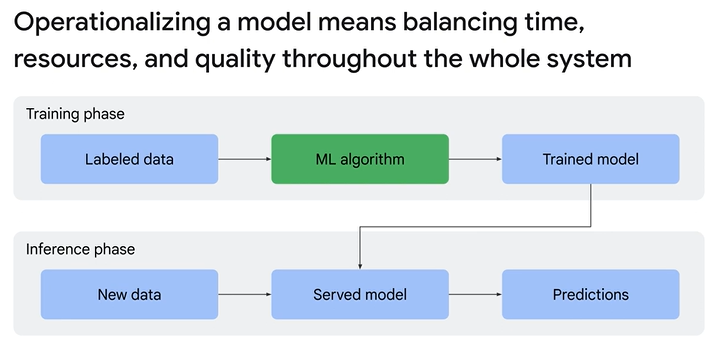

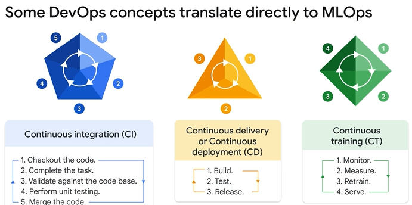

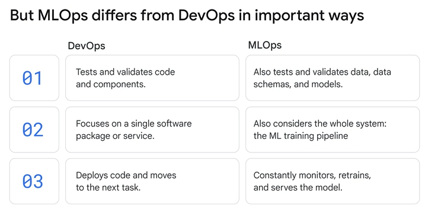

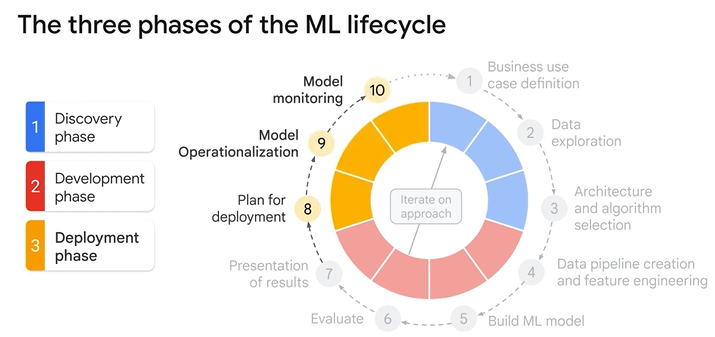

---

## MLOps Critical Steps

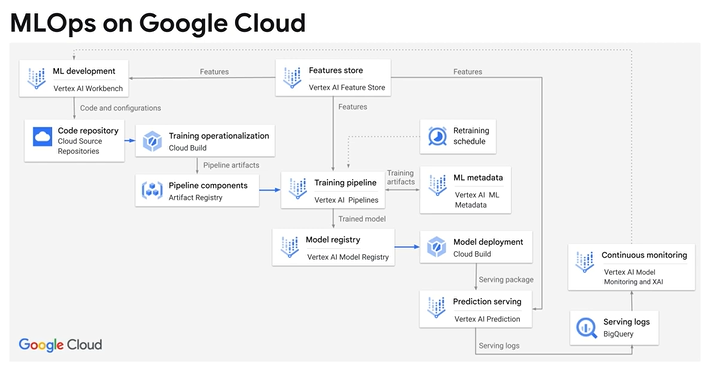

**MLOps** (Machine Learning Operations) automates the ML lifecycle from development to production monitoring. It ensures reproducibility, scalability, and continuous improvement of ML systems.

### Core MLOps Steps with GCP Services

| Step | Description | Goal | GCP Services |
|------|-------------|------|--------------|
| **1. Data Ingestion** | Collect data from multiple sources into centralized repository | Ensure consistent, quality data for training | Cloud Pub/Sub, Dataflow, Cloud Storage, BigQuery |
| **2. Data Validation** | Check data quality, schema compliance, and anomalies | Prevent bad data from corrupting models | TensorFlow Data Validation (TFDV), BigQuery |
| **3. Feature Engineering** | Transform raw data into meaningful features | Improve model performance and training speed | Dataflow, Dataproc, Vertex AI Feature Store |
| **4. Model Training** | Train models on preprocessed data with versioning | Create reproducible, trackable models | Vertex AI Training, BigQuery ML, Dataproc |
| **5. Hyperparameter Tuning** | Optimize model parameters automatically | Find best model configurations | Vertex AI Hyperparameter Tuning, Katib (Kubeflow) |
| **6. Model Evaluation** | Test model on holdout set against acceptance criteria | Ensure quality before production deployment | Vertex AI Experiments, TensorBoard |
| **7. Model Registry** | Store trained model with metadata, versions, and metrics | Enable versioning, rollback, and audit trails | Vertex AI Model Registry, Cloud Storage |
| **8. Pipeline Orchestration** | Automate entire MLOps workflow execution | Reproducible, scheduled ML pipelines | Vertex AI Pipelines, Cloud Composer (Airflow) |
| **9. Model Deployment** | Push model to production serving endpoints | Make predictions available to applications | Vertex AI Endpoints, Cloud Run, App Engine |
| **10. Inference / Serving** | Run predictions on new data (batch or real-time) | Deliver business value through predictions | Vertex AI Online/Batch Prediction, BigQuery ML |
| **11. Monitoring & Drift Detection** | Track model performance, data drift, and anomalies | Catch degradation early and trigger retraining | Cloud Monitoring, Vertex AI Model Monitoring, Cloud Logging |
| **12. Feedback & Retraining** | Collect ground truth, update training data, retrain | Continuously improve model accuracy | Pub/Sub, BigQuery, Dataflow, Vertex AI Pipelines |
| **13. CI/CD & DevOps** | Automate testing and deployment of ML code | Ensure code quality and reliable deployments | Cloud Build, Cloud Source Repositories |

---

## MLOps Workflow on GCP (End-to-End)

```
Raw Data (Cloud Storage / APIs)
    ↓
Data Ingestion (Pub/Sub / Dataflow)
    ↓
Data Validation (TFDV) → Reject if anomalies
    ↓
Feature Store (Vertex AI Feature Store)
    ↓
Model Training (Vertex AI Training)
    ↓
Model Evaluation (Vertex AI Experiments)
    ↓
Model Registry (Vertex AI Model Registry)
    ↓
Deployment (Vertex AI Endpoints / Cloud Run)
    ↓
Inference (Batch / Online Predictions)
    ↓
Monitoring (Vertex AI Model Monitoring)
    ↓
Drift Detection → If drift detected, trigger retraining
    ↓
Feedback Loop (Ground Truth Collection)
    ↓
[Loop back to Training]
```

---

## Key MLOps Principles (Best Practices)

| Principle | Why It Matters |
|-----------|----------------|
| **Version Control** | Track code, data, and model versions for reproducibility and rollback |
| **Reproducibility** | Same inputs → same outputs; enables debugging and compliance |
| **Automation** | Reduce manual steps, prevent human error, enable continuous integration |
| **Monitoring** | Catch performance degradation early before users notice |
| **Feedback Loops** | Collect ground truth to continuously improve models |
| **Data Quality** | Bad data → bad predictions; validate early and often |
| **Model Governance** | Document who trained the model, with what data, and why |
| **Scalability** | Handle growing data volumes and prediction requests |

---

## Example: MLOps Pipeline on Vertex AI

```python
from kfp import dsl
from kfp.v2.dsl import component, Output, Input, Model, Dataset

# Step 1: Data Validation
@component(base_image='python:3.9', packages_to_install=['tensorflow-data-validation'])
def validate_data(raw_data_path: str, validation_report: Output[Dataset]) -> None:
    import tensorflow_data_validation as tfdv
    stats = tfdv.generate_statistics_from_csv(raw_data_path)
    schema = tfdv.infer_schema(stats)
    # Save validation report
    with open(validation_report.path, 'w') as f:
        f.write(str(schema))

# Step 2: Model Training
@component(base_image='python:3.9', packages_to_install=['scikit-learn', 'joblib'])
def train_model(training_data: Input[Dataset], model_output: Output[Model]) -> None:
    import pandas as pd
    import joblib
    from sklearn.ensemble import RandomForestClassifier
    
    df = pd.read_csv(training_data.path)
    X, y = df.drop('target', axis=1), df['target']
    model = RandomForestClassifier(n_estimators=100)
    model.fit(X, y)
    joblib.dump(model, model_output.path)

# Step 3: Model Evaluation
@component(base_image='python:3.9', packages_to_install=['scikit-learn', 'joblib'])
def evaluate_model(model: Input[Model], test_data: Input[Dataset]) -> float:
    import pandas as pd
    import joblib
    
    model = joblib.load(model.path)
    df = pd.read_csv(test_data.path)
    X, y = df.drop('target', axis=1), df['target']
    return model.score(X, y)

# Step 4: Pipeline Orchestration
@dsl.pipeline(name='mlops-pipeline')
def mlops_pipeline():
    validate_task = validate_data(raw_data_path='gs://bucket/raw_data.csv')
    train_task = train_model(training_data=validate_task.outputs['validation_report'])
    eval_task = evaluate_model(model=train_task.outputs['model_output'], 
                                test_data=validate_task.outputs['validation_report'])
```

---

## Quick MLOps Checklist

- [ ] Data versioning (track data changes)
- [ ] Model versioning (tag trained models)
- [ ] Automated pipeline (avoid manual steps)
- [ ] Unit tests (validate code quality)
- [ ] Integration tests (test components together)
- [ ] Model monitoring (track accuracy, latency)
- [ ] Drift detection (monitor data/concept changes)
- [ ] Rollback capability (revert to previous model if needed)
- [ ] Documentation (record model purpose, data, decisions)
- [ ] Access control & audit logs (compliance & security)

----------------------

## Quiz

1. Which of the following characteristics of delivering an ML model is considered as a characteristic of maturity level 0?
- [ ] Feature store integration
- [ ] Pipeline continuous integration
- [x] Manual, script-driven, and interactive process
- [ ] Source control automation


2.What is the important aspect of MLOps which differs from DevOps?

- [x] MLOps constantly monitors, retrains, and serves the model.
- [ ] MLOps tests and validates only the code and components.
- [ ] MLOps deploys code and moves to another task.
- [ ] MLOps focuses on a single software package or service.


3.What is the process of monitoring, measuring, retraining, and serving ML models automatically and continuously to adapt to changes in the data before they’re redeployed?

- [ ] Continuous deployment
- [ ] Continuous delivery
- [x] Continuous training
- [ ] Continuous integration

```
❌ Continuous Integration (CI) → Integrating and testing code changes.
❌ Continuous Delivery (CD) → Preparing software/models for deployment.
✅ Continuous Training (CT) → Monitoring, retraining, and updating ML models automatically.
❌ Continuous Deployment → Automatically deploying approved releases to production.
```

4. Which of the following steps is part of continuous integration and delivery (CI/CD) but not continuous training (CT)?

- [x] Building the model
- [ ] Measuring the model
- [ ] Retraining the model
- [ ] Monitoring the model

----------------------

## MLOps on Vertex AI

**MLOps on Vertex AI** is Google Cloud's end-to-end managed solution for automating ML workflows. It integrates data preparation, model training, evaluation, deployment, and monitoring into a unified platform. Key components include Vertex AI Pipelines (orchestration), Model Registry (versioning), Feature Store (feature management), and continuous monitoring with automated retraining triggers for drift detection.

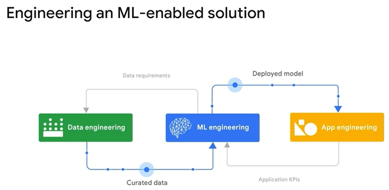

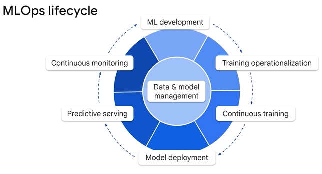

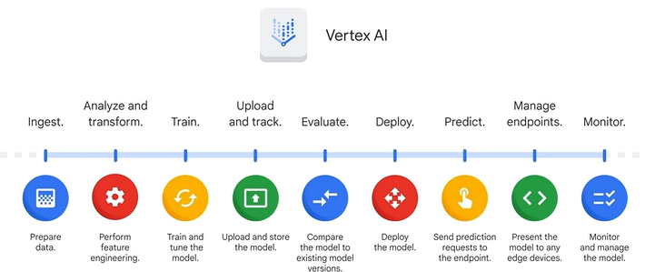

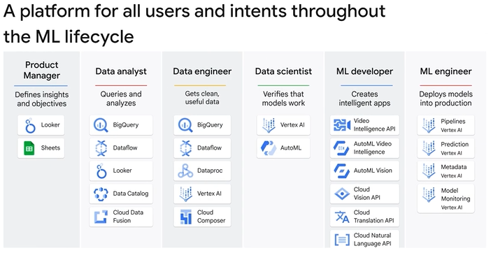

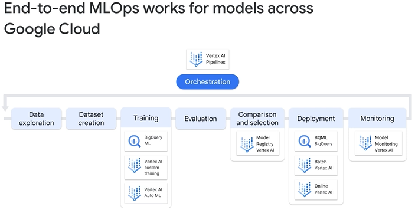

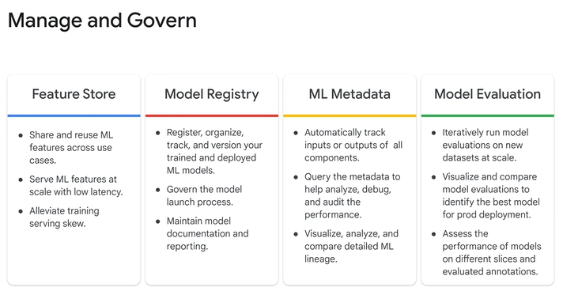

### Vertex Explainable AI (XAI)

**Purpose**: Understand which features drive model predictions by computing feature attributions (Shapley values, gradients). Helps identify biases, debug incorrect predictions, and build trust in ML models.

**GCP Service**: Vertex AI Explainable AI provides feature importance analysis, sample-based or gradient-based explanations, and integrated visualization for model interpretability.

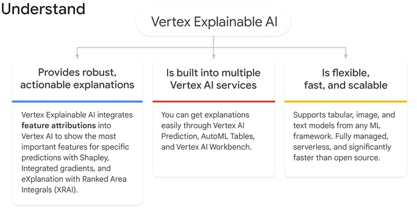

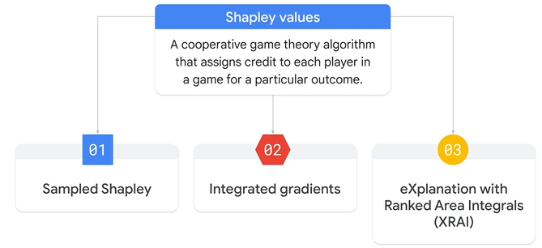

### Monitoring ML

**Purpose**: Track model performance, data drift, and prediction quality in production. Detects degradation, anomalies, and concept shifts before they impact business. Triggers alerts and automated retraining when metrics fall below thresholds.

**GCP Service**: Vertex AI Model Monitoring continuously monitors prediction distributions, compares against training data baselines, logs metrics to Cloud Logging, and integrates with Cloud Alerting for automated responses.

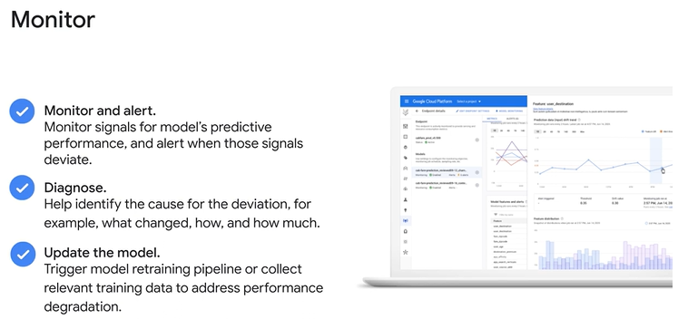

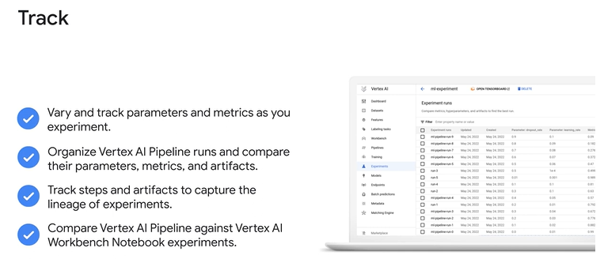

---

## Step-by-Step Implementation on GCP

### 1. Data Preparation & Training

**Steps**:
1. Upload dataset to Cloud Storage or BigQuery
2. Create Vertex AI Dataset resource
3. Configure data preprocessing pipeline
4. Split into train/validation/test sets

**GCP Configuration**:
```bash
# Create dataset in Vertex AI
gcloud ai datasets create \
  --display-name="customer-data" \
  --location=us-central1 \
  --source="gs://your-bucket/data.csv"

# Prepare training data
gsutil cp local_data.csv gs://your-bucket/datasets/
```

**Diagram**:
```
┌──────────────────┐
│ Raw Data         │ (Local/Cloud Storage)
└────────┬─────────┘
         ↓
┌──────────────────────────┐
│ Create Vertex Dataset    │
└────────┬─────────────────┘
         ↓
    ┌────────────────────┐
    │ Data Validation    │
    │ (Check quality)    │
    └────────┬───────────┘
             ↓
    ┌────────────────────────────┐
    │ Split: Train/Val/Test      │
    │ (70% / 15% / 15%)          │
    └────────────────────────────┘
```

---

### 2. Hyperparameter Tuning

**Steps**:
1. Define hyperparameter search space (learning rate, batch size, etc.)
2. Create tuning job configuration (YAML)
3. Submit tuning job to Vertex AI
4. System tests multiple parameter combinations in parallel
5. Evaluates each on validation set
6. Returns best parameters

**GCP Configuration**:
```bash
# Create tuning job config (config.yaml)
cat > config.yaml <<EOF
study:
  algorithm: GRID
  goal: MAXIMIZE
  maxTrialCount: 100
  parallelTrialCount: 10
parameters:
  - name: learning_rate
    scale: LINEAR
    minValue: 0.001
    maxValue: 0.1
  - name: batch_size
    scale: LINEAR
    minValue: 16
    maxValue: 128
EOF

# Submit tuning job
gcloud ai hp-tuning-jobs create \
  --display-name="churn-tuning" \
  --config=config.yaml \
  --region=us-central1
```

**Diagram**:
```
┌──────────────────────────────────┐
│ Define Search Space              │
│ (learning_rate, batch_size, etc) │
└──────────────┬───────────────────┘
               ↓
┌──────────────────────────────────┐
│ Submit to Vertex AI Tuning Job   │
└──────────────┬───────────────────┘
               ↓
        ┌──────┴──────┬──────┐
        ↓             ↓      ↓
    [Trial 1]   [Trial 2] [Trial N]  (Parallel)
        ↓             ↓      ↓
    ┌──────┴──────┬──────┐
    │ Evaluate on Validation Set │
    └──────┬───────────────────┘
           ↓
    ┌──────────────────────────┐
    │ Best Parameters Found    │
    │ (LR: 0.05, BS: 64)       │
    └──────────────────────────┘
```

---

### 3. Model Training

**Steps**:
1. Create training script (Python with TensorFlow/PyTorch)
2. Configure Vertex AI training job
3. Submit training job (allocate compute resources)
4. Monitor training progress and logs
5. Save trained model to Cloud Storage
6. Log training metrics to Vertex AI Experiments

**GCP Configuration**:
```bash
# Create training script (train.py)
cat > train.py <<EOF
import tensorflow as tf
from google.cloud import aiplatform

# Load data
train_ds = tf.data.Dataset.from_csv('gs://bucket/train.csv')

# Build & compile model
model = tf.keras.Sequential([...])
model.compile(optimizer='adam', loss='binary_crossentropy', metrics=['accuracy'])

# Train
model.fit(train_ds, epochs=50, batch_size=64)

# Save model
model.save('gs://bucket/models/model.h5')
EOF

# Submit training job
gcloud ai custom-jobs create \
  --display-name="customer-churn-training" \
  --region=us-central1 \
  --config=training-config.yaml
```

**Diagram**:
```
┌──────────────────────┐
│ Best Hyperparameters │ (from tuning)
└────────┬─────────────┘
         ↓
┌──────────────────────┐
│ Training Dataset     │
└────────┬─────────────┘
         ↓
┌──────────────────────────┐
│ Build Model with Params  │
│ (Learning rate, etc)     │
└────────┬─────────────────┘
         ↓
    ┌──────────────────┐
    │ Train on GPU/TPU │
    │ (Vertex AI)      │
    └────────┬─────────┘
             ↓
    ┌──────────────────────┐
    │ Trained Model        │
    │ → Cloud Storage      │
    └──────────────────────┘
```

---

### 4. Experimenting

**Steps**:
1. Create experiment run with model parameters & data version
2. Log metrics, parameters, and artifacts during training
3. Track model code, data lineage, and timestamps
4. Compare multiple runs side-by-side
5. Select best-performing configuration

**GCP Configuration**:
```bash
# Initialize experiment tracking
gcloud ai experiments create --display-name="churn-experiment"

# Log metrics during training (in training script)
from google.cloud import aiplatform
aiplatform.init(project='your-project', location='us-central1')

run = aiplatform.start_run(run=f"run-{timestamp}")
run.log_metrics({'accuracy': 0.92, 'loss': 0.15})
run.log_params({'learning_rate': 0.05, 'batch_size': 64})
```

**Diagram**:
```
┌──────────────────────────────────┐
│ Experiment: Model Selection      │
│ Comparing 3 Configurations       │
└────────┬────────────┬────────────┘
         │            │            │
    ┌────▼──┐    ┌────▼──┐    ┌───▼───┐
    │ Run 1 │    │ Run 2 │    │ Run 3 │
    │LR:0.01│    │LR:0.05│    │LR:0.1 │
    │Acc:0.89    │Acc:0.92    │Acc:0.88
    └────┬──┘    └────┬──┘    └───┬───┘
         │            │            │
         │   ┌────────▼────────┐   │
         │   │ Run 2 is BEST   │   │
         │   │ (Highest Acc)   │   │
         │   └─────────────────┘   │
         ↓
    ┌─────────────────────┐
    │ Register Model v1.0 │
    └─────────────────────┘
```

---

### 5. Model Evaluation

**Steps**:
1. Create experiment run with model parameters & data version
2. Log metrics, parameters, and artifacts during training
3. Track model code, data lineage, and timestamps
4. Compare multiple runs side-by-side
5. Select best-performing configuration

**GCP Service**: `Vertex AI Experiments`

```
┌──────────────────────────────────┐
│ Experiment: Model Selection      │
│ Comparing 3 Algorithms           │
└────────┬────────────┬────────────┘
         │            │            │
    ┌────▼──┐    ┌────▼──┐    ┌───▼───┐
    │ Run 1 │    │ Run 2 │    │ Run 3 │
    │LR:0.01│    │LR:0.05│    │LR:0.1 │
    └────┬──┘    └────┬──┘    └───┬───┘
         │            │            │
    ┌────▼──────────┬─▼──────────┬─▼──┐
    │ Accuracy      │ Accuracy   │Accuracy
    │ 0.89          │ 0.92       │ 0.88
    └────┬──────────┼────────────┴─────┘
         │          │
         │   ┌──────▼──────────┐
         │   │ Run 2 is Best   │
         │   │ (Highest Acc)   │
         │   └─────────────────┘
         ↓
    ┌─────────────────────┐
    │ Register Model v1.0 │
    └─────────────────────┘
```

---

### 5. Model Evaluation

**Steps**:
1. Load model from registry
2. Run on test set with various metrics
3. Generate confusion matrix, ROC curve, feature importance
4. Create evaluation report with visualizations
5. Document findings and approval decision

**GCP Configuration**:
```bash
# Download model from registry
gcloud ai models list --region=us-central1

# Evaluate using Vertex AI Model Evaluation
gcloud ai model-evaluation-jobs create \
  --display-name="churn-eval" \
  --model-display-name="churn-model-v1" \
  --test-dataset="gs://bucket/test_data.csv" \
  --region=us-central1

# Use What-If Tool for edge case testing
from google.cloud import aiplatform
aiplatform.init(project='your-project')
model = aiplatform.Model.get('model-id')
model.evaluate()
```

**Diagram**:
```
┌──────────────────┐
│ Trained Model    │
└────────┬─────────┘
         ↓
┌──────────────────────────┐
│ Test Dataset (Hold-out)  │
└────────┬─────────────────┘
         ↓
    ┌────────────────────────┐
    │ Generate Reports:      │
    │ • Confusion Matrix     │
    │ • ROC Curve            │
    │ • Feature Importance   │
    │ • Precision/Recall     │
    └────────┬───────────────┘
             ↓
    ┌────────────────────────┐
    │ What-If Analysis       │
    │ (Test edge cases)      │
    └────────┬───────────────┘
             ↓
    ┌──────────────────────────┐
    │ Meets Acceptance Criteria?
    │ YES? → Deploy             │
    │ NO? → Retrain             │
    └──────────────────────────┘
```

---

### 6. Explainability (XAI)

**Steps**:
1. Deploy model to Vertex AI Endpoint with explanations enabled
2. Make predictions and request feature attributions
3. Compute feature attributions (Shapley, gradients)
4. Visualize which features influenced prediction
5. Debug bias or unexpected behavior

**GCP Configuration**:
```bash
# Deploy model with explanations enabled
gcloud ai endpoints deploy-model \
  --endpoint-id=churn-endpoint \
  --display-name="churn-deployment" \
  --model-id=churn-model-v1 \
  --deployed-model-display-name="v1" \
  --enable-explanations \
  --explanation-method=integrated-gradients

# Request prediction with explanation
curl -X POST \
  -H "Authorization: Bearer $(gcloud auth application-default print-access-token)" \
  -H "Content-Type: application/json" \
  https://us-central1-aiplatform.googleapis.com/v1/projects/YOUR_PROJECT/locations/us-central1/endpoints/ENDPOINT_ID:explain \
  -d '{
    "instances": [{
      "age": 35, "income": 75000, "credit_score": 750
    }],
    "explain_options": {
      "explanation_type": "feature_attributions"
    }
  }'
```

```
┌──────────────────┐
│ Input Sample     │
│ [age, income,    │
│  credit_score]   │
└────────┬─────────┘
         ↓
┌──────────────────────────┐
│ Model Prediction         │
│ Output: Approved (0.89)  │
└────────┬─────────────────┘
         ↓
┌──────────────────────────┐
│ Compute Attributions:    │
│ • Shapley Values         │
│ • Gradient-based         │
└────────┬─────────────────┘
         ↓
    ┌────────────────────┐
    │ Feature Impact:    │
    │ ✓ income: +0.45   │
    │ ✓ age: +0.30      │
    │ ✗ debt: -0.04     │
    └────┬───────────────┘
         ↓
    ┌──────────────────────────┐
    │ Explainability Report    │
    │ → Understand Decision    │
    └──────────────────────────┘
```

---

### 7. Monitoring ML

**Steps**:
1. Serve model predictions in production
2. Log predictions + ground truth labels to BigQuery
3. Compute training data baseline statistics
4. Monitor serving data distribution continuously
5. Alert if drift detected
6. Trigger retraining if needed

**GCP Configuration**:
```bash
# Enable prediction logging to BigQuery
gcloud ai endpoints deploy-model \
  --endpoint-id=churn-endpoint \
  --model-id=churn-model-v1 \
  --enable-request-response-logging \
  --request-response-logging-sampling-percentage=100

# Create monitoring job for drift detection
gcloud ai model-monitoring-jobs create \
  --display-name="churn-monitoring" \
  --endpoint-id=churn-endpoint \
  --model-display-name="churn-model-v1" \
  --training-dataset="gs://bucket/training_data.csv" \
  --logging-sampling-percentage=50 \
  --alert-threshold=0.1

# Set up alert policy
gcloud alpha monitoring policies create \
  --notification-channels=CHANNEL_ID \
  --display-name="Model Drift Alert" \
  --condition-display-name="drift > 10%"
```

```
┌─────────────────────────────┐
│ Production Endpoint         │
│ (Serving Predictions)       │
└────────────┬────────────────┘
             ↓
    ┌────────────────────────┐
    │ Log to BigQuery:       │
    │ • Predictions          │
    │ • Features             │
    │ • Ground Truth         │
    └────────┬───────────────┘
             ↓
    ┌─────────────────────────────┐
    │ Compute Baselines:          │
    │ Training data distribution  │
    └────────┬────────────────────┘
             ↓
    ┌──────────────────────────┐
    │ Monitor Serving Data:    │
    │ • Data Drift Detection   │
    │ • Prediction Drift       │
    │ • Feature Statistics     │
    └────────┬─────────────────┘
             ↓
    ┌──────────────────────────┐
    │ Threshold Check:         │
    │ Is drift > threshold?    │
    └────────┬─────────────────┘
             │
    ┌────────┴────────┐
    │ YES             │ NO
    ↓                 ↓
 ┌─────────┐     ┌─────────┐
 │ALERT    │     │Continue │
 │Retrain  │     │Serving  │
 └─────────┘     └─────────┘
```

---

### 8. Deploying ML Model

**Steps**:
1. Register final model in Vertex AI Model Registry
2. Create Vertex AI Endpoint resource
3. Deploy model to endpoint with compute resources
4. Configure traffic splitting (canary deployment)
5. Enable monitoring and logging
6. Run health checks before full traffic

**GCP Configuration**:
```bash
# 1. Register model in Model Registry
gcloud ai models upload \
  --display-name="churn-model-v1" \
  --artifact-uri="gs://bucket/models/model.h5" \
  --container-image-uri="gcr.io/cloud-aiplatform/prediction/tf2-cpu.2-11"

# 2. Create endpoint
gcloud ai endpoints create \
  --display-name="churn-endpoint" \
  --region=us-central1

# 3. Deploy model to endpoint
gcloud ai endpoints deploy-model \
  --endpoint-id=churn-endpoint \
  --display-name="churn-deployment" \
  --model-id=churn-model-v1 \
  --machine-type="n1-standard-4" \
  --min-replica-count=2 \
  --max-replica-count=10

# 4. Configure canary deployment (traffic split)
gcloud ai endpoints update ENDPOINT_ID \
  --update-deployed-model=churn-deployment \
  --traffic-split=churn-model-v1:20,churn-model-v0:80

# 5. Test health
curl -X POST \
  -H "Authorization: Bearer $(gcloud auth application-default print-access-token)" \
  -H "Content-Type: application/json" \
  https://us-central1-aiplatform.googleapis.com/v1/projects/YOUR_PROJECT/locations/us-central1/endpoints/ENDPOINT_ID:predict \
  -d '{
    "instances": [{"age": 35, "income": 75000, "credit_score": 750}]
  }'
```

**GCP Service**: `Vertex AI Model Registry` + `Vertex AI Endpoints`

```
┌──────────────────────────┐
│ Vertex AI Model Registry │
│ • model v1.0             │
│ • model v1.1 (candidate) │
└────────┬─────────────────┘
         ↓
┌──────────────────────────┐
│ Create Endpoint Resource │
│ Define compute resources │
└────────┬─────────────────┘
         ↓
┌──────────────────────────────┐
│ Deploy Model to Endpoint     │
│ Allocate n1-standard-4 VM    │
└────────┬─────────────────────┘
         ↓
┌──────────────────────────────┐
│ Traffic Split Setup:         │
│ • v1.0: 80% (stable)         │
│ • v1.1: 20% (canary)         │
└────────┬─────────────────────┘
         ↓
┌──────────────────────────────┐
│ Enable Monitoring & Logging  │
│ • Request/response logging   │
│ • Predictions to BigQuery    │
└────────┬─────────────────────┘
         ↓
    ┌──────────────────┐
    │ Health Checks OK │
    │ → Production     │
    └──────────────────┘
         ↓
    ┌──────────────────────┐
    │ Serve Predictions    │
    │ Real-time API calls  │
    └──────────────────────┘
```

---

## Complete MLOps Pipeline Flow (Sequential Order)

```
┌──────────────────────┐
│ 1. Data Preparation  │
│ (Upload & Split)     │
└────────┬─────────────┘
         ↓
┌──────────────────────────┐
│ 2. Hyperparameter Tuning │
│ (Grid/Random Search)     │
└────────┬─────────────────┘
         ↓
┌──────────────────────────┐
│ 3. Model Training        │
│ (With best parameters)   │
└────────┬─────────────────┘
         ↓
┌──────────────────────────┐
│ 4. Experimenting         │
│ (Track & Log metrics)    │
└────────┬─────────────────┘
         ↓
┌──────────────────────────┐
│ 5. Model Evaluation      │
│ (Test set + metrics)     │
└────────┬─────────────────┘
         ↓
         │ Pass Acceptance?
         ├─ NO → Back to step 2 (Retune)
         └─ YES ↓
┌──────────────────────────┐
│ 6. Explainability (XAI)  │
│ (Feature attributions)   │
└────────┬─────────────────┘
         ↓
┌──────────────────────────┐
│ 7. Deploy Model          │
│ (Endpoint + canary)      │
└────────┬─────────────────┘
         ↓
┌──────────────────────────┐
│ 8. Monitoring (Prod)     │
│ (Drift detection loop)   │◄─────┐
└────────┬─────────────────┘       │
         │                         │
    Drift Detected?               │
         ├─ YES ──────────────────┘
         │        (Retrain)
         └─ NO → Continue Serving
```

---

# Vertex AI Dataset vs Feature Store

## Vertex AI Dataset
A **Vertex AI Dataset** is a managed container in Vertex AI that stores raw training data (images, text, tabular data, video) with metadata and labels. It's specifically formatted for training AutoML or custom models and handles data versioning, validation, and preparation for model training.

## Feature Store
A **Feature Store** is a centralized repository that stores pre-computed, processed features ready for ML model consumption. Features are engineered, validated, and versioned. It serves features to both training and prediction pipelines, ensuring consistency between training and serving.

## Comparison

| Aspect | Dataset | Feature Store |
|--------|---------|---------------|
| **Content** | Raw/labeled data | Pre-computed, engineered features |
| **Purpose** | Training model input | Consistent feature delivery (train & serve) |
| **Processing** | Requires feature engineering | Features already processed |
| **Reusability** | Project-specific | Shared across multiple models |
| **Example** | CSV with raw customer data | Age, income_level, purchase_frequency |

---

## All Vertex AI Services - Comprehensive Reference

| Service | Purpose | Key Features | Use Case | Command/API |
|---------|---------|-------------|----------|------------|
| **Vertex AI Datasets** | Managed data containers for training data with labels, metadata, versioning | Data versioning, label management, schema validation | Prepare data for AutoML/custom training | `gcloud ai datasets create` |
| **Vertex AI AutoML** | No-code model training for image, text, tabular, time-series data | Auto feature engineering, model selection, hyperparameter tuning | Quick model development for non-experts | `gcloud ai auto-ml create` |
| **Vertex AI Custom Training** | Train models with full control using TensorFlow, PyTorch, scikit-learn | Framework flexibility, distributed training, custom code | Complex ML workflows, research models | `gcloud ai custom-jobs create` |
| **Vertex AI Hyperparameter Tuning (HPO)** | Automated hyperparameter optimization using Bayesian search | Grid, random, Bayesian search strategies | Improve model accuracy systematically | `gcloud ai hp-tuning-jobs create` |
| **Vertex AI Experiments** | Track and compare ML experiments with metrics, parameters, artifacts | Run tracking, version control, comparison UI | Reproducibility, model iteration | `aiplatform.start_run()` |
| **Vertex AI Model Registry** | Centralized repository for trained models with versioning and metadata | Version control, metadata storage, lineage tracking | Model governance, deployment management | `gcloud ai models upload` |
| **Vertex AI Endpoints** | Managed REST API endpoints for real-time model serving | Auto-scaling, traffic splitting, batch prediction | Deploy models for production inference | `gcloud ai endpoints deploy-model` |
| **Vertex AI Batch Prediction** | Process large datasets through trained models asynchronously | BigQuery input/output, cost-effective | Large-scale offline predictions | `gcloud ai batch-predictions create` |
| **Vertex AI Pipelines** | Orchestrate ML workflows using Kubeflow/Vertex Pipelines DAGs | Component-based, reusable, scheduled execution | Automate end-to-end ML workflows | `gcloud ai pipelines create` |
| **Vertex AI Feature Store** | Centralized repository for pre-computed features with online/offline stores | Consistent train-serve, low-latency retrieval, versioning | Prevent training-serving skew, feature reusability | `gcloud ai feature-stores create` |
| **Vertex AI Model Evaluation** | Automated model evaluation with metrics, fairness checks, explanations | Classification, regression, NLP metrics | Pre-deployment quality assurance | `gcloud ai model-evaluation-jobs create` |
| **Vertex AI Explainable AI (XAI)** | Feature attribution and model explanations (SHAP, Integrated Gradients) | Feature importance, local/global explanations | Model transparency, debugging | `--enable-explanations` flag |
| **Vertex AI Model Monitoring** | Track deployed model performance and detect data drift | Drift detection, performance tracking, alerts | Monitor production models for degradation | `gcloud ai model-monitoring-jobs create` |
| **Vertex AI Prediction API** | REST/gRPC API for real-time predictions from deployed models | Low-latency, scalable inference | Production prediction serving | `curl https://region-aiplatform.googleapis.com/...` |
| **Vertex AI Generative AI** | Access to foundation models (Gemini, PaLM) for text, image, code generation | Multi-modal, few-shot learning, prompt tuning | LLM applications, content generation | `vertexai.generative_models.GenerativeModel()` |
| **Vertex AI Search & Conversation** | Build conversational search and recommendation systems | Semantic search, RAG, conversational AI | Enterprise search, recommendation engines | `vertexai.rag` |
| **Vertex AI Agent Builder** | Create autonomous agents using LLMs and tools | Multi-step reasoning, tool orchestration | Intelligent workflow automation | `gcloud ai agents create` |
| **Vertex AI Prompt Engineering** | Tune and optimize prompts for LLMs | Prompt templates, parameter optimization | Improve LLM output quality | `aiplatform.preview.prompts` |
| **Vertex AI Data Labeling** | Managed service for data annotation and labeling | Human labeling, active learning | Create labeled datasets for training | `gcloud ai data-labeling datasets create` |
| **Vertex AI Workbench** | Jupyter notebook environment for ML development | Pre-configured kernels, GCP integration | Exploratory data analysis, prototyping | `gcloud notebooks instances create` |
| **Vertex AI TensorBoard** | Visualization for training metrics and model debugging | Real-time metrics, histograms, graphs | Monitor training progress in real-time | `tensorboard --logdir=gs://bucket/logs` |
| **Vertex AI Forecasting** | Time-series forecasting for demand, revenue, trends | Auto ARIMA, Prophet, neural networks | Predict future values from historical data | `gcloud ai forecasting-models create` |
| **Vertex AI Classification** | Binary/multi-class classification with evaluation | Confusion matrix, ROC curves, precision-recall | Categorize data into classes | Built into AutoML/Custom Training |
| **Vertex AI Regression** | Predict continuous numerical values | RMSE, MAE, R² metrics | Price prediction, trend forecasting | Built into AutoML/Custom Training |
| **Vertex AI NLP (Text)** | Sentiment analysis, entity extraction, text classification | Pre-trained models, custom training | Understand and classify text data | `aiplatform.preview.language_models` |
| **Vertex AI Vision (Images)** | Object detection, image classification, image segmentation | OCR, document analysis, visual search | Analyze and classify images | `aiplatform.ImageTextModel` |
| **Vertex AI Video** | Video classification, action recognition, tracking | Temporal analysis, scene detection | Understand video content | `aiplatform.VideoDataset` |
| **Vertex AI Document AI** | Extract data from documents (invoices, receipts, contracts) | Table extraction, form parsing, OCR | Automate document processing | `documentai.DocumentProcessorServiceClient()` |
| **Vertex AI Matching Engine** | Vector database for semantic/similarity search | Low-latency nearest neighbor search | Recommendation systems, semantic search | `gcloud ai index create` |
| **Vertex AI Reasoning Engine** | Build reasoning systems for complex LLM tasks | Long-context reasoning, multi-step planning | Solve complex multi-step problems | `vertexai.reasoning_engines` |

## GCP MLOps Tools Quick Reference

| Step | Process | Primary GCP Service | Key Command |
|------|---------|-------------------|-------------|
| 1 | Data Preparation | Vertex AI Datasets | `gcloud ai datasets create` |
| 2 | Hyperparameter Tuning | Vertex AI HPO | `gcloud ai hp-tuning-jobs create` |
| 3 | Model Training | Vertex AI Training | `gcloud ai custom-jobs create` |
| 4 | Experimenting | Vertex AI Experiments | `aiplatform.start_run()` |
| 5 | Model Evaluation | Vertex AI Evaluation | `gcloud ai model-evaluation-jobs create` |
| 6 | Explainability (XAI) | Vertex AI XAI | `--enable-explanations` flag |
| 7 | Monitoring | Vertex AI Model Monitoring | `gcloud ai model-monitoring-jobs create` |
| 8 | Deployment | Vertex AI Endpoints | `gcloud ai endpoints deploy-model` |

---

## Key GCP Services Summary

| Service | Purpose | Use For |
|---------|---------|---------|
| **Vertex AI Pipelines** | Orchestrate entire ML workflows | Automate data prep → train → deploy |
| **Vertex AI Model Registry** | Version control for models | Track model versions, metadata, lineage |
| **Vertex AI Endpoints** | Serve models for predictions | Real-time inference with scaling |
| **Vertex AI Experiments** | Track runs and metrics | Compare different training configurations |
| **Vertex AI Feature Store** | Centralized feature management | Ensure consistency between training/serving |
| **Cloud Monitoring** | Monitor metrics and logs | Track model performance, set alerts |
| **BigQuery** | Log predictions and ground truth | Analyze model behavior, detect drift |
| **TensorFlow Data Validation (TFDV)** | Validate data quality | Detect anomalies and schema violations |


## Quiz

1.How does end-to-end MLOps help ML practitioners with the machine learning life cycle?
- [ ] End-to-end MLOps lets ML practitioners only perform exploratory data analysis (EDA) and prototyping.
- [ ] End-to-end MLOPs lets ML practitioners only train and tune ML models.
- [ ] End-to-end MLOPs lets ML practitioners only monitor ML models.
- [x] End-to-end MLOps helps ML practitioners efficiently and responsibly manage, monitor, govern, and explain ML projects throughout the entire development lifecycle.


2.What is the MLOps life cycle iterative process that retrains your production models with the new data?
- [ ] Continuous delivery
- [ ] ML development
- [ ] Predictive serving
- [x] Continuous training


3.What component of an ML pipeline is responsible for deploying the model to any edge devices?

- [ ] Upload and track
- [ ] Analyze and transform
- [ ] Evaluate
- [x] Upload model and deploy endpoint

```
❌ Upload and track → Tracks model artifacts/metadata, does not deploy.
❌ Analyze and transform → Data preprocessing/feature engineering stage.
❌ Evaluate → Measures model quality and metrics.
✅ Upload model and deploy endpoint → Deploys the trained model for inference/serving.
```

---

# End-to-End MLOps Pipeline: Kubeflow + Vertex AI (GCP Operations)

## Overview

A production-ready MLOps pipeline that automates the entire ML lifecycle using Kubeflow Pipelines (KFP) and Vertex AI. This section covers **only GCP operations** — data download, model registration, deployment, and orchestration.

---

## Architecture: From Code to Production

```
┌──────────────────────────────────────────────────────────────────────┐
│                    END-TO-END MLOPS WORKFLOW                        │
├──────────────────────────────────────────────────────────────────────┤
│                                                                      │
│  1. Data Layer                                                       │
│     └─ Download from GCS → Preprocess → Split (train/valid/test)  │
│                                                                      │
│  2. Training Layer                                                   │
│     └─ Train Model (RandomForest) → Evaluate on test data           │
│        Metrics: R², MAE, MAPE, MSE, RMSE                           │
│                                                                      │
│  3. Registration Layer                                               │
│     └─ Upload model to Vertex AI Model Registry                     │
│        (Version control, artifact tracking)                         │
│                                                                      │
│  4. Deployment Layer                                                 │
│     └─ Deploy to Vertex AI Endpoint                                 │
│        (REST API, auto-scaling, real-time predictions)             │
│                                                                      │
│  5. Orchestration Layer                                              │
│     └─ Kubeflow Pipelines (DAG execution, scheduling)              │
│        Each step runs in isolated container                         │
│                                                                      │
└──────────────────────────────────────────────────────────────────────┘
```

---

## Step-by-Step GCP Operations

### Step 1: Retrieve GCP Project ID and Create GCS Bucket

**Purpose:** Get credentials and set up cloud storage for data/artifacts

**Commands:**
```bash
# Get GCP project ID
gcloud config list --format 'value(core.project)'

# Create GCS bucket for pipeline artifacts
gsutil mb gs://YOUR-PROJECT-ID-bucket

# List bucket contents
gsutil ls -al gs://YOUR-PROJECT-ID-bucket
```

**Python SDK:**
```python
import os
PROJECT_ID = !gcloud config list --format 'value(core.project)' 2>/dev/null
PROJECT_ID = PROJECT_ID[0]
BUCKET_NAME = f"gs://{PROJECT_ID}-bucket"
print(f"Project: {PROJECT_ID}")
print(f"Bucket: {BUCKET_NAME}")
```

---

### Step 2: Upload Data to Cloud Storage

**Purpose:** Make dataset available to cloud pipeline components

**Command:**
```bash
# Copy local CSV to GCS
gsutil cp ./data/hour.csv gs://YOUR-PROJECT-ID-bucket/

# Verify upload
gsutil ls -al gs://YOUR-PROJECT-ID-bucket/
```

**Output:**
```
1156736 bytes  2026-07-13T16:52:50Z  gs://YOUR-PROJECT-ID-bucket/hour.csv
```

---

### Step 3: Initialize Vertex AI and AI Platform

**Purpose:** Set up Vertex AI services for model management

**Commands:**
```bash
# Enable required APIs

## ML API Services to Enable

| API Service | Description |
|---|---|
| **aiplatform.googleapis.com** | Vertex AI platform for model training, deployment, and serving (AutoML, custom training, pipelines, endpoint management) |
| **compute.googleapis.com** | Google Compute Engine for VM instances used for training and serving models |
| **container.googleapis.com** | Google Kubernetes Engine (GKE) for containerized model deployment and orchestration |
| **containerregistry.googleapis.com** | Container Registry for storing and managing Docker container images for model serving |
| **storage-component.googleapis.com** | Google Cloud Storage for storing datasets, models, and pipeline artifacts |
| **logging.googleapis.com** | Cloud Logging for monitoring and logging ML pipeline execution and model performance |
| **monitoring.googleapis.com** | Cloud Monitoring for tracking metrics and setting up alerts on model performance |
| **bigquery.googleapis.com** | BigQuery for large-scale data analysis and feature engineering |
| **dataflow.googleapis.com** | Cloud Dataflow for Apache Beam ETL pipelines to process training data |
| **ml.googleapis.com** | Google Cloud Machine Learning Engine (legacy AI Platform) for batch predictions and model management |
| **artifactregistry.googleapis.com** | Artifact Registry for storing Python packages and container images |
| **cloudtrace.googleapis.com** | Cloud Trace for tracking and debugging model serving latency |

```bash
gcloud services enable \
  aiplatform.googleapis.com \
  compute.googleapis.com \
  container.googleapis.com \
  containerregistry.googleapis.com \
  storage-component.googleapis.com \
  logging.googleapis.com \
  monitoring.googleapis.com \
  bigquery.googleapis.com \
  dataflow.googleapis.com
```

# Get service account (for pipeline execution)
gcloud auth list  # Shows current authenticated accounts
```

**Python SDK:**
```python
from google.cloud import aiplatform

# Initialize Vertex AI
aiplatform.init(project=PROJECT_ID, location="us-central1")

# Verify initialization
print(f"Vertex AI initialized for project: {PROJECT_ID}")
```

---

### Step 4: Create Pipeline Configuration

**Purpose:** Centralize all parameters for reproducible pipeline runs

**Config File (config.json):**
```json
{
    "project": "YOUR-PROJECT-ID",
    "region": "us-central1",
    "service_account": "YOUR-SERVICE-ACCOUNT@developer.gserviceaccount.com",
    "staging_bucket_uri": "gs://YOUR-PROJECT-ID-bucket",
    "pipeline_name": "tabular-data-regression-pipeline",
    "pipeline_package_path": "pipeline.json",
    "input_data_path": "gs://YOUR-PROJECT-ID-bucket",
    "input_data_filename": "hour.csv",
    "target_column_name": "cnt",
    "train_size": 0.8,
    "test_size": 0.1,
    "valid_size": 0.1,
    "deployment_metric": "r2",
    "deployment_metric_threshold": 0.8,
    "model_name": "model_tabular_regression",
    "serving_container_uri": "us-docker.pkg.dev/vertex-ai/prediction/sklearn-cpu.1-3:latest"
}
```

**Python to read config:**
```python
import json

with open("config.json") as f:
    config = json.load(f)

SERVICE_ACCOUNT = config.get("service_account")
PIPELINE_ROOT = f"{config['staging_bucket_uri']}/pipeline_root/kfp_pipeline"
print(f"Pipeline will store artifacts at: {PIPELINE_ROOT}")
```

---

### Step 5: Build Kubeflow Pipeline Components

**Purpose:** Create reusable, containerized ML tasks

---

## 🔗 Component Communication: Kubeflow Key Concepts

| Kubeflow Concept | Description | Code Example |
|------------------|-------------|--------------|
| **@component** | Decorator that converts Python function into KFP component; runs in isolated container with specified base image and packages | `@component(base_image="python:3.9", packages_to_install=["pandas"])` |
| **@dsl.pipeline** | Decorator that defines pipeline DAG (directed acyclic graph); orchestrates component execution order | `@dsl.pipeline(pipeline_root="gs://bucket/pipeline", name="my_pipeline")` |
| **Input[T]** | Read-only artifact reference from previous component; automatically fetched from GCS before component runs | `def comp(data: Input[Dataset]):` |
| **Output[T]** | Write artifact for next component; automatically saved to GCS path after component completes | `def comp(output: Output[Dataset]):` |
| **Input[Dataset]** | Receives CSV, JSON, Parquet files from previous component; access via `artifact.path + ".csv"` | `df = pd.read_csv(input_data.path + ".csv")` |
| **Output[Dataset]** | Outputs data files; writes to `artifact.path + ".csv"` in GCS bucket | `df.to_csv(output_data.path + ".csv")` |
| **Input[Model]** | Receives trained model (pickle, SavedModel) from training component; access via `artifact.path + ".pkl"` | `pickle.load(open(model.path + ".pkl"))` |
| **Output[Model]** | Outputs serialized model; writes to `artifact.path + ".pkl"` in GCS bucket (can be 100MB+) | `pickle.dump(rf, open(model.path + ".pkl", "wb"))` |
| **Output[Metrics]** | Logs evaluation metrics to KFP UI for visualization and monitoring; use `metrics.log_metric(name, value)` | `kpi.log_metric("R2", 0.95)` |
| **artifact.path** | Returns GCS path of artifact (e.g., "gs://bucket/pipeline/component/output") | `print(output.path)` # → gs://bucket/... |
| **artifact.metadata** | Dictionary to store/retrieve key-value pairs (framework, version, hyperparams); persisted with artifact | `model.metadata["framework"] = "sklearn"` |
| **component_op.outputs["name"]** | Reference to component's output; passed to next component's input to create dependency | `comp2(data=comp1_op.outputs["output_data"])` |
| **packages_to_install** | List of Python packages auto-installed in component's container at runtime | `packages_to_install=["pandas", "scikit-learn"]` |
| **base_image** | Docker image for component execution (e.g., "python:3.9", "python:3.11") | `base_image="python:3.9"` |
| **output_component_file** | Save component definition as YAML for reuse across multiple pipelines | `output_component_file="./components/download.yaml"` |
| **pipeline_root** | GCS location where all pipeline artifacts are stored (e.g., "gs://bucket/pipeline_root/kfp_pipeline") | `pipeline_root="gs://bucket/pipeline_root"` |
| **dsl.If()** | Conditional execution block; downstream components run only if condition is true; enables conditional deployment | `with dsl.If(eval_op.outputs["deploy"] == "True"):` |
| **NamedTuple** | Return type annotation for components that output multiple values (e.g., model_id + metrics) | `-> NamedTuple("Outputs", [("model_id", str)])` |

### **Component Communication Flow**

```
Component A                 GCS Storage                    Component B
(Produces)                (Persistent)                   (Consumes)
┌────────────┐            ┌──────────────┐               ┌────────────┐
│Output[T]   │  writes to │gs://bucket/  │  reads from  │Input[T]    │
│artifact.   │──────────→ │pipeline/...  │ ←──────────  │artifact.   │
│path + ext  │            │(persisted)   │              │path + ext  │
└────────────┘            └──────────────┘               └────────────┘
                          
Pipeline syntax:
component_b_op = component_b(
    input_param=component_a_op.outputs["output_name"]
)
```

### **6 Pipeline Components Summary**

| Component | Input | Output | Purpose |
|-----------|-------|--------|---------|
| **1. Download** | `input_data_path` (str), `input_data_filename` (str) | `downloaded_data` (Dataset) | Fetch CSV from GCS, save for next component |
| **2. Preprocess** | `input_data` (Dataset), `train_size/test_size/valid_size` (float) | `train_data`, `valid_data`, `test_data` (Dataset) | Split dataset into train/validation/test; select features |
| **3. Train** | `train_data` (Dataset) | `model` (Model), metadata | Train RandomForest model on training data; attach framework/version info |
| **4. Evaluate** | `test_data` (Dataset), `model` (Model), deployment params | `kpi` (Metrics), `deploy_flag` (str) | Calculate R², MAE, RMSE; determine if model meets threshold |
| **5. Register** | `model` (Model), `project_id`, `region`, `model_name` | `model_resource_name` (str) | Upload model to Vertex AI Model Registry for versioning |
| **6. Deploy** | `model_resource_name` (str), `project_id`, `region` | `endpoint_resource_name` (str) | Deploy model to Vertex AI Endpoint for real-time predictions |

---

### Step 6: Compile and Build Pipeline

**Purpose:** Convert component definitions into a Kubernetes-executable DAG

**Build Script (build_pipeline.py):**
```python
import json
from kfp import dsl, compiler
from kfp.components import load_component_from_file

# Load all components from YAML files
download_data = load_component_from_file("./components/download_data.yaml")
preprocess_data = load_component_from_file("./components/preprocess_data.yaml")
train_model = load_component_from_file("./components/train.yaml")
evaluate_model = load_component_from_file("./components/evaluate_model.yaml")
register_model = load_component_from_file("./components/register_model.yaml")
deploy_model = load_component_from_file("./components/deploy_model.yaml")

# Read config
with open("config.json") as f:
    config = json.load(f)

PIPELINE_NAME = config["pipeline_name"]
PACKAGE_PATH = config["pipeline_package_path"]
BUCKET_URI = config["staging_bucket_uri"]
PIPELINE_ROOT = f"{BUCKET_URI}/pipeline_root/kfp_pipeline"

@dsl.pipeline(
    pipeline_root=PIPELINE_ROOT,
    name=PIPELINE_NAME
)
def pipeline(
    project: str = "",
    region: str = "",
    service_account: str = "",
    staging_bucket_uri: str = "",
    input_data_path: str = "",
    input_data_filename: str = "",
    train_size: float = 0.8,
    test_size: float = 0.1,
    valid_size: float = 0.1,
    target_column_name: str = "",
    deployment_metric: str = "",
    deployment_metric_threshold: float = 0.8,
    serving_container_uri: str = "",
    model_name: str = ""
):
    # Step 1: Download data from GCS
    download_op = download_data(
        input_data_path=input_data_path,
        input_data_filename=input_data_filename
    )
    
    # Step 2: Preprocess (split into train/valid/test)
    preprocess_op = preprocess_data(
        train_size=train_size,
        test_size=test_size,
        valid_size=valid_size,
        input_data=download_op.outputs["downloaded_data"]
    )
    
    # Step 3: Train model
    train_op = train_model(
        train_data=preprocess_op.outputs["train_data"]
    )
    
    # Step 4: Evaluate model
    evaluate_op = evaluate_model(
        test_data=preprocess_op.outputs["test_data"],
        model=train_op.outputs["model"],
        target_column_name=target_column_name,
        deployment_metric=deployment_metric,
        deployment_metric_threshold=deployment_metric_threshold
    )
    
    # Step 5-6: Register and Deploy (only if evaluation passes)
    with dsl.If(evaluate_op.outputs["deploy_flag"] == "True"):
        register_op = register_model(
            serving_container_uri=serving_container_uri,
            model=train_op.outputs["model"],
            model_name=model_name,
            project_id=project,
            region=region
        )
        
        deploy_op = deploy_model(
            model_resource_name=register_op.outputs["model_resource_name"],
            project_id=project,
            region=region
        )

# Compile pipeline to JSON
compiler.Compiler().compile(
    pipeline_func=pipeline,
    package_path=PACKAGE_PATH
)
print(f"Pipeline compiled to: {PACKAGE_PATH}")
```

**Run compilation:**
```bash
python3 build_pipeline.py
```

---

### Step 7: Submit Pipeline to Vertex AI Pipelines

**Purpose:** Execute the pipeline on Google Cloud infrastructure

**Submission Script (run_pipeline.py):**
```python
from google.cloud import aiplatform
import json

# Load configuration
with open("config.json") as f:
    config = json.load(f)

SERVICE_ACCOUNT = config["service_account"]
DISPLAY_NAME = config["pipeline_name"]
PACKAGE_PATH = config["pipeline_package_path"]
BUCKET_URI = config["staging_bucket_uri"]
PIPELINE_ROOT = f"{BUCKET_URI}/pipeline_root/kfp_pipeline"

# Create and submit pipeline job
job = aiplatform.PipelineJob(
    display_name=DISPLAY_NAME,
    template_path=PACKAGE_PATH,
    pipeline_root=PIPELINE_ROOT,
    parameter_values=config  # Pass all config parameters
)

# Submit with service account credentials
job.submit(service_account=SERVICE_ACCOUNT)
print(f"Pipeline submitted: {job.resource_name}")
print(f"Track execution at: https://console.cloud.google.com/vertex-ai/pipelines")
```

**Commands:**
```bash
# Build pipeline
python3 build_pipeline.py

# Submit to Vertex AI
python3 run_pipeline.py

# Monitor pipeline execution
gcloud ai pipelines list --region=us-central1

# View detailed pipeline run
gcloud ai pipelines describe \
  --resource-name=PIPELINE_RESOURCE_NAME \
  --region=us-central1
```

**Python to monitor:**
```python
from google.cloud import aiplatform

# List all pipeline runs
aiplatform.init(project=PROJECT_ID, location="us-central1")

pipelines = aiplatform.PipelineJob.list()
for pipeline in pipelines:
    print(f"Pipeline: {pipeline.display_name}")
    print(f"Status: {pipeline.state}")
    print(f"Created: {pipeline.create_time}")
```

---

### Step 8: Upload Pipeline Artifacts to GCS

**Purpose:** Version control and share pipeline definitions

**Commands:**
```bash
# Upload config and pipeline definition
gsutil cp ./config.json gs://YOUR-PROJECT-ID-bucket/
gsutil cp ./pipeline.json gs://YOUR-PROJECT-ID-bucket/

# Make files publicly readable (for sharing)
gsutil acl ch -u AllUsers:R gs://YOUR-PROJECT-ID-bucket/config.json
gsutil acl ch -u AllUsers:R gs://YOUR-PROJECT-ID-bucket/pipeline.json

# Verify uploads
gsutil ls -al gs://YOUR-PROJECT-ID-bucket/
```

---

### Step 9: Test Deployed Endpoint

**Purpose:** Verify model is serving predictions correctly

**Python SDK:**
```python
from google.cloud import aiplatform

# Get endpoint resource name from pipeline execution
ENDPOINT_RESOURCE_NAME = "projects/PROJECT-ID/locations/us-central1/endpoints/ENDPOINT-ID"

aiplatform.init(project=PROJECT_ID, location="us-central1")
endpoint = aiplatform.Endpoint(ENDPOINT_RESOURCE_NAME)

# Create test instance (14 features matching training data)
test_instance = [[
    1.0,    # season
    0.0,    # yr
    1.0,    # mnth
    0.0,    # hr
    0.0,    # holiday
    6.0,    # weekday
    0.0,    # workingday
    1.0,    # weathersit
    0.24,   # temp
    0.2879, # atemp
    0.81,   # hum
    0.0,    # windspeed
    3.0,    # casual
    13.0    # registered
]]

# Get prediction from endpoint
prediction = endpoint.predict(instances=test_instance)
print(f"Predicted bike rentals: {prediction.predictions}")
```

---

### Step 10: Monitor and Maintain

**Purpose:** Track model performance and pipeline health

**Commands:**
```bash
# View endpoint logs
gcloud logging read \
  "resource.type=api" AND "resource.labels.service=aiplatform.googleapis.com" \
  --limit=50 \
  --format=json

# Get endpoint details
gcloud ai endpoints describe ENDPOINT-ID \
  --region=us-central1

# Monitor model prediction latency
gcloud monitoring time-series list \
  --filter='metric.type="aiplatform.googleapis.com/endpoint/prediction_latency"'

# List model versions
gcloud ai models list --region=us-central1
```

**Python to cleanup:**
```python
from google.cloud import aiplatform

aiplatform.init(project=PROJECT_ID, location="us-central1")

# Get endpoint
endpoint = aiplatform.Endpoint(ENDPOINT_RESOURCE_NAME)

# Undeploy all models
endpoint.undeploy_all()

# Delete endpoint
endpoint.delete()

# Delete model
model = aiplatform.Model(MODEL_RESOURCE_NAME)
model.delete()

print("Cleanup complete - no more charges for endpoint!")
```

---

## Quick Reference: GCP Services Used

| Service | Purpose | Command |
|---------|---------|---------|
| **Cloud Storage (GCS)** | Store data, models, artifacts | `gsutil cp`, `gsutil ls` |
| **Vertex AI Pipelines** | Orchestrate ML workflows | `aiplatform.PipelineJob()` |
| **Vertex AI Model Registry** | Version and register models | `aiplatform.Model.upload()` |
| **Vertex AI Endpoints** | Serve real-time predictions | `model.deploy()`, `endpoint.predict()` |
| **Dataflow / BigQuery** | Compute features (optional) | `--input-bucket`, `--output-bucket` |
| **Cloud Logging** | Monitor pipeline execution | `gcloud logging read` |
| **Cloud Monitoring** | Track metrics and alerts | `gcloud monitoring` |

---

## Checklist: Deploy MLOps Pipeline End-to-End

- [ ] Enable required GCP APIs (AI Platform, Cloud Storage, Logging)
- [ ] Upload training data to GCS bucket
- [ ] Create `config.json` with correct project ID, region, service account
- [ ] Define 6 components (download, preprocess, train, evaluate, register, deploy)
- [ ] Build pipeline with `build_pipeline.py`
- [ ] Submit pipeline with `run_pipeline.py`
- [ ] Monitor execution in Vertex AI Pipelines UI
- [ ] Verify model metrics meet deployment threshold
- [ ] Test predictions from deployed endpoint
- [ ] Clean up endpoint and model after testing
- [ ] Schedule pipeline runs with Cloud Scheduler (optional)

-------------------
---

# Vertex AI Feature Store

## Critical Role: When & Where Feature Store Matters Most

| ML Lifecycle Stage | Feature Store Role | Business Impact |
|---|---|---|
| **1. Data Collection** | Centralize raw data ingestion | Single source of truth; prevents scattered ETL |
| **2. Feature Engineering** | Define, compute, version features once | 40% of ML work; avoid recomputation across teams |
| **3. Training** | Export consistent snapshots with timestamps | Prevent training-serving skew; reproducibility |
| **4. Model Validation** | Ensure features used match training baseline | Catch drift before deployment |
| **5. Production Serving** | <100ms online feature retrieval | Enable real-time predictions (fraud, recommendations) |
| **6. Monitoring & Drift** | Track feature quality + staleness | Alert on data degradation; trigger retraining |
| **7. Retraining Loop** | Versioned features for incremental updates | Faster iteration; easy rollback |

**Critical Moments:**
- 🔴 **Training-Serving Skew** (Stage 3→5): Same features = aligned performance
- 🔴 **Data Leakage** (Stage 3): Timestamps prevent future data in training
- 🔴 **Multi-Team Reuse** (Stage 2): One definition, 50+ models benefit
- 🔴 **Drift Detection** (Stage 6): Real-time alerting saves $M in bad predictions

---

## What is Feature Store?

**Vertex AI Feature Store** is a centralized, managed repository for storing, managing, and retrieving ML features. It ensures consistency between training and serving by serving the same pre-computed features to both pipelines, preventing training-serving skew. Features are stored with versioning, making them reusable across multiple ML models.

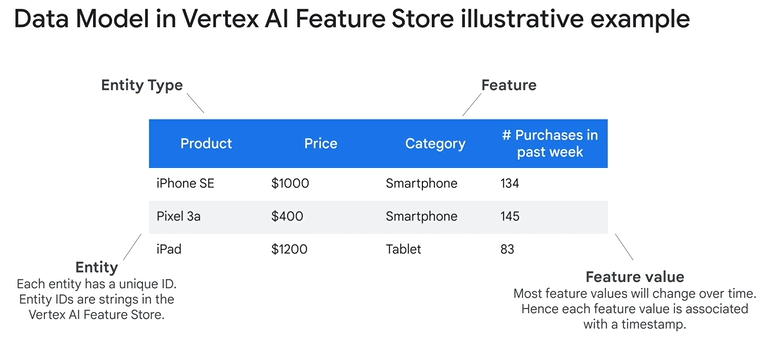

| Aspect | Details |
|--------|---------|
| **Core Purpose** | Centralized repository to store, manage, and retrieve features with versioning and consistency guarantees |
| **Problem It Solves** | Training-serving skew (different features at train vs. inference time) |
| **Key Benefit** | Single source of truth for all features; reusable across projects and models |
| **Data Organization** | Organized into Feature Repositories → Entities → Feature Views |

---

## Why Do We Need Feature Store?

**Problems Without Feature Store:**

| Problem | Impact | Example |
|---------|--------|---------|
| **Training-Serving Skew** | Model trained on one set of features, served with different features → wrong predictions | Train: user age from Jan 2024, Serve: age from May 2024 (different time windows) |
| **Feature Duplication** | Each team reimplements same logic, creating inconsistencies | 3 teams compute "customer_lifetime_value" differently → models trained on conflicting data |
| **Data Staleness** | Features computed once, never updated → model predictions degrade as data changes | Recommendation model uses 6-month-old user preferences |
| **Latency in Serving** | Features computed on-the-fly during inference → slow predictions | Real-time predictions require 500ms feature computation → violates 100ms SLA |
| **No Feature Lineage** | Don't know which features went into which model for debugging | Model accuracy drops 5% → can't trace back to feature changes |
| **Compliance Risk** | Features stored in multiple places; hard to audit and control access | PII data scattered across databases → GDPR compliance violation |

**Solution: Centralized Feature Store**

| Benefit | How It Helps |
|---------|-------------|
| **Consistency** | Train and serve use identical features from same source |
| **Reusability** | One feature shared across 10+ models; update once, applies everywhere |
| **Performance** | Pre-compute features offline; serve in <100ms at prediction time |
| **Versioning** | Track which features trained which model; rollback if needed |
| **Governance** | Single point of access control, auditing, and compliance |

---

## How Feature Store Works (Architecture)

```
┌─────────────────────────────────────────────────────────────────────────┐
│                        VERTEX AI FEATURE STORE                          │
└─────────────────────────────────────────────────────────────────────────┘

┌──────────────────────────────────────────────────────────────────────┐
│ OFFLINE FEATURE COMPUTATION (Batch)                                  │
│                                                                       │
│  Raw Data Sources                                                    │
│  ├─ Cloud Storage / BigQuery / Dataflow                             │
│  └─ External APIs / Databases                                       │
│          ↓                                                            │
│  Feature Engineering (Transformations)                               │
│  ├─ ML.STANDARD_SCALER(age)                                         │
│  ├─ CONCAT(first_name, last_name) → full_name                      │
│  └─ SUM(purchases) OVER time window → lifetime_value                │
│          ↓                                                            │
│  Materialization (Pre-compute & store)                               │
│  ├─ Write to BigTable (fast reads)                                  │
│  └─ Cache in memory for <100ms lookup                               │
│          ↓                                                            │
│  Feature Store (Vertex AI FeatureStore Service)                      │
│  ├─ Entity: Customer (ID = 12345)                                   │
│  ├─ Features:                                                        │
│  │   ├─ age: 35                                                      │
│  │   ├─ lifetime_value: $5,000                                      │
│  │   ├─ last_purchase_date: 2024-07-01                              │
│  │   └─ Version: v2 (timestamp: 2024-07-13T10:00:00Z)              │
│  └─ TTL: 30 days (auto-cleanup)                                    │
└──────────────────────────────────────────────────────────────────────┘
         │
         ├───────────────────────────────────────────┬─────────────────┐
         ↓                                           ↓                 ↓
    ┌─────────────────────┐     ┌──────────────────────┐  ┌──────────────────┐
    │ TRAINING PIPELINE   │     │ SERVING PIPELINE     │  │ BATCH INFERENCE  │
    │ (Model Development) │     │ (Real-time)          │  │ (Batch Jobs)     │
    │                     │     │                      │  │                  │
    │ 1. Request features │     │ 1. Client request    │  │ 1. Load batch    │
    │    for customer 123 │     │    prediction for    │  │    of entity IDs  │
    │    from store       │     │    customer 123      │  │ 2. Fetch features│
    │                     │     │ 2. Fetch features    │  │    in bulk        │
    │ 2. Retrieve:        │     │    from store        │  │ 3. Create        │
    │    age: 35          │     │ 3. Load model        │  │    feature matrix │
    │    LTV: $5,000      │     │ 4. Predict           │  │ 4. Score all     │
    │    last_purchase:   │     │ 5. Return result     │  │    entities      │
    │    2024-07-01       │     │    <50ms             │  │ 5. Write to BQ   │
    │                     │     │                      │  │                  │
    │ 3. Train model      │     └──────────────────────┘  └──────────────────┘
    │    on 1M records    │
    │ 4. Log version      │
    │    features_v2      │
    └─────────────────────┘
```

---

## Feature Store Components

| Component | Purpose | Example |
|-----------|---------|---------|
| **Feature Repository** | Top-level container for all features across projects | `online-retail-features` |
| **Entity** | The subject of features (customer, product, account) | Customer ID: 12345 |
| **Feature View** | Logical group of related features for an entity | `customer_demographics` (age, gender, location), `customer_behavior` (purchases, clicks) |
| **Feature** | Individual computed/raw attribute | `lifetime_value`, `average_order_amount`, `churn_risk_score` |
| **Online Store** | Low-latency store (BigTable) for real-time serving | <100ms lookup per entity |
| **Offline Store** | High-volume store (BigQuery) for training data export | Query 1M features in minutes |
| **Snapshot** | Point-in-time feature values for training set | Features as of 2024-07-01 10:00:00 UTC |

---

## Feature Store Hierarchy & Relationships

### Correlation: Feature Store → Entity → Entity Type → Feature View

```
┌─────────────────────────────────────┐
│     FEATURE STORE                   │  (Container for all features)
│  (online-retail-features)           │
│                                     │
│  ┌─────────────────────────────┐   │
│  │ ENTITY TYPE                 │   │  (Schema defining entity structure)
│  │ (Customer)                  │   │  ├─ Primary Key: customer_id
│  │                             │   │  ├─ Value Type: STRING/INT
│  │                             │   │  └─ Description
│  │                             │   │
│  │  ┌─────────────────────┐    │   │
│  │  │ ENTITY INSTANCE     │    │   │  (Actual data record)
│  │  │ customer_id: 12345  │    │   │  ├─ Each entity = unique customer
│  │  │ customer_id: 67890  │    │   │  ├─ Can have multiple entities
│  │  │ customer_id: 11111  │    │   │  └─ Linked to Feature View(s)
│  │  │ ...                 │    │   │
│  │  └─────────────────────┘    │   │
│  │         ↓ (multiple)         │   │
│  │  ┌─────────────────────┐    │   │
│  │  │ FEATURE VIEW 1      │    │   │  (Logical feature grouping)
│  │  │ customer_demographics│   │   │  ├─ age, gender, location
│  │  │ (joined from sources)│   │   │  ├─ One entity per row
│  │  └─────────────────────┘    │   │  └─ Linked via entity_id
│  │         ↓                    │   │
│  │  ┌─────────────────────┐    │   │
│  │  │ FEATURE VIEW 2      │    │   │  (Another feature grouping)
│  │  │ customer_behavior   │    │   │  ├─ purchases, clicks, ltv
│  │  │ (from events)       │    │   │  └─ Same entity instances
│  │  └─────────────────────┘    │   │
│  └─────────────────────────────┘   │
└─────────────────────────────────────┘
```

### Key Relationships Explained

| Relationship | Definition |
|-------------|-----------|
| **Feature Store** | Logical container at project level; holds all entities and feature views |
| **Entity Type** | Schema/definition of what an entity is (e.g., Customer with customer_id as PK) |
| **Entity (Instance)** | Actual data record identified by entity ID (e.g., customer_id = 12345) |
| **Feature View** | Logical collection of features for the **same entity type**; multiple feature views can reference the same entities. **Data source where feature is pulled(BigQuery etc)** |
| **Multiple Entities** | ✅ **YES** — One Feature Store can contain MULTIPLE entity types (Customer, Product, Account, etc.) and MULTIPLE instances of each |

### Can Multiple Entity Types be Present in 1 Feature Store?

**✅ YES - Absolutely!** A single Feature Store can contain:

- **Multiple Entity Types**: Customer, Product, Account, Merchant, etc.
- **Multiple Entity Instances**: 1M+ customer records, 100K products, etc.
- **Multiple Feature Views per Entity Type**: `customer_demographics`, `customer_behavior`, `customer_transactions`
- **Cross-Entity Feature Engineering**: Join features from different entities (e.g., customer + product features for recommendation model)

**Example**:
```
Feature Store: "ecommerce-platform"
├── Entity Type: Customer
│   ├── Feature View: customer_profile (age, country, tier)
│   ├── Feature View: customer_purchase_history (ltv, frequency, recency)
│   └── Entities: customer_id 12345, 67890, 11111, ... (1M+)
├── Entity Type: Product
│   ├── Feature View: product_info (category, price, rating)
│   ├── Feature View: product_popularity (views, purchases, trend)
│   └── Entities: product_id p001, p002, p003, ... (100K+)
└── Entity Type: Merchant
    ├── Feature View: merchant_stats (sales, rating, reviews)
    └── Entities: merchant_id m001, m002, ... (10K+)
```

---

## Step-by-Step Configuration in GCP

### Step 1: Create Feature Repository

**Purpose**: Container for all features in your project.

**GCP Configuration**:
```bash
# Create Feature Repository
gcloud ai feature-stores create \
  --display-name="online-retail-features" \
  --location=us-central1 \
  --region=us-central1

# List repositories
gcloud ai feature-stores list --location=us-central1
```

**Code Example (Python SDK)**:
```python
from google.cloud import aiplatform

# Initialize AI Platform
aiplatform.init(project='your-project', location='us-central1')

# Create feature store
feature_store = aiplatform.FeatureStore.create(
    display_name='online-retail-features',
    online_store_type='bigtable'  # for real-time serving
)
```

---

### Step 2: Create Entity Type

**Purpose**: Define the entity (customer, product, account) your features describe.

**GCP Configuration**:
```bash
# Create Entity Type: Customer
gcloud ai entity-types create customer \
  --feature-store=online-retail-features \
  --location=us-central1 \
  --display-name="Customer Entity"

# Create Entity Type: Product
gcloud ai entity-types create product \
  --feature-store=online-retail-features \
  --location=us-central1 \
  --display-name="Product Entity"
```

**Code Example (Python SDK)**:
```python
from google.cloud import aiplatform

feature_store = aiplatform.FeatureStore(name='online-retail-features')

# Create Customer entity type
customer_entity = feature_store.create_entity_type(
    entity_type_id='customer',
    description='Customer entity for retail features'
)

# Create Product entity type
product_entity = feature_store.create_entity_type(
    entity_type_id='product',
    description='Product entity for retail features'
)
```

---

### Step 3: Create Feature View (Offline Source)

**Purpose**: Define features and their source (BigQuery, Cloud Storage).

**Auto-Sync (Automatic Updates):**
| Aspect | Details |
|--------|---------|
| **How It Works** | Set a `cron` schedule (e.g., daily at 12 AM) → Feature Store automatically queries BigQuery on that schedule |
| **Data Changes** | If BQ data changes between syncs, those changes are **NOT** reflected until next scheduled sync |
| **Manual Sync** | You can also trigger sync anytime manually via CLI or API |
| **Setup** | `sync_config=cron='0 0 * * *'` during Feature View creation |
| **Best For** | Batch updates (daily/hourly) when real-time updates not needed |

**Key Point:** Feature View is just a **definition** of where data comes from. Syncing is a **separate process** that pulls data from BQ into Feature Store's online store.

**GCP Configuration**:
```bash
# Define features from BigQuery source
cat > feature_view_config.yaml <<EOF
bigquery_source:
  input_uri: "bq://your-project.retail_dataset.customer_features"
entity_id_column: "customer_id"
feature_columns:
  - name: "age"
    value_type: INT64
  - name: "lifetime_value"
    value_type: FLOAT
  - name: "last_purchase_date"
    value_type: STRING
  - name: "is_vip"
    value_type: BOOL
EOF

# Create Feature View
gcloud ai feature-views create customer_demographics \
  --feature-store=online-retail-features \
  --location=us-central1 \
  --config=feature_view_config.yaml \
  --entity-type=customer
```

**Code Example (Python SDK)**:
```python
from google.cloud.aiplatform import FeatureStore
from google.cloud.aiplatform_v1 import FeatureView, BigQuerySource

feature_store = aiplatform.FeatureStore(name='online-retail-features')
customer_entity = feature_store.entity_type('customer')

# Define offline source (BigQuery)
offline_source = BigQuerySource(
    uri='bq://your-project.retail_dataset.customer_features'
)

# Create Feature View
feature_view = customer_entity.create_feature_view(
    feature_view_id='customer_demographics',
    big_query_source=offline_source,
    sync_config=aiplatform.FeaturestoreSyncConfig(
        cron='0 0 * * *'  # Daily sync at midnight UTC
    )
)
```

---

### Step 4: Ingest Features (Offline → Online Store)

**Purpose**: Materialize offline features to online store for real-time serving.

---

#### **Offline vs Online Store Architecture**

| Aspect | Offline Store (BigQuery) | Online Store (BigTable) |
|--------|--------------------------|------------------------|
| **Storage** | BigQuery (data warehouse) | BigTable (NoSQL, columnar) |
| **Use Case** | Historical data for training | Real-time serving (<100ms) |
| **Default State** | ✓ Features live here by default | ✗ Empty until synced |
| **Data Freshness** | Hours/days old (batch) | Minutes old (scheduled sync) |
| **Latency** | Seconds-minutes (query) | <100ms (direct lookup) |
| **Access Pattern** | Join & aggregate 1M rows | Lookup 1 entity ID |
| **Cost** | Pay per query | Pay per throughput |

**Key Insight**: Feature Store is **offline-first**. Online store must be explicitly populated via sync.

---

#### **How Latest Data is Fetched**

**Timeline Example (Daily Sync at Midnight UTC)**:
```
Day 1, 11:59 PM: BigQuery updated with new purchase data
         ↓
Day 2, 12:00 AM: Sync job triggers (cron: 0 0 * * *)
         ↓
Day 2, 12:05 AM: Online Store (BigTable) refreshed with new features
         ↓
Day 2, 12:30 PM: Serving reads latest features from online store
```

**Between Syncs**: Features in online store are **stale** (from last sync).

---

#### **How to Keep Data Fresh**

| Strategy | Frequency | Freshness | Use Case |
|----------|-----------|-----------|----------|
| **Scheduled Sync** | Daily (cron) | 24 hours old | E-commerce, batch recommendations |
| **Hourly Sync** | Hourly (cron) | 1 hour old | Real-time dashboards, fraud detection |
| **On-Demand Sync** | Manual trigger | Real-time | Critical updates, before campaign launch |
| **Streaming Ingest** | Continuous | <1 minute old | High-frequency trading, IoT |

---

**GCP Configuration**:
```bash
# Trigger one-time import from BigQuery to online store (immediate)
gcloud ai feature-views sync \
  --feature-store=online-retail-features \
  --feature-view=customer_demographics \
  --location=us-central1 \
  --entity-type=customer

# Schedule daily sync at midnight UTC
gcloud ai feature-views update customer_demographics \
  --feature-store=online-retail-features \
  --sync-frequency="0 0 * * *"  # Cron: daily
```

**Code Example (Python SDK)**:
```python
from datetime import datetime

feature_view = customer_entity.get_feature_view('customer_demographics')

# Manual sync (one-time, immediate ingestion)
sync_response = feature_view.sync()
print(f"Sync job ID: {sync_response.name}")

# Or configure automatic daily sync
feature_view.update(
    cron='0 0 * * *'  # Every day at midnight UTC
)

# Check sync status
sync_status = feature_view.get_sync_jobs(limit=1)
print(f"Last sync: {sync_status[0].create_time}")
print(f"Status: {sync_status[0].state}")  # SUCCEEDED, RUNNING, FAILED
```

**Output**:
```
Sync job ID: projects/123456/locations/us-central1/featureStores/my-store/featureViews/customer_demographics/syncJobs/1720876800
Last sync: 2024-07-13 12:00:00 UTC
Status: SUCCEEDED
```

---

### Step 5: Retrieve Features for Training

**Purpose**: Export features from offline store for model training.

**GCP Configuration**:
```bash
# Export features to BigQuery for training
gcloud ai feature-views export \
  --feature-store=online-retail-features \
  --feature-view=customer_demographics \
  --location=us-central1 \
  --entity-type=customer \
  --destination="bq://your-project.training_dataset.customer_features_snapshot" \
  --read-instances-uri="bq://your-project.training_dataset.customer_list" \
  --export-format=PARQUET \
  --destination-uri="gs://your-bucket/exported_features/"
```

**Code Example (Python SDK)**:
```python
import pandas as pd

# Get feature values for a list of customer IDs
customer_ids = ['cust_001', 'cust_002', 'cust_003']

# Option 1: Batch export to BigQuery
training_features = feature_view.read(
    read_instances_uri='bq://your-project.training_dataset.customer_list',
    as_of_time=datetime(2024, 7, 1)  # Point-in-time snapshot
)
training_features.to_csv('training_features.csv')

# Option 2: Fetch features as DataFrame
df_features = pd.read_csv(training_features.path)
print(df_features.head())
```

**Expected Output**:
```
customer_id  age  lifetime_value  last_purchase_date  is_vip  timestamp
cust_001     35   5000.50         2024-07-01          True    2024-07-01 10:00:00
cust_002     28   1200.25         2024-06-15          False   2024-07-01 10:00:00
cust_003     42   8500.75         2024-07-05          True    2024-07-01 10:00:00
```

---

### Step 6: Retrieve Features for Real-Time Serving

**Purpose**: Fetch features in <100ms for online predictions.

**GCP Configuration**:
```bash
# No explicit command; features auto-serve from online store
# Use in your prediction endpoint
```

**Code Example (Python SDK - During Inference)**:
```python
from google.cloud import aiplatform
import json

# Initialize Vertex AI
aiplatform.init(project='your-project', location='us-central1')

# Load serving function
def get_customer_features(customer_id):
    """Fetch features for a customer in <100ms"""
    feature_store = aiplatform.FeatureStore(name='online-retail-features')
    entity_type = feature_store.entity_type('customer')
    
    # Read from online store (BigTable)
    features = entity_type.read(
        entity_ids=[customer_id],
        feature_view='customer_demographics'
    )
    return features

# Make prediction with served features
customer_id = 'cust_001'
customer_features = get_customer_features(customer_id)

print(json.dumps(customer_features, indent=2))
# Output:
# {
#   "customer_id": "cust_001",
#   "age": 35,
#   "lifetime_value": 5000.50,
#   "last_purchase_date": "2024-07-01",
#   "is_vip": true,
#   "timestamp": "2024-07-13T14:30:00Z"
# }

# Use features in model
predictions = model.predict(
    instances=[customer_features]
)
print(f"Churn risk: {predictions[0]}")  # Output: 0.15 (15% churn risk)
```

---

### Step 7: Monitor Feature Quality & Drift

**Purpose**: Track feature statistics and detect anomalies.

**GCP Configuration**:
```bash
# Set up monitoring for feature values
gcloud ai feature-views monitor \
  --feature-store=online-retail-features \
  --feature-view=customer_demographics \
  --location=us-central1 \
  --threshold=0.1  # Alert if drift > 10%
```

**Code Example (Python SDK - Monitoring Script)**:
```python
from google.cloud import aiplatform
from datetime import datetime, timedelta

feature_view = customer_entity.get_feature_view('customer_demographics')

# Get statistics on feature values
def monitor_feature_drift():
    # Baseline: training data statistics
    baseline_stats = {
        'age': {'mean': 35.5, 'std': 12.3, 'min': 18, 'max': 80},
        'lifetime_value': {'mean': 3500.0, 'std': 2100.0}
    }
    
    # Current: serving data statistics (last 24 hours)
    current_data = feature_view.read(
        read_instances_uri='bq://your-project.monitoring.recent_features',
        as_of_time=datetime.now() - timedelta(hours=24)
    )
    
    current_stats = {
        'age': {
            'mean': current_data['age'].mean(),
            'std': current_data['age'].std(),
            'min': current_data['age'].min(),
            'max': current_data['age'].max()
        }
    }
    
    # Compute drift (e.g., Kolmogorov-Smirnov test)
    from scipy.stats import ks_2samp
    
    baseline_ages = list(range(18, 81))  # Example
    current_ages = current_data['age'].tolist()
    
    ks_stat, p_value = ks_2samp(baseline_ages, current_ages)
    
    if p_value < 0.05:
        print(f"⚠️  DRIFT DETECTED in 'age' feature! p-value: {p_value}")
        print(f"   Baseline mean: {baseline_stats['age']['mean']}")
        print(f"   Current mean: {current_stats['age']['mean']}")
        # Trigger retraining
    else:
        print(f"✓ No drift detected in 'age' feature (p-value: {p_value})")

monitor_feature_drift()
```

---

## Feature Store vs. Manual Feature Engineering

| Aspect | Feature Store | Manual Engineering |
|--------|---------------|-------------------|
| **Consistency** | Same features train & serve | Risk of skew between environments |
| **Reusability** | One feature, shared across 100 models | Each team reimplements logic |
| **Serving Speed** | <100ms (pre-computed, cached) | Seconds (compute on-the-fly) |
| **Versioning** | Full history, rollback possible | Scattered across code repos |
| **Data Quality** | Central monitoring & validation | Hard to audit |
| **Maintenance** | Update once, applies everywhere | Update in 10 different places |
| **Compliance** | Single point of access control | PII scattered, hard to govern |
| **Cost** | Higher upfront (infrastructure) | Lower initial, higher long-term |

**When to Use Feature Store:**
- ✓ Large-scale ML systems (100+ models)
- ✓ Real-time serving requirements (<100ms)
- ✓ Compliance/governance needs
- ✓ Multiple teams sharing features
- ✓ High-frequency model retraining

**When Manual Engineering Suffices:**
- ✓ Small teams with 1-5 models
- ✓ Batch serving only (offline predictions)
- ✓ Simple features (no complex logic)
- ✓ Prototype/MVP phase

---

## Complete Feature Store Workflow Example

```
┌─────────────────────────────────────────────────────────────────┐
│               E2E Feature Store Workflow                         │
└─────────────────────────────────────────────────────────────────┘

DAY 1: Setup & Ingestion
├─ Step 1: Create Feature Repository (online-retail-features)
├─ Step 2: Create Entity Type (customer, product)
├─ Step 3: Define Feature View (customer_demographics from BigQuery)
├─ Step 4: Ingest to Online Store (BigTable for serving)
└─ Timestamp: 2024-07-01 00:00:00 UTC

DAY 2-30: Model Training
├─ Step 5: Export features from offline store for training
│          → Get snapshot: customer_demographics as of 2024-07-01
│          → 100k rows × 4 features = training matrix
├─ Train model on exported features
├─ Log feature version used: customer_demographics_v1
└─ Accuracy: 92%

DAY 31+: Production Serving
├─ Deploy model to Vertex AI Endpoint
├─ Step 6: Retrieve features in real-time (<100ms)
│          → Client: "Predict churn for customer_001"
│          → Feature Store: Return [age: 35, LTV: $5k, ...]
│          → Model: Output churn_risk = 0.15
├─ Step 7: Monitor feature drift
│          → Daily check: Compare serving features vs. training baseline
│          → Alert if drift detected
└─ If drift > 10%: Trigger retraining → Back to Step 5

Benefits Achieved:
✓ No training-serving skew (same features everywhere)
✓ <100ms serving latency (pre-computed, cached)
✓ Reusability (same features for 50+ models)
✓ Full audit trail (who used what features when)
✓ Easy rollback (revert to previous feature version)
```

---

## Feature Store Architecture Diagram

```
┌────────────────────────────────────────────────────────────────────┐
│              VERTEX AI FEATURE STORE ARCHITECTURE                  │
└────────────────────────────────────────────────────────────────────┘

DATA SOURCES                FEATURE STORE              CONSUMERS
├─ BigQuery                 ┌──────────────┐          ├─ Training
├─ Cloud Storage            │ Online Store │          ├─ Serving
├─ APIs                     │ (BigTable)   │          ├─ Batch Inference
└─ Databases      ─────────→│ <100ms       │   ─────→ └─ Analytics
                             └──────────────┘
                                   ↑
                             (Real-time lookup)
                                   
OFFLINE COMPUTE             Feature Repository        TRAINING
├─ Dataflow / Spark         ┌──────────────────────┐  ├─ Export snapshot
├─ BigQuery / Dataproc      │ Customer              │  ├─ Train model
└─ Custom Jobs   ─────────→ │  └─ Demographics     │─→ ├─ Log versions
                             │  └─ Behavior         │   └─ Register model
                             │  └─ Purchases        │
                             │                      │
                             │ Product              │
                             │  └─ Pricing          │
                             │  └─ Inventory        │
                             └──────────────────────┘

MONITORING & GOVERNANCE
├─ Drift Detection (KS test, statistical)
├─ Data Validation (schema, ranges)
├─ Access Control (who can read which features)
├─ Audit Logging (what, when, who, why)
└─ Versioning (rollback capability)
```

---

## Joining Multiple Entities for Training

**Scenario**: Train a model using features from 2 entities (users + products).

```python
from google.cloud import aiplatform
import pandas as pd

project_id = "your-project"
region = "us-central1"
featurestore_id = "your-featurestore"

# 1. Retrieve features from Entity 1 (Users)
user_features = aiplatform.FeatureStore.read_feature_values(
    featurestore_name=f"projects/{project_id}/locations/{region}/featurestores/{featurestore_id}",
    entity_type="users",
    entity_ids=["user_001", "user_002", "user_003"],
    feature_selector=['age', 'purchase_count']
)

# 2. Retrieve features from Entity 2 (Products)  
product_features = aiplatform.FeatureStore.read_feature_values(
    featurestore_name=f"projects/{project_id}/locations/{region}/featurestores/{featurestore_id}",
    entity_type="products",
    entity_ids=["prod_101", "prod_102", "prod_103"],
    feature_selector=['category', 'price']
)

# 3. Join on common keys (user_id, product_id from events table)
events = pd.read_csv('gs://bucket/events.csv')  # Contains: user_id, product_id, label

# Merge all three
training_data = events.merge(
    user_features[['user_id', 'age', 'purchase_count']], 
    on='user_id'
).merge(
    product_features[['product_id', 'category', 'price']], 
    on='product_id'
)

print(f"Training data: {training_data.shape}")  # (N rows, 7 features)
# Ready for model training!
```

**Key Points:**
- ✓ Call `read_feature_values()` separately for each entity
- ✓ Join on entity IDs (user_id, product_id)
- ✓ Event table provides the join keys + label
- ✓ No training-serving skew (same features everywhere)

---

## Purpose of Timestamps in Feature Store

**Timestamps answer: "What features did this entity have at time T?"**

| Purpose | Example | Prevents |
|---------|---------|----------|
| **Point-in-time correctness** | Training: Use features as of 2024-07-01 10:00 AM | Future data leakage into training |
| **Training-serving consistency** | Model trained on features at T; served with features at T (no skew) | Skew: model prediction distribution differs from training |
| **Reproducibility** | Re-train model on exact same feature snapshot | Non-deterministic results when features change |
| **Debugging drift** | Compare feature stats (T=yesterday vs T=today) | Silent data quality degradation |

**Code Example**:
```python
# Training: Get features as they were on training date
training_features = feature_view.read(
    as_of_time=datetime(2024, 7, 1, 10, 0, 0)  # Exact snapshot
)

# Serving: Get latest features  
serving_features = feature_view.read(
    as_of_time=datetime.now()  # Current time
)
```

---

## Entity Versioning & Best Practices

| Practice | How | Why |
|----------|-----|-----|
| **Version Features** | Name: `customer_demographics_v1`, `v2`, etc. | Track breaking changes, rollback if needed |
| **Timestamp Everything** | Add `feature_timestamp` column | Point-in-time queries prevent leakage |
| **Separate Online/Offline** | Online: latest only; Offline: full history | Fast serving + historical accuracy |
| **Schema Contract** | Define required fields + data types | Catch breaking changes early |
| **Immutable Snapshots** | Tag training exports with version + date | Reproducibility & audit trail |
| **Deprecation Period** | 30-day notice before removing feature | Give teams time to migrate |
| **Monitoring** | Track feature staleness + null rates | Alert on data quality issues |
| **Entity ID Stability** | Never reuse or recycle IDs | Prevent data corruption |

**Quick Code:**
```python
# Tag features with version
feature_view = aiplatform.FeatureView(
    name="customer_demographics_v2",
    source_uri="bq://project.dataset.customer_table",
    sync_freq_secs=3600,
    # Created_time auto-tracked for lineage
)

# Export training data with metadata
snapshot = featurestore.batch_read_feature_values(
    csv_read_lines=[...],
    destination_uri="gs://bucket/training_export_v2_2024-07-14.csv"
)
```

-------------------

# GenAI

## LLM Quiz

1. What are some of the applications of LLMs?

- [ ] LLMs can be used for many tasks such as making real-time decisions in emergency situations and generating content based on physical perceptions.
- [ ] LLMs can be used for many tasks, including personalized advice and therapy.
- [x] LLMs can be used for many tasks, including writing, translating, and coding.
- [ ] LLMs can be used for many tasks, including original creative expression and ethical decision making.

2. What are large language models (LLMs)?:
- [ ] An LLM is an artificial neural network architecture optimized for training large-scale reinforcement learning agents capable of mastering complex tasks in robotics.
- [x] An LLM is a type of artificial intelligence (AI) that can generate human-quality text. LLMs are trained on massive datasets of text and code, and they can be used for many tasks, such as writing, translating, and coding.
- [ ] An LLM is an advanced natural language processing framework that uses linguistic algorithms to generate sophisticated conversational agents.
- [ ] An LLM is a state-of-the-art computer vision system that excels in recognizing and analyzing intricate patterns and features in images and videos.

3.What is a benefit of using large language models (LLMs)?

- [ ] They can be trained using only a tiny dataset of text and code.
- [ ] They can generate inaccurate or misleading content if their training data is incomplete or biased.
- [x] They can generate human-quality text for tasks such as content creation, writing assistance, and automatic summarization.
- [ ] They can only provide output in the English language.

4. What are some of the challenges of using LLMs? Select three options.

- [ ] After being developed, they only change when they are fed new data.
- [x] They can be expensive to train.
- [x] They can be biased.
- [x] They can be used to generate harmful content.

----------

## MLOps

### QUIZ

1.A data science team is struggling to manage the lifecycle of their machine learning models from development to deployment. They face challenges with inconsistent model performance, difficulty tracking model versions, and a lack of collaboration between team members. Which of the following best describes how adopting an MLOps approach with Vertex AI could address these issues?

- [ ] MLOps with Vertex AI would primarily focus on automating model training, but wouldn't address versioning or collaboration challenges.
- [x] MLOps with Vertex AI would provide a structured framework for managing the entire ML lifecycle, promoting collaboration, enabling version control, and improving model performance consistency.
- [ ] MLOps with Vertex AI would only help with model deployment, not addressing issues like inconsistent performance or collaboration.
- [ ] MLOps with Vertex AI would mainly focus on model evaluation, neglecting other crucial aspects like deployment and monitoring.


2.An ML engineer is developing a customer churn prediction model. During model evaluation, they notice the model performs exceptionally well on the training data but poorly on new, unseen data. Which of the following concepts best describes this issue?

- [x] Overfitting
- [ ] Bias-variance tradeoff
- [ ] Data shift
- [ ] Generalization


3.You're working on a machine learning project and need to evaluate your model's performance. Which of the following scenarios would benefit from using Vertex AI's model evaluation service? Select all that apply.

- [ ] You want to get detailed feedback from users about the quality and relevance of your model's predictions.
- [x] You need to monitor your deployed model's performance over time and detect potential issues like concept drift.
- [x] You have a large dataset and need to compare multiple model versions to find the best one.
- [x] You are concerned that your model may be overfitting to your training data and want to assess its performance on unseen data.

4.An ML engineer is working on a large-scale project that involves training multiple machine learning models. They are evaluating a new model and want to ensure it can adapt to changes in real-world data over time. Which of the following evaluation strategies should the engineer prioritize?

- [ ] Cross-validation to assess the model's average performance across multiple data folds.
- [ ] Leave-one-out cross-validation to assess the model's performance by leaving out each data point and retraining.
- [ ] Holdout validation to assess the model's performance on a single, fixed dataset.
- [x] Continuous evaluation to monitor model performance on new data after deployment and retrain as needed.

-------------

### LLM Evaluation

#### 1. **Lexical Similarity**
- **Type**: Reference-based metric (compares output to expected answer)
- **Definition**: Measures text overlap between generated output and reference answer using word matches
- **Beginner Context**: If model outputs "The capital of France is Paris" and reference is "Paris is the capital of France", it finds matching words (capital, France, Paris)

**Lexical Similarity Metrics:**

| Metric | How It Works | Example | Use Case |
|--------|-------------|---------|----------|
| **BLEU** (Bilingual Evaluation Understudy) | Counts matching n-grams (unigrams, bigrams, trigrams) between output & reference. Score 0-1 (1 = perfect match) | Reference: "The cat sat on the mat"<br/>Output: "The cat sat on mat"<br/>BLEU = 4/5 matching words = 0.8 | Machine translation, text generation |
| **ROUGE** (Recall-Oriented Understudy for Gisting Evaluation) | Focuses on **recall** (coverage of reference words in output). Variants: ROUGE-N (n-grams), ROUGE-L (longest common subsequence) | Reference: "Machine learning is powerful"<br/>Output: "Machine learning is amazing"<br/>ROUGE-1 = 3/4 matching words = 0.75 (recall) | Summarization, abstractive generation |
| **METEOR** (Metric for Evaluation of Translation with Explicit Ordering) | Matches words + considers synonyms + word order. More lenient than BLEU, closer to human judgment | Reference: "The movie was excellent"<br/>Output: "The film was great"<br/>METEOR recognizes: film=movie (synonym), great≈excellent → Higher score than BLEU | Translation, paraphrasing |
| **BLEURT** (Learned Evaluation Metric) | Uses a **pre-trained neural network** to evaluate quality like humans do. Learns from human judgments, captures semantic similarity beyond word overlap | Reference: "The movie was excellent"<br/>Output: "That film was amazing"<br/>BLEURT = 0.92 (recognizes semantic equivalence; highest among all metrics)<br/>✓ Understands meaning, not just words | All NLG tasks (translation, summarization, dialogue, Q&A) |

**Quick Example (Translation Task):**
```
Reference (Expected): "I love machine learning"
Model Output: "I adore machine learning"

BLEU Score: 2/4 = 0.5 (only "I" and "machine learning" match exactly)
ROUGE Score: 2/4 = 0.5 (recall-based)
METEOR Score: 4/4 = 1.0 (recognizes "adore" = synonym of "love")
             ↑ Closest to human judgment!
```

**Key Differences:**
- **BLEU**: Strict word matching (penalizes synonyms) → Best for exact-match tasks
- **ROUGE**: Recall-focused (how much of reference is in output) → Best for summarization
- **METEOR**: Lenient with synonyms & word order → More human-like than BLEU
- **BLEURT**: **AI-powered evaluation** using neural networks; trained on human judgments → **Most human-like** (best overall)

**Comparison Example (Same Task):**
```
Reference: "Machine learning is powerful and important"
Output: "ML is very useful and critical"

BLEU:    0.25 (only 1/5 words match exactly)
ROUGE-1: 0.40 (40% word overlap)
METEOR:  0.60 (recognizes synonyms: ML≈Machine learning, critical≈important)
BLEURT:  0.89 (understands semantic equivalence; closest to human judgment)
```

**When to Use Each:**
| Metric | When to Use | Pros | Cons |
|--------|------------|------|------|
| BLEU | Exact matching needed | Fast, simple | Penalizes synonyms unfairly |
| ROUGE | Summarization focus | Good for recall | Ignores synonyms |
| METEOR | Translation & paraphrase | Handles synonyms | Still surface-level |
| BLEURT | Any NLG task; production use | Understands meaning like humans | Slower, requires GPU |

#### 2. **Linguistic Quality**
- **Type**: Reference-free metric (evaluates output alone)
- **Definition**: Assesses grammar, fluency, coherence, and clarity of generated text
- **Beginner Context**: A response "The cat sitting on mat" has poor linguistic quality vs. "The cat is sitting on the mat"

**Linguistic Quality Metrics:**

| Metric | What It Measures | Example | Score Interpretation |
|--------|-----------------|---------|----------------------|
| **Coherence** | Do sentences logically flow together? Does the text make sense as a whole? | ✓ Good: "I studied hard. As a result, I passed the exam."<br/>✗ Bad: "I studied hard. The sky is blue. Dogs can fly." | Higher = more logical flow<br/>0-1 scale or subjective (1-5 rating) |
| **Perplexity** | How **confused** is the model by the text? Lower = model is more confident the text is natural | ✓ Natural: "The weather is nice today" → Perplexity = 20<br/>✗ Unnatural: "Nice is weather the today" → Perplexity = 500 | Lower = better quality<br/>Score 0-∞ (no upper bound) |

**Detailed Examples:**

**Coherence Example:**
```
Text 1 (HIGH coherence):
"I wanted to learn Python. First, I watched tutorials. Then, I built projects. 
Now, I'm a proficient programmer."
✓ Logical progression: motivation → learning → practice → result

Text 2 (LOW coherence):
"I wanted to learn Python. The Eiffel Tower is in Paris. My dog is brown. 
I'm now a proficient programmer."
✗ Sentences jump randomly; no clear connection between ideas
```

**Perplexity Example (Language Model's Perspective):**
```
Sentence 1: "The cat sat on the mat"
Perplexity ≈ 15 (model very confident; common, natural English)

Sentence 2: "The cat sat on the mat's purple grandmother"
Perplexity ≈ 800 (model confused; rare/nonsensical word sequence)

Sentence 3: "Cat the on mat sat the"
Perplexity ≈ 2000 (model extremely confused; grammatically broken)

Formula: Perplexity = 2^(Cross-Entropy Loss)
Lower loss → Lower perplexity → Higher quality text
```

**Key Differences:**
- **Coherence**: Focuses on **logical flow & meaning** (semantic) → Human judgment or trained classifiers
- **Perplexity**: Focuses on **statistical likelihood** (syntactic) → Calculated from model's probability predictions
- **Together**: High coherence + Low perplexity = Excellent linguistic quality

#### 3. **Task-Specific Metrics**
- **Type**: Task-dependent metric
- **Definition**: Custom metrics designed for specific tasks (classification accuracy, F1-score for NLP tasks)
- **Example**: For translation: BLEU score; For summarization: ROUGE; For Q&A: Exact Match (EM)
- **Beginner Context**: Different tasks need different measuring sticks—you wouldn't use translation metrics to evaluate chatbot responses

#### 4. **Safety & Fairness**
- **Type**: Safety metric
- **Definition**: Evaluates if model avoids harmful, biased, or discriminatory outputs
- **Example**: Testing if model provides equal quality responses for different demographic groups; checking for toxic content
- **Beginner Context**: Ensuring a chatbot doesn't generate hate speech or perpetuate gender bias in job recommendations

#### 5. **Groundedness**
- **Type**: Factual correctness metric
- **Definition**: Measures if generated text is supported by source documents (no hallucinations)
- **Example**: If source says "AI was founded in 1956" and model outputs this, it's grounded; if model adds facts not in source, it's hallucinating
- **Beginner Context**: Checks if the model "makes things up" or sticks to what it actually knows from the given context

#### 6. **User-Centric Metrics**
- **Type**: Human evaluation metric
- **Definition**: Measures user satisfaction, usefulness, and alignment with human preferences
- **Example**: User ratings (1-5 stars), A/B testing comparing model outputs, user feedback surveys
- **Beginner Context**: Asking real users "Was this response helpful?" and collecting their ratings to see if model is actually useful in practice

### Evaluation Metrics

#### Pointwise Evaluation
- **Type**: Absolute quality scoring metric
- **Definition**: Evaluates each LLM output independently on an absolute scale (e.g., 1-5 rating) without comparing to other outputs
- **Example**: User asks "What is Python?", model responds, evaluator rates the response 4/5 based on its own merit (accuracy, clarity, completeness)
- **Use Case**: Single output quality checks, production monitoring, human raters scoring one response at a time
- **Beginner Context**: Think of it like giving a grade to a single student's answer without comparing it to other students' answers—each output gets judged on its own

#### Pairwise Evaluation
- **Type**: Comparative quality scoring metric
- **Definition**: Evaluates two LLM outputs side-by-side and determines which one is better based on a relative scale
- **Example**: User asks "Explain AI", model A and model B both respond, evaluator compares them and picks "Model A is better" or "Model B is better" or "they're equal"
- **Use Case**: A/B testing between models, ranking model improvements, identifying which approach produces better results, human preference evaluation
- **Beginner Context**: Like comparing two students' answers to pick which one is better—you need both answers side-by-side to make the judgment call

--------

### Evaluation Dataset

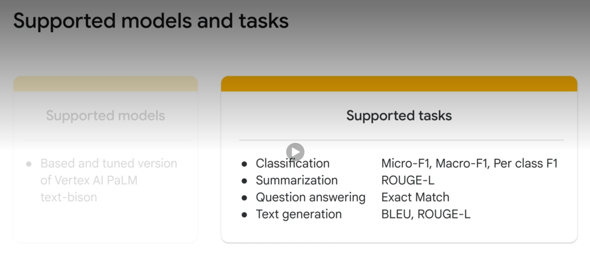

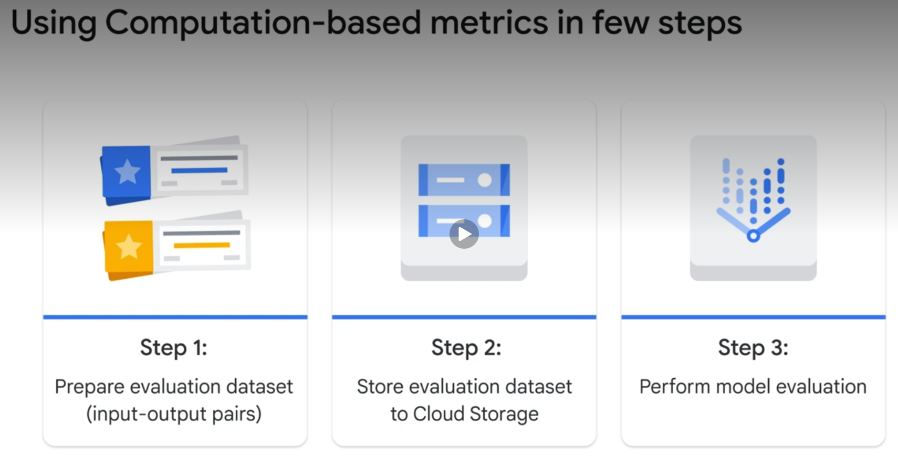

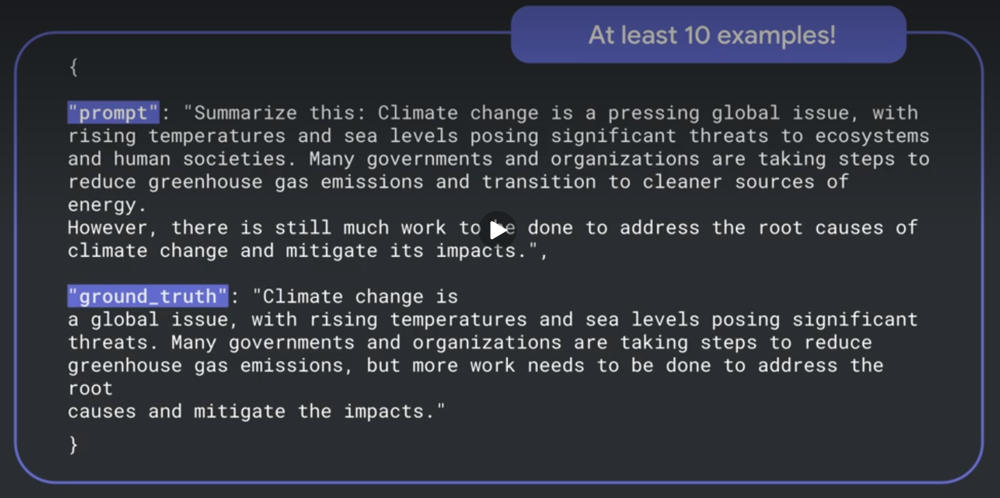

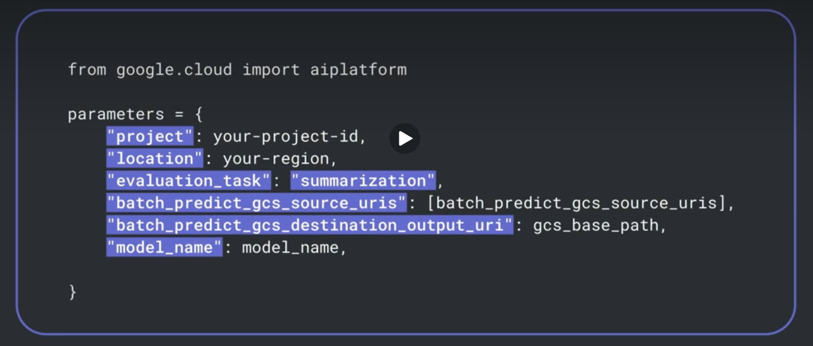

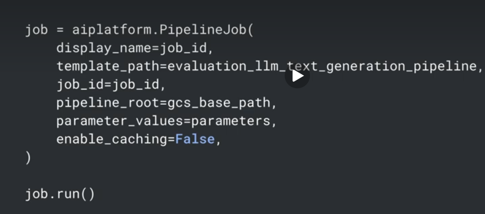

-------------

### Auto side-by-side(SxS) comparison

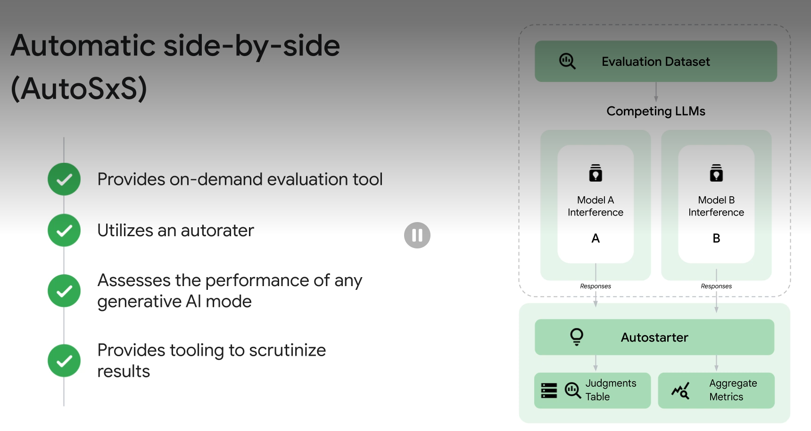

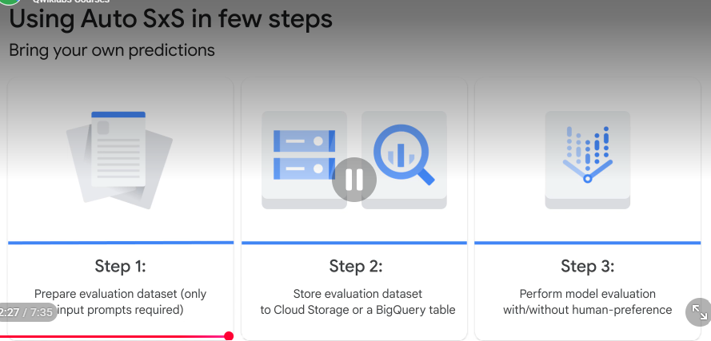

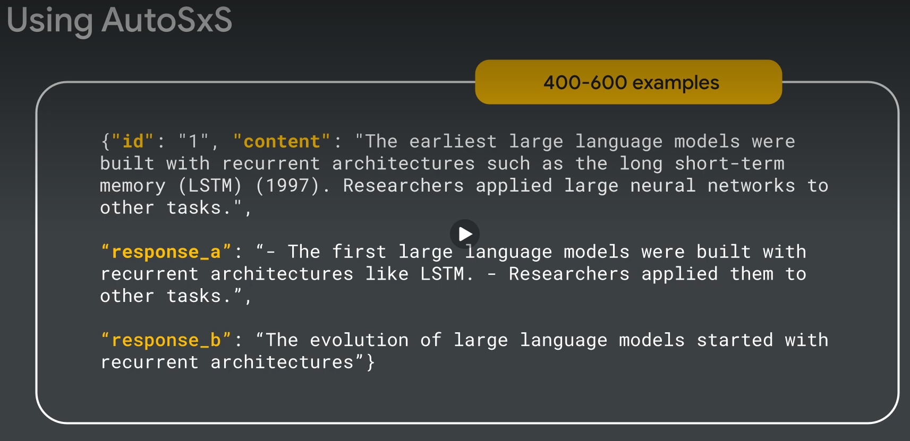

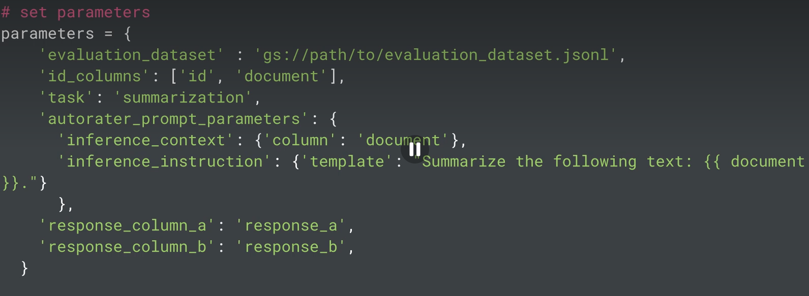

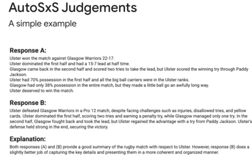

----------------
### Quiz


1.During the evaluation of an LLM, you find that the model often produces responses that sound fluent and grammatical but are factually incorrect. Which of the following evaluation challenges does this example illustrate?
- [ ] Lack of data
- [ ] Limited reference data
- [x] Model complexity and decision-making
- [ ] Data contamination


2.Which component of an LLM block is responsible for storing and retrieving past interactions with the model to provide context for future requests?
- [ ] Prompt templates
- [ ] Guardrails
- [x] Memory
- [ ] Data sources


3.You're tasked with evaluating multiple versions of a language model for summarizing news articles. You want to know which model produces the most informative and coherent summaries. Which evaluation type would be most appropriate?

- [ ] Multi-task evaluation: evaluate each model on additional tasks like question answering or text generation alongside summarization.
- [x] Ranking evaluation: have human evaluators rank the summaries from different models based on their overall quality.
- [ ] Numerical evaluation: calculate metrics like ROUGE or BLEU to measure the similarity between generated summaries and reference summaries.
- [ ] Binary evaluation: assign a simple pass or fail judgment to each summary based on basic criteria.


4.You're evaluating a language model designed to generate creative stories. Which of the following evaluation approaches would be most relevant? Select all that apply.


- [x] Calculating the perplexity of the model's output.
- [x] Assessing the diversity and originality of the generated stories.
- [ ] Using BLEU score to measure similarity to reference stories.
- [] Comparing the model's output to a standard grammar and syntax checker.

5.An ML engineer is tasked with selecting the best-performing image classification model from three candidates, all trained on the same dataset. Their primary goal is to understand how each model performs in real-world scenarios and identify areas for potential improvement. Which evaluation approach would be most effective for this initial assessment?
- [x] Pointwise evaluation, focusing on the absolute performance of each model and identifying its strengths and weaknesses.
- [ ] Multi-task evaluation, assessing each model's performance on a variety of image-related tasks beyond classification.
- [ ] Pairwise evaluation, comparing the performance of each model against the others on specific tasks.
- [ ] Binary evaluation, determining whether each model meets a pre-defined accuracy threshold.


6.When using evaluation methods like BLEU or ROUGE for LLM assessment, which of the following challenges is most likely to arise if the reference dataset is limited or biased?

- [x] The evaluation may underestimate the model's true capabilities because the reference data doesn't cover the full range of acceptable responses.
- [ ] The model may become vulnerable to adversarial attacks due to the insufficient diversity of the reference data.
- [ ] The model may require more computational resources for training to compensate for the limited reference data.
- [ ] The evaluation may overestimate the model's performance, as it's being compared against an artificially narrow set of outputs.


7.A company is using a generative AI model to write marketing copy. Which evaluation approach would help them ensure that the generated content is both creative and relevant to their target audience?

- [ ] Relying solely on human evaluation for a qualitative assessment.
- [ ] Focusing only on grammar and syntax s to ensure accuracy.
- [ ] Using only automated metrics like BLEU and ROUGE.
- [x] Combining automated metrics for diversity and relevance with human evaluation for creativity and brand alignment.
  
---------------------

## Create GenAI App


1.A chatbot is designed to answer customer questions using information from previous interactions. Which type of generative AI application is this an example of? Select two.
info
Note: To get credit for a multiple-select question, you must select all of the correct options and none of the incorrect ones.

- [ ] Semantic search
- [ ] Text-to-image AI generation
- [x] Domain-based conversations
  - **Explanation:** A chatbot that answers customer questions represents a domain-specific conversational AI. It's designed to operate within a specific domain (customer support) and engage in multi-turn conversations while maintaining context from previous interactions.
- [ ] Content creation
- [x] Retrieval augmented generation
  - **Explanation:** RAG is a technique where the AI system retrieves relevant information from previous interactions (a knowledge base or memory) and uses that information to augment its responses. This matches the description of a chatbot that uses "information from previous interactions" to answer questions.

2.What is the primary advantage of using a foundation model over building a custom AI model?
- [ ] Foundation models are guaranteed to be free of biases.
- [ ] Foundation models require less computational resources to train.
- [x] Foundation models can be easily adapted to various tasks without extensive retraining.
- [ ] Foundation models are always more accurate than custom models.

3.What is the term for incorrect or misleading results generated by an AI model?
- [ ] Bias
- [ ] Prompt injection
- [ ] Overfitting
- [x] Hallucination

4.Which of the following Google foundation models is used to convert between speech and text?
- [ ] Nano Banana
- [ ] Embeddings
- [x] Chirp
- [ ] Cloud Translation

5.Which of the following best describes the primary function of a generative AI model?
- [ ] To translate text between different languages.
- [ ] To analyze and interpret complex datasets.
- [ ] To store and retrieve large amounts of data.
- [x] To create new content based on learned patterns.

6.Which of the following are challenges associated with using generative AI in applications? Select two.

- [x] The potential for AI models to generate offensive or harmful content.
- [ ] The need for specialized hardware to run generative AI models effectively.
- [ ] Ensuring the completeness of data used by foundation models.
- [x] The expense of building and training custom models.
- [ ] The limited availability of pre-trained foundation models.

7.Which of the following is an example of using generative AI for content creation?
- [ ] An AI-powered search engine retrieving relevant documents.
- [ ] An AI model summarizing a lengthy research paper.
- [ ] A chatbot answering customer questions based on previous interactions.
- [x] An AI system generating product descriptions based on product images and manuals.

8.What type of model is Gemini?
- [ ] A text embeddings model
- [x] A multimodal model
- [ ] A code generation model
- [ ] A text-to-speech model
  
------

## Prompt Quiz


1.In prompt design, what is the purpose of the "Recap" component?

- [x] To provide a concise summary of the key instructions and constraints in the prompt.
- [ ] To introduce the persona of the AI model.
- [ ] To summarize the main points of a long document.
- [ ] To offer additional context or background information to the model.

2.What is the purpose of prompt design in generative AI?

- [x] To guide the AI model's output and improve the quality of responses.
- [ ] To evaluate the performance and accuracy of AI models.
- [ ] To train the AI model on a specific dataset.
- [ ] To translate natural language into machine-readable code.

3.What is the recommended practice for structuring context in a prompt?

- [x] Use delimiters to separate distinct documents.
- [ ] Avoid using context altogether to prevent bias in the model's response.
- [ ] Combine all context into a single paragraph.
- [ ] Place instructions before the context.

4.In prompt design, what is the purpose of the "System Instructions" component?
- [ ] To specify the desired format of the model's response.
- [x] To offer technical or environmental directives that influence the model's behavior.
- [ ] To define the overall goal or objective of the prompt.
- [ ] To provide step-by-step instructions on how to complete a task.

5.Which of the following is a technique for improving the quality of responses from a generative AI model?
- [ ] Avoiding the use of examples in prompts.
- [x] Instructing the model to explain its reasoning.
- [ ] Using complex and elaborate instructions.
- [ ] Setting the temperature parameter to the highest possible value.

6.Which parameter in a generative AI model controls the degree of randomness in the output?

- [x] Temperature
- [ ] Top-K
- [ ] Max output tokens
- [ ] Top-P

7.What is the primary benefit of using a prompt template in a generative AI application?
- [ ] It eliminates the need for prompt engineering.
- [ ] It reduces the computational resources required for generating responses.
- [ ] It guarantees the accuracy of the AI model's responses.
- [x] It allows for easy customization and reuse of prompts with dynamic content.

8.Which of the following are required components of a prompt? Select two.
info
Note: To get credit for a multiple-select question, you must select all of the correct options and none of the incorrect ones.

- [ ] Tone
  - **Reason why incorrect:** While tone can enhance a prompt, it is optional. A prompt can work effectively without specifying a particular tone, though including it may improve response quality.
- [x] Objective
  - **Explanation:** The objective (what you want the model to do or achieve) is a required component. Without a clear objective, the model won't know what task to perform or what kind of response you're expecting.
- [ ] Examples
  - **Reason why incorrect:** Examples are helpful for improving response quality and providing context through few-shot learning, but they are not a required component. Prompts can work without examples.
- [ ] Context
  - **Reason why incorrect:** While context can improve the relevance and quality of responses, it is optional. A prompt can function without explicit context, though including it helps the model understand the situation better.
- [x] Instructions
  - **Explanation:** Instructions (the specific directions or steps for the model to follow) are a required component. Clear instructions tell the model how to approach the task and what format or approach to use in the response.

----------------------------

## RAG QUIZ


1.What is the purpose of the pgvector extension in AlloyDB for PostgreSQL?

- [x] To enable the storage and querying of vector embeddings.
- [ ] To evaluate the quality of the responses generated by the model.
- [ ] To improve the performance of keyword searches.
- [ ] To generate natural language responses based on user queries.

2.Which of the following is a technique used to improve the performance of a foundation model for specific tasks?
- [x] Supervised tuning
- [ ] Grounding with Google Search
- [ ] Retrieval Augmented Generation (RAG)
- [ ] Vector search

3.What is the purpose of using semantic search in the RAG serving subsystem?
- [ ] To find exact keyword matches in the user's query.
- [x] To retrieve documents based on the meaning and intent of the query.
- [ ] To generate creative responses that are not directly related to the query.
- [ ] To filter out irrelevant or low-quality documents from the search results.

4.Which component of the RAG architecture is responsible for adding external data to the RAG process?
- [ ] Database layer
- [ ] Serving subsystem
- [x] Data ingestion subsystem
- [ ] Quality evaluation subsystem

5.What is the role of vector embeddings in a RAG system?
- [ ] To evaluate the quality and accuracy of the model's responses.
- [ ] To generate human-like text responses based on a given prompt.
- [ ] To compress large documents into smaller, more manageable chunks.
- [x] To represent text and other data types in a way that captures semantic meaning.

6.What is the primary goal of Retrieval Augmented Generation (RAG)?
- [ ] To replace foundation models with smaller, more efficient models.
- [x] To improve the accuracy and relevance of responses from foundation models.
- [ ] To eliminate the need for prompt engineering in generative AI applications.
- [ ] To reduce the cost of training and deploying foundation models.

7.Which of the following types of data should be stored in a location other than the Agent Search data store?

**Note:** Agent Search data store is a repository where data is indexed and stored for rapid retrieval by AI agents in RAG pipelines. It's optimized for search and retrieval, not for model training.
- [ ] Structured data — ✗ Incorrect: Structured data (like databases and tables) is appropriate for Agent Search data store as it needs to be searchable and queryable.
- [ ] Unstructured data — ✗ Incorrect: Unstructured data (like text, documents, and images) is the primary type of data that Agent Search data store is designed to index and search.
- [x] Training data — ✓ Correct: Training data should be stored separately, not in the Agent Search data store. The data store is for retrieval and search, while training data is used for model development and should be stored in appropriate ML repositories or data warehouses.
- [ ] Website data — ✗ Incorrect: Website data, including both structured and unstructured content, is suitable for indexing and searching in the Agent Search data store for retrieval purposes.

8. In the context of RAG, what does "grounding" refer to?
- [ ] Training the foundation model on a specific dataset.
- [ ] Fine-tuning the model to improve its performance on a specific task.
- [x] Connecting the model's output to verifiable sources of information.
- [ ] Reducing the model's reliance on external knowledge sources.

------------------

# Responsible AI

## QUIZ


1. Which statement accurately describes a Google AI principle?
- [ ] AI should gather or use information for surveillance to ensure the safety of people.
- [x] AI should be a tool that empowers others for individual and collective benefit.
- [ ] AI should uphold high standards of operational excellence.
- [ ] AI should create unfair bias that cannot be easily identified or mitigated.

2. You have been asked to do a presentation to a stakeholder in your organization on the importance of responsible AI. As you are thinking through your key opening statement, what is the most appropriate statement you can make that describes the importance of having responsible AI?

- [ ] Responsible AI is important for our organization because it ensures that our AI is fail-proof.
- [ ] Responsible AI is important for our organization because it encourages surveillance of others and ensuring that we can be aware of what our competition is doing.
- [x] Responsible AI is important for our organization because it reduces overall harm that our products may inflict on underrepresented groups.

3.As you think through the development of your AI product, your organization is looking to you to lead and guide the development team around responsible AI best practices. What is a key best practice the team should think through as they develop the AI product?

- [x] When possible, the team should hold the capability to access raw data to investigate issues or unintended behaviors.
- [ ] The team should limit testing of their AI system to avoid introducing hallucinations into the model.
- [ ] The team should use an AI centered design approach to ensure that development is rooted in an AI foundation.
- [ ] The team should plan to develop Version 2 of the product once version 1 has been deployed to ensure that they don’t lose any time between development cycles.

4.The data scientist team in your company is working to implement an AI model to assist processing credit card applications. During testing, you notice that the model has inconsistent performance among different sub-group of applicants. What responsible AI best practice should the team apply to the model?

- [x] Ensure the recommendation data the product is pulling from is fairly representative of the entire dataset.
- [ ] Designate a vendor team to verify and examine the data so the Product team can focus on model developing.
- [ ] Ensure the recommendation data the product is pulling from gives extra weight on minority groups.
- [ ] Include the same number of data points from each country or region in the training data.


-------------------
## Fairness & Bias

**Bias** = systematic inaccurate predictions for demographic groups. **Fairness** = equitable treatment.

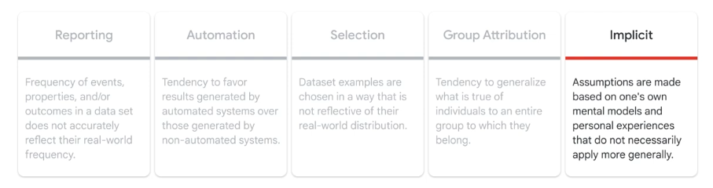

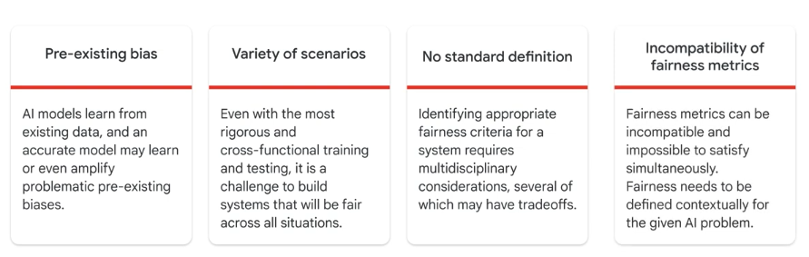


### Bias Types with Examples

#### 1. **Selection Bias**
Training data underrepresents or excludes certain demographic groups, causing poor model performance for minorities.

**Example**: Loan approval model trained on 80% male applicants, 20% female. Model learns male patterns better → lower accuracy for women.

**Fix**: Collect balanced data; use stratified sampling; oversample underrepresented groups.

---

#### 2. **Measurement Bias**
Using proxy variables that correlate with protected attributes, leaking demographic information indirectly.

**Example**: Using ZIP code as a feature for loan approval. ZIP code strongly correlates with race/income → model learns racial discrimination implicitly.

**Fix**: Remove proxy variables; use alternative features; ensure feature engineering is fairness-aware.

---

#### 3. **Aggregation Bias**
Using a single model for heterogeneous populations with different underlying distributions, causing poor predictions for sub-groups.

**Example**: One age-based risk model for all countries. In Country A, age 40 = high risk; in Country B, age 40 = low risk. Model fails for one group.

**Fix**: Build separate models per sub-group; use fairness constraints to adapt to each group's distribution.

---

#### 4. **Implicit Bias** (Evaluation Bias)
Model overall metrics mask poor performance on minority groups; evaluation hides the bias during testing.

**Example**: Model achieves 95% accuracy overall, but only 60% for women. Developers don't check stratified metrics → deploy biased model.

**Fix**: Always evaluate per demographic group; set fairness thresholds; use stratified test sets.

---

#### 5. **Group Attribution Bias**
Assuming individuals in a group share the same characteristics as the group average, leading to stereotyping.

**Example**: Model predicts career: "Majority in this demographic become nurses" → assumes all individuals from that group will too (ignoring individual traits).

**Fix**: Focus on individual features, not group demographics; avoid using group membership directly in predictions.

---

#### 6. **Automation Bias**
Over-relying on ML model predictions without human review, amplifying errors and biases in automated decisions.

**Example**: HR system auto-rejects resumes based on model score without human review. Biased model rejects all qualified candidates from certain backgrounds.

**Fix**: Implement human-in-the-loop review; flag high-confidence predictions for manual verification; require fairness sign-off before deployment.

---

### Summary Table

| Bias Type | Root Cause | Impact | Fix |
|-----------|-----------|--------|-----|
| **Selection** | Imbalanced training data | Poor accuracy for minorities | Stratified sampling, oversampling |
| **Measurement** | Proxy variables leak info | Indirect discrimination | Remove proxies, audit features |
| **Aggregation** | One model, many groups | Fails on sub-populations | Group-specific models/constraints |
| **Implicit** | Hidden in overall metrics | Biased model deployed undetected | Stratified evaluation |
| **Group Attribution** | Individual confused with group | Stereotyping | Use individual features |
| **Automation** | Blind trust in model | Biased decisions at scale | Human-in-the-loop review |

### Fairness Techniques

**Data-Level**: Resampling, SMOTE, remove proxies, stratified splits

**Algorithm-Level**: Add fairness constraints, threshold optimization, adversarial debiasing, calibration

**Post-Processing**: Group-specific thresholds, output calibration, equalized odds

**Monitoring**: Demographic parity, equalized odds, calibration, disparate impact (≥0.8)

### GCP Tools

| Tool | Purpose |
|------|---------|
| Vertex AI Fairness Indicators | Auto fairness metrics, Model Cards |
| TensorFlow Fairness Indicators | Demographic parity, equalized odds, calibration |
| What-If Tool (WIT) | Visual scenario testing, bias detection |
| SHAP | Feature importance by group |

### 5-Step Implementation

1. **Define**: Protected attributes + fairness metric
2. **Audit**: Check data representation per group
3. **Evaluate**: Measure fairness pre-deployment
4. **Intervene**: Apply data/algo/post-processing technique
5. **Monitor**: Track daily in production

### Quick Example: Threshold Adjustment

```python
# Women approval = 40%, Men = 70% (biased)
# Fix: Use threshold_women=0.4, threshold_men=0.5

for pred, gender in zip(predictions, genders):
    threshold = 0.4 if gender == 'F' else 0.5
    decision = 1 if pred >= threshold else 0
```

### Fairness Metrics

| Metric | Trade-off |
|--------|-----------|
| Demographic Parity (equal approval rates) | May ↓ accuracy |
| Equalized Odds (equal FPR/TPR) | Harder to achieve |
| Calibration | Needs large samples |
| Disparate Impact Ratio ≥ 0.8 | Legal standard |

### Quiz

1. **Selection bias example?**
   - [x] Training data missing applications from certain groups ✓

2. **Model: 99% accuracy overall, 70% for minorities. Fix?**
   - [x] Stratified evaluation + rebalance training data ✓

3. **GCP tool for automated fairness?**
   - [x] Vertex AI Fairness Indicators ✓

4. **Demographic parity means?**
   - [x] Equal approval rates across groups ✓

5. **Women approval: 60%→40%, men: 70%. Action?**
   - [x] Investigate drift, retrain, adjust thresholds ✓

------
### Identify Bias with TFDV

**TensorFlow Data Validation (TFDV)** detects bias through data anomalies and skewed distributions:

#### How TFDV Identifies Bias

| Component | Detects | Example |
|-----------|---------|---------|
| **StatisticsGen** | Distribution skew per group | Age mean=35 for men, mean=25 for women → selection bias |
| **SchemaGen** | Value range differences by group | ZIP codes valid for majority group missing for minorities |
| **ExampleValidator** | Anomalies concentrated in groups | 10% NULL values in income field for women, 1% for men |

#### TFDV Bias Detection Workflow

```
Training Data
    ↓
StatisticsGen: Compute stats per demographic group
    ↓
Compare distributions: Group_A vs Group_B
    ↓
Identify skew: Different means, stdevs, ranges → Selection/Measurement Bias
    ↓
SchemaGen: Define acceptable ranges per group
    ↓
ExampleValidator: Check production data against schema per group
    ↓
Alert if: Anomaly rate > threshold per demographic
```

#### Quick Example

```python
import tensorflow_data_validation as tfdv

# Compute stats on training data
stats = tfdv.generate_statistics_from_csv('training_data.csv')

# Compare by gender (detect selection bias)
stats_male = tfdv.generate_statistics_from_csv('training_data_male.csv')
stats_female = tfdv.generate_statistics_from_csv('training_data_female.csv')

# TFDV detects:
# - Female age distribution: mean=28, stddev=10
# - Male age distribution: mean=45, stddev=15
# → Alerts: Selection bias (age skew across genders)

# Schema enforcement
schema = tfdv.infer_schema(stats)
anomalies = tfdv.validate_examples(test_data, schema)
# Flags anomalies concentrated in minority groups
```

#### Key Alerts TFDV Raises for Bias

- **Missing values concentrated in groups** → Measurement bias
- **Feature ranges differ by group** → Aggregation bias (one model unfit for all)
- **Value frequencies skewed by group** → Selection bias (underrepresentation)
- **Schema violations only in minorities** → Data quality issues for specific groups

---

#### What-if tool

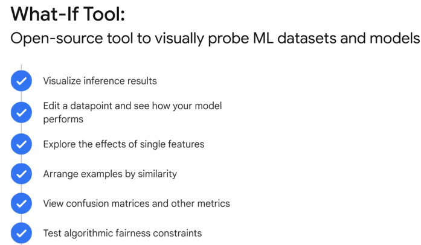

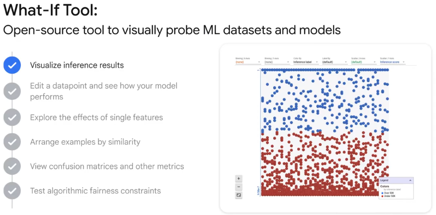

#### TFMA(TF Model Analysis)

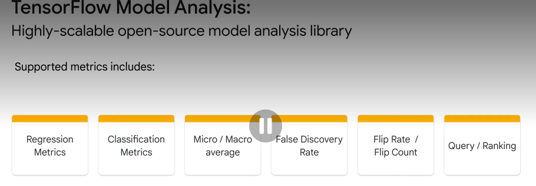

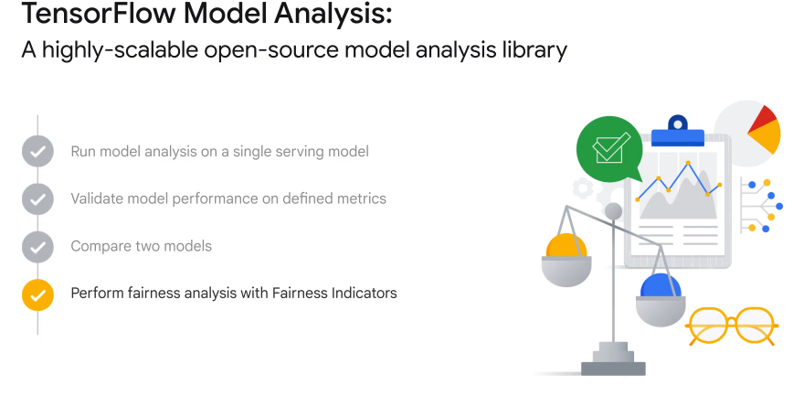

#### Threshold Calibration

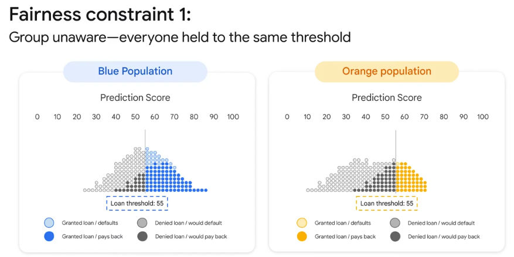

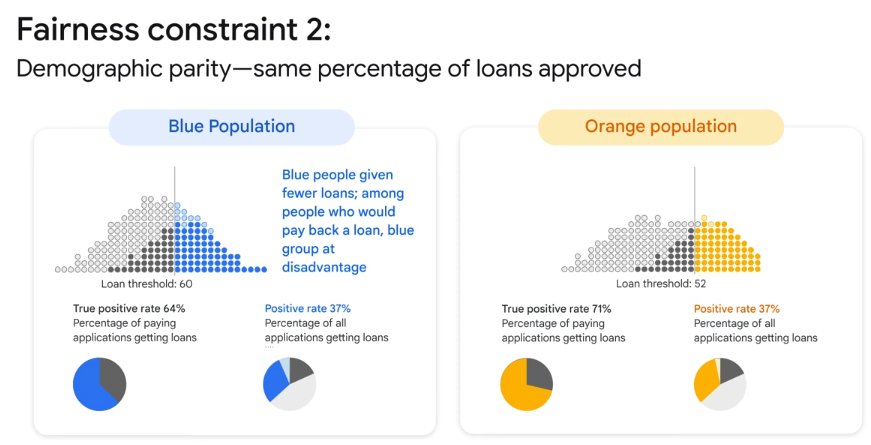

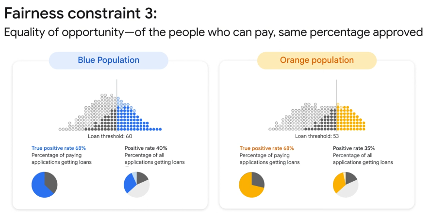

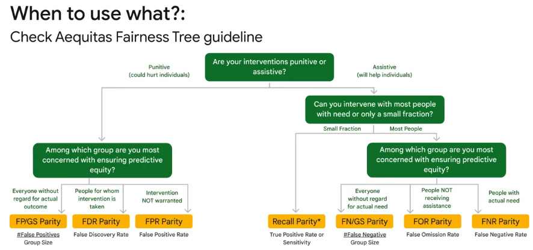

### QUIZ


1.As a data scientist, you are tasked with identifying bias in training data in an effective way. Which of the tools below can be used to identify bias in data?
- [ ] TensorFlow Data Validation, TensorFlow Serving.
- [x] TensorFlow Data Validation, What-if Tool.
- [ ] TensorFlow Datasets, What-if Tool.
- [ ] TensorFlow Data Validation, TensorBoard.

2.A researcher did an anonymous survey with students in a mixed-gender middle school to learn the health and diet patterns of middle school students in the entire country. What type of bias could it introduce?
- [ ] Automation bias.
- [x] Selection bias.
- [ ] Implicit bias.
- [ ] Group attribution bias.

3.You have been asked to do a presentation in your organization on the importance of AI fairness and bias. As you are thinking through your key opening statement, what is the most appropriate statement you can make that explains why AI fairness is difficult?
- [ ] Fairness is difficult because AI developers should not have direct access to their training and testing data, and can’t find bias directly.
- [ ] Fairness is difficult because bias is 100% harmful and it’s critical to eliminate all bias in AI system development to achieve AI fairness.
- [ ] Fairness is difficult because the decision-making process in AI systems can’t be transparent and impossible to satisfy all parties.
- [x] Fairness is difficult because there are pre-existing biases, a variety of scenarios, no standard definition of fairness, and incompatibility of fairness metrics.

--------

## Interpretability & Transparency

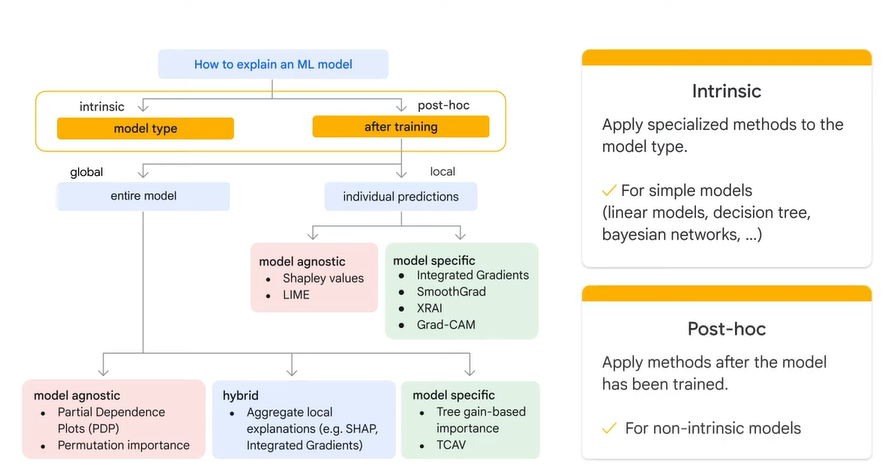

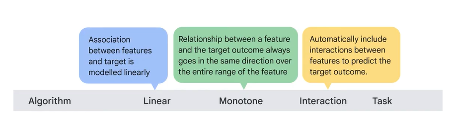

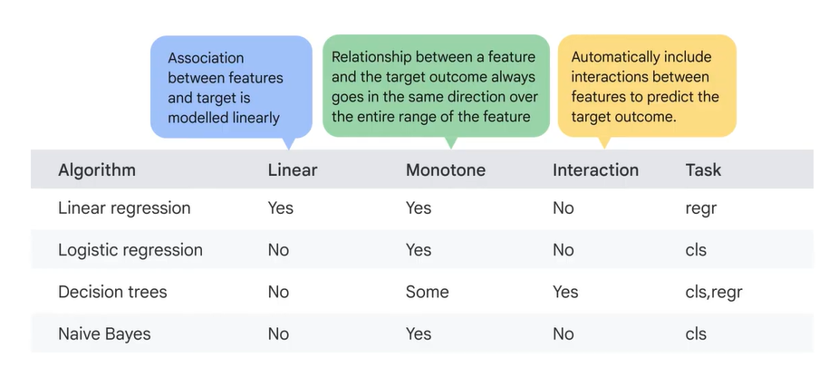

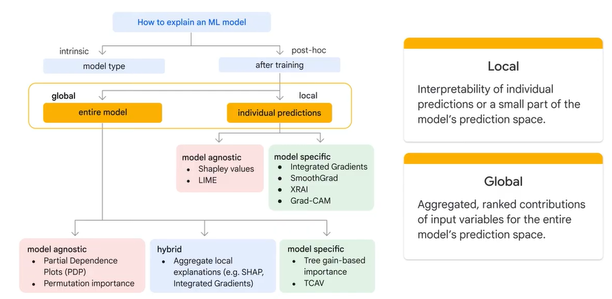

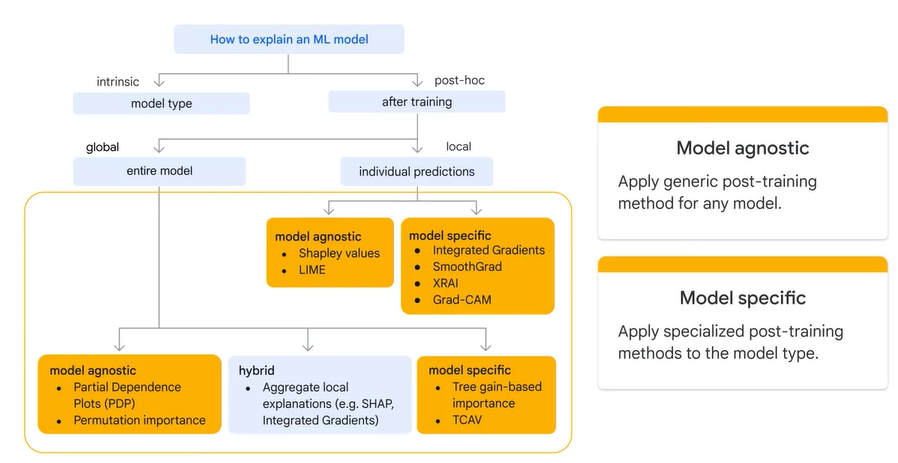

---
### Model-Agnostic Interpretability & Transparency

**Model-Agnostic**: Works with ANY model type (linear, tree, neural network, etc.) without needing model internals. Treats model as a "black box."

**Why**: Deep learning, ensembles are hard to interpret. Need universal methods to explain ANY model.

---

#### Key Techniques

| Technique | What It Does | Output | Use Case |
|-----------|------------|--------|----------|
| **LIME** (Local Interpretable Model-agnostic Explanations) | Perturb inputs locally; fit simple model to approximate complex model behavior | Why was THIS prediction made? | Single prediction explanation |
| **SHAP** (SHapley Additive exPlanations) | Calculate feature contribution to prediction using game theory | Feature importance + direction | Model debugging, fairness audit |
| **Partial Dependence Plot (PDP)** | Show relationship between feature and prediction (average across data) | How does feature affect outcome? | Feature impact analysis |
| **Anchor Explanations** | Find minimal set of features that guarantee prediction (anchors the decision) | Which features are critical? | High-confidence explanations |
| **Permutation Feature Importance** | Shuffle feature; measure prediction change (bigger change = more important) | Feature ranking | Model understanding |
| **Counterfactual Explanations** | Show minimal changes to flip prediction (e.g., "change age from 40→35 to approve loan") | What would change decision? | User-facing explanations |

---

#### Techniques: Pros, Cons & When to Use

| Technique | What | Pros | Cons | When | Scenario |
|-----------|------|------|------|------|----------|
| **LIME** | Local explanation via simple model | ✓ Fast, ✓ Works any model | ✗ Inconsistent, ✗ Misses global patterns | Single prediction | "Why rejected?" |
| **SHAP** | Game theory feature attribution | ✓ Consistent, ✓ Fair, ✓ Global+local | ✗ Slow, ✗ Hard to interpret | Fairness audit | "Prove equality" |
| **PDP** | Feature-outcome relationship | ✓ Fast, ✓ Non-linear, ✓ Easy | ✗ Assumes independence, ✗ Masks interactions | Trend analysis | "How does age affect approval?" |
| **Anchors** | Minimal critical features | ✓ Fast, ✓ High-confidence, ✓ Simple rules | ✗ May miss patterns, ✗ Sensitive | High-stakes decisions | "Confirm diagnosis rules" |
| **Counterfactual** | Minimal change to flip prediction | ✓ User-friendly, ✓ Actionable | ✗ Slow, ✗ Multiple solutions | User guidance | "What to qualify?" |
| **Permutation** | Feature importance via shuffling | ✓ Fast, ✓ Works any model | ✗ No direction info, ✗ Correlated features | Feature ranking | "Which features matter?" |

#### Quick Decision Guide

**When to use:**

| Question | Technique |
|----------|-----------|
| Why was THIS prediction made? | LIME (local) or SHAP (global) |
| Which features matter most? | Permutation Importance or SHAP |
| How to change prediction? | Counterfactual Explanation |
| Is model fair across groups? | SHAP (compare distributions by group) |
| What's the decision boundary? | Anchor Explanations |
| How does feature affect outcome? | Partial Dependence Plot |

---

#### GCP Tools for Model-Agnostic Explanations

| Tool | Integration | Use |
|------|-----------|-----|
| **Vertex AI Explainable AI** | Native SHAP support | Built-in feature attribution |
| **What-If Tool** | Jupyter notebook | Interactive scenario testing |
| **SHAP library** | Open-source Python | Detailed explanations |
| **Model Card** | Vertex AI | Transparency documentation |

---

## Model Specific

Model-specific interpretability techniques are tailored to particular model architectures. They leverage internal structure (gradients, activations, attention mechanisms) for deeper insights.

### Techniques: Pros, Cons & When to Use

| Technique | What | Pros | Cons | When | Scenario |
|-----------|------|------|------|------|----------|
| **Integrated Gradients** | Cumulative gradient effect from baseline to input | ✓ Theoretically sound (Shapley-based), ✓ Works deep learning | ✗ Slow (multiple forward passes), ✗ Sensitive to baseline choice | Neural network fairness audit | Why did model favor this feature over baseline? |
| **Saliency Maps** | Pixel/feature importance via gradient magnitude | ✓ Fast (single pass), ✓ Visual (images/text) | ✗ Noisy, ✗ High-frequency artifacts, ✗ Brittle | CNN/vision model debug | Which pixels influenced prediction? |
| **DeepLIFT** | Attribution via activation differences from reference | ✓ Faster than Integrated Gradients, ✓ Handles saturation | ✗ Reference-dependent, ✗ Complex math | DNN layer-level analysis | Feature importance in hidden layers? |
| **Layer-wise Relevance Propagation (LRP)** | Backpropagate relevance scores layer-by-layer | ✓ Comprehensive layer-by-layer breakdown, ✓ Theoretically grounded | ✗ Slow, ✗ Requires custom implementation, ✗ Per-layer tuning | Deep network audit | Which layers contributed most? |
| **Attention Visualization** | Attention weight heatmaps in Transformer/RNN models | ✓ Native to model, ✓ Fast, ✓ Multi-head interpretability | ✗ What attention attends to ≠ causality, ✗ Post-hoc only | Transformer/NLP debugging | Which tokens did model focus on? |
| **Grad-CAM (Gradient-weighted Class Activation Mapping)** | Class-specific spatial map via gradient-weighted feature maps | ✓ Fast, ✓ Visual, ✓ Works CNNs/Transformers | ✗ Coarse spatial resolution, ✗ Aggregates spatial info | CNN/vision model localization | Which image regions matter for class? |

---

## XRAI

**XRAI (eXplanation with Ranked Area Integrals)** is an advanced image attribution technique that improves upon Integrated Gradients by identifying important **image regions** instead of individual pixels.

### How XRAI Works

1. Segment image into superpixels (semantic regions)
2. Compute Integrated Gradients on superpixels instead of pixels
3. Rank regions by importance
4. Highlight top regions in output

### Benefits

| Benefit | Why It Matters |
|---------|----------------|
| **Semantic Regions** | Groups related pixels → cleaner saliency (whole objects, not noisy pixels) |
| **Human-Readable** | Highlights meaningful regions (tumors, objects) vs. pixel-level noise |
| **Noise Reduction** | Superpixel aggregation removes high-frequency artifacts |
| **Theoretically Sound** | Built on Integrated Gradients (grounded in Shapley values) |
| **Fast** | Fewer regions to evaluate than pixel-level methods |
| **Fairness Audit** | Detect if model biases against specific visual patterns |

### When to Use XRAI

✓ Image classification - "Why classified as X?"  
✓ Computer vision debugging - Verify model focuses on right objects  
✓ Medical imaging - Highlight tumor/anomaly regions for radiologist verification  
✓ Fairness audits - Detect visual pattern discrimination  
✓ Stakeholder explanations - Clean, intuitive visualizations  

### Example

Medical imaging: XRAI highlights tumor region model flagged → radiologists verify if correct anatomy was considered (not artifacts/noise).

------

## Concept-based and example-based explanations

### TCAV

**TCAV (Testing with Concept Activation Vectors)** interprets neural networks using **user-defined concepts** instead of raw features.

#### How TCAV Works

1. User defines concept (e.g., "stripes", "gender", "bright colors")
2. Collect examples with/without concept
3. Train linear classifier to identify concept direction in model's hidden layer
4. Test if model's predictions rely on that concept
5. Quantify concept importance (TCAV score)

#### Benefits

| Benefit | Why It Matters |
|---------|----------------|
| **User-Defined Concepts** | Test fairness with human-meaningful terms (e.g., "looks feminine") |
| **High-Level Explanations** | Concept-based → easier for stakeholders than raw features |
| **Bias Detection** | Test if model uses unfair concepts (gender, race, age) |
| **No Retraining** | Works on already-trained models |
| **Any Model** | Black-box compatible (like LIME/SHAP) |
| **Concept Interaction** | Test combinations of concepts |

#### When to Use TCAV

✓ Fairness audits - "Does model use gender/race concepts?"  
✓ Bias detection - Identify unfair concept dependencies  
✓ Stakeholder validation - Explain predictions in business terms  
✓ Image classification - "Does model rely on object texture/color?"  
✓ Sensitive domains - Finance, healthcare, hiring systems  

#### Example

**Hiring model:** TCAV tests if model's hiring decisions rely on "appearance" concept → if yes, flags fairness issue → remove/debias concept.

### ACE

**ACE (Automated Concept-based Explanations)** automatically discovers concepts in model representations without requiring user definition.

#### How ACE Works

1. Segment dataset images into patches
2. Apply clustering (k-means) to group similar patches across dataset
3. Each cluster = discovered concept (e.g., "striped patterns", "faces", "text")
4. Test concept importance using TCAV-like scoring
5. Rank concepts by relevance to predictions

#### Benefits

| Benefit | Why It Matters |
|---------|----------------|
| **Automatic Discovery** | No manual concept definition (vs. TCAV's manual step) |
| **Data-Driven Concepts** | Finds patterns actually present in dataset |
| **Unbiased Exploration** | Discovers unexpected model behaviors |
| **Scalable** | Works on large datasets automatically |
| **Interpretable Output** | Visualize concept clusters for inspection |
| **Anomaly Detection** | Spot concepts model shouldn't use |

#### When to Use ACE

✓ Exploratory analysis - "What concepts does model learn?"  
✓ Bias discovery - Find unexpected discriminatory patterns  
✓ Image classification - Validate what features matter  
✓ Fairness audits - Discover hidden biased concepts  
✓ Model debugging - Understand failure modes  

#### Example

**Image classifier:** ACE discovers model relies on "blurry background" concept for classification → explains why high-res images fail → retrain on varied backgrounds.

---

## Interpretability Tools

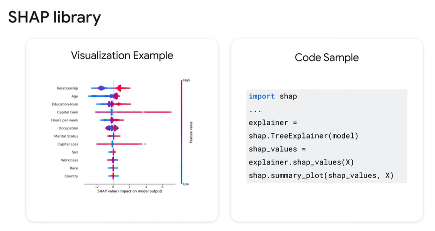

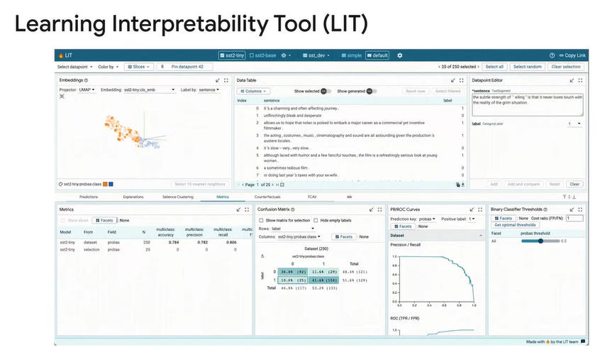

### Vertex Explainable AI

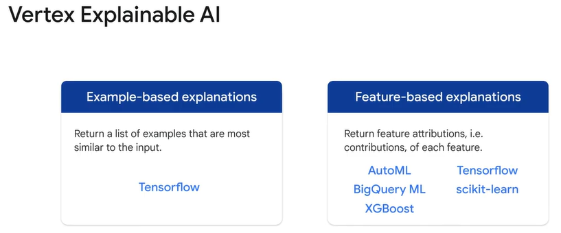

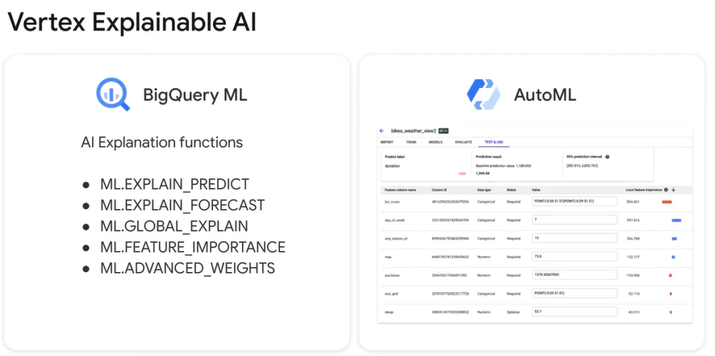

-----

## Data & Model Transparency

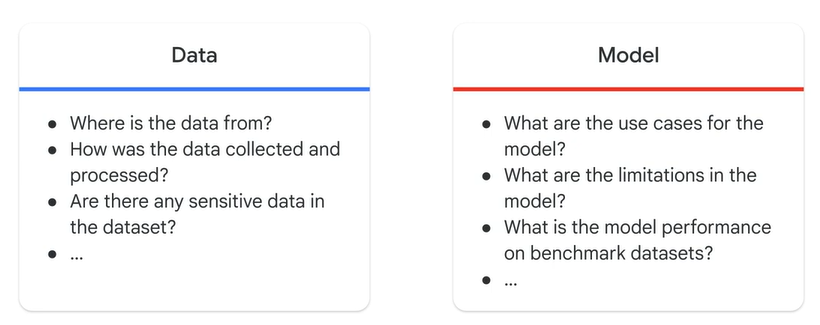

### Data card

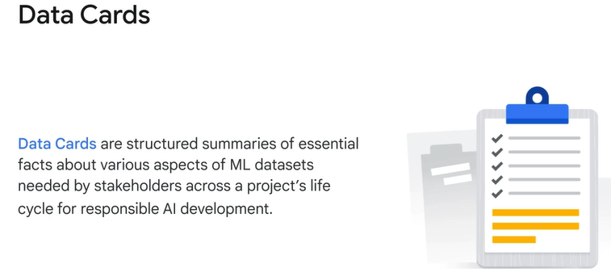

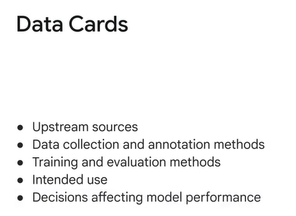

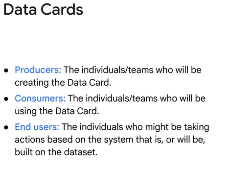

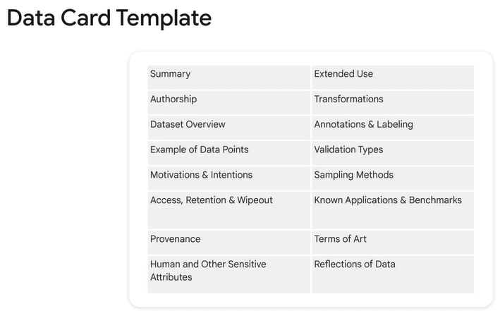

### Model card

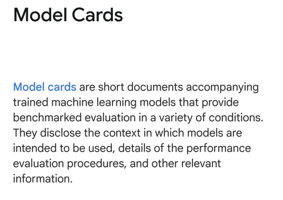

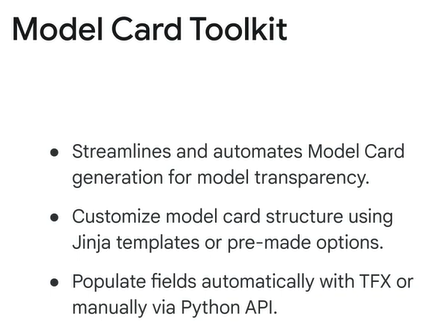

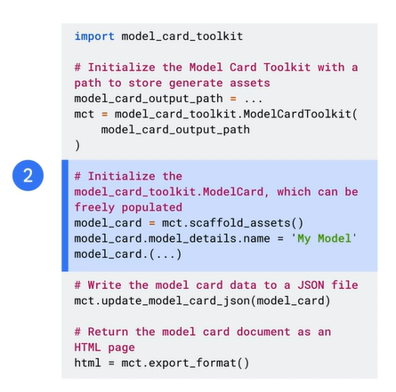

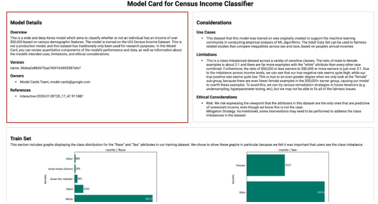

----

## QUIZ

1. You're working on an image classification model for identifying different types of clouds. During testing, you notice some strange results. The model seems to be focusing on irrelevant areas of the images (like background objects) instead of the actual cloud features. To understand why your model is behaving this way, which of the following tools or techniques would be the most helpful?

- [x] XRAI (eXplainable Region-based Artificial Intelligence)
- [ ] ACE (Automatic Concept-based Explanation)
- [ ] Permutation Feature Importance
- [ ] TCAV (Testing with Concept Activation Vectors)


2.As an AI engineering team manager, you're giving a presentation to explain why interpretability and transparency in AI development is important for engineers. Which of the following statements would be best to include in your slides?
- [ ] Shorten project lead time.
- [ ] Reduce project cost.
- [x] Understand model behaviors
- [ ] Compliance.

3.Your manager is a strong advocate for responsible AI development. During a project review, they emphasize the importance of transparency and documentation around the dataset you're using and the resulting AI model. They want to know what steps you're taking to ensure this. Which of the following tools or techniques are you using to provide a clear understanding of your dataset and model?
- [ ] Learning Interpretability Tool (LIT).
- [x] Data card, Model card.
- [ ] Vertex Explainable AI
- [ ] SHAP library.

-----

## Privacy & Safety

### De-Identification Techniques


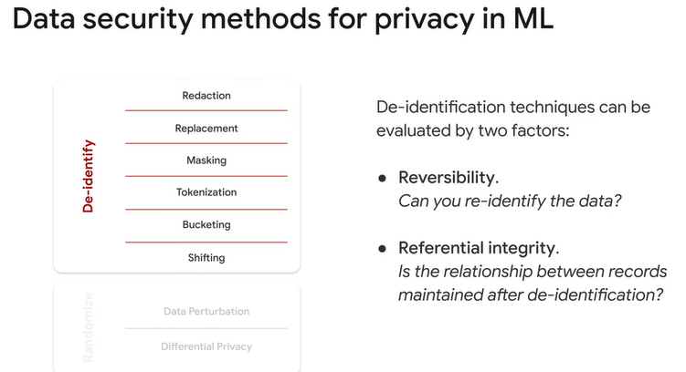

|Technique| Description|
|--|--|
|Redaction|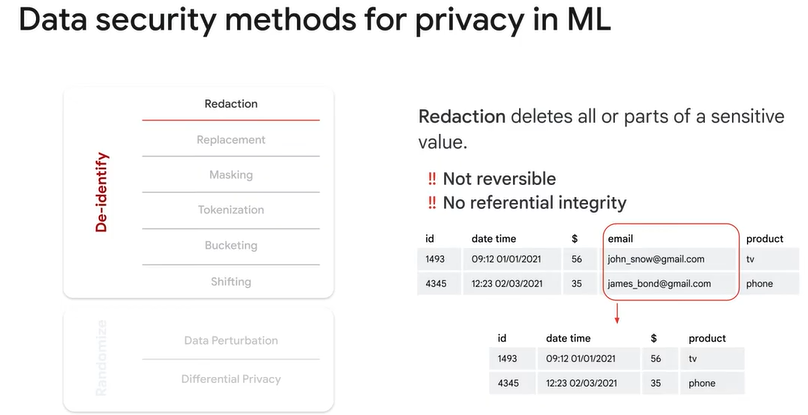
|Replacement|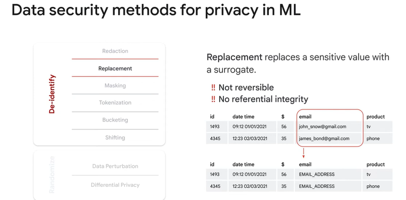|
|Masking| 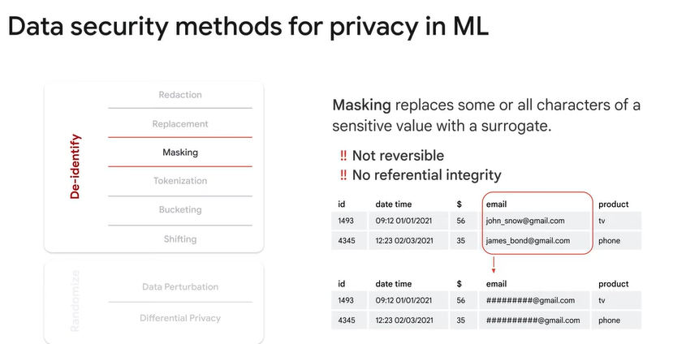|
|Tokenization|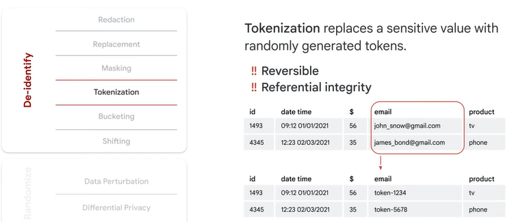|
|Bucketing|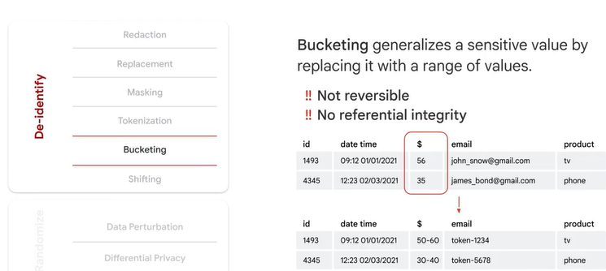 |
|Shifting|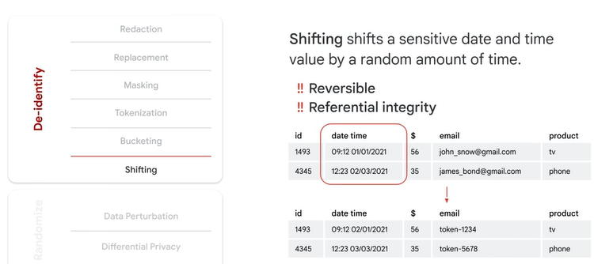|

### k-anonymity & l-diversity

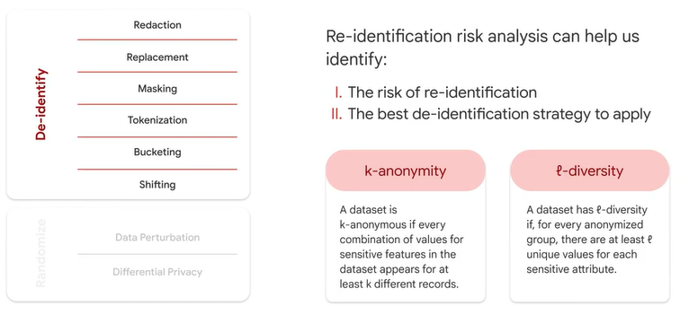

### Randomization Technique

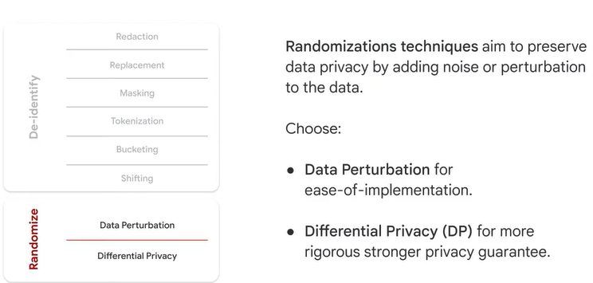

**Data Perturbation**

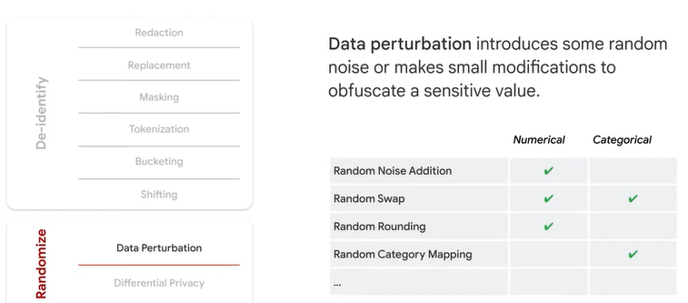

**Differential Privacy**

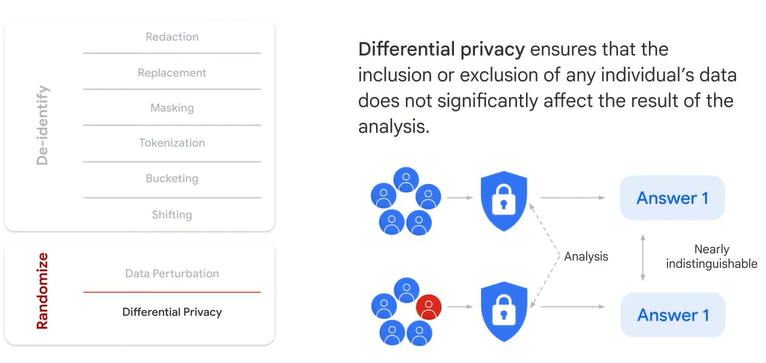

### DP-SGD

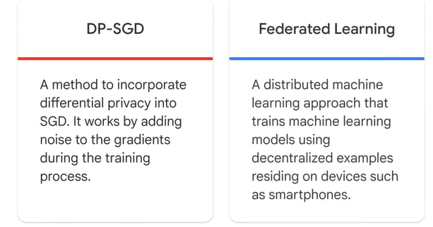

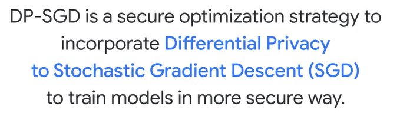

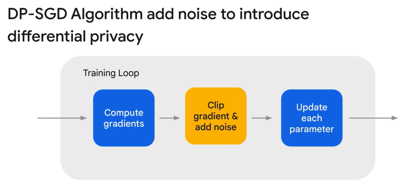

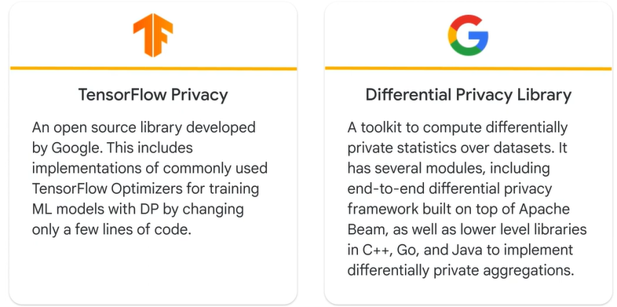

### Federated Learning

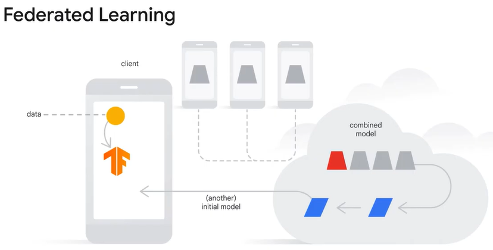

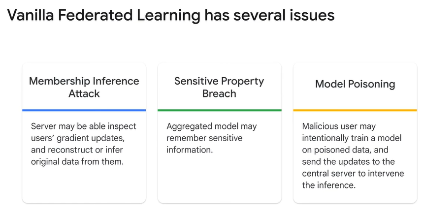

**Federated Learning** trains ML models across **decentralized devices** without sending raw data to central server. Only model updates (gradients) are shared.

#### How It Works

1. Send model to edge devices (phones, IoT, hospitals)
2. Each device trains locally on its data
3. Device sends only gradients/model updates to server
4. Server aggregates updates (averaging)
5. Updated model sent back to devices
6. Repeat until convergence

#### Benefits

| Benefit | Why It Matters |
|---------|----------------|
| **Privacy** | Raw data stays on device; only gradients shared |
| **Data Security** | No centralized data collection (GDPR/HIPAA compliant) |
| **Bandwidth Efficient** | Smaller gradient updates vs. raw data |
| **Latency** | Local training faster for real-time inference |
| **Edge Devices** | Works on mobile, IoT, hospitals with local compute |
| **Heterogeneous Data** | Models learn from non-IID (non-identical) data distributions |

#### Key Challenges

✗ Communication overhead - Many rounds of gradient exchange  
✗ Model convergence - Slower due to non-IID data  
✗ Debugging - Hard to inspect local data issues  
✗ Synchronization - Device dropout/unreliability  

#### When to Use Federated Learning

✓ Healthcare - Train on patient data without centralizing  
✓ Mobile apps - Personalized models on-device (keyboards, recommendations)  
✓ Finance - Train on sensitive transaction data across branches  
✓ Privacy-critical domains - GDPR, HIPAA compliance  
✓ IoT/Edge - Distributed sensor networks  

#### Example

**Healthcare:** Hospital trains model on local patient records → sends gradients to federated server → aggregated model learns from all hospitals without sharing raw data → deployed back locally.

#### GCP Implementation

- **Vertex AI Federated Learning** - Managed federated training service
- **TensorFlow Federated** - Open-source framework for building federated systems

### GCP System Security

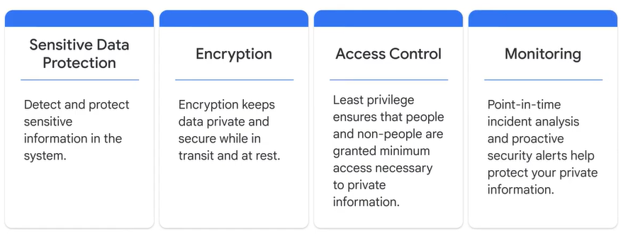

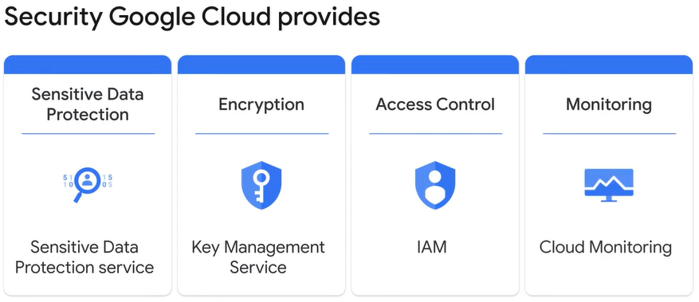

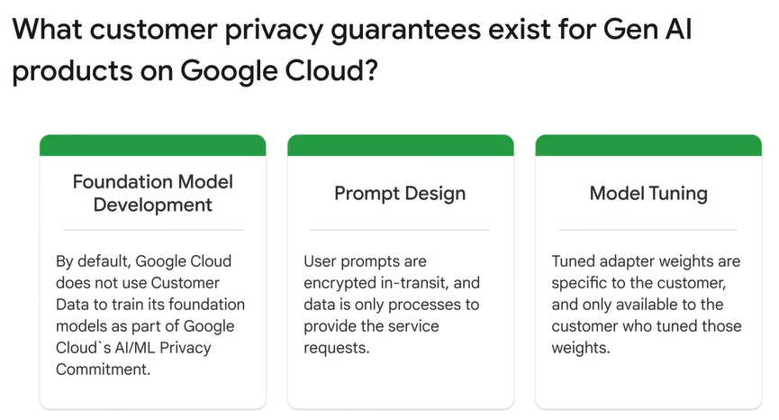

-------

## Quiz

1. In machine learning, privacy measures often introduce trade-offs with other important factors. Which of the following does NOT represent a typical trade-off?
- [ ] Privacy and Model Performance
- [ ] Privacy and Fairness
- [ ] Privacy and Training Efficiency
- [x] Privacy and Transparency


2.You've applied various de-identification techniques to a customer dataset containing sensitive information before using it to train an AI model. Which of the following concepts should you use to evaluate the suitability of your de-identification techniques?
- [x] Reversibility and referential integrity.
- [ ] Complexity and time consumption.
- [ ] Scalability and efficiency.
- [ ] Productivity and efficiency.

3. A customer is working with a large dataset of healthcare records to develop a diagnostic AI model. They want to ensure privacy of sensitive data, by restricting the contribution of specific data on the model during training. Which privacy-focused technique would be best for the customer?

- [x] DP-SGD (Differentially Private - Stochastic Gradient Descent)
- [ ] Federated Learning
- [ ] Data perturbation
- [ ] TFF (TensorFlow Federated)

---------------

## AI Safety

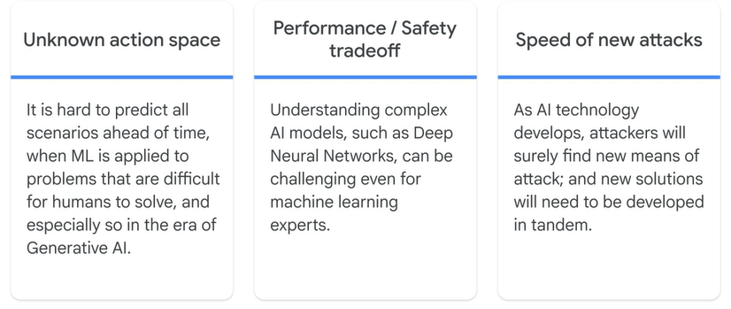

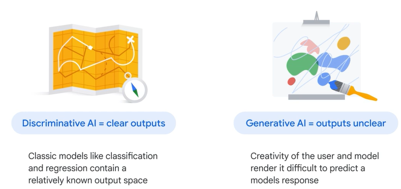

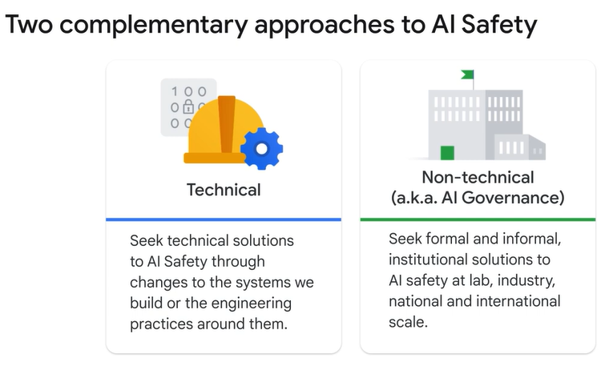

### Safety Evaluation

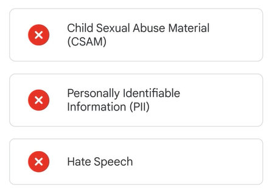

#### Adversarial Testing

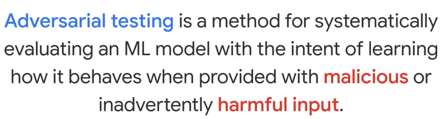

### Safety in GCP

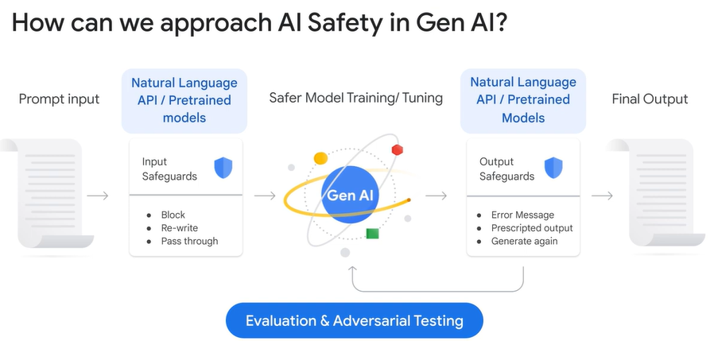

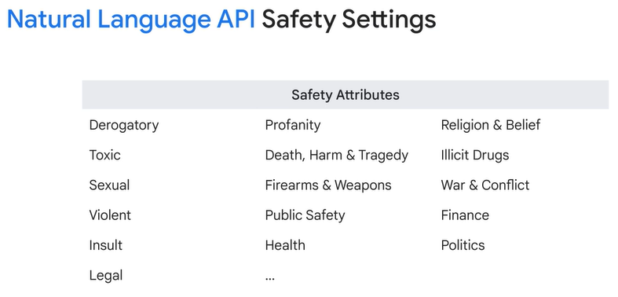

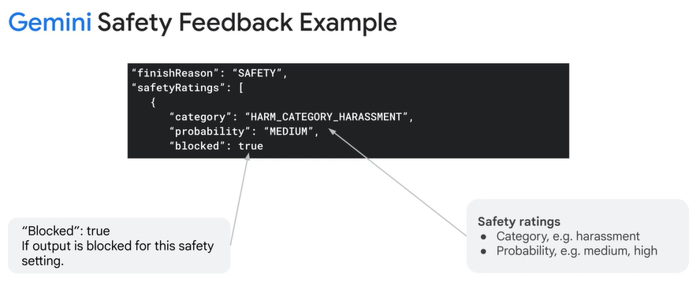

## QUIZ

check
1.

You're pitching an AI-powered customer support solution to a potential client. Their company handles highly sensitive user information, and they have reservations about potential risks associated with AI systems. To address their concerns and win their trust, which key message about AI safety would be most effective to emphasize?
- [ ] "AI safety mechanisms make our systems easier to understand, allowing you greater control and oversight."
- [ ] "AI safety prioritizes fairness and avoids biased outcomes, protecting the interests of your diverse customer base."
- [ ] "AI safety practices increase development speed, enabling us to deliver your project faster and at a lower cost."
- [x] "Adherence to AI safety principles helps us build reliable systems that minimize unexpected errors, safeguarding your customer data."

2.Your manager asked you to lead a project to research the key considerations in AI safety and develop a failure mode catalog to assist evaluate safety in Generative AI products. Which of the following should not be included as a failure mode?
- [x] Citation
- [ ] Violence.
- [ ] Hate speech
- [ ] Discrimination.

3.You want to embed the concept of safety into a pre-trained LLM by fine-tuning it. You have a dataset of prompts and pairs of possible answers, along with labels created by human safety evaluators indicating their preference for one answer over the other. Which technique is the most suitable for fine-tuning the LLM in this scenario?
- [ ] Transfer Learning
- [x] Reinforcement Learning from Human Feedback (RLHF)
- [ ] Instruction Tuning
- [ ] Zero-shot Learning

---

## GCP Service Enablement Roles & Permissions

Important IAM roles required to enable and manage GCP services for ML and data pipelines:

| Role | Service(s) | Purpose |
|------|-----------|---------|
| **Compute Admin** | Compute Engine, GKE | Create, manage, and delete VM instances, clusters, and networking resources |
| **Storage Admin** | Cloud Storage | Full control over buckets, objects, and access management |
| **BigQuery Admin** | BigQuery | Create datasets, tables, manage queries, billing, and access |
| **ML.Admin** | Vertex AI | Create and manage ML models, training jobs, and endpoints |
| **Data Transfer Admin** | Data Transfer Service | Schedule and manage data transfers between services |
| **Service Account Admin** | IAM | Create and manage service accounts for service-to-service authentication |
| **Editor** | All Services | Full edit access to all resources (use sparingly for principle of least privilege) |
| **Viewer** | All Services | Read-only access across all resources for monitoring and auditing |
| **Cloud Build Editor** | Cloud Build | Create and run CI/CD pipelines and container builds |
| **Artifact Registry Writer** | Artifact Registry | Publish and manage container images and artifacts |
| **Dataflow Admin** | Cloud Dataflow | Create, manage, and monitor data processing pipelines |
| **TFDV Admin** | TensorFlow Data Validation | Access data validation and monitoring capabilities |
| **Service Usage Admin** | Service Management | Enable and disable APIs and services within project |
| **Project Editor** | All Services | Edit-level access at project scope (alternative to Editor) |

**Best Practice**: Use service accounts with minimal required roles (principle of least privilege) instead of granting Editor role directly to users.

-----------

# GCP APIs


| API Service | Description |
|---|---|
| **aiplatform.googleapis.com** | Vertex AI platform for model training, deployment, and serving (AutoML, custom training, pipelines, endpoint management) |
| **compute.googleapis.com** | Google Compute Engine for VM instances used for training and serving models |
| **container.googleapis.com** | Google Kubernetes Engine (GKE) for containerized model deployment and orchestration |
| **containerregistry.googleapis.com** | Container Registry for storing and managing Docker container images for model serving |
| **storage-component.googleapis.com** | Google Cloud Storage for storing datasets, models, and pipeline artifacts |
| **logging.googleapis.com** | Cloud Logging for monitoring and logging ML pipeline execution and model performance |
| **monitoring.googleapis.com** | Cloud Monitoring for tracking metrics and setting up alerts on model performance |
| **bigquery.googleapis.com** | BigQuery for large-scale data analysis and feature engineering |
| **dataflow.googleapis.com** | Cloud Dataflow for Apache Beam ETL pipelines to process training data |
| **ml.googleapis.com** | Google Cloud Machine Learning Engine (legacy AI Platform) for batch predictions and model management |
| **artifactregistry.googleapis.com** | Artifact Registry for storing Python packages and container images |
| **cloudtrace.googleapis.com** | Cloud Trace for tracking and debugging model serving latency |
| **speech.googleapis.com** | Cloud Speech-to-Text API for converting audio to text with synchronous recognition (request/response) or asynchronous recognition (long-running operations) for large files |

| **datafusion.googleapis.com** | Cloud Data Fusion for visual ETL/ELT pipeline development and data integration |

---

# Speech-to-Text API: Synchronous vs Asynchronous Recognition

| Aspect | Synchronous | Asynchronous |
|--------|-------------|--------------|
| **Operation** | Request/response within single API call | Long-running operation (LRO) with polling |
| **File Size** | Up to 1 minute of audio (~640 KB) | Large files (up to hours of audio) |
| **Latency** | Real-time (<1 second for short audio) | Higher latency (task queued, processed asynchronously) |
| **Use Case** | Live transcription, real-time voice commands | Batch processing, archived recordings, large media files |
| **Implementation** | Simple, direct API call | Requires polling/tracking operation status |
| **Cost Consideration** | Better for small, frequent requests | Better for large files (cost per second of audio) |

---

# Cloud Data Fusion

## Overview

**Cloud Data Fusion** is a fully managed, cloud-native ETL/ELT (Extract-Transform-Load / Extract-Load-Transform) service on Google Cloud Platform. It provides a visual, low-code/no-code interface for building and managing data pipelines that integrate data from multiple sources into a unified data warehouse or data lake.

## Purpose & Key Benefits

### Primary Purposes:
1. **Data Integration** - Connect and consolidate data from diverse sources (databases, APIs, cloud storage, SaaS applications)
2. **ETL/ELT Pipeline Development** - Build complex data transformation pipelines without extensive coding
3. **Low-Code/No-Code Pipeline Design** - Enable data engineers and analysts to design pipelines through a visual UI
4. **Rapid Development** - Reduce time-to-market for data projects with pre-built connectors and transformations
5. **Scalable Data Processing** - Leverage Cloud Dataflow for distributed, serverless data processing at scale

### Key Benefits:
- **Visual Pipeline Designer** - Drag-and-drop interface for building data workflows
- **Pre-built Connectors** - 70+ out-of-the-box connectors to popular data sources and destinations
- **Enterprise-grade Security** - VPC Service Controls, encrypted connections, IAM integration
- **Managed Service** - No infrastructure to manage; automatic scaling and high availability
- **Integration with GCP Ecosystem** - Seamless connectivity with BigQuery, Cloud Storage, Pub/Sub, Datastore, etc.
- **Cost-Effective** - Pay-as-you-go pricing for actual data processed

## Core Components

| Component | Description |
|-----------|-------------|
| **Data Pipelines** | Visual workflows that define data flow, transformations, and destinations |
| **Connectors** | Pre-built integrations for source and destination systems (databases, APIs, cloud services) |
| **Transforms** | Data transformation logic (aggregation, filtering, joining, custom functions) |
| **Wrangler** | Interactive data profiling and exploration tool for understanding data before pipeline execution |
| **Cloud Dataflow** | Underlying execution engine that processes data in a distributed, serverless manner |
| **Metadata Management** | Schema tracking, lineage, and data catalog integration |

## Typical Use Cases

### 1. **Data Warehouse Population**
- Extract data from multiple operational systems (CRM, ERP, HR systems)
- Transform and consolidate into BigQuery for analytics and reporting

### 2. **Real-time Data Replication**
- Stream changes from source databases to Cloud Storage or BigQuery
- Enable near-real-time analytics on transactional data

### 3. **Data Lake Ingestion**
- Ingest raw data from various sources into Cloud Storage
- Apply transformations (cleaning, deduplication, enrichment) before analytics

### 4. **API Data Integration**
- Fetch data from REST APIs (Salesforce, Marketo, Zendesk, etc.)
- Schedule periodic data pulls and load into data warehouse

### 5. **Log Aggregation & Processing**
- Consolidate application and infrastructure logs from multiple services
- Transform and analyze in BigQuery for troubleshooting and auditing

### 6. **Master Data Management (MDM)**
- Integrate customer, product, and supplier data from different systems
- Create a single source of truth with deduplication and enrichment

## Architecture & Workflow

```
Data Sources (Database, API, Cloud Storage, Pub/Sub)
    ↓
Cloud Data Fusion UI (Visual Pipeline Design)
    ↓
Data Transforms (Wrangler, SQL, Custom Functions)
    ↓
Cloud Dataflow (Distributed Execution Engine)
    ↓
Data Destinations (BigQuery, Cloud Storage, Databases, Pub/Sub)
```

### Pipeline Execution Flow:
1. **Design** - Create visual pipeline in Cloud Data Fusion UI
2. **Validate** - Test pipeline with sample data using Wrangler
3. **Deploy** - Publish pipeline to production
4. **Execute** - Run on-demand or schedule recurring executions
5. **Monitor** - Track pipeline status, errors, and performance metrics
6. **Iterate** - Update pipeline logic based on data quality or business requirements

## Key Features

### Connectors & Data Sources
- **Databases** - MySQL, PostgreSQL, Oracle, SQL Server, MongoDB, Cassandra
- **Cloud Services** - BigQuery, Cloud Storage, Cloud Pub/Sub, Cloud Datastore, Firestore
- **SaaS Applications** - Salesforce, Marketo, Zendesk, ServiceNow, Workday
- **APIs** - Generic HTTP/REST API connector for custom integrations
- **Data Warehouses** - Snowflake, Amazon Redshift (via connectors)
- **File-based** - CSV, Parquet, Avro, JSON, Excel

### Transformation Capabilities
- **SQL Transformations** - Write custom SQL for complex logic
- **Wrangler** - Interactive data profiling, cleaning, and format conversion
- **Joins & Aggregations** - Combine data from multiple sources
- **Custom Scripts** - Python or Java-based custom transformations
- **Built-in Functions** - Conditional logic, string operations, date functions

### Scheduling & Triggers
- **Scheduled Runs** - Cron-based scheduling (hourly, daily, weekly, etc.)
- **Trigger-based Execution** - Run pipelines on-demand or event-triggered
- **Error Handling** - Retry policies and error notifications

## Comparison with Alternatives

| Feature | Cloud Data Fusion | Apache NiFi | Talend | Informatica |
|---------|-------------------|-----------|--------|------------|
| **Cloud-Native** | ✓ (GCP) | Requires hosting | ✓ | Partial |
| **Visual Pipeline Design** | ✓ | ✓ | ✓ | ✓ |
| **Serverless Execution** | ✓ (via Dataflow) | ✗ | ✓ | Partial |
| **Pre-built Connectors** | 70+ | Extensive | 500+ | 500+ |
| **Low-Code** | ✓ | ✓ | ✓ | ✓ |
| **GCP Integration** | Excellent | Good | Good | Limited |
| **Cost** | Pay-per-use | Open-source | Enterprise | Enterprise |

## Integration with Machine Learning Pipelines

Cloud Data Fusion plays a crucial role in ML project workflows:

1. **Data Preparation** - ETL pipelines prepare raw data for ML feature engineering
2. **Feature Store Integration** - Pipelines can feed transformed data to Vertex AI Feature Store
3. **Model Training Data** - Prepare balanced, cleaned datasets for Vertex AI AutoML or custom training
4. **Prediction Data Pipeline** - Load real-time or batch data for model inference
5. **Data Quality Monitoring** - Detect data drift and quality issues before they impact models

## Common Pipeline Example: E-commerce Analytics

```
Sales System (MySQL) → Data Fusion → BigQuery
Inventory System (PostgreSQL) ↗     ↓
Customer CRM (Salesforce) ↗      Vertex AI ML
Marketing Data (Google Ads API) ↗  ↓
                              Analytics Dashboard
```

**Steps:**
1. Extract order data from MySQL sales system
2. Extract inventory levels from PostgreSQL
3. Fetch customer profiles from Salesforce
4. Retrieve marketing metrics from Google Ads API
5. Join and aggregate data by customer and product
6. Load enriched data to BigQuery
7. Use BigQuery data for customer churn prediction model in Vertex AI

## Pricing & Considerations

- **Data Processing Pricing** - Charged based on GB of data processed (similar to Dataflow)
- **Connector Licensing** - Premium connectors may incur additional costs
- **No Infrastructure Cost** - Managed service eliminates VM/cluster provisioning costs
- **Cost Optimization** - Use scheduling efficiently and filter data early in pipeline

## Best Practices

1. **Start with Wrangler** - Use interactive data exploration before building full pipelines
2. **Implement Data Quality Checks** - Validate row counts, schema, and key metrics
3. **Modular Pipelines** - Break complex workflows into smaller, reusable pipeline components
4. **Error Handling** - Define clear error handling and retry logic
5. **Monitoring & Alerts** - Set up alerts for pipeline failures and data quality issues
6. **Version Control** - Export and version control pipeline configurations
7. **Incremental Loading** - Use change data capture (CDC) and incremental loads for efficiency
8. **Security** - Use service accounts with minimal permissions and VPC Service Controls

## Related GCP Services

- **BigQuery** - Data warehouse destination for analytics and ML feature engineering
- **Vertex AI** - ML platform that consumes prepared training data from Data Fusion pipelines
- **Cloud Dataflow** - Underlying execution engine for distributed data processing
- **Cloud Pub/Sub** - Real-time event streaming data source
- **Cloud Storage** - Data lake for raw data ingestion
- **Dataprep by Trifacta** - Alternative for interactive data exploration and transformation
---

# TPU (Tensor Processing Unit)

## What is TPU?

**TPU** is a custom ASIC developed by Google for ML workloads. It accelerates tensor operations (matrix multiplications) used in deep learning. Features: custom silicon, massive parallelism, high memory bandwidth, optimized for bfloat16 precision.

### TPU Generations

| Version | Year | Performance | Key Feature |
|---------|------|-------------|-------------|
| v2 | 2017 | 180 TFLOPS | Cloud Pods support |
| v3 | 2018 | 420 TFLOPS | 128GB memory |
| v4 | 2021 | 1.1 PFLOPS | Best performance |
| v5e | 2023 | 96 TFLOPS/core | Cost-effective |

## TPU vs GPU

| Aspect | TPU | GPU |
|--------|-----|-----|
| **Optimized For** | Matrix operations (ML-specific) | General-purpose compute |
| **Tensor Performance** | 420-1,100 TFLOPS | 47-664 TFLOPS (with Tensor Cores) |
| **Memory Bandwidth** | 425 GB/s - 1.2 TB/s | 900 GB/s - 2.4 TB/s |
| **Per-Request Latency** | High (batch optimized) | Low |
| **Cost** | $2.40-3.50/hr | $0.32-2.00/hr |
| **Flexibility** | ML-only, XLA required | General-purpose, any framework |

## Choose TPU When

- **Large-scale training**: Transformer models (BERT, GPT), 1B+ parameters
- **Batch inference**: Processing millions of predictions
- **High throughput**: Large batch sizes (32-1024+), 24/7 production workloads
- **Dense tensor ops**: Matrix multiplications are primary workload
- **Cost at scale**: Amortizing TPU pod cost over months of training

**Examples:** Training BERT, batch inference on 1M images, recommendation systems, Neural Architecture Search

## Choose GPU When

- **Low-latency inference**: <100ms per-request requirement, real-time APIs
- **General ML**: ResNet, standard models, multi-framework projects
- **Flexibility**: Custom logic, conditional branches, preprocessing/postprocessing
- **Development**: Rapid experimentation, debugging, prototyping
- **Smaller workloads**: Training ResNet/MobileNet in 1-3 days
- **Framework choice**: PyTorch with custom training loops

**Examples:** Real-time object detection API, fine-tuning ResNet, RL training, research

## Quick Decision Tree

```
Is it large-scale tensor training (>1B params)?
├─ YES → TPU POD
└─ NO  → GPU?

Need <10ms per-request latency?
├─ YES → GPU
└─ NO  → Could be TPU for batching

Complex custom logic/preprocessing?
├─ YES → GPU
└─ NO  → TPU if large-scale
```

## Scenario Comparison

| Scenario | Choice | Reason |
|----------|--------|--------|
| Train LLM (1B+ params, 4-8 weeks) | **TPU Pod** | Massive tensor ops, cost-effective at scale |
| Real-time recommendation API (<100ms) | **GPU** | Need low latency, TPU optimized for throughput |
| Fine-tune ResNet (100K images, 2-3 days) | **GPU** | Not huge enough for TPU, simpler setup |
| Batch process 100M images daily | **TPU** | High throughput, non-critical latency |
| Research 10+ architectures | **GPU** | Flexibility crucial, faster iteration |
| Multi-modal training (custom pipeline) | **GPU** | XLA constraints limiting, need CUDA flexibility |

## TPU on GCP

| Offering | Use Case | Cost |
|----------|----------|------|
| Cloud TPU v4 Pod | Enterprise training | $8-12/hr |
| Cloud TPU v5e | Moderate scale | $2.40-3.50/hr |
| Vertex AI with TPU | Managed pipeline | Bundled |

**Setup:** Enable Cloud TPU API → Create TPU → Use TensorFlow/JAX with XLA → Submit job → Monitor on TensorBoard

**Optimizations:** XLA JIT compilation, bfloat16 mixed precision, data parallelism, model parallelism

## Cost Example

**Training BERT (24h on 8 cores):**
- TPU v3: $60 (24h × $2.50)
- 8× V100 GPU: $186 (slower, needs more time)
- **TPU wins on cost + speed**

**Real-time inference (1 year):**
- Single GPU: $15K, 500 req/sec, 8ms latency
- TPU Pod: $21,900, 100K req/sec, 25ms latency  
- Multi-GPU: $87.5K
- **GPU wins for latency-sensitive use**

## Hybrid Strategy

```
Development → GPU (prototyping, debugging)
Production Training → TPU Pod (cost-effective, fast)
Batch Inference → TPU (high throughput)
Real-time APIs → GPU (low latency)
```

## Key Takeaways

- **TPU:** Massive models, batch processing, cost at scale, tensor-heavy ops
- **GPU:** Flexibility, low latency, prototyping, mixed workloads, frameworks like PyTorch
## Preemptible vs Non-Preemptible TPU

| Aspect | Preemptible | Non-Preemptible |
|--------|------------|-----------------|
| **Cost** | 70% cheaper ($0.75-1/hr) | Full price ($2.40-3.50/hr) |
| **Availability** | Can terminate anytime | Guaranteed availability |
| **Termination Notice** | 30 seconds | None |
| **SLA** | None | 99.9% |
| **Best For** | Dev, batch, experiments | Production, real-time |

### When to Choose Preemptible
- ✓ Development & hyperparameter tuning
- ✓ Batch jobs with checkpointing
- ✓ Long training (2+ weeks) with hourly checkpoints
- ✓ Non-critical workloads, cost-sensitive R&D
- **Example:** 2-week training: $180 (preemptible) vs $840 (non-preemptible)

### When to Choose Non-Preemptible
- ✓ Production inference serving
- ✓ Time-critical jobs with deadlines
- ✓ Models without checkpoint support
- ✓ Real-time/SLA-bound workloads
- **Example:** Recommendation API needs 99.9% uptime

### Quick Decision
```
Has proper checkpointing + can tolerate restarts?
├─ YES → PREEMPTIBLE (Save 70% cost)
└─ NO  → NON-PREEMPTIBLE (guaranteed availability)
```

### Hybrid Strategy
- Dev phase: Preemptible
- Final week: Switch to non-preemptible (ensure completion)
- Production: Non-preemptible always
---

# Log Loss (Cross-Entropy Loss)

## What is Log Loss?

**Log Loss** (also called Cross-Entropy Loss) measures the performance of classification models by calculating the difference between predicted probabilities and actual labels. Lower log loss = better predictions.

**Formula:**
```
Log Loss = -1/n * Σ[y*log(p) + (1-y)*log(1-p)]
```
Where:
- `y` = actual label (0 or 1)
- `p` = predicted probability
- `n` = number of samples

## Why Use Log Loss?

- **Penalizes confidence errors** - Heavily penalizes wrong predictions made with high confidence
- **Probability-focused** - Works with probability outputs (0-1), not just class predictions
- **Smooth gradient** - Better for gradient descent optimization
- **Standard metric** - Industry standard for classification evaluation

### Example
- Predict 0.9 for label 1 → Low loss (good)
- Predict 0.1 for label 1 → High loss (bad, even if wrong class prediction)
- Predict 0.51 for label 1 → Very low loss (barely confident, still correct)

## When to Use Log Loss

| Scenario | Use Log Loss? | Why |
|----------|---------------|-----|
| Binary classification | ✓ YES | Standard for binary (logistic regression) |
| Multi-class classification | ✓ YES | Use categorical cross-entropy variant |
| Imbalanced datasets | ✓ YES | Focuses on prediction confidence |
| Probability predictions needed | ✓ YES | Output probabilities, not just classes |
| Want to penalize wrong confidence | ✓ YES | Heavily punishes confident wrong predictions |
| Need class accuracy only | ✗ NO | Use accuracy, precision, recall instead |
| Regression problems | ✗ NO | Use MSE, MAE, RMSE instead |

## Quick Comparison

| Loss Function | Best For | Output |
|---------------|----------|--------|
| **Log Loss** | Classification with probabilities | 0 (perfect) to ∞ (worst) |
| **Accuracy** | Simple classification metric | % correct predictions |
| **MSE** | Regression | Average squared errors |
| **Focal Loss** | Class imbalance | Variant of log loss |
| **Hinge Loss** | SVM, large margins | For binary classification |

## Common Use Cases

✓ **Binary Classification** - Fraud detection, disease diagnosis, email spam
✓ **Multi-class Classification** - Image recognition, text classification
✓ **Imbalanced Data** - Rare disease detection (focus on confidence)
✓ **Probability Calibration** - Need reliable predicted probabilities
✓ **Model Comparison** - Comparing different classification models

## In GCP/Vertex AI

**TensorFlow:**
```python
loss = tf.keras.losses.BinaryCrossentropy()  # For binary
loss = tf.keras.losses.CategoricalCrossentropy()  # For multi-class
```

**BigQuery ML:**
```sql
-- Log loss used by default for classification
CREATE OR REPLACE MODEL project.dataset.model
AS SELECT * FROM dataset
  WITH CONNECTION="connection"
  OPTIONS(model_type='linear_reg');
```

## Key Takeaways

- **Log Loss** = Cross-entropy loss for classification
- **<br>**Use when:**** Binary/multi-class classification with probability outputs
- **Don't use:** Regression, when only accuracy matters
- **Lower is better** - Ranges from 0 (perfect) to ∞
- **Penalizes confidence** - Wrong predictions made confidently get heavy penalties
---

# Matrix Factorization Model

## What is Matrix Factorization?

**Matrix Factorization** breaks down a large sparse matrix (e.g., user-item ratings) into two smaller matrices to discover latent patterns and make predictions.

**Formula:**
```
Large Matrix (m×n) = User Matrix (m×k) × Item Matrix (k×n)
```
Where `k` = latent factors (hidden features learned by the model)

## How It Works

1. User-item rating matrix is incomplete (many missing ratings)
2. Factor into two smaller matrices: User embeddings & Item embeddings
3. Multiply matrices back to predict missing ratings
4. Learn embeddings using gradient descent

**Example:**
```
Rating Matrix:          User Factors:        Item Factors:
User\Movie  A  B  C     User  [F1 F2]       Movie  [F1 F2]
1           5  ?  3  =  1     [0.8 0.2]  ×  A      [0.7 0.3]
2           4  3  ?     2     [0.6 0.5]     B      [0.2 0.8]
                               3    [0.9 0.1]     C      [0.5 0.4]
```

## When to Use

| Use Case | Suitable? |
|----------|-----------|
| **Recommendation systems** | ✓ Best use case |
| **Collaborative filtering** | ✓ Core algorithm |
| **Movie/product recommendations** | ✓ Excellent |
| **Missing data imputation** | ✓ Works well |
| **Dense/complete data** | ✗ Not needed |
| **Cold-start problem** (new users) | ✗ Limited |
| **Real-time personalization** | ✓ Fast inference |

## Key Advantages

- ✓ Scalable for large datasets
- ✓ Discovers latent patterns
- ✓ Fast predictions
- ✓ Handles sparse data well

## Key Disadvantages

- ✗ Cold-start problem (new users/items)
- ✗ Can't use content features directly
- ✗ Requires tuning (number of factors)

## Common Algorithms

| Algorithm | Use Case |
|-----------|----------|
| **SVD (Singular Value Decomposition)** | Classic matrix factorization |
| **NMF (Non-negative Matrix Factorization)** | When factors should be non-negative |
| **Alternating Least Squares (ALS)** | Distributed, scalable recommendation |
| **Gradient Descent** | Standard optimization |

## GCP Implementation

**Vertex AI Recommendation AI** uses matrix factorization for:
- Movie recommendations
- Product recommendations
- Content recommendations

**TensorFlow Recommenders** library supports matrix factorization

## Key Takeaways

- **What:** Decompose sparse matrix into latent factors
- **When:** Recommendation systems, collaborative filtering
- **Output:** Predicted ratings/recommendations for user-item pairs
- **Advantage:** Efficient, discovers hidden patterns
- **Limitation:** Poor with cold-start problem (new users)


# Quick Bytes

| Framework/Concept | Use Case | Key Point |
|-----------|----------|-----------------|
| **Core ML** | Apple's iOS framework for ML integration | Requires manual coding for custom models |
| **TFLite** | Mobile deployment tool | Not designed for training custom models from scratch |
| **Coral** | Edge TPU optimization | Designed for dev boards/USB accelerators, not native iOS phones |
| **TensorFlow.js** | Browser/Node.js runtime | Not designed for native iOS applications |
| **Time Series in AutoML Tables** | Data with temporal signals across columns | Manually ensure splits respect chronological order: Training → Validation → Testing to prevent data leakage |
| **Feature Cross** | Feature engineering technique for structured data | Captures interactions between variables in linear models |
| **F-Score (Recall Weighted)** | Imbalanced datasets with minority class focus | Emphasizes finding all actual instances (high recall); use when missing rare cases is costly |
| **F-Score (Precision Weighted)** | Imbalanced datasets requiring confidence | Emphasizes prediction accuracy (high precision); conservative approach; risks high False Negative rate for minority class |
| **AutoML Natural Language** | Custom NLP models with own data | Supports text classification, entity extraction, sentiment analysis; customizable for specific domain needs |
| **Vertex AI Training (Built-in)** | Tabular or image data | XGBoost, Linear Learner lack native NLP support; not suitable for text processing |
| **Standard Natural Language API** | Pre-trained general-purpose NLP | Cannot be customized; unable to recognize domain-specific product names or categories |
| **Custom NLP from Scratch** | Building custom models manually | Time-consuming with significant data preprocessing; contradicts minimizing development time requirement |
| **Setuptools** | Python package management and distribution | Builds, packages, and distributes Python projects; essential for dependency management and deployment in GCP environments<br><br>\`\`\`python<br>from setuptools import setup, find_packages<br>setup(<br>&nbsp;&nbsp;&nbsp;&nbsp;name="my-gcp-library",<br>&nbsp;&nbsp;&nbsp;&nbsp;version="1.0.0",<br>&nbsp;&nbsp;&nbsp;&nbsp;packages=find_packages(),<br>&nbsp;&nbsp;&nbsp;&nbsp;install_requires=[<br>&nbsp;&nbsp;&nbsp;&nbsp;&nbsp;&nbsp;&nbsp;&nbsp;"google-cloud-storage",<br>&nbsp;&nbsp;&nbsp;&nbsp;&nbsp;&nbsp;&nbsp;&nbsp;"google-cloud-pubsub",<br>&nbsp;&nbsp;&nbsp;&nbsp;],<br>)\`\`\` |
| **BigQuery ML + Vertex AI Registry** | Build, register, and deploy ML models using BigQuery | Train model in BigQuery, register in Vertex AI Model Registry, deploy to Vertex AI endpoint for serving<br><br>**Steps:**<br>1. Create model in BigQuery<br>2. Export model to GCS<br>3. Register in Vertex AI Model Registry<br>4. Deploy to endpoint<br><br>\`\`\`sql<br>CREATE OR REPLACE MODEL \`project.dataset.my_model\`<br>OPTIONS(model_type='linear_reg') AS<br>SELECT * FROM \`project.dataset.training_data\`;<br>\`\`\`<br><br>\`\`\`python<br>from google.cloud import aiplatform, bigquery<br>aiplatform.init(project='project-id', location='us-central1')<br>bq = bigquery.Client()<br><br># Export BigQuery ML model to GCS<br>bq.extract_model('project.dataset.my_model', 'gs://bucket/model/**')<br><br># Register in Vertex AI Model Registry<br>model = aiplatform.Model.upload(<br>&nbsp;&nbsp;&nbsp;&nbsp;display_name='my-bqml-model',<br>&nbsp;&nbsp;&nbsp;&nbsp;artifact_uri='gs://bucket/model',<br>&nbsp;&nbsp;&nbsp;&nbsp;serving_container_image_uri='gcr.io/.../serving:latest'<br>)<br><br># Deploy to endpoint<br>endpoint = model.deploy(machine_type='n1-standard-4')<br>\`\`\` |
| **Feature Hashing (Hash Buckets)** | Handling high-cardinality categorical features | Maps unique categories into fixed-size buckets using hash function; reduces memory footprint and handles unknown categories<br><br>**When to use:** 1000+ unique values (city, URL, product ID); memory constraints; streaming data with new values<br>**When NOT to use:** Low-cardinality (<50); interpretability critical<br><br>**How:** Apply hash function → map to n_features buckets (e.g., 256) → create sparse vector<br>**Trade-off:** Memory efficiency vs. hash collision (~1-3% accuracy drop)<br><br>\`\`\`python<br>from sklearn.feature_extraction import FeatureHasher<br>hasher = FeatureHasher(n_features=256)<br>hashed = hasher.transform([{'city': 'NYC'}, {'city': 'LA'}]).toarray()<br>\`\`\`<br><br>**In GCP:** BigQuery ML auto-applies; TensorFlow `categorical_column_with_hash_bucket()`; Dataprep for automated hashing<br><br>**Key Point:** Control memory for high-cardinality features; accept minor accuracy trade-off for unlimited category support |
| **Vertex AI Data Labeling** | Annotate/label raw data for ML training | Human annotators label images, text, video to prepare training datasets; creates labeled data as input for model training. Can use active learning to predict labels for unlabeled records, reducing manual labeling effort<br><br>**Supported inputs:** Images, text, video, audio<br><br>**Workflow:** Raw data → Human labels OR Active Learning predictions → Labeled dataset <br>**Human annotations** - manual labeling by annotators<br>**Active Learning predictions** - automatically predicts labels for unlabeled records, reducing manual effort |
| **Vertex AI Document AI** | Extract structured info from documents | Pre-trained models process documents (invoices, contracts, receipts) to extract key-value pairs and tables for business workflows<br><br>**Supported inputs:** PDF, JPEG, PNG, GIF, TIFF, WEBP documents |
| **GCP Cloud Natural Language API** | Specific NLP tasks without custom training | Pre-trained managed service for sentiment analysis, entity recognition, syntax analysis, content classification. Returns structured data (not generated text); fast, no ML infrastructure needed |
| **Count Vector** | Simple text feature extraction | Counts word frequency in each document; easy to compute but ignores word importance and document context; use for quick baseline models |
| **TF-IDF Vector** | Weighted text feature extraction | Balances term frequency (TF) with inverse document frequency (IDF) to emphasize important words; reduces impact of common words; better for text classification and similarity tasks than Count Vector |
| **Co-Occurrence Matrix** | Word relationship analysis | Captures how often words appear together; reveals semantic relationships and word context; use for understanding word embeddings, synonym detection, and semantic analysis |
| **AutoML Vision Edge** | Custom image models for edge devices | Train custom image classification/object detection models; deploy to edge devices (phones, IoT, dev boards) for low-latency offline inference; requires labeled data and training |
| **Vision AI** | Pre-trained image understanding service | Managed service for object detection, label detection, logo recognition, text detection; no training required; fast cloud-based API for general-purpose image analysis |
| **Video AI** | Pre-trained video understanding service | Managed service for video object tracking, action recognition, shot detection, explicit content detection; processes video streams or files; no training required |
| **AutoML Vision** | Custom image models for cloud deployment | Train custom image classification/object detection models on your labeled data; deploy to Vertex AI endpoints for scalable cloud serving; slower inference than Edge but more accurate on custom domains<br>**Prepare labeled data** - Annotate images with correct labels (e.g., "cat", "dog", "bird")<br>**Train model** - AutoML trains on this labeled dataset<br>Evaluate - Test on validation set to check accuracy<br>**Deploy** - Deploy trained model to Vertex AI endpoint<br>**Predict** - Use deployed model to predict labels on new/test images |
| **Vision AI vs AutoML Vision** | Decision guide for image tasks | **Use Vision AI:** Pre-trained models sufficient (standard objects, logos, text); need quick deployment; no custom training data available<br><br>**Use AutoML Vision:** Need domain-specific accuracy (medical scans, custom product types); have labeled training data; performance > speed trade-off acceptable; want to improve over time with more data |
| **UNIT_LINEAR_SCALE** | Linear hyperparameters (embedding dimension, batch size) | Use when parameter changes have proportional linear effects; doubling embedding dims roughly doubles capacity. Example: embedding_dimension: 32, 64, 128, 256. Useful for model capacity and structural parameters |
| **UNIT_LOG_SCALE** | Exponential hyperparameters (learning rate, regularization) | Use when parameter changes have exponential effects; 0.001 vs 0.01 is 10x difference. Example: learning_rate: 0.00001, 0.0001, 0.001, 0.01. Critical for optimization parameters where small changes cause large impact |
| **maxParallelTrials** | Hyperparameter tuning concurrency control | **Low (1-2):** Better for Bayesian optimization; allows algorithm to learn from each trial and refine search space progressively; recommended for iterative improvement<br><br>**High (many):** Faster wall-clock time but wastes optimization learning; treats trials independently without feedback; only use when speed is critical and cost isn't concern<br><br>**Best Practice:** Keep low (1-2) to leverage Vertex AI's intelligent search algorithm and achieve better final model quality |
| **Vertex AI Vizier** | Hyperparameter optimization and black-box optimization service | **What:** Managed hyperparameter tuning service using Bayesian optimization, grid search, or random search to find best parameters/configurations<br><br>**Purpose:** Automate finding optimal hyperparameters instead of manual trial-and-error; maximizes model performance with fewer expensive training runs<br><br>**When to use:**<br>- Fine-tune complex models (many hyperparameters)<br>- Limited budget/time (few training runs possible)<br>- Black-box optimization (don't know parameter impact)<br>- AutoML studies (find best feature combinations)<br><br>**How it works:**<br>1. Define search space (parameter ranges)<br>2. Define objective metric (accuracy, loss)<br>3. Submit trials<br>4. Vizier suggests next parameters (Bayesian optimization learns from previous runs)<br>5. Repeat until optimal found<br><br>**Example use cases:**<br>- Neural network hyperparameter tuning<br>- ML model algorithm selection (linear vs tree vs neural net)<br>- Database query optimization<br>- Recommendation system parameter tuning<br><br>**Advantage over grid search:**<br>- Grid search: Try all combinations (exponential cost)<br>- Vizier (Bayesian): Smart suggestions based on prior results (10x fewer trials)<br><br>\`\`\`python<br>from google.cloud import aiplatform<br>aiplatform.init(project="my-project")<br>vizier_study = aiplatform.create_study(<br>&nbsp;&nbsp;&nbsp;&nbsp;display_name="hpo-study",<br>&nbsp;&nbsp;&nbsp;&nbsp;study_cfg={"parameters": [<br>&nbsp;&nbsp;&nbsp;&nbsp;&nbsp;&nbsp;&nbsp;&nbsp;{"double_param": {"min": 0.0001, "max": 0.1}, "param_id": "learning_rate"}<br>&nbsp;&nbsp;&nbsp;&nbsp;]},<br>&nbsp;&nbsp;&nbsp;&nbsp;metric_spec={"accuracy": "MAXIMIZE"}<br>)\br>\`\`\`<br><br>**Key Point:** Automates hyperparameter search; faster than manual tuning |
| **scale-tier: BASIC_TPU** | Configure training infrastructure | Use TPU (Tensor Processing Unit) for distributed training; accelerates large-scale model training; significantly faster than CPU/GPU for matrix operations; suited for large datasets and complex models |
| **Set Master-machine-type** | Configure master node in distributed training | Specifies machine type for master node that coordinates training job; examples: n1-standard-4, n1-highmem-8; master handles job orchestration, logging, checkpointing; typically lighter than worker machines |
| **Set Worker-machine-type** | Configure worker nodes in distributed training | Specifies machine type for worker nodes that perform actual model training; examples: n1-standard-8, gpu-accelerated instances; all workers should have same machine type for consistent performance; determines training parallelism and speed |
| **Set parameterServerType** | Configure parameter server in distributed training | Specifies machine type for parameter servers that store and distribute model parameters; enables asynchronous updates in distributed training; lighter machine types acceptable (parameters are read-heavy); examples: n1-standard-2 |
| **scaleTier (TensorFlow Training)** | Define training infrastructure scale | Predefined configurations for distributed training infrastructure (BASIC, STANDARD_1, PREMIUM_1, BASIC_TPU, TPU_POD). Maps to machine types, worker count, parameter servers automatically. Example: BASIC_TPU uses TPU clusters; STANDARD_1 uses multi-GPU setup. Simplifies infrastructure management without manual machine-type specification |
| **ConditionalParameterSpec (Hyperparameter Tuning)** | Apply parameter constraints based on other parameters | Defines conditional rules for hyperparameter search: if parameter A has value X, then parameter B should use range Y. Example: if model_type='deep_network' then learning_rate should search [0.001-0.1]; if model_type='linear' then learning_rate should search [0.01-1.0]. Prevents invalid parameter combinations; optimizes search space efficiency |
| **Vertex AI vs Preemptible VMs: Cost Trade-off** | Choose between managed service vs self-managed infrastructure | **Vertex AI Training (Managed):** Fully managed, automatic scaling, easy setup, integrated monitoring; **Cost:** Standard pricing (~30-50% premium for management overhead)<br><br>**GKE + Preemptible VMs (Self-managed):** Full control, manual infrastructure setup, fault tolerance needed; **Cost:** Up to 80% cheaper than standard VMs<br><br>**Decision matrix:**<br>**Use Vertex AI when:** Quick time-to-market, low fault-tolerance workloads, small-to-medium training jobs, limited DevOps expertise<br>**Use Preemptible VMs when:** Long-running workloads (hours/days), fault-tolerant code, cost-sensitive, large-scale training, have infrastructure team<br><br>**Example:** Standard n1-standard-8 = $0.38/hr | Preemptible n1-standard-8 = $0.076/hr (80% savings); Vertex AI same instance = $0.50+/hr (premiums for management)<br><br>**Key Point:** Vertex AI easier/faster but expensive; Preemptible VMs cheaper but require fault tolerance and infrastructure management |
| **TensorFlow Profiler** | Performance optimization tool for TensorFlow models | Analyzes TensorFlow model performance and identifies bottlenecks; helps optimize recurring operations which may be slower under eager execution mode (default in TF 2.x); generates profiling reports for optimization guidance<br><br>**Why NOT alternatives:**<br>**@tf.function** - Graph transformation tool, not for profiling<br>**TF Tracing** - Records operations in graph, not for optimization<br>**TF Debugging (Debugger V2)** - Creates debug logs, not for profiling<br>**Checkpoints** - Saves model parameters, not for profiling |
| **AutoML Video Intelligence** | Customize pre-trained Video Intelligence for specific needs | Train custom video models (object tracking, action recognition) with your labeled data; identify and locate entities with custom tags; more flexible than pre-built Cloud Video Intelligence<br><br>**Differs from alternatives:**<br>**AI Infrastructure** - Manages hardware/processors for ML, not video customization<br>**Cloud Video Intelligence AI** - Pre-configured pre-trained service, not customizable<br>**Vision AI** - For images, not video |
| **AI Platform Prediction** | Fully managed model serving with autoscaling | Deploys trained ML models for online and batch predictions; automatically scales to handle traffic; no infrastructure management needed; supports multiple frameworks (TensorFlow, scikit-learn, XGBoost)<br><br>**Why NOT alternatives:**<br>**GKE + TensorFlow** - Requires manual Kubernetes management, not fully managed<br>**VMs + Autoscaling + LB** - Requires manual infrastructure setup, not fully managed<br>**Kubeflow** - Orchestration tool for ML pipelines, not a managed serving platform |
| **tf.data.Dataset** | Efficient input pipeline for large datasets | Creates streaming input pipelines for processing complex data elements; processes data in streaming mode without loading full dataset into memory; handles datasets larger than available RAM; simpler than queues; supports batching, shuffling, prefetching<br><br>\`\`\`python<br>import tensorflow as tf<br>dataset = tf.data.Dataset.from_tensor_slices((x, y))<br>dataset = dataset.shuffle(buffer_size=1000)<br>dataset = dataset.batch(32)<br>dataset = dataset.prefetch(tf.data.AUTOTUNE)<br>for batch_x, batch_y in dataset:<br>&nbsp;&nbsp;&nbsp;&nbsp;# Process batch<br>\`\`\`<br><br>**Why NOT alternatives:**<br>**tf.train.shuffle_batch** - More complex, older API<br>**pandas.DataFrame / NumPy** - Load entire dataset into memory, fail for large data |
| **TensorFlow Estimators** | High-level API for production ML on structured data | **What:** Pre-built estimator classes (LinearClassifier, DNNClassifier, BoostedTreesRegressor, RandomForestClassifier) that handle full training pipeline automatically<br><br>**Purpose:** Simplify ML development for structured/tabular/time-series data; eliminate custom training loops; provide production-ready infrastructure (distributed training, checkpointing, fault recovery, SavedModel export)<br><br>**Use when:** Structured data classification/regression, need quick baselines, require production infrastructure with fault tolerance, have limited ML expertise<br><br>**Key advantages:** Built-in distributed training (multi-GPU/TPU), automatic data pipelines (batching, shuffling, prefetching), model checkpointing, native SavedModel export for Vertex AI<br><br>**vs Keras Sequential:** Estimators better for tabular data + distributed training; Keras better for custom layers<br>**vs tf.data.Dataset:** Estimators include full training logic; tf.data is low-level input pipeline only<br>**vs BigQuery ML:** Estimators more algorithms; BQML is SQL-based<br><br>**Code:** \`tf.estimator.LinearClassifier(feature_columns).train(input_fn).predict()\`<br><br>**Key Point:** Production-ready ML for structured data without writing training loops |
| **TensorFlow Object Detection API** | Identify and localize multiple objects in images | Pre-built library for detecting and localizing multiple objects within a single image; supports various pre-trained models (YOLO, Faster R-CNN, SSD); optimized for real-time and batch inference; handles bounding box predictions and class labels<br><br>**Why NOT alternatives:**<br>**TabNet + TensorFlow** - For tabular data, not images<br>**Linear Learner + TensorFlow Estimator** - For regression/classification, not object detection<br>**XGBoost + BigQueryML** - For structured data, not images |
| **TF Object Detection vs Vision AI vs AutoML Vision** | Decision guide for object detection | **TensorFlow Object Detection API:** Pre-trained models, no training needed; requires ML expertise for setup, inference pipeline, optional fine-tuning, edge deployment<br><br>**Vision AI:** Pre-built, one API call, zero ML knowledge needed, fast results<br><br>**AutoML Vision:** Customization without coding, platform handles setup, optional fine-tuning |
| **Bias vs Variance** | Understanding model complexity tradeoff | **High Bias (Underfitting):** Model too simple, misses patterns; poor performance on training AND test data; example: linear model on non-linear data<br><br>**High Variance (Overfitting):** Model too complex, memorizes training data; good training performance but poor test performance; example: very deep neural network on small dataset<br><br>**Bias-Variance Tradeoff:** Balance model complexity to minimize total error = bias² + variance + noise |
| **Collaborative Filtering (Matrix Factorization)** | Recommendation system approach | Finds patterns in user-item interactions by assuming users with similar preferences will like similar items; uses matrix factorization to decompose user-item ratings matrix into lower-dimensional representations; recommends items rated highly by similar users but not yet rated by target user<br><br>**Why NOT alternatives:**<br>**Hierarchical Clustering** - Groups similar items/users, doesn't make personalized recommendations<br>**Autoencoder** - Dimensionality reduction, not inherently for recommendations<br>**CNN** - For images/spatial data, not user-item interactions |
| **Data Anonymization Techniques** | De-identifying sensitive data | **Masking:** Replaces sensitive values with surrogate characters (hash # or asterisk *); data unreadable; example: credit card 1234-5678-9012-3456 → ****-****-****-3456<br><br>**Format-Preserving Encryption (FPE):** Encrypts while keeping same format; 16-digit card number stays 16-digit number; reversible via decryption key<br><br>**K-Anonymity:** Groups records so person-specific info indistinguishable; maintains all data; prevents re-identification via quasi-identifiers<br><br>**Replacement:** Substitutes sensitive element with specified placeholder value; example: name → "REDACTED" |
| **TensorFlow Probability** | Statistical analysis and probabilistic modeling | Python library for probabilistic machine learning; supports Bayesian inference, distributions, statistics; runs on CPU, GPU, TPU; enables uncertainty quantification in ML models<br><br>**Why NOT alternatives:**<br>**TensorFlow Hub** - Pre-trained models repository, not for statistics<br>**TensorFlow Enterprise** - Enterprise support/services, not statistics library<br>**TensorFlow Statistics** - Not an official TensorFlow library |
| **Kubeflow Pipelines** | Platform for ML workflow orchestration | Specifically designed for creating and deploying ML workflows; containerizes steps as Docker containers; enables reproducible, scalable ML pipelines; integrates with Kubernetes and GCP services<br><br>**Why NOT alternatives:**<br>**BigQuery ML** - For training, not workflow orchestration<br>**AI Platform** - For training/serving, not workflow design<br>**Cloud Workflows** - General orchestration, not ML-specific<br>**Pub/Sub + Cloud Run** - Event-driven, not designed for ML pipelines<br>**Cloud Composer** - For data pipeline scheduling, not ML workflows |
| **Training Job States (Vertex AI)** | Custom training job lifecycle | **JOB_STATE_QUEUED:** Waiting for resources; not yet started execution<br>**JOB_STATE_RUNNING:** Actively executing; processing data<br>**JOB_STATE_ENDED:** Completed (success or failure)<br><br>**NOT a valid state:** JOB_STATE_ACTIVE (incorrect for training job lifecycle); use JOB_STATE_RUNNING instead |
| **TensorFlow Enterprise** | Enterprise support and engineer assistance | Optimized distribution of open-source TensorFlow linked to specific versions; free for big enterprises with significant GCP usage; provides engineer-to-engineer support from Google Cloud and TensorFlow teams; prepackaged and optimized for containers and VMs<br><br>**Why NOT alternatives:**<br>**AI Platform** - Training/serving platform, no direct engineer support<br>**Kubeflow** - Workflow orchestration, not enterprise support<br>**TFX** - Production ML pipelines framework, not support service |
| **Vertex Explainable AI (XAI)** | Understanding model predictions | Provides feature attribution and explanations for individual predictions; explains **WHY** a model predicted a specific result; uses SHAP values or gradient-based methods; answers questions like "which features influenced this fraud prediction?"; enables regulatory compliance and model debugging<br><br>**Use Case:** Post-prediction analysis, building trust, debugging incorrect predictions, compliance audits<br><br>**Key Point:** Interpretability-focused; answers "WHY did the model predict X?" |
| **Feature Attributions & Explain** | Enable model explainability on production endpoints | Deploy model to Vertex AI endpoint with explanations enabled. Use the "explain" method to get feature attribution values showing which features influenced each prediction. Call API endpoint with `explain_options` parameter set to `{"explanation_type": "feature_attributions"}`<br><br>**How to enable:**<br>1. Deploy model to Vertex AI Endpoint<br>2. Enable explanations with `explanation_spec` parameter<br>3. Use `:explain` API endpoint to request feature attributions<br>4. Returns feature attribution scores for each feature<br><br>\`\`\`python<br>endpoint = model.deploy(explanation_spec={<br>&nbsp;&nbsp;&nbsp;&nbsp;"parameters": {"method": "shap"}<br>})<br>explanation = endpoint.explain(<br>&nbsp;&nbsp;&nbsp;&nbsp;instances=[{"age": 35, "income": 75000}],<br>&nbsp;&nbsp;&nbsp;&nbsp;parameters={"explanation_type": "feature_attributions"}<br>)<br>\`\`\`<br><br>**Differs from:** Pre-trained Vision AI (general-purpose); Feature attribution is model-specific explainability explaining individual predictions, not general pre-trained capabilities<br><br>**Key Point:** Production-focused; answers "WHICH features drove this prediction?" for any deployed model via REST API |
| **Vertex Explainable AI (XAI) vs Feature Attributions & Explain** | Clarify terminology and scope | **They are the SAME feature** - "Vertex Explainable AI" is the umbrella service/product name from Google Cloud; "Feature Attributions & Explain" refers to the specific capability within XAI that computes feature attributions<br><br>**Terminology:**<br>- **Vertex Explainable AI (XAI):** Broader GCP service/product for model explainability and interpretability<br>- **Feature Attributions:** Specific technique within XAI that quantifies how much each feature contributes to a prediction<br>- **Explain API/Method:** The API call/endpoint to request explanations with feature attributions<br><br>**All refer to same core capability:**<br>Deploy model → Enable explanations → Call explain endpoint → Get feature attribution scores (SHAP, gradients, Integrated Gradients)<br><br>**Attribution methods supported by Vertex XAI:**<br>1. **Sampled Shapley:** Fast approximation for tabular data<br>2. **Shapley:** Full computation (slower, more accurate)<br>3. **Integrated Gradients:** For neural networks and text<br>4. **XRAI:** For image models (region-based)<br>5. **Permutation Feature Importance:** Model-agnostic<br><br>**Key Point:** Vertex Explainable AI = Product name | Feature Attributions = Technical capability | Explain API = How you access it. All three are the same underlying service |
| **Vertex AI Model Monitoring** | Production model performance tracking | Continuously monitors deployed model performance and detects data drift; tracks prediction distributions against training data baselines; alerts when model degrades or data shifts; monitors **HOW WELL** a model performs over time<br><br>**Use Case:** Production monitoring, drift detection, degradation alerts, triggering retraining<br><br>**Key Point:** Reliability-focused; answers "IS the model still working correctly?" |
| **XAI vs Model Monitoring** | Decision guide for model quality assurance | **Use XAI:** Need to understand specific predictions, comply with regulations (GDPR/Fair lending), debug why model failed, build stakeholder trust<br><br>**Use Model Monitoring:** Track production performance, detect data drift, set up automated alerts for degradation, trigger retraining pipelines<br><br>**Best Practice:** Deploy both - use XAI for explaining predictions + Model Monitoring for tracking performance over time; when monitoring detects drift, use XAI to investigate which features changed |
| **Vertex Data Labeling** | Rapid labeling for incomplete datasets | Quickly label missing data using human annotators; manages labeling workflow efficiently; critical for supervised learning where label quality directly impacts model accuracy and predictions; solves the problem of incomplete training data under time constraints<br><br>**Why NOT alternatives:**<br>**Mechanical Turk** - Manual crowdsourcing, no integration with GCP/Vertex<br>**GitLab ML** - Version control, not labeling service<br>**Tag Manager** - For analytics/tag management, not ML data labeling |
| **Integrated Gradients** | Model explainability for deep neural networks | **Used in differentiable model (like Neural Networks)** **. Attribution technique that shows which features contribute to model predictions; explains "why" the model made a specific decision; helps understand feature importance and model behavior; builds trust in black-box models<br><br>**Why NOT alternatives:**<br>**LIT (Language Interpretability Tool)** - For NLP/language model probing, not general explainability<br>**WIT (What-If Tool)** - Interactive visualization tool, not attribution technique<br>**PCA** - Dimensionality reduction, not explainability method |
| **tf.distribute.MirroredStrategy** | Multi-GPU training on single machine | Enables synchronous training across multiple GPUs in one VM; each GPU gets a replica of the model; reduces costs for experiments vs. multi-worker setup; simple to implement for single-machine multi-GPU scenarios<br><br>**Why NOT alternatives:**<br>**TPUStrategy** - For TPU clusters, not GPUs<br>**MultiWorkerMirroredStrategy** - For distributed training across multiple machines<br>**OneDeviceStrategy** - For single device, not multi-GPU |
| **Comparing Pipeline Executions** | Best practice for tracking and visualizing runs | **Correct approach:** Record metrics to Vertex ML Metadata → Compare runs with Vertex AI Experiments → Visualize with Vertex AI TensorBoard<br><br>**Why:** Provides both programmatic access (Metadata API) and interactive visualizations (Experiments + TensorBoard); native integration with Vertex AI Pipelines; designed for ML workflow comparison<br><br>**Why NOT alternatives:**<br>**BigQuery + Looker Studio** - SQL requires manual setup, not integrated with pipeline<br>**Metadata + pandas/Matplotlib** - Manual export is cumbersome, not collaborative<br>**Model Registry + Cloud Monitoring** - For model monitoring, not execution comparison |
| **Core ML for On-Device Face Detection** | Deploy face detection to iOS with minimal effort | **Correct approach:** AutoML Vision model exported to Core ML<br><br>**Why:** Core ML is Apple's native ML framework; AutoML Vision handles training complexity (no custom model engineering needed); seamless export to Core ML format; true on-device inference with no cloud dependency; minimal integration effort<br><br>**Why NOT alternatives:**<br>**Custom TensorFlow → TFLite** - Requires ML expertise for model training and conversion<br>**Cloud Vision API** - Cloud-based, requires network calls and latency<br>**Vertex AI Vision** - Cloud service, not on-device |
| **VPC Service Controls for Data Governance** | Secure ML training with data residency requirements | **Correct approach:** VPC Service Controls creates security perimeter around Vertex AI and data services<br><br>**Why:** Enforces data residency policies within service perimeter; restricts data movement between inside/outside perimeter; prevents data exfiltration even if credentials compromised; aligns with strict governance requirements<br><br>**Why NOT alternatives:**<br>**Cloud Run proxy + IAM** - Only adds authentication layer, doesn't control data flow boundaries<br>**Private Service Connect** - For private connectivity, not data perimeter control<br>**VPC peering + firewall rules** - Basic networking controls, no data exfiltration protection |
| **Pipeline Release Process (Build Once Pattern)** | Safe promotion to production with minimal disruption | **Correct approach:** Cloud Build → Build & test source → Deploy validated artifacts to staging → Execute pipeline in staging → Promote same artifacts to production<br><br>**Why:** Automated end-to-end (fast); comprehensive validation (compilation, tests, artifact validation, staging execution); zero drift between staging and production (same artifacts); ensures production runs exactly what was validated<br><br>**Why NOT alternatives:**<br>**Manual console steps** - Breaks automation, introduces human error<br>**Rebuild from main before production** - Different build artifacts in staging vs production; defeats staging validation purpose<br>**Unit tests only in staging** - Insufficient validation; misses integration issues and pipeline behavior problems |
| **One-Hot Encoding for High-Cardinality Features** | Encode categorical features for columnar ML training | **Correct approach:** Use Dataprep to apply one-hot encoding to customer_city (180 values → 180 binary columns)<br><br>**Why:** Low-code/no-code tool (minimal coding effort); preserves all predictive power (no information loss); creates true columnar representation (each city as separate binary column); result feeds directly to BigQuery ML training<br><br>**Why NOT alternatives:**<br>**Remove column** - Eliminates most predictive feature<br>**TensorFlow vocabulary** - Requires coding; doesn't align with BigQuery ML's native categorical handling<br>**Data Fusion numeric mapping** - Loses predictive power (180 cities → 5 codes = information loss) |
| **Post-Training Quantization (PTQ)** | Quick compression of pre-trained models | Convert FP32 model to INT8 without retraining (offline, ~5 min). <br>**Use when:** already have production model, need speed, limited budget. Trade-off: ⚡ Fast & simple | ❌ ~2-5% accuracy drop. Example: `quantized = quantize_model(bert_fp32, bits=8)` |
| **Quantization-Aware Training (QAT)** | Compress models with better accuracy | Simulate quantization *during* training so model learns to handle INT8. <br>**Use when:** quality critical, have GPU budget for retraining. Trade-off: 📊 2-3x better than PTQ | ⏱️ Requires retraining. Example: `model = add_quantization_layers(model); train(model); quantized = convert_to_int8(model)` |
| **GPTQ (Gradient Post-Training Quantization)** | Extreme LLM compression with Hessian info | **How it works:** Quantizes ALL layers but intelligently using Hessian matrix (second-order gradient info) to determine weight importance. Weights with high Hessian values (important) → quantize less (INT8). Weights with low Hessian values (less important) → quantize more (INT4/INT3). Enables **mixed precision** across layers.<br><br>**Example:**<br>Layer 1: Important weights → INT8 (8-bit)<br>Layer 2: Medium importance → INT6<br>Layer 3: Less important → INT4 (4-bit)<br><br>Real-world: LLaMA-7B FP32 (28GB) → GPTQ 4-bit (~7GB) with <0.5% accuracy loss<br><br><br>**Use when:** LLMs, extreme quantization (2-4 bit), accuracy critical. Trade-off: 🎯 Best for extreme quantization | ⏳ Slower (~hours) |
| **AWQ (Activation-Aware Weight Quantization)** | Production-ready LLM quantization | **How it works:** Analyzes interaction between weights AND activations (real data flowing through). Protects channels with high activation values, aggressively quantizes channels with low impact. NOT based on weight magnitude alone—based on weight × activation impact.<br><br>**Example across layers:**<br>Layer 1: Weights [0.5, 2.0, 0.1], Activations [100, 5, 0.5]<br>&nbsp;&nbsp;Ch0: 0.5×100=50 (LARGE) → INT8 | Ch1: 2.0×5=10 → INT4 | Ch2: 0.1×0.5=0.05 → INT4<br>Layer 3: Weights [5.0, 0.2, 0.3], Activations [0.1, 20, 0.5]<br>&nbsp;&nbsp;Ch0: 5.0×0.1=0.5 (small) → INT4 | Ch1: 0.2×20=4.0 (LARGE) → INT8 | Ch2: 0.3×0.5=0.15 → INT4<br><br>Real-world: LLaMA-13B → 4-bit, 2x faster than FP32, better throughput than GPTQ<br><br><br>**Use when:** LLMs, need speed + quality balance, production ready. Trade-off: ⚡ Fast inference | 🎯 Best accuracy-to-speed ratio |
| **NF4 (4-bit NormalFloat)** | Consumer GPU LLM deployment | Custom 4-bit data type optimized for neural network weight distributions. <br>**Use when:** extreme compression needed, running large models on consumer GPUs. Example: 7B model FP32 (28GB) → NF4 (~4GB) with LoRA on RTX 4090. Trade-off: 💾 7x compression | 🎮 Works on consumer hardware | ⚠️ Framework-specific |
| **GPTQ vs AWQ: When to Use** | Decision framework for LLM quantization | **Use GPTQ when:**<br>- Accuracy is paramount (0.1% difference matters)<br>- Offline compression (not time-sensitive)<br>- Mathematical optimality required<br>- Example: Academic research, regulatory compliance models<br><br>**Use AWQ when:**<br>- Production deployment needed<br>- Inference throughput critical<br>- Have real activation data to analyze<br>- Need speed + quality balance<br>- Example: Production LLM APIs, commercial deployments<br><br>**Quick decision:**<br>**Accuracy-first** → GPTQ (Hessian-based, mathematically optimal, 0.1-0.3% better)<br>**Production-first** → AWQ (Real-world activations, 2x faster inference, proven in production)<br><br>Trade-off summary:<br>GPTQ: 🎯 Best accuracy | ⏳ ~3-4x slower quantization<br>AWQ: ⚡ Best throughput | 📊 Slightly less accurate than GPTQ (~0.2% gap) |
| **Vertex AI Workbench IAM (Restrict to 5 Users)** | Control access to user-managed notebooks | **Correct approach:**<br>1. Grant **Vertex AI User** to default Compute Engine service account (allows notebook execution)<br>2. Grant **Service Account User** to each of 5 teammates on that service account (allows impersonation)<br>3. Run notebook as default Compute Engine service account<br><br>**Why:** Service Account User allows teammates to act as the service account; service account has Vertex AI User to perform operations; only these 5 have the permission to use the service account<br><br>**Why NOT alternatives:**<br>**Vertex AI Administrator** - Too permissive; gives admin to entire Vertex AI<br>**Notebook Viewer** - Read-only role; cannot run (only view)<br>**Lead gets Vertex AI User, others get Notebook Viewer** - Only lead can run; others stuck in read-only |
| **Vertex ML Metadata for ML Reproducibility** | Central metadata repository for experiment lineage and reproducibility | **Purpose:** Single place to track lineage (inputs → artifacts → outputs), parameters, executions, and generated artifacts across projects<br><br>**What it stores:**<br>- **Lineage**: Full DAG showing data → components → models<br>- **Parameters**: All hyperparameters and configuration<br>- **Executions**: Each pipeline/experiment run with timestamps<br>- **Artifacts**: Versioned models, datasets, evaluation results<br><br>**Captured by default?** <br>✅ **Partially:** Vertex AI Pipelines automatically logs metadata (component inputs/outputs, execution status)<br>❌ **NOT automatic:** Custom training metrics must be explicitly logged using `aiplatform.log_metrics()` or TensorBoard; model registration NOT automatic after training—must manually register to Model Registry<br><br>**How to use:**<br>1. Pipelines auto-capture execution DAG<br>2. Explicitly log metrics: `aiplatform.log_metrics({"accuracy": 0.95})`<br>3. Register models: `aiplatform.Model.upload(...)` to track in registry<br>4. Query lineage via Metadata API<br><br>**Why:** Native ML metadata repository; integrates with Vertex AI Pipelines; enables reproducibility (all data to recreate any result); works across projects with centralized store<br><br>**Why NOT alternatives:**<br>**BigQuery** - General data warehouse; requires manual ETL for metadata<br>**Cloud Operations Suite** - For infrastructure monitoring, not ML lineage<br>**Vertex TensorBoard** - Visualization tool; not a metadata repository |
| **ROC AUC (Receiver Operating Characteristic)** | Evaluate binary classification across all thresholds | Measures TPR (True Positive Rate) vs FPR (False Positive Rate) at all classification thresholds. Area under ROC curve = AUC score (0-1, higher is better). **Why optimal:** Scale-invariant (measures how well predictions are ranked rather than absolute values) and threshold-invariant (evaluates model performance across ALL possible classification thresholds). **<br>**Use when:**** balanced dataset, cost of FP ≈ cost of FN, need overall model performance across all thresholds. Example: Medical screening where false positives and false negatives have similar costs |
| **PR AUC (Precision-Recall Area Under the Curve)** | Evaluate binary classification on imbalanced data | Measures Precision (TP/(TP+FP)) vs Recall (TP/(TP+FN)) at all thresholds. Better for imbalanced datasets where positive class is rare. Focuses on positive class performance. **<br>**Use when:**** imbalanced dataset, cost of FP > cost of FN OR cost of FN >> cost of FP, minority class matters most. Example: Fraud detection (0.1% fraud rate) - better to optimize PR AUC than ROC AUC |
| **ROC AUC vs PR AUC: When to Use** | Decision framework for choosing evaluation metric | **Use ROC AUC when:**<br>- Balanced dataset (similar positive/negative ratio)<br>- Cost of false positives ≈ cost of false negatives<br>- Need overall discrimination ability across all thresholds<br>- Example: Binary image classification (50/50 split)<br><br>**Use PR AUC when:**<br>- Imbalanced dataset (rare positive class)<br>- Cost of FP ≠ cost of FN (one error type more costly)<br>- Interested in positive class performance<br>- Example: Fraud detection, disease diagnosis, rare event prediction<br><br>**Key insight:** ROC AUC can be misleading on imbalanced data (FP rate looks small because negatives dominate); PR AUC directly reflects impact on minority class<br><br>Quick rule: **Imbalanced + rare minority class = PR AUC** | **Balanced + equal costs = ROC AUC** |
| **Cloud Storage FUSE** | Mount GCS buckets as local filesystems | Mounts Cloud Storage bucket as a standard POSIX filesystem; enables legacy apps to read/write directly to GCS without code changes; provides filesystem interface instead of API-based access; ideal for ML workflows needing local file paths. Differs from traditional cloud storage by: local mounting (vs. API calls), transparent access (vs. explicit bucket operations), native filesystem tools support (vs. gsutil). Trade-off: Slightly higher latency than direct API calls but enables seamless app integration. Example: `gcsfuse --implicit-dirs my-bucket /mnt/bucket` |
| **Workload Identity Federation** | Enable external workloads to authenticate to GCP | Allows applications running outside GCP (on-premises, AWS, Azure, generic OpenID Connect) to authenticate to Google Cloud using external credentials without managing GCP service account keys. Exchanges external tokens (AWS STS, Azure JWT) for temporary GCP service account credentials. Differs from traditional key management by: no long-lived credentials stored, automatic token refresh, cross-cloud federation, keyless authentication. Use case: ML pipelines in on-premises Kubernetes accessing GCP resources, GitHub Actions deploying to GCP, multi-cloud ML workflows. Trade-off: Requires OIDC provider configuration but eliminates key rotation burden. **Why NOT Workload Identity Pool (on GKE):** Only for GKE pods in GCP; Workload Identity Federation covers external workloads |
| **Vertex AI Endpoint vs RunInference API: When to Use** | Decision framework for model inference architecture | **Use Vertex AI Endpoint when:**<br>- Real-time predictions with REST/gRPC API calls<br>- Multi-model serving with traffic splitting/canary deployment<br>- Horizontal scaling needed (auto-scaling endpoints)<br>- Explainability/feature attribution required<br>- Latency: ~100ms-500ms per request (network round-trip)<br>- Example: Mobile app calling model API, web service batch predictions, A/B testing models<br><br>**Use RunInference API when:**<br>- Batch or streaming ML processing (Dataflow pipelines)<br>- Sub-millisecond latency needed (in-process inference, no network calls)<br>- Continuous inference on large data volumes<br>- Model refresh required without redeploying pipeline<br>- Cost-effective for 100s of models (keep in workers, no endpoint overhead)<br>- Latency: <1ms (sub-millisecond, in-process)<br>- Example: Streaming data enrichment, batch scoring on Dataflow, real-time fraud detection pipelines<br><br>**Key differences:**<br>- **Endpoint:** Cloud-hosted API, managed scaling, network latency, flexible deployment<br>- **RunInference:** In-process (Dataflow workers), ultra-low latency, batch/streaming native, automatic model refresh<br><br>**Quick decision:** Need REST API? → Endpoint | Need Dataflow pipeline with <1ms latency? → RunInference |
| **Feature Drift vs Feature Skew: When to Detect Which** | Monitoring data quality in production | **Feature Drift:** Distribution of a feature changes over time in production data. Causes: Seasonal patterns, user behavior changes, external events (economic shifts, policy changes). Example: Email open rates drop from 35% to 20% over 6 months. Detection: Compare production data distribution today vs. yesterday/last week using statistical tests (KL divergence, Kolmogorov-Smirnov). Impact: Model performance degrades gradually; predictions become less accurate. Mitigation: Retrain model with recent data, adjust thresholds<br><br>**Feature Skew:** Training and serving data have different feature distributions. Causes: Data processing bugs, different data sources, temporal misalignment (train on historical, serve on real-time). Example: Model trained on emails from 2023, deployed to predict 2024 emails with different characteristics. Detection: Compare training set distribution vs. production serving distribution using statistical tests. Impact: Model makes poor predictions immediately after deployment; real-time performance differs from validation performance. Mitigation: Fix data pipeline, ensure consistency between training and serving<br><br>**Key difference:** Drift = temporal change (same source) | Skew = spatial difference (train vs serve)<br><br>**Monitoring approach:** Track drift continuously over time; check skew at deployment and after data pipeline changes |
| **Vertex AI Pipeline Components (Kubeflow-based)** | Use Google Cloud pipeline components in KFP | Vertex AI Pipelines runs on Kubeflow Pipelines (KFP) engine. Import components from `google_cloud_aiplatform` and chain them using `@dsl.pipeline`. Example:<br><br>\`\`\`python<br>from google_cloud_aiplatform.v1 import aiplatform<br>from kfp import dsl<br><br>@dsl.pipeline(name="ml-pipeline")<br>def pipeline():<br>&nbsp;&nbsp;&nbsp;&nbsp;dataset = aiplatform.TabularDatasetCreateOp(display_name="data", gcs_source="gs://bucket/data.csv")<br>&nbsp;&nbsp;&nbsp;&nbsp;training = aiplatform.CustomTrainingJobOp(dataset=dataset.outputs["dataset"])<br>&nbsp;&nbsp;&nbsp;&nbsp;endpoint = aiplatform.EndpointCreateOp(model=training.outputs["model"])<br>\`\`\`<br><br>Chain components using `.outputs["key"]` to pass artifacts between steps. Each op is a Kubeflow component that executes independently and passes outputs to next step. |
| **TabularDatasetCreateOp** | Create tabular datasets in Vertex AI Pipelines | Vertex AI Pipeline component that creates/registers a tabular dataset for training structured data models. <br>**Use when:** Building AutoML Tables models or custom training with tabular data (CSV, BigQuery).<br>**Input:** Data source (GCS files or BigQuery table), dataset display name. <br>**Output:** Dataset artifact registered in Vertex AI. Example: Read customer data from BigQuery, create dataset, pass to training component. <br>**Why:** Native Vertex AI component; integrates with pipeline orchestration; handles data validation and schema inference; created dataset can be reused across runs |
| **TextDatasetCreateOp** | Create text datasets in Vertex AI Pipelines | Vertex AI Pipeline component that creates/registers a text dataset for NLP training (text classification, entity extraction, sentiment analysis). <br>**Use when:** Building AutoML NLP models or custom text processing. <br>**Input:** Text files from GCS or BigQuery with labels, dataset name. <br>**Output:** Text dataset artifact ready for training. Example: Upload labeled product reviews, create text dataset, train sentiment classifier. <br>**Why:** Handles text-specific formatting; integrates with AutoML NLP; automatic label parsing; dataset can be versioned and reused |
| **CustomTrainingJobOp** | Execute custom training scripts in Vertex AI Pipelines | Vertex AI Pipeline component that runs user-written training code (Python, TensorFlow, PyTorch, scikit-learn) on managed infrastructure. <br>**Use when:** Custom training logic not covered by AutoML; need full control over model architecture and training. <br>**Input:** Container image with training code, hyperparameters, machine type. <br>**Output:** Trained model artifact. Example: Run custom PyTorch training with advanced regularization, output model to GCS. <br>**Why:** Full flexibility for custom algorithms; manages infrastructure (GPU/TPU); integrates with pipeline workflow; automatic artifact output; supports distributed training |
| **EndpointCreateOp** | Deploy models to Vertex AI Endpoints in pipelines | Vertex AI Pipeline component that creates a managed endpoint for real-time model serving with REST/gRPC API. <br>**Use when:** Need to serve models for low-latency online predictions after training pipeline completes. <br>**Input:** Trained model artifact, machine type, traffic split config. <br>**Output:** Endpoint resource with serving URL. Example: After training, automatically deploy to endpoint for A/B testing or canary rollout. <br>**Why:** Serverless deployment; auto-scaling based on traffic; integrated pipeline output; supports multi-model serving with traffic splitting; managed by Vertex AI |
| **AutoMLTextTrainingOp** | Train AutoML text models in pipelines | Vertex AI Pipeline component that trains AutoML NLP models (text classification, entity extraction) without writing training code. <br>**Use when:** Building text classifiers or entity recognizers quickly without ML expertise. <br>**Input:** Text dataset, training time budget, labels. <br>**Output:** Trained NLP model ready for deployment. Example: Create text dataset of support tickets, train classifier to categorize by issue type, deploy to endpoint. <br>**Why:** No-code/low-code; automatic hyperparameter tuning; handles text preprocessing; fast training; outputs production-ready model |
| **ModelDeployOp** | Deploy trained models from pipelines to endpoints | Vertex AI Pipeline component that takes a trained model and deploys it to a Vertex AI Endpoint for serving (alternative to EndpointCreateOp, used when endpoint already exists or for re-deployment). <br>**Use when:** Deploying new model versions to existing endpoints, A/B testing, canary deployments. <br>**Input:** Trained model artifact, existing endpoint resource. <br>**Output:** Deployment configuration applied to endpoint. Example: Train new model version, deploy to existing endpoint with 10% traffic (90% to old version). <br>**Why:** Flexible deployment strategy; supports gradual rollouts; separates model training from deployment; enables shadow mode testing |
| **Vertex AI Pipeline Components: When to Use Which** | Decision framework for Vertex AI pipeline operations (Kubeflow-based) | **TabularDatasetCreateOp:** When working with structured/CSV data; creates dataset from BigQuery or GCS files; input for AutoML Tables or custom training<br><br>**TextDatasetCreateOp:** When building NLP models; creates text-specific datasets with label parsing; input for AutoML NLP training<br><br>**CustomTrainingJobOp:** When algorithm not in AutoML; full control over training; supports any ML framework; outputs trained model to GCS<br><br>**EndpointCreateOp:** When deploying new models; creates endpoint + deploys model in one step; REST/gRPC serving; auto-scaling enabled<br><br>**AutoMLTextTrainingOp:** When no ML expertise available; text classification/entity extraction without coding; automatic hyperparameter tuning<br><br>**ModelDeployOp:** When redeploying to existing endpoint; supports canary/shadow deployments; gradual rollout strategy<br><br>**Typical pipeline flow:** DatasetCreateOp → TrainingOp → EndpointCreateOp/ModelDeployOp → Monitoring<br><br>**Kubeflow chaining example:**<br>\`\`\`python<br>@dsl.pipeline(name="ml-pipeline")<br>def pipeline():<br>&nbsp;&nbsp;&nbsp;&nbsp;dataset = aiplatform.TabularDatasetCreateOp(display_name="data", gcs_source="gs://bucket/data.csv")<br>&nbsp;&nbsp;&nbsp;&nbsp;training = aiplatform.CustomTrainingJobOp(dataset=dataset.outputs["dataset"])<br>&nbsp;&nbsp;&nbsp;&nbsp;endpoint = aiplatform.EndpointCreateOp(model=training.outputs["model"])<br>\`\`\` |
| **CustomTrainingJobOp vs AutoML Training Ops** | Choosing between custom vs automated training in pipelines | **CustomTrainingJobOp (Custom Training):**<br>- **Control:** Full control over model architecture, hyperparameters, loss functions<br>- **Flexibility:** Supports any ML framework (TensorFlow, PyTorch, scikit-learn, XGBoost)<br>- **Effort:** Requires writing training code (Python script + Docker container)<br>- **Use:** Custom algorithms, advanced feature engineering, non-standard ML approaches<br>- **Time to deploy:** Moderate (write code + train + deploy)<br>- **Output:** Raw model artifact (ONNX, SavedModel, H5, PKL)<br><br>**AutoML Training Ops (AutoMLTextTrainingOp, AutoMLTabularTrainingOp, etc):**<br>- **Control:** Limited; GCP automatically selects architecture and hyperparameters<br>- **Flexibility:** Pre-built algorithms only (linear, tree, neural networks for tabular; CNN for images; BERT for text)<br>- **Effort:** No-code/low-code; UI-based or simple component parameters<br>- **Use:** Standard ML problems when domain expertise unavailable<br>- **Time to deploy:** Fast (minutes to hours training time)<br>- **Output:** Production-ready model with built-in serving container<br><br>**Decision matrix:**<br>| Aspect | Custom | AutoML |<br>|---|---|---|<br>| **Need custom loss function?** | ✓ Use Custom | ✗ Use AutoML |<br>| **Have large ML team?** | ✓ Use Custom | ✗ Use AutoML |<br>| **Need specific architecture (LSTM, CNN)?** | ✓ Use Custom | ✗ Use AutoML |<br>| **Quick time-to-value needed?** | ✗ Use AutoML | ✓ Use AutoML |<br>| **Standard classification/regression?** | ✗ Use AutoML | ✓ Use AutoML |<br>| **Advanced preprocessing logic?** | ✓ Use Custom | ✗ Use AutoML |<br><br>**Example pipeline comparison:**<br>Custom: `CustomTrainingJobOp(container="gcr.io/my-training", machine_type="n1-standard-4")`<br>AutoML: `AutoMLTextTrainingOp(dataset=text_dataset, training_time_budget=1)` |
| **Dataflow vs Cloud Functions** | Choose based on data volume and processing type | **Dataflow (Apache Beam):**<br>- **Scale:** Large-scale distributed batch/streaming (TB-PB data)<br>- **Latency:** Minutes/hours (batch); seconds (streaming)<br>- **Cost:** Billed per vCPU-hour; scales with data volume<br>- **Use:** ETL, feature engineering, data preprocessing for ML pipelines<br>- **Setup:** Moderate (write Beam pipeline code)<br><br>**Cloud Functions:**<br>- **Scale:** Small event-driven tasks; limited concurrency (~1000)<br>- **Latency:** <1 second (cold start 500ms); no data processing overhead<br>- **Cost:** Pay-per-invocation ($0.40/M requests); free tier 2M/month<br>- **Use:** Webhooks, real-time API responses, lightweight transformations<br>- **Setup:** Fast (simple Python/Node.js function)<br><br>**Decision guide:**<br>- **1TB+ data, batch processing** → Dataflow<br>- **Real-time streaming** → Dataflow<br>- **HTTP API endpoint** → Cloud Function<br>- **One-off data transform** → Cloud Function<br>- **Complex data pipeline** → Dataflow<br>- **Serverless event handler** → Cloud Function |
| **Vertex AI Prebuilt Containers** | Ready-to-use serving containers for ML models | **Prebuilt serving containers (no custom code needed):**<br><br>**TensorFlow:**<br>- `gcr.io/cloud-aiplatform/prediction/tf2-cpu.2-11` - TensorFlow 2.11 CPU<br>- `gcr.io/cloud-aiplatform/prediction/tf2-gpu.2-11` - TensorFlow 2.11 GPU<br>- `gcr.io/cloud-aiplatform/prediction/tf-cpu.2-9` - TensorFlow 2.9 CPU<br>- `gcr.io/cloud-aiplatform/prediction/tf-gpu.2-9` - TensorFlow 2.9 GPU<br><br>**PyTorch:**<br>- `gcr.io/cloud-aiplatform/prediction/pytorch-cpu.2-0` - PyTorch 2.0 CPU<br>- `gcr.io/cloud-aiplatform/prediction/pytorch-gpu.2-0` - PyTorch 2.0 GPU<br>- `gcr.io/cloud-aiplatform/prediction/pytorch-cpu.1-13` - PyTorch 1.13 CPU<br>- `gcr.io/cloud-aiplatform/prediction/pytorch-gpu.1-13` - PyTorch 1.13 GPU<br><br>**Scikit-learn & XGBoost:**<br>- `us-docker.pkg.dev/vertex-ai/prediction/sklearn-cpu.1-3:latest` - Scikit-learn 1.3 CPU<br>- `us-docker.pkg.dev/vertex-ai/prediction/sklearn-cpu.1-0:latest` - Scikit-learn 1.0 CPU<br>- `us-docker.pkg.dev/vertex-ai/prediction/xgboost-cpu.1-7:latest` - XGBoost 1.7 CPU<br>- `us-docker.pkg.dev/vertex-ai/prediction/xgboost-cpu.1-5:latest` - XGBoost 1.5 CPU<br><br>**Custom/Other frameworks:**<br>- `gcr.io/cloud-aiplatform/prediction/onnx-cpu` - ONNX models<br>- `gcr.io/cloud-aiplatform/prediction/onnx-gpu` - ONNX GPU<br>- `gcr.io/cloud-aiplatform/containers/predictions/fast-api:latest` - FastAPI for custom Python<br><br>**When to use prebuilt containers:**<br>- Standard model framework (TensorFlow, PyTorch, sklearn, XGBoost)<br>- No custom inference logic needed<br>- Deploy quickly without Docker image management<br>- Automatic security patches and framework updates<br><br>**Example deployment:**<br>\`\`\`bash<br>gcloud ai models upload \\<br>&nbsp;&nbsp;--display-name="my-model" \\<br>&nbsp;&nbsp;--artifact-uri="gs://bucket/model" \\<br>&nbsp;&nbsp;--container-image-uri="gcr.io/cloud-aiplatform/prediction/sklearn-cpu.1-3"<br>\`\`\`<br><br>**Key Point:** Use prebuilt containers for standard frameworks; use custom containers only when inference code is custom |
| **KFServing** | Kubernetes-native serverless model serving | **What:** Kubeflow service for deploying ML models on K8s with REST/gRPC endpoints<br><br>**Features:** Auto-scaling, traffic splitting, canary deployments, multi-framework support (TensorFlow, PyTorch, XGBoost, ONNX)<br><br>**When to use:** Self-managed K8s clusters (GKE, EKS, on-prem); need serving control; multi-model deployments<br><br>**Why:** Serverless abstractions on K8s; zero-copy updates; auto-scales based on demand<br><br>**Why NOT:** Use Vertex AI Endpoint (fully managed GCP); use Cloud Run (stateless inference)<br><br>**Example:** Deploy BERT model with auto-scaling (0.5-2 replicas) on GKE<br>\`\`\`bash<br>kubectl apply -f - <<EOF<br>apiVersion: serving.kubeflow.org/v1beta1<br>kind: InferenceService<br>metadata: {name: bert-model}<br>spec:<br>&nbsp;&nbsp;predictor:<br>&nbsp;&nbsp;&nbsp;&nbsp;pytorch: {storageUri: gs://bucket/bert-model}<br>EOF\`\`\` |
| **Vertex AI Model Monitoring** | Track model performance & detect drift in production | **Purpose:** Continuously monitor deployed models for performance degradation, data drift, and prediction quality<br><br>**Key configurations:**<br>- **prediction-sampling-rate:** Percentage of predictions to sample (0.0-1.0). Example: 0.1 = monitor 10% of predictions. Use 1.0 for critical models, 0.1-0.5 for cost optimization<br>- **monitoring-frequency:** How often to check for drift (hourly, daily, weekly). Example: Check for feature drift daily, skew at deployment<br><br>**What it monitors:** Feature drift (temporal distribution changes), feature skew (train-serve differences), prediction distribution shifts<br><br>**Output:** Alerts to Cloud Monitoring when metrics exceed thresholds; logs to Cloud Logging; triggers retraining pipelines<br><br>**Example:**<br>\`\`\`python<br>aiplatform.ModelMonitoringJob.create(<br>&nbsp;&nbsp;display_name="my-model-monitoring",<br>&nbsp;&nbsp;model_id="my-model",<br>&nbsp;&nbsp;prediction_sampling_rate=0.5,<br>&nbsp;&nbsp;alert_config={"thresholds": {"drift": 0.05}})<br>\`\`\` |
| **Sampled Shapley vs Shapley in Vertex XAI** | Feature attribution methods for model explainability | **Shapley (Full):**<br>- Computes true Shapley values by evaluating all 2^n feature permutations<br>- **Accuracy:** 100% mathematically optimal<br>- **Cost:** Extremely high (exponential); hours/days for 20+ features<br>- **Use when:** Model accuracy critical, limited features (<10), non-time-sensitive<br>- Example: Regulatory compliance, medical diagnosis<br><br>**Sampled Shapley:**<br>- Approximates Shapley by sampling random permutations (not all)<br>- **Accuracy:** 95-99% (close to full with fewer samples)<br>- **Cost:** ~100x-1000x faster; minutes for 100+ features<br>- **Use when:** Time/cost constraints, many features, near-optimal explanation needed<br>- Example: Production dashboards, real-time explanations<br><br>**Trade-off rule:**<br>- Few features (<10) + unlimited budget → Shapley<br>- Many features (10+) + time constraint → Sampled Shapley<br><br>**Example:**<br>\`\`\`python<br>aiplatform.Endpoint(...).explain(instances, parameters={"sampled_shapley_attribution": {"path_count": 100}})<br>\`\`\` |
| **XRAI (eXplanation with Ranked Area Integrals)** | Image attribution method for Vertex XAI | **What:** Attribution technique that highlights which regions/pixels in an image contribute most to model predictions<br><br>**How it works:** Extension of Integrated Gradients; ranks pixel importance by area, combines neighboring pixels into semantic regions, generates heatmap showing important areas<br><br>**Purpose:** Explain image model decisions; show which objects/features influenced prediction; build trust in CV models<br><br>**Advantages:** Human-interpretable (shows actual regions), focuses on important areas (not noise), faster than pixel-level analysis<br><br>**Use cases:** Medical imaging (highlight tumor region), object detection (show detected objects), classification (highlight distinguishing features)<br><br>**Why:** Better than raw gradients (saliency maps) which are noisy; better than attention maps which aren't true attribution<br><br>**In Vertex XAI:**<br>\`\`\`python<br>aiplatform.Endpoint(...).explain(<br>&nbsp;&nbsp;instances=image,<br>&nbsp;&nbsp;parameters={"xrai_attribution": {"step_count": 50}}<br>)<br>\`\`\`<br>Returns heatmap showing which image regions matter most for prediction |
| **Vertex Explainable AI Attribution Methods** | Choose right method per data type and use case | **Integrated Gradients:** Tabular/text, computes gradient flow; mathematically sound; smooth explanations; best for differentiable models(**neutral network**)<br><br>**Shapley:** Tabular, game-theory optimal, slow but accurate; regulatory compliance; limited to <10 features<br><br>**Sampled Shapley:** Tabular/many features, fast approximation; production dashboards; trade-off: speed vs accuracy<br><br>**XRAI:** Images, region-based attribution, human-interpretable heatmaps; computer vision; shows which image regions matter<br><br>**Permutation Feature Importance:** Tabular, model-agnostic, works with any model; no gradient needed; slower<br><br>**Decision guide:**<br>- Image model → XRAI<br>- Tabular + regulatory → Shapley<br>- Tabular + production + many features → Sampled Shapley<br>- Tabular + deep learning → Integrated Gradients<br>- Tabular + any model → Permutation Feature Importance<br><br>**Enable in Vertex XAI:**<br>\`\`\`python<br>model.deploy(..., explanation_spec={"parameters": {"method": "xrai"}})<br>endpoint.explain(instances, parameters={"method": "xrai"})<br>\`\`\` |
| **Vertex AI Experiment** | Complete ML workflow: data collection to prediction to registry | **Step-by-step flow:**<br>**1. Data Ingestion:** Collect/prepare dataset in BigQuery or GCS<br>**2. Data Labeling:** Annotate raw data (images, text, video) with Vertex AI Data Labeling<br>**3. Dataset Creation:** Register labeled data as Vertex AI Dataset (Tabular/Text/Image)<br>**4. Training:** Launch custom training job or AutoML; logs metrics to Vertex AI Experiments<br>**5. Evaluation:** Validate model on test set; record metrics (accuracy, F1, AUC)<br>**6. Model Versioning:** Register trained model in Vertex AI Model Registry<br>**7. Deployment:** Deploy model to Vertex AI Endpoint for serving<br>**8. Monitoring:** Enable Vertex AI Model Monitoring for drift/skew detection<br>**9. Retraining:** Detect degradation, trigger retraining automatically or manually<br><br>**How Experiments Compare Runs:**<br>- **Vertex Experiments UI:** Shows all runs with side-by-side metric comparison (accuracy, loss, AUC, F1)<br>- **Metrics Visualization:** TensorBoard integration displays training curves, scalar metrics, distributions across runs<br>- **Parameter Comparison:** View hyperparameters used in each run (learning rate, batch size, model architecture)<br>- **Artifact Tracking:** Compare output artifacts (trained models, evaluation results) per run<br>- **Filter/Sort:** Find best runs by metric (highest accuracy, lowest loss) to identify optimal configuration<br><br>**Model Registration After Experiment:**<br>- **NOT automatic:** Each training run does NOT auto-register to Model Registry<br>- **Manual registration required:** After evaluation, explicitly register best model to Registry using `aiplatform.Model.upload()` or UI<br>- **Why:** Allows quality gate; register only models meeting performance thresholds (e.g., >95% accuracy)<br>- **Multiple experiments possible:** Run many experiments, compare metrics, register only winner to Model Registry<br>- **Example:** 10 training runs → compare metrics in Experiments UI → select best run → manually register to Registry |
| **parentModel in Model Registry** | Model versioning and lineage tracking | Links a newly trained model to its predecessor (parent model) in Vertex AI Model Registry; maintains model lineage and version history; enables tracking which model versions evolved from which base models<br><br>**Purpose:** Create explicit parent-child relationships between model versions; supports model governance, rollback scenarios, A/B testing with version tracking<br><br>**When to use:** Deploying a new model version that improves upon an existing production model; setting `parentModel` parameter to the current model ID establishes the lineage relationship<br><br>**Example deployment scenario:**<br>1. Create new model version<br>2. Set `parentModel` parameter to ID of currently deployed model<br>3. Upload to Vertex AI Model Registry<br>4. Deploy new model to existing endpoint with traffic shifting<br><br>**Why:** Best practice for model versioning; maintains audit trail of model evolution; enables rollback to parent version if needed; improves governance and compliance tracking<br><br>**Key Point:** Versioning-focused; answers "WHERE did this model come from?" and maintains complete lineage in Model Registry |
| **Transformations NOT in AutoML & BigQuery ML** | When to use Custom Training | **AutoML limitations:**<br>- **Array/Struct data types:** Not supported in AutoML from CSV files; requires BigQuery source with native compound type handling<br>- **Complex interactions:** Cannot create custom feature crosses or polynomial expansions<br>- **Custom preprocessing:** No ability to apply custom normalization, scaling, or domain-specific transformations<br>- **Stateful operations:** Cannot perform windowing, session-based aggregations, or time-series specific features<br>- **Custom loss functions:** Limited to built-in model types; cannot define custom objectives<br><br>**BigQuery ML limitations:**<br>- **Unstructured data:** Cannot directly process images, video, audio, or text documents; only structured tabular data<br>- **Custom architectures:** Limited to built-in algorithms (linear regression, classification, time series, etc.); no custom neural network layers<br>- **Advanced feature engineering:** While supports ML.FEATURE_CROSS and ML.POLYNOMIAL_EXPAND, limited to SQL-based transformations<br><br>**When to use Custom Training instead:**<br>- Need to handle Array/Struct data types (requires custom preprocessing)<br>- Require windowing or time-series stateful transformations<br>- Need custom loss functions or metrics<br>- Working with unstructured data (images, text, audio, video)<br>- Need custom model architecture not available in AutoML/BQML<br>- Complex domain-specific transformations not expressible in SQL or AutoML UI<br><br>**Key Point:** Use Custom Training when AutoML/BQML transformation capabilities are insufficient for your use case |
| **Vertex AI Pipelines: Execution Caching** | Skip re-execution of unchanged steps | **What:** Automatically reuses cached outputs from previous runs if component definition and inputs match; enabled by default<br><br>**How:** Vertex AI creates "fingerprint" (component code + inputs); if identical to prior run → skip execution, use cache (near-zero cost/time)<br><br>**Common scenarios:**<br>- Expensive preprocessing (10TB, 1 hour) → caches once, subsequent runs instant<br>- Iterative model dev: training code changes but data unchanged → preprocessing cached, only training reruns<br><br>**When to disable caching:**<br>- Model training: need to retrain every run (hyperparameter tuning)<br>- Non-deterministic steps: random sampling, external API calls, real-time data fetches<br><br>**Guidelines:**<br>- Use static component names (avoid dynamic timestamps like `f"preprocess-{dt}.yaml"` → use `preprocess.yaml`)<br>- Separate preprocessing from training (cache independently)<br>- Disable caching only for specific non-deterministic steps<br><br>**Impact:** First run normal; subsequent runs 1-10x faster with 90% cost reduction for cached steps. Only changed steps re-execute<br><br>**Key Point:** Caching reduces cost/time for iterative development without extra configuration |
| **Dataplex** | Unified data fabric for multi-project governance | **What:** Centralized platform for discovering, managing, monitoring, and governing data across data lakes, warehouses, and marts (even across multiple GCP projects)<br><br>**Key capabilities:**<br>- **Data discovery:** Find available datasets through unified catalog<br>- **Governance:** Enforce access policies, manage quality, ensure compliance<br>- **Lineage tracking:** Understand data provenance and relationships<br>- **Cross-project management:** Unified view of distributed data assets<br><br>**When to use:** Multi-project data environments needing centralized governance, data discovery for ML teams, data quality enforcement, compliance tracking<br><br>**In ML pipelines:** Works alongside Vertex AI Experiments (model tracking) and Vertex ML Metadata (workflow lineage) to handle data governance side before data reaches ML models<br><br>**Key Point:** Data governance-focused; answers "WHERE is the right data?" and "HOW do we manage access/quality across projects?" |
| **What-If Tool (WIT)** | Interactive model probing and fairness analysis | **Purpose:** Manual exploration tool for debugging model behavior on specific data samples; analyze feature importance, check for bias/fairness issues, explore "what-if" scenarios<br><br>**Capabilities:**<br>- **Feature importance analysis:** Understand which features influence predictions<br>- **Counterfactual analysis:** Explore "what-if" scenarios (e.g., "what if salary was higher?")<br>- **Bias detection:** Analyze model fairness across demographic groups<br>- **Model comparison:** Compare predictions side-by-side for different model versions<br><br>**NOT for:** Automated, continuous production monitoring; programmatic batch explanations; production deployment comparisons<br><br>**Use case:** Interactive debugging, fairness audits, understanding specific predictions, exploratory analysis<br><br>**Key Point:** Manual inspection tool for developers; NOT for automated production monitoring |
| **Continuous Evaluation feature** | Automated production performance monitoring over time | **Purpose:** Monitor deployed model performance by continuously sampling predictions and comparing against ground truth labels; detect performance degradation and drift in real-world data<br><br>**How it works:**<br>- Regularly samples prediction inputs/outputs from production<br>- Collects ground truth labels over time<br>- Calculates metrics (accuracy, precision, recall, mAP) on new data<br>- Tracks performance changes across model versions<br><br>**Advantages over static validation:**<br>- **Over-time monitoring:** Detects drift as new data arrives (vs. static held-out set)<br>- **Real-world performance:** Evaluates on actual production data, not historical validation set<br>- **Multiple model versions:** Compare metrics across deployed model versions automatically<br><br>**Use cases:** Monitor model degradation over time, detect data drift, compare model versions in production, trigger retraining alerts<br><br>**Key Point:** Automated production monitoring; designed for continuous performance tracking of live models with new data |
| **What-If Tool vs Continuous Evaluation** | Decision framework for model inspection vs production monitoring | **Use What-If Tool when:**<br>- Need interactive debugging of model behavior<br>- Analyzing specific predictions or fairness issues<br>- Exploring counterfactual "what-if" scenarios<br>- Manual exploratory analysis by data scientists<br>- NOT monitoring production performance over time<br><br>**Use Continuous Evaluation when:**<br>- Automated monitoring of deployed models in production<br>- Comparing performance of multiple model versions over time<br>- Detecting performance drift as new data arrives<br>- Need metrics (mAP, accuracy, etc.) tracked continuously<br>- Triggering alerts for model degradation<br><br>**Key difference:**<br>What-If = Manual inspection (developers probe specific cases)<br>Continuous Evaluation = Automated monitoring (system tracks production performance)<br><br>**Production scenario:**<br>Deploy model → Use Continuous Evaluation to monitor over time → When issues detected, use What-If Tool to debug root cause |
| **Vertex AI Model Monitoring vs Continuous Evaluation** | Data drift detection vs performance evaluation | **Model Monitoring:** Detects training-serving skew and feature drift by comparing production data to training baseline; **NO ground truth labels needed**; answers "Did data change?"<br><br>**Continuous Evaluation:** Tracks model performance metrics (accuracy, mAP, etc.) against ground truth labels; **REQUIRES labeled outcomes**; answers "Is model still accurate?"<br><br>**Key difference:**<br>- Model Monitoring = Early warning (detects data drift before performance drops)<br>- Continuous Evaluation = Performance validation (confirms accuracy with real outcomes)<br><br>**Best practice:** Deploy both—Model Monitoring detects drift → Continuous Evaluation confirms performance impact with ground truth labels |
| **dsl.component** | Define reusable pipeline components | Decorator (`@dsl.component`) that wraps Python functions into Kubeflow pipeline components; creates containerized, reusable building blocks for pipelines<br><br>**Purpose:** Build modular, versioned steps that can be chained and reused across pipelines<br><br>**Used in:** Custom preprocessing, feature engineering, model evaluation steps; any custom logic needing encapsulation as a pipeline step<br><br>**Example:**<br>\`\`\`python<br>@dsl.component<br>def preprocess(data_path: str) -> str:<br>&nbsp;&nbsp;&nbsp;&nbsp;# Custom preprocessing logic<br>&nbsp;&nbsp;&nbsp;&nbsp;return processed_path<br>\`\`\`<br><br>**Key Point:** Modular component reuse across pipelines |
| **dsl.ParallelFor** | Execute pipeline steps in parallel for multiple inputs | Loop construct that runs same component/step multiple times in parallel with different inputs (fan-out pattern)<br><br>**Purpose:** Distribute work across multiple parallel executions; process multiple datasets/hyperparameters concurrently<br><br>**Used in:** Hyperparameter tuning loops, batch processing multiple datasets, cross-validation folds in parallel<br><br>**Example:**<br>\`\`\`python<br>with dsl.ParallelFor([0.001, 0.01, 0.1]) as learning_rate:<br>&nbsp;&nbsp;&nbsp;&nbsp;training_op = CustomTrainingJobOp(learning_rate=learning_rate)<br>\`\`\`<br><br>**Key Point:** Fan-out parallelization; all iterations run concurrently |
| **CustomTrainingJobOp** | Execute custom training scripts in Vertex AI Pipelines | Pipeline component that runs user-written training code (Python, TensorFlow, PyTorch, scikit-learn) on managed infrastructure<br><br>**Purpose:** Full control over model architecture and training logic; custom algorithms not covered by AutoML<br><br>**Used in:** Custom model training, advanced feature engineering, non-standard ML algorithms<br><br>**Inputs:** Container image with training code, hyperparameters, machine type, training data<br>**Outputs:** Trained model artifact<br><br>**Example:**<br>\`\`\`python<br>training_op = CustomTrainingJobOp(<br>&nbsp;&nbsp;&nbsp;&nbsp;display_name="my-training",<br>&nbsp;&nbsp;&nbsp;&nbsp;container_uri="gcr.io/my-project/training:latest",<br>&nbsp;&nbsp;&nbsp;&nbsp;machine_type="n1-standard-4"<br>)\br>\`\`\`<br><br>**Key Point:** Full flexibility for custom algorithms |
| **DataflowPythonJobOp** | Execute Apache Beam/Dataflow jobs in pipelines | Pipeline component that runs Apache Beam/Dataflow jobs (large-scale batch or streaming data processing) as a pipeline step, **invoke custom/manually created python script/code**<br><br>**Purpose:** Process massive datasets (ETL, feature engineering) using distributed computing before feeding to training<br><br>**Used in:** Large-scale data preprocessing, feature extraction from BigQuery, real-time data pipelines, batch ETL workflows<br><br>**Inputs:** Python Beam code (or template), input data source, output location<br>**Outputs:** Processed data in GCS/BigQuery<br><br>**Example:**<br>\`\`\`python<br>dataflow_op = DataflowPythonJobOp(<br>&nbsp;&nbsp;&nbsp;&nbsp;python_file_path="gs://bucket/beam_job.py",<br>&nbsp;&nbsp;&nbsp;&nbsp;temp_location="gs://bucket/temp"<br>)\br>\`\`\`<br><br>**Key Point:** Distributed data processing at scale |
| **WaitGcpResourcesOp** | Wait for external GCP resources to be ready | Pipeline component that waits for GCP resources (models, datasets, endpoints) to complete provisioning/initialization before proceeding<br><br>**Purpose:** Handle async resource creation; ensure dependencies are ready before downstream steps<br><br>**Used in:** Wait for model deployment to complete, wait for dataset import to finish, wait for infrastructure provisioning, handling async operations with dependencies<br><br>**Example:**<br>\`\`\`python<br>wait_op = WaitGcpResourcesOp(<br>&nbsp;&nbsp;&nbsp;&nbsp;resource_names=[endpoint.resource_name],<br>&nbsp;&nbsp;&nbsp;&nbsp;timeout_sec=3600<br>)\br>\`\`\`<br><br>**Key Point:** Blocking synchronization for async resource readiness |
| **ImageDatasetImportDataOp** | Import image data into Vertex AI Datasets | Pipeline component that imports image files from GCS or local paths into Vertex AI Image Dataset for model training<br><br>**Purpose:** Register and prepare image data for AutoML Vision or custom training pipelines<br><br>**Used in:** Computer vision model training, image classification/detection dataset preparation, federated image data management<br><br>**Inputs:** Image files location (GCS path), dataset name, optional labels<br>**Outputs:** Vertex AI Image Dataset artifact with imported images<br><br>**Example:**<br>\`\`\`python<br>image_import_op = ImageDatasetImportDataOp(<br>&nbsp;&nbsp;&nbsp;&nbsp;display_name="my-images",<br>&nbsp;&nbsp;&nbsp;&nbsp;import_data_spec={"gcs_source": {"uris": ["gs://bucket/images/*"]}}<br>)\br>\`\`\`<br><br>**Key Point:** Centralized image data registration for vision tasks |
| **aiplatform Metrics Functions** | Log training metrics to Vertex AI Experiments | **aiplatform.log_metrics():** Logs scalar values (F1 score, accuracy, loss) as simple key-value pairs to Vertex AI Experiments for tracking across runs<br><br>**aiplatform.log_classification_metrics():** Logs complex classification-specific structures (confusion matrices, ROC curves) for visualization in Experiments UI<br><br>**Purpose:** Record all training metrics to Vertex ML Metadata for experiment comparison, hyperparameter tuning, and reproducibility<br><br>**When to use:** Custom training jobs with Custom Training JobOp, custom training scripts, hyperparameter tuning loops needing metric comparison across runs<br><br>**Key difference:** Use `log_metrics()` for simple scalar values; use `log_classification_metrics()` for class-specific complex structures (confusion matrix, ROC curve visualization)<br><br>**Related functions:** `aiplatform.log_model()` (registers model), `aiplatform.log_params()` (logs hyperparameters)<br><br>**Key Point:** Dual logging approach—scalars via log_metrics(), classification complexity via log_classification_metrics(); both populate Experiments for comparison |
| **aiplatform Regression Metrics** | Log regression model performance to Vertex AI Experiments | **Common regression metrics via aiplatform.log_metrics():** MSE (Mean Squared Error), RMSE (Root Mean Squared Error), MAE (Mean Absolute Error), R² (R-squared), MAPE (Mean Absolute Percentage Error)<br><br>**Purpose:** Track regression model performance across training runs; log as scalar key-value pairs to Vertex AI Experiments UI<br><br>**When to use:** Custom regression training (linear regression, tree-based regressors, neural networks), hyperparameter tuning for regression, comparing different model architectures or hyperparameters<br><br>**Logging pattern:** `aiplatform.log_metrics({"mse": 0.25, "rmse": 0.5, "mae": 0.4, "r2": 0.92})` logs all metrics to single experiment run<br><br>**Key metrics:**<br>- **MSE/RMSE:** Penalizes larger errors heavily; sensitive to outliers<br>- **MAE:** Average absolute error; less sensitive to outliers<br>- **R²:** Proportion of variance explained (0-1); higher better<br>- **MAPE:** Percentage error; useful for forecasting<br><br>**Key Point:** Use aiplatform.log_metrics() to log regression metrics as scalars; compare across runs in Experiments UI |
| **Feature Drift vs Feature Attribution Drift** | Detect data/concept changes in production models | **Feature Drift:** Monitors INPUT FEATURE distribution changes (e.g., age shifts 25-45 → 35-55); early warning before performance degrades; NO ground truth needed; **Configured in:** Vertex AI Model Monitoring (on deployed endpoint)<br><br>**Feature Attribution Drift:** Monitors FEATURE IMPORTANCE changes (e.g., "age" most important → "income" becomes most important); detects concept drift(changes in Feature relationship); requires XAI explanations enabled (expensive); **Configured in:** Custom implementation (NOT pre-built; requires SHAP tracking + Cloud Monitoring)<br><br>**Key difference:** Feature Drift = data shift (distribution) | Feature Attribution Drift = behavior shift (importance)<br><br>**Best practice:** Use Feature Drift (built-in, low-cost); investigate with Feature Attribution (XAI) when drift detected |
| **Private Service Access (PSA) vs VPC Service Controls** | Secure private access to Google Cloud services | **Private Service Access (PSA):** Enables private connectivity from VPC to Google-managed services (Cloud SQL, Firestore, Bigtable, Vertex AI) without public IPs; uses VPC peering/private service connection; traffic stays within Google network; **Use when:** Need to access managed services from private networks without exposing to internet<br><br>**VPC Service Controls:** Creates security perimeter around GCP services; controls data movement in/out of perimeter; prevents data exfiltration; enforces data residency; **Use when:** Need strict compliance, regulatory requirements (GDPR, FedRAMP), prevent data leaving perimeter<br><br>**Key difference:** PSA = private connectivity | VPC Service Controls = data exfiltration prevention<br><br>**Best practice:** Use PSA for private access to managed services; use VPC Service Controls for compliance/governance. Can use together for defense-in-depth |
| **TensorFlow Extended (TFX) Pipeline** | Production ML lifecycle orchestration | **What:** Framework orchestrating end-to-end ML workflow (data ingestion → validation → feature engineering → training → evaluation → serving) on distributed infrastructure<br><br>**Key components:** ExampleGen, StatisticsGen, SchemaGen, ExampleValidator, Transform, Trainer, Evaluator, ModelValidator, Pusher<br><br>**Purpose:** Automate repeatable production pipelines; handle data quality, feature consistency, model validation; track lineage and metadata<br><br>**Use:** Continuous retraining, multi-team systems, regulatory compliance, large-scale feature engineering<br><br>**Key Point:** Complete lifecycle with automated quality checks and metadata tracking |
| **TensorFlow Model Analysis (TFMA)** | Sliced model evaluation for fairness & bias | **What:** Library analyzing model performance across data slices (demographics, time periods, data segments) and model versions; detects fairness issues invisible in aggregate metrics<br><br>**Use:** Understand slice-specific model behavior (e.g., high accuracy overall but fails for 50+ age group), audit fairness, detect demographic performance gaps, regulatory compliance<br><br>**Output:** Sliced metrics, fairness statistics, artifacts for visualization (Jupyter, TFMA UI), CI/CD quality gates<br><br>**Integration:** Works in TFX pipelines via Evaluator component for pre-promotion validation<br><br>**Key Point:** Slice-based evaluation reveals fairness issues and performance gaps aggregate metrics hide |
| **TFMA with Dataflow Runner** | Scale TFMA evaluation to large datasets | **Problem:** TFMA uses Apache Beam; default DirectRunner executes locally on single machine → OOM errors with large datasets<br><br>**Solution:** Add `-runner=DataflowRunner` to `beam_pipeline_args` to offload evaluation to Google Cloud Dataflow (fully managed distributed processing service)<br><br>**Benefits:** Horizontal scaling across multiple workers, automatic resource management, no manual infrastructure setup, eliminates memory constraints<br><br>**When to use:** Large-scale model evaluation (>100GB data), production TFX pipelines, memory-constrained evaluation steps<br><br>**Key Point:** DirectRunner = local/OOM risk | DataflowRunner = distributed/scalable evaluation |
| **tfma.MetricsSpec()** | Define TFMA evaluation metrics & thresholds | **What:** Configuration object specifying which metrics to compute (accuracy, precision, recall, AUC, F1) and threshold values (e.g., accuracy ≥ 0.95) for automatic model quality gates<br><br>**Supports:** Per-slice metric thresholds (e.g., accuracy ≥ 0.90 per demographic group), multi-metric comparisons<br><br>**Purpose:** Automate model promotion decisions; pass/fail based on metric thresholds before serving<br><br>**Use in TFX:** Evaluator component compares metrics against spec; blocks promotion if thresholds not met<br><br>**Key Point:** Automated quality gates for model promotion; reusable specification across reruns |
| **GCP Compute Machine Types** | Select instance by workload needs | **e2-series:** 4 GB RAM/vCPU, 35% cheaper; for dev/test, batch jobs; **Use:** Cost-sensitive, non-latency-critical<br><br>**n1-series:** 3.75 GB RAM/vCPU (standard/highmem/highcpu variants); baseline performance; **Use:** General ML training (n1-standard-16/32 typical), feature engineering<br><br>**n2-series:** 3.75-8 GB RAM/vCPU, 25% faster CPU than n1; **Use:** High-performance training, LLMs, GPU-paired nodes<br><br>**t2d-series:** AMD-based, 4 GB RAM/vCPU, 40% cheaper than n1; comparable speed; **Use:** Batch processing, Dataflow, BigQuery jobs<br><br>**Memory-optimized (m1/m2-ultramem):** Up to 5,888 GB RAM (m2-ultramem-416); **Use:** In-memory analytics, entire datasets in RAM, large feature stores<br><br>**GPU nodes:** n1/n2 + T4/A100/H100 GPUs; 10-100x speedup; **Use:** Deep learning, NLP, computer vision models<br><br>**Decision rule:** Cost-bound→e2/t2d | CPU-bound→n2/GPU | Memory-bound→highmem/ultramem |
| **TensorFlow Serving Universal Model Server** | Multi-model serving infrastructure | **What:** Open-source model serving system supporting multiple model types (TensorFlow, Keras, Scikit-Learn, XGBoost via saved_model format) with REST/gRPC APIs; handles batching, caching, version management<br><br>**Purpose:** Production-ready inference serving for multiple models; concurrent requests with minimal latency; automatic model versioning and canary deployments<br><br>**Key features:** Multi-model serving (multiple models in one server), request batching (combines requests for efficiency), model versioning (hot-swap between versions), gRPC/REST endpoints, warm-up requests support<br><br>**vs Vertex AI Endpoints:** TFS = self-managed (GKE, on-prem); Vertex AI = fully managed GCP service<br><br>**Use:** Self-managed inference infrastructure, cost-sensitive serving (vs managed services), hybrid on-prem/cloud deployments, multi-model services<br><br>**Key Point:** Multi-model production serving with versioning and request batching |
| **Vertex AI Custom Prediction Routine (CPR)** | Custom preprocessing/postprocessing for inference | **What:** Python code container that wraps model serving to add custom logic BEFORE predictions (preprocessing) and AFTER (postprocessing); deployed alongside model on Vertex AI Endpoint<br><br>**Purpose:** Handle transformations not natively supported by model (e.g., image resizing, text tokenization, custom feature engineering); format model outputs for downstream apps (JSON restructuring, threshold logic)<br><br>**Use cases:** Image preprocessing (resize → normalize), text embedding (tokenize → embed), ensemble post-processing (combine multiple model outputs), business logic (apply discount rules to predictions), format conversion (protobuf → JSON)<br><br>**Example scenario:** Deploy image classification model that expects 224x224 images; CPR resizes all incoming images automatically before passing to model<br><br>**vs Alternative:** Without CPR, client must handle preprocessing (pushes burden to client apps); with CPR, server handles it (cleaner architecture)<br><br>**Key Point:** Server-side preprocessing/postprocessing for model invocations; keeps client code simple |
| **Example-Based Explanations** | Interpretability via similar training examples | **What:** Explanation method showing similar examples from training data that influenced a prediction; answers "Why did model predict X? Because it's similar to these training examples"<br><br>**How it works:** For a given prediction, find nearest neighbors (most similar examples) in training data using distance metrics (L2 distance for embeddings, cosine similarity); display those examples to explain the model's reasoning<br><br>**Types:**<br>- **Influence functions:** Trace which training examples contributed most to a specific prediction (computationally expensive)<br>- **Nearest neighbors:** Find k closest training examples in feature/embedding space (fast, intuitive)<br>- **Prototypes:** Representative examples from each class/cluster showing model's decision boundaries<br><br>**Advantages:** Human-interpretable (shows real examples, not abstract features), model-agnostic (works with any model), builds trust through familiar data points<br><br>**Disadvantages:** Requires storing entire training dataset, may be slow for large datasets, doesn't explain feature importance<br><br>**Use cases:** Image classification (show similar images), fraud detection (show similar fraudulent transactions), medical diagnosis (show similar patient cases), regulatory compliance (audit trail showing why decision made)<br><br>**Key Point:** Explain predictions via training data similarity; intuitive but memory/computationally expensive |
| **DLVM Images on Vertex AI** | Pre-configured deep learning environments | **What:** Deep Learning VM (DLVM) images with pre-installed ML frameworks (TensorFlow, PyTorch, JAX), CUDA/cuDNN, Jupyter, and common tools; ready-to-use on Vertex AI Workbench, Compute Engine, GKE<br><br>**Purpose:** Skip framework setup; start training immediately without dependency conflicts or version mismatches<br><br>**Includes:** TensorFlow + Keras, PyTorch, Scikit-Learn, XGBoost, Jupyter Lab, GPU/TPU drivers, gcloud CLI, common Python libraries<br><br>**Use:** Vertex AI Workbench notebooks, custom training on Vertex AI, quick prototyping, local development<br><br>**Key Point:** Pre-configured ML environments; eliminates setup overhead |
| **Vertex AI IAM: User Role vs Notebook Runner** | Different permission scopes | **User Role:** Full access to Vertex AI resources; can create/manage notebooks, datasets, training jobs, models, endpoints; intended for data scientists/ML engineers<br><br>**Notebook Runner Role:** Limited scope; can ONLY execute/modify notebooks (read/write notebook cells) via the Notebooks API or scheduled executions; CANNOT create new resources, manage training jobs, deploy models, or interact with Vertex AI Pipelines API; intended for notebook consumers<br><br>**Key limitation:** Notebook Runner role does NOT grant permissions to submit and manage Vertex AI Pipelines jobs—users cannot create pipeline runs, view pipeline execution status, or trigger automated workflows; this requires elevated User Role permissions<br><br>**Key difference:** User = creator/admin | Notebook Runner = notebook executor only (no pipeline/resource access)<br><br>**Use case:** Restrict team members to run pre-built notebooks without allowing resource creation, deletion, or pipeline orchestration |
| **Early Stopping (Parameter = TRUE)** | Stop hyperparameter tuning when model stops improving | **What:** Terminates trial jobs when validation metric plateaus; avoids wasting resources on low-performing trials<br><br>**Benefit:** Reduces training cost by 40-60%; faster tuning completion; stops unpromising trials early<br><br>**When to use:** Hyperparameter tuning with Vertex AI Vizier or AutoML; large search spaces; cost-sensitive training<br><br>**Key Point:** Automatically halt underperforming trials; save compute and money |
| **Vertex AI Pipelines + TFX + Dataflow** | Orchestrate large-scale TFX workflows | **What:** Vertex AI Pipelines manages TFX pipeline lifecycle; TFX components (ExampleGen, StatisticsGen, Transform, Trainer) execute on Apache Beam; Beam automatically offloads to Dataflow for distributed processing<br><br>**Integration:** Native artifact tracking via Vertex ML Metadata; metrics/params logged to Vertex AI Experiments; no manual setup required<br><br>**Scaling mechanism:** Configure `beam_pipeline_args` with `-runner=DataflowRunner`; Beam distributes data processing across Dataflow cluster (handles 100TB+ datasets)<br><br>**Pipeline lifecycle:** Vertex AI Pipelines manages scheduling, monitoring, artifact lineage; Dataflow handles heavy compute; seamless integration<br><br>**Use:** Production ML workflows at scale; continuous retraining; automated data pipelines; regulatory compliance with full lineage tracking<br><br>**Key Point:** Vertex AI orchestrates | TFX defines steps | Dataflow executes compute (automatic scaling for massive data) |
| **AUTO_CLASS_WEIGHTS** | Balance imbalanced classification | **Automatically computes class weights inversely proportional to class frequency; rare classes get higher weight during training**<br><br>**Prevents minority class being ignored; improves recall for underrepresented classes**<br><br>**Use:** Imbalanced datasets (90/10, 95/5); fraud detection, disease diagnosis, rare events<br><br>**Key Point:** Auto class balancing; no manual weight tuning |
| **Cloud Dataprep** | Visual ETL for data cleaning & transformation | **What:** No-code/low-code data preparation tool; visually design data pipelines without writing code; executes on Dataflow backend<br><br>**Capabilities:** Data profiling (detect anomalies, missing values, outliers), filtering, joining, pivoting, text normalization, regex transformations, schema inference<br><br>**Workflow:** Load data → Visual recipe editor (drag-drop transformations) → Preview results → Execute on Dataflow → Output to BigQuery/Cloud Storage<br><br>**Use:** Business analysts preparing ML datasets, data quality checks before training, non-programmers cleaning data, rapid exploratory data analysis<br><br>**vs TFX:** Dataprep = manual visual ETL | TFX = programmatic automated pipelines; Dataprep suited for ad-hoc cleaning, TFX for production retraining<br><br>**Key Point:** Visual data cleaning without code; scales via Dataflow backend |
| **Data Catalog** | Discover, govern, manage metadata | **Centralized metadata repository for all data assets (BigQuery tables, Cloud Storage buckets, Pub/Sub topics, Dataproc clusters)<br><br>**Features:** Asset discovery (search/browse data), tagging (classify sensitive data as PII/CONFIDENTIAL), lineage tracking (data flow), data quality monitoring<br><br>**Use:** Data governance, compliance (GDPR, HIPAA), DLP integration to auto-detect sensitive columns, teams finding reusable datasets<br><br>**Key Point:** Single source of truth for data metadata; enables discovery and governance |
| **BigQuery Omni** | Query data across clouds without moving it | Query AWS S3, Azure Data Lake, on-premises data directly from BigQuery using standard SQL; unified data analytics without data movement or replication; cost-effective cross-cloud analysis |
| **tf.data.dataset Reader for BigQuery** | Connect TensorFlow/Keras directly to BigQuery | Streaming data pipeline; reads BigQuery tables as TensorFlow datasets; eliminates data export step; supports filtering, shuffling, batching natively; ideal for large training datasets |
| **BigQuery I/O Connector for Dataflow** | Connect Dataflow pipelines directly to BigQuery | Apache Beam I/O connector for Dataflow; read/write BigQuery data without intermediate storage; handles schema inference and automatic partitioning; efficient for ETL workflows |
| **BigQuery Python Client Library** | Universal BigQuery access for any framework | Generic Python library for querying BigQuery; supports Pandas, Scikit-Learn, PyTorch, XGBoost, or custom frameworks; execute SQL, fetch results as DataFrames; use when framework-specific connectors unavailable |
| **BigQuery Feature Engineering** | Transform and cross features in SQL | **QUANTILE_BUCKETIZE:** Groups continuous features into quantile-based categories (e.g., income → low/mid/high bins). **ML.FEATURE_CROSS:** Crosses categorical features (e.g., STRUCT(country, language) → origin); creates interaction features without explicit joins. Both reduce preprocessing and enable feature engineering directly in SQL |

# Q&A Section

## Question 1

**Your ML platform team needs to automatically record accuracy metrics for every run and allow engineers to retrieve those metrics over time through an API for comparisons and dashboards. Which approach should they adopt?**

**A.** Use Vertex AI Training to run jobs, write accuracy metrics to BigQuery, and access them with the BigQuery API

**B.** Use Vertex AI Training to execute runs and send accuracy values to Cloud Monitoring, then read them with the Monitoring API

**C.** Use Kubeflow Pipelines to orchestrate experiments, export metrics from steps, and retrieve run metrics with the Kubeflow Pipelines API

**D.** Use Vertex AI Workbench notebooks to run tests and log results in a shared Google Sheets workbook, then fetch values with the Google Sheets API

---

## Answer 1

**✅ CORRECT: A**

**Why:** BigQuery is purpose-built for time-series metric storage and historical analysis; supports complex queries for dashboards and comparisons; integrates with BI tools

**Why NOT:**
- **B** - Cloud Monitoring: Infrastructure tool; short retention (30-90 days); not for long-term ML metrics analysis
- **C** - Kubeflow Pipelines: Orchestration tool; not designed for time-series analytics or metric retrieval
- **D** - Google Sheets: Not scalable; API rate limits; no analytics; unreliable for critical metrics

---

## Question 2

**How should you set the scaling type for each hyperparameter and what should you choose for maxParallelTrials?**

**A.** Set UNIT_LOG_SCALE for both hyperparameters and use many parallel trials

**B.** Set UNIT_LINEAR_SCALE for embedding, UNIT_LOG_SCALE for learning rate, and keep maxParallelTrials low

**C.** Set UNIT_LINEAR_SCALE for both hyperparameters and keep maxParallelTrials low

---

## Answer 2

**✅ CORRECT: B**

**Why:** embedding_dimension has linear effects (doubling dimension ≈ doubles capacity) → UNIT_LINEAR_SCALE; learning_rate has exponential effects (0.001 vs 0.01 = 10x difference) → UNIT_LOG_SCALE; low maxParallelTrials (1-2) allows Bayesian optimization to learn from each trial and refine search progressively

**Why NOT:**
- **A** - UNIT_LOG_SCALE for embedding is wrong; embedding doesn't have exponential effects; many parallel trials wastes optimization learning
- **C** - UNIT_LOG_SCALE for learning_rate is missing; learning_rate must use log scale due to exponential effects

---

## Question 3

**Your startup needs to deploy a face detection model to iOS devices. The model must run entirely on-device with minimal integration effort. Which approach should you choose?**

**A.** Train a custom TensorFlow model and convert it to TensorFlow Lite for iOS

**B.** AutoML Vision model exported to Core ML

**C.** Use Vertex AI Vision for real-time detection

**D.** Call the Cloud Vision API Face Detection from the iOS app

---

## Answer 3

**✅ CORRECT: B**

**Why:** Core ML is Apple's native framework; AutoML Vision handles training (no custom ML expertise needed); seamless export to Core ML; true on-device inference without cloud dependency; minimal integration

**Why NOT:**
- **A** - Requires ML expertise for custom model training and TFLite conversion
- **C** - Cloud-based service; requires network calls and introduces latency
- **D** - Cloud API; requires network connectivity; not on-device

---

## Question 4

**You need to deploy a machine learning model to predict fraudulent transactions in production. Your company has strict data residency requirements and wants to prevent data exfiltration risks. What should you do?**

**A.** Configure a Cloud Run service as a proxy in front of the API with IAM authentication

**B.** Advertise the API through Private Service Connect and restrict with IAM

**C.** Enable VPC Service Controls and place services inside a service perimeter

**D.** Configure VPC peering and rely on firewall rules

---

## Answer 4

**✅ CORRECT: C**

**Why:** VPC Service Controls creates security perimeter around services; enforces data residency policies; restricts data movement between inside/outside perimeter; prevents data exfiltration even if credentials compromised

**Why NOT:**
- **A** - Only adds authentication layer; doesn't control data flow boundaries
- **B** - For private connectivity; doesn't provide data perimeter control
- **D** - Basic networking; no data exfiltration protection

---

## Question 5

**You want a release process that promotes updated ML pipeline versions to production quickly while minimizing disruption. What should you do?**

**A.** Create Cloud Build workflow to compile, test, then manually push to Artifact Registry and upload to Vertex AI Pipelines

**B.** Configure Cloud Build to build, deploy to staging, then rebuild from main branch and release to production

**C.** Configure Cloud Build to build, test, deploy to staging, run pipeline in staging, then promote same artifacts to production

**D.** Set up Cloud Build to compile, deploy to staging, run unit tests only, then deploy to production

---

## Answer 5

**✅ CORRECT: C**

**Why:** Build once, validate comprehensively (compilation, tests, artifact validation, staging execution), then promote same artifacts to production; eliminates drift between staging and production; ensures production runs exactly what was validated

**Why NOT:**
- **A** - Manual steps break automation; introduces human error
- **B** - Different build artifacts in staging vs production; defeats staging validation
- **D** - Unit tests alone are insufficient; misses integration issues

---

## Question 6

**Your training data includes a categorical feature "customer_city" with 180 unique values. You want the training table fully columnar for BigQuery ML, keep this predictive feature, and do minimal coding. What should you do?**

**A.** Use BigQuery to remove the customer_city column

**B.** Use TensorFlow to build a categorical vocabulary and upload to BigQuery ML

**C.** Use Dataprep to apply one-hot encoding to customer_city (180 values → 180 binary columns)

**D.** Use Cloud Data Fusion to convert each city to numeric region code (1-5)

---

## Answer 6

**✅ CORRECT: C**

**Why:** Dataprep is low-code/no-code tool; one-hot encoding creates true columnar format (each city as separate binary column); preserves all predictive power; result feeds directly to BigQuery ML

**Why NOT:**
- **A** - Removes most predictive feature
- **B** - Requires TensorFlow coding; doesn't align with BigQuery ML's native handling
- **D** - Loses predictive power (180 cities → 5 codes = massive information loss)

---

## Question 7

**You want to optimize a large language model for production deployment on consumer hardware with extreme compression. Which quantization method should you use?**

**A.** Post-Training Quantization (PTQ)

**B.** Quantization-Aware Training (QAT)

**C.** AWQ (Activation-Aware Weight Quantization)

**D.** NF4 (4-bit NormalFloat)

---

## Answer 7

**✅ CORRECT: D**

**Why:** NF4 is custom 4-bit data type optimized for neural networks; enables 7x compression; runs large models on consumer GPUs; example: 7B model 28GB → 4GB on RTX 4090

**Why NOT:**
- **A** - PTQ is for quick compression but not extreme (2-5% accuracy drop)
- **B** - QAT requires retraining; not for already-trained models
- **C** - AWQ is good for production but not optimal for extreme compression; NF4 achieves better compression

---

## Question 8

**You're choosing between GPTQ and AWQ for LLM quantization. Your priority is production deployment with strong throughput performance. Which should you choose?**

**A.** GPTQ because it provides mathematically optimal quantization

**B.** AWQ because it balances speed and quality for production deployments

**C.** Both are equally suitable

**D.** Neither; use NF4 instead

---

## Answer 8

**✅ CORRECT: B**

**Why:** AWQ analyzes real activation patterns; protects channels with high activation values; optimized for production throughput; 2x faster inference than FP32; proven in commercial deployments

**Why NOT:**
- **A** - GPTQ is more accurate (~0.2% better) but slower quantization; better for accuracy-critical offline use
- **C** - They have different trade-offs; GPTQ for accuracy, AWQ for production
- **D** - NF4 is for extreme compression on consumer hardware; not the best for production throughput optimization

---

## Question 9

**You need to control access to a Vertex AI Workbench notebook so that only 5 specific teammates can open and run it. How should you configure IAM?**

**A.** Grant Vertex AI Administrator role to teammates and run notebook with default Compute Engine service account

**B.** Grant Vertex AI User to default service account, grant Service Account User to each teammate on that account, run notebook as default Compute Engine service account

**C.** Create dedicated service account with Notebook Viewer, grant teammates Service Account User and Vertex AI User

**D.** Grant Vertex AI User to lead, grant Notebook Viewer to other 4 teammates

---

## Answer 9

**✅ CORRECT: B**

**Why:** Service Account User role allows teammates to impersonate service account; service account has Vertex AI User to execute; only these 5 have permission to use service account; restricts access exactly to specified users

**Why NOT:**
- **A** - Vertex AI Administrator is too permissive (admin to entire Vertex AI)
- **C** - Notebook Viewer is read-only; cannot run notebooks
- **D** - Only lead can run; others are stuck in read-only mode

---

## Question 10

**Your ML platform team needs a single place to track experiment lineage, parameters, executions, and generated artifacts across projects for reproducibility. Which solution should you adopt?**

**A.** Store training run logs and metrics in BigQuery

**B.** Use Vertex ML Metadata to track lineage, artifacts, and executions

**C.** Use Google Cloud Operations Suite for monitoring

**D.** Use Vertex TensorBoard for visualization

---

## Answer 10

**✅ CORRECT: B**

**Why:** Vertex ML Metadata is purpose-built for ML lineage; tracks lineage, parameters, executions, artifacts; integrates with Vertex AI Pipelines; enables reproducibility (all data to recreate results); works across projects with centralized store

**Why NOT:**
- **A** - General data warehouse; requires manual ETL for metadata
- **C** - For infrastructure monitoring; not for ML experiment tracking
- **D** - Visualization tool; not a metadata repository

---

## Question 11

**Your binary classification model is trained on a balanced dataset where false positives and false negatives have similar costs. Which evaluation metric should you use?**

**A.** ROC AUC

**B.** PR AUC

**C.** F1-Score

**D.** Recall only

---

## Answer 11

**✅ CORRECT: A**

**Why:** ROC AUC measures TPR vs FPR across all thresholds; threshold-independent; ideal for balanced datasets with equal FP/FN costs; shows overall discrimination ability

**Why NOT:**
- **B** - PR AUC is better for imbalanced datasets with rare positive class
- **C** - F1-Score requires choosing threshold; not threshold-independent like ROC AUC
- **D** - Recall alone doesn't account for precision; incomplete evaluation

---

## Question 12

**You're building a fraud detection system where fraudulent transactions are only 0.1% of data. The cost of missing fraud (false negative) is much higher than false alarms (false positive). Which metric should guide your threshold tuning?**

**A.** ROC AUC

**B.** PR AUC

**C.** Accuracy

**D.** Specificity

---

## Answer 12

**✅ CORRECT: B**

**Why:** PR AUC is designed for imbalanced datasets; measures Precision vs Recall; directly reflects minority class performance; better than ROC AUC when positive class is rare and costs are unequal

**Why NOT:**
- **A** - ROC AUC can be misleading on imbalanced data (FP rate looks small because negatives dominate)
- **C** - Accuracy is poor for imbalanced data (model predicting all negatives looks 99.9% accurate)
- **D** - Specificity (TNR) doesn't capture fraud detection performance

---

## Answer 2

**✅ CORRECT: B**

**Why:** Embedding dimension typically scales linearly (doubling embeddings roughly doubles model capacity); learning rate scales logarithmically (exponential sensitivity—0.001 vs 0.01 is a 10x difference); maxParallelTrials should be low to allow Vertex AI's Bayesian optimization to learn from previous trials and refine the search space

**Why NOT:**
- **A** - Log scaling for both is incorrect; embeddings don't have exponential sensitivity like learning rates; many parallel trials wastes the optimization algorithm's learning capabilities
- **C** - Linear scaling for learning rate misses the exponential nature of its effect; keeping low trials is correct but scaling is wrong

---

## Question 3

**You work for a subscription streaming startup and need to group subscribers by their viewing and purchase behavior. All subscriber interaction records have been loaded into BigQuery. You believe there are multiple natural segments, but you do not know how many groups exist or which features they share. You want a fast and effective way to find these segments without predefined labels. What should you do?**

**A.** Create a new flow in Dataprep that reads from your BigQuery tables and use its profiling to look for similarities within each field

**B.** Export the dataset to Dataproc and run Spark MLlib k-means while testing several k values using the elbow method

**C.** Train a k-means model in BigQuery ML and enable it to automatically select the number of clusters

**D.** Use the Data Labeling Service to annotate each subscriber and then train a model with AutoML Tables to assess patterns

---

## Answer 3

**✅ CORRECT: C**

**Why:** BigQuery ML k-means supports automatic cluster selection, solving the "unknown number of groups" problem; data already resides in BigQuery (no export needed); uses managed service (faster, simpler than setting up Dataproc); avoids operational overhead of manual elbow method testing; best for fast and effective unsupervised segmentation on data already in BigQuery

**Why NOT:**
- **A** - Dataprep profiling examines data characteristics/quality, not clustering or segment discovery; profiling similarities within individual fields doesn't find cross-feature segments
- **B** - More manual and operationally complex; requires export to Dataproc, manual k-value testing with elbow method, cluster setup; when BigQuery ML offers automatic k-selection within the same data warehouse, this adds unnecessary overhead
- **D** - Data Labeling Service is for supervised learning (creating labeled data); contradicts "without predefined labels"; defeats the purpose of unsupervised segmentation

---

## Question 4

**At a subscription-based home fitness service called Flexify, you have several years of customer transaction history stored in BigQuery. You need to build a model that predicts customer lifetime value over the next 30 months and you want a simple and efficient workflow that stays within BigQuery. What should you do?**

**A.** Start a Vertex AI Workbench notebook and use IPython magic to run a CREATE MODEL command that builds an ARIMA model

**B.** Open BigQuery Studio in the Google Cloud console and run a CREATE MODEL statement to train an ARIMA model

**C.** Open BigQuery Studio in the Google Cloud console and run a CREATE MODEL statement to train an AutoML regression model

**D.** Start a Vertex AI Workbench notebook and use IPython magic to run a CREATE MODEL command that builds an AutoML regression model

---

## Answer 4

**✅ CORRECT: C**

**Why:** Customer Lifetime Value (CLV) is a regression problem (predicting a continuous numeric value); BigQuery ML supports LINEAR_REG and AutoML Tables for regression; BigQuery Studio is the simplest UI-based approach requiring no coding; stays entirely within BigQuery as requested; AutoML provides better accuracy than ARIMA for structured business data like customer transactions

**Why NOT:**
- **A** - ARIMA is for time series forecasting (univariate temporal patterns); CLV prediction uses multiple customer features (purchase history, engagement) making it a regression problem, not pure time series; Workbench adds unnecessary complexity
- **B** - ARIMA is wrong model type for CLV prediction; better to use regression model for multi-feature customer data
- **D** - Workbench adds unnecessary complexity; BigQuery Studio already handles AutoML regression natively without notebook setup

---

## Question 5

**For a binary classifier on a highly imbalanced dataset with a 97 to 3 class ratio and a goal of reducing both false positives and false negatives, which evaluation metric should guide model training and hyperparameter tuning?**

**A.** PR AUC

**B.** F1 score

**C.** Accuracy

**D.** Precision

---

## Answer 5

**✅ CORRECT: B**

**Why:** F1 score is the harmonic mean of Precision and Recall; equally weights False Positives and False Negatives (your explicit requirement: "reducing both"); ideal for imbalanced datasets where you care about both error types; prevents model from being biased toward majority class; directly optimizes for the stated goal

**Why NOT:**
- **A** - PR AUC focuses on positive class performance but doesn't equally weight FP and FN; emphasizes recall over precision
- **C** - Accuracy is misleading on imbalanced data (97% class dominance means dummy classifier achieves 97% accuracy); doesn't reflect performance on minority class
- **D** - Precision only measures false positives; ignores false negatives completely; misses half your requirement

---

## Question 6

**Your team at example.com is building a Kubeflow Pipelines workflow on Google Kubernetes Engine. The first component must run a SQL query in BigQuery and pass the result directly to the following component. What is the most straightforward way to implement this requirement?**

**A.** Run the query in the BigQuery console and save the results to a new table before triggering the pipeline

**B.** Orchestrate the BigQuery query with Cloud Workflows and invoke the workflow from the pipeline

**C.** Load the BigQuery Query component from the Kubeflow Pipelines public repository by URL and wire its output to the next step

**D.** Package a Python program that calls the BigQuery API and run it as the first container step in the pipeline

---

## Answer 6

**✅ CORRECT: C**

**Why:** Kubeflow Pipelines public repository maintains pre-built, tested components for common GCP services; BigQuery Query component is designed specifically for this use case; component automatically handles output passing to next step; straightforward (no custom coding); integrates seamlessly with pipeline DAG

**Why NOT:**
- **A** - Manual process; defeats automation and pipeline reusability; not straightforward; breaks pipeline-as-code
- **B** - Cloud Workflows adds unnecessary orchestration layer; adds complexity; overcomplicated for simple query execution
- **D** - Custom Python code requires more work than using pre-built component; more error-prone; requires handling authentication, client setup, error handling manually

---

## Question 7

**In a streaming Dataflow pipeline that reads from Pub/Sub and writes to BigQuery, what is the simplest way to run TensorFlow inference while achieving a p95 latency under 150 ms?**

**A.** Vertex AI endpoint

**B.** Embed SavedModel in a DoFn

**C.** Vertex AI Batch Prediction

---

## Answer 7

**✅ CORRECT: B**

**Why:** Embedding SavedModel in a DoFn runs inference locally within the Dataflow worker process; eliminates network round-trip latency to external service; p95 latency under 150ms is easily achievable with in-process inference; simplest implementation for streaming data; no need for external API calls or batch operations

**Why NOT:**
- **A** - Vertex AI endpoint adds network latency (REST/RPC calls); typical endpoint latency 200-500ms+; difficult to guarantee p95 under 150ms with network overhead
- **C** - Batch Prediction is designed for offline batch jobs, not streaming; incompatible with streaming Pub/Sub data; not real-time; causes significant latency

---

## Question 8

**Your team is tuning a neural network for a recommendation system on Vertex AI. The hyperparameters include: embedding_dimension (32–512 range) and learning_rate (0.00001–0.1 range). You have a strict SLA requiring the best model within 48 hours. Which scaling strategy and maxParallelTrials configuration is optimal?**

**A.** Set both to UNIT_LOG_SCALE and use maxParallelTrials=20 for speed

**B.** Set embedding_dimension to UNIT_LINEAR_SCALE, learning_rate to UNIT_LOG_SCALE, and keep maxParallelTrials=2

**C.** Set both to UNIT_LINEAR_SCALE and use maxParallelTrials=10

**D.** Use UNIT_LOG_SCALE for both and set maxParallelTrials=2 to ensure exploration

---

## Answer 8

**✅ CORRECT: B**

**Why:** 
- **Embedding dimension** scales linearly: doubling from 64→128 roughly doubles model capacity proportionally
- **Learning rate** scales logarithmically: 0.001 vs 0.01 is a 10x difference with exponential effect on convergence
- **maxParallelTrials=2** (low): Leverages Bayesian optimization to learn from each trial, progressively refining search space; within 48-hour SLA because intelligent search is more efficient than brute force
- This combination balances **quality** (correct scaling + intelligent tuning) with **speed** (Bayesian optimization converges faster than random search)

**Why NOT:**
- **A** - Log scaling for embeddings is incorrect; they don't have exponential sensitivity; maxParallelTrials=20 wastes Bayesian optimization learning; treats trials independently instead of iteratively improving; slower convergence to optimal hyperparameters
- **C** - Linear scaling for learning rate misses exponential effects; learning rate 0.001 vs 0.01 causes vastly different training dynamics; incorrect scaling leads to poor parameter exploration
- **D** - Correct scales but maxParallelTrials=2 alone doesn't guarantee exploration; without proper scaling, the parameter space isn't effectively sampled; exploration requires both correct scaling AND intelligent algorithm

**Key Insight:** Proper scale selection guides the optimization algorithm toward important regions faster; combining correct scales with low parallel trials (Bayesian feedback) beats high parallelism with wrong scales.

---

## Question 9

**You're building a document classification pipeline for customer support tickets (10,000 documents, 500 unique words on average, 20 labels). You need fast inference (<100ms per ticket) and your data has domain-specific terminology not in standard word embeddings. Which feature extraction approach is best?**

**A.** Use TF-IDF Vector to capture word importance and domain terminology

**B.** Use Count Vector for simplicity and fastest inference

**C.** Use Feature Hashing to reduce memory footprint to fixed-size buckets

**D.** Use Word2Vec embeddings with pre-trained Google News vectors

---

## Answer 9

**✅ CORRECT: A**

**Why:**
- **TF-IDF Vector** balances term frequency (TF) with inverse document frequency (IDF): emphasizes domain-specific words while reducing impact of common words ("the", "a")
- **Domain terminology focus**: TF-IDF learns from YOUR data, not external embeddings; discovers that "refund", "API_error" are important in support tickets
- **Speed**: Inference is matrix multiplication only; <100ms easily achievable with 500-word vocabulary
- **Effectiveness**: Better than Count Vector for text classification because word importance is captured; better than embeddings for this problem size (10K docs is too small for effective embedding training)

**Why NOT:**
- **B** - Count Vector ignores word importance; treats "support", "urgent", "common" equally; no domain learning; inferior text classification accuracy
- **C** - Feature Hashing: reduces memory but creates hash collisions; loses semantic information from collided features; unnecessary for 500-word vocabulary; complexity without benefit for this use case
- **D** - Pre-trained Word2Vec: external embeddings don't know your domain terminology; "API_error" not in Google News; requires separate embedding layer (adds complexity); slower inference than TF-IDF matrix multiplication; overkill for 10K document dataset

**Key Insight:** TF-IDF is the sweet spot for domain-specific text classification: learns YOUR terminology, fast inference, memory-efficient for moderate vocabulary.

---

## Question 10

**Your team needs to identify invoice types (receipt, invoice, purchase order, tax document) from 5,000 PDF documents. You have no pre-labeled training data but need 95%+ accuracy for automated routing. Which solution combination is most appropriate?**

**A.** Use Vision AI with Document AI for label detection

**B.** Use Vertex AI Data Labeling to annotate samples, then deploy AutoML Vision with custom training

**C.** Use Vision AI to extract text, then Custom NLP model for classification

**D.** Use Vertex AI Document AI Processor to extract structured fields, then rule-based classification

---

## Answer 10

**✅ CORRECT: D**

**Why:**
- **Vertex AI Document AI**: Pre-trained, domain-specific processor for invoice/document understanding; extracts key-value pairs, tables, line items without custom training
- **No labeled data needed**: Pre-trained models are already optimized for common document types; directly applicable to invoices, receipts, POs, tax forms
- **95%+ accuracy achievable**: Document AI is production-grade service specifically designed for this; ~95% accuracy out-of-box for standard document types
- **Speed**: No training pipeline needed; deploy immediately and classify documents in minutes
- **Cost-effective**: Rule-based classification on extracted fields (e.g., "has tax_id" = tax document, "has line_items" = invoice) is reliable for well-structured documents

**Why NOT:**
- **A** - Vision AI does label detection (generic object labels); not designed for document type classification; treats PDFs as images; poor accuracy for fine-grained document type distinctions; not domain-optimized
- **B** - Requires manual labeling of 5,000 documents; contradicts "no pre-labeled data"; expensive and time-consuming; AutoML Vision is for images, not documents; overkill when pre-trained solution exists
- **C** - Adds complexity: Vision AI for text extraction + Custom NLP pipeline; requires labeled training data; slower deployment; worse accuracy than specialized Document AI; waste of resources
- **D vs others - Key advantage**: Document AI Processors are specifically pre-trained on financial/business documents; label 5,000 samples would take weeks; solution ships immediately with better accuracy

**Key Insight:** When pre-trained domain-specific services exist (Document AI for documents, Vision AI for images), use them first before investing in custom training; saves months of development and achieves better accuracy.

---

## Question 11

**Your company specializes in building bridges for cities worldwide. To monitor construction progress, cameras installed at each site capture hourly images uploaded to Cloud Storage. A team of specialists reviews images, selects important ones, and annotates specific objects. To enhance scalability and reduce costs with minimal upfront investment, what approach should you recommend?**

**A.** Train an AutoML object detection model to assist specialists in annotating objects in the images

**B.** Use the Cloud Vision API to automatically annotate objects in the images, assisting specialists with the annotation process

**C.** Develop a BigQuery ML classification model to identify important images and use it to help specialists filter new images

**D.** Utilize Vertex AI to train an open-source object detection model to assist specialists in annotating objects in the images

---

## Answer 11

**✅ CORRECT: B**

**Why:**
- **Zero upfront investment**: Cloud Vision API is pre-trained and ready to use immediately; no setup time or infrastructure costs
- **No training data required**: Doesn't need specialists to manually label images first; works out-of-box
- **Scalable pay-per-use pricing**: Costs scale with actual image volume; no fixed infrastructure expenses; perfect for "reduce costs" requirement
- **Instant specialist assistance**: Specialists can use it within minutes to auto-detect construction equipment, materials, structural elements, and progress markers
- **Minimal maintenance**: Google manages model updates, versioning, and scaling; reduces operational overhead
- **Addresses core bottleneck**: Annotation is the limiting factor; automating object detection directly multiplies specialist productivity

**Why NOT:**
- **A** - AutoML training requires expensive upfront investment: specialist labor to annotate training samples (defeating the purpose of reducing manual work); training compute costs; waiting hours/days for model training; contradicts "minimal upfront investment"
- **C** - Solves the wrong problem: focuses on filtering important images, not annotation assistance; specialists still manually annotate all selected images; doesn't address the core bottleneck of annotation workload
- **D** - Higher operational complexity and setup costs: requires model selection, configuration, containerization, infrastructure deployment; more engineering overhead than managed API; contradicts "minimal investment"; open-source models still need evaluation and potential fine-tuning

**Cost & Time Comparison:**
| Approach | Upfront Investment | Time to Deploy | Scaling Cost | Specialist Effort |
|----------|-------------------|------------------|--------------|-------------------|
| **Vision API (B)** | $0 | Minutes | Pay-per-use | Reduced (auto-annotation) |
| **AutoML (A)** | $$$ (training) | Days | Fixed + per-prediction | High (data labeling) |
| **Vertex AI/OSS (D)** | $$ (setup) | Hours | Fixed + compute | Medium (deployment) |

**Key Insight:** For "minimal upfront investment + scalability + cost reduction," always prefer managed pre-trained APIs over custom model training. You pay only for actual usage, deploy instantly, and immediately multiply specialist productivity without the expensive training pipeline overhead.

---

## Question 12

**As an ML engineer, you're developing an end-to-end training pipeline for a TensorFlow model with several terabytes of structured data. You need to perform data quality checks before training and model quality checks after training before deployment. To minimize development time and infrastructure maintenance, how should you construct and orchestrate your training pipeline?**

**A.** Construct using TensorFlow Extended (TFX) with standard TFX components; orchestrate using Kubeflow Pipelines on Google Kubernetes Engine

**B.** Construct using Kubeflow Pipelines DSL with predefined Google Cloud components; orchestrate using Kubeflow Pipelines on Google Kubernetes Engine

**C.** Construct using TensorFlow Extended (TFX) with standard TFX components; orchestrate using Vertex AI Pipelines

**D.** Construct using Kubeflow Pipelines DSL with predefined Google Cloud components; orchestrate using Vertex AI Pipelines

---

## Answer 12

**✅ CORRECT: C**

**Why:**
- **TFX + Vertex AI Pipelines = Managed ML orchestration**: TFX components (ExampleValidator, StatisticsGen, Transform, Trainer, ModelValidator, Pusher) are purpose-built for ML workflows with built-in data quality and model quality checks
- **Minimal infrastructure maintenance**: Vertex AI Pipelines handles orchestration, scheduling, and resource management; no need to maintain Kubeflow cluster on GKE
- **Reduced development time**: Vertex AI Pipelines integrates natively with GCP services (BigQuery, Cloud Storage, Vertex AI); TFX components are pre-optimized for GCP
- **Scalability without overhead**: Serverless orchestration scales automatically; pay only for compute used during pipeline execution
- **Built-in quality checks**: TFX validators (StatisticsGen → ExampleValidator for data quality; ModelValidator for model quality) are production-grade, tested components
- **Best-in-class for TensorFlow workflows**: TFX is the standard ML Ops framework for TensorFlow; Vertex AI Pipelines is its native GCP orchestration layer

**Why NOT:**
- **A** - Kubeflow on GKE adds infrastructure overhead: requires cluster provisioning, node management, scaling configuration, monitoring; contradicts "minimize infrastructure maintenance"; team burden for cluster updates and patches
- **B** - Kubeflow DSL is more complex than TFX for ML workflows: Kubeflow is general-purpose orchestration (supports any containerized workload); TFX components are specialized for ML; requires more boilerplate code; Kubeflow on GKE still requires cluster maintenance
- **D** - Kubeflow DSL + Vertex AI Pipelines mismatch: Kubeflow DSL is designed for Kubeflow Pipelines orchestration, not Vertex AI; adds unnecessary complexity; less native integration with GCP ML services; TFX components are the preferred GCP-native ML pipeline choice

**Pipeline Architecture Comparison:**
| Dimension | TFX + Vertex AI (C) | Kubeflow + GKE (A) | Kubeflow DSL + Vertex AI (D) |
|-----------|-------------------|-------------------|------------------------------|
| **Infrastructure Maintenance** | Minimal (serverless) | High (manage GKE cluster) | Medium (DSL complexity) |
| **Development Time** | Low (pre-built ML components) | High (container orchestration) | High (DSL learning curve) |
| **GCP Native Integration** | Excellent (built for GCP) | Good (requires adaptation) | Medium (DSL not GCP-optimized) |
| **Data Quality Checks** | Built-in (ExampleValidator) | Manual (write custom) | Manual (write custom) |
| **Model Quality Checks** | Built-in (ModelValidator) | Manual (write custom) | Manual (write custom) |
| **Scaling Model** | Auto-scale (pay-per-execution) | Fixed (cluster cost) | Auto-scale (pay-per-execution) |

**Key Insight:** For ML-specific orchestration on GCP, TFX + Vertex AI Pipelines is the production standard—it minimizes infrastructure maintenance (serverless), provides built-in quality checks (no custom validation code), and integrates seamlessly with GCP ML services. Kubeflow is more complex and requires more operational overhead for GCP-based ML teams.

---

## Question 13

**Which compliance standard focuses on payment card industry security?**

**A.** SOX

**B.** PCI DSS

**C.** GDPR

**D.** HIPAA

---

## Answer 13

**✅ CORRECT: B**

**Why:**
- **PCI DSS = Payment Card Industry Data Security Standard**: Explicit focus on protecting cardholder data and payment transactions
- **Covers**: Credit card processing, merchant security, encryption, access controls for payment systems
- **Requirement for payment processors**: Mandatory for any organization handling credit cards

**Why NOT:**
- **A** - SOX (Sarbanes-Oxley): Financial reporting and corporate governance; not payment card specific
- **C** - GDPR: EU data privacy; covers personal data broadly, not card payments specifically
- **D** - HIPAA: Healthcare data protection; unrelated to payment cards

**Key Insight:** PCI DSS is the payment card industry standard; SOX is finance/governance; GDPR is privacy; HIPAA is healthcare.

---

## Question 14

**Your data science team is training a PyTorch model for image classification using a pre-trained ResNet model. To achieve optimal performance, you need to conduct hyperparameter tuning for various parameters. What steps should you take?**

**A.** Convert the model to a Keras model and run a Keras Tuner job

**B.** Run a hyperparameter tuning job on Vertex AI using custom containers

**C.** Create a Kubeflow Pipelines instance and run a hyperparameter tuning job on Katib

**D.** Convert the model to a TensorFlow model and run a hyperparameter tuning job on Vertex AI

---

## Answer 14

**✅ CORRECT: B**

**Why:**
- **Vertex AI Hyperparameter Tuning**: Native GCP service supporting PyTorch, TensorFlow, scikit-learn, and custom frameworks
- **Custom containers enable PyTorch**: Package PyTorch model, training script, and dependencies in a container; Vertex AI handles orchestration, parallel trials, and Bayesian optimization
- **No framework conversion**: Keep native PyTorch model; no rewriting to Keras/TensorFlow
- **Managed Bayesian optimization**: Vertex AI automatically explores hyperparameter space, manages `maxParallelTrials`, tracks metrics, finds optimal values
- **Seamless integration**: Connects to Vertex AI metrics, TensorBoard, model registry; results stored in Vertex AI Experiments

**Why NOT:**
- **A** - Unnecessary conversion: Converting PyTorch to Keras loses model fidelity, adds overhead, defeats purpose of pre-trained ResNet in PyTorch ecosystem
- **C** - Over-engineered: Kubeflow + Katib requires GKE cluster management, complex DSL, steep operational overhead; Vertex AI is simpler managed alternative
- **D** - Unnecessary conversion: Converting PyTorch to TensorFlow is lossy, time-consuming, and unnecessary when Vertex AI supports PyTorch natively

**Framework Support Comparison:**
| Service | PyTorch | TensorFlow | Custom | Container | Bayesian Opt |
|---------|---------|-----------|--------|-----------|-------------|
| **Vertex AI (B)** | ✅ | ✅ | ✅ | ✅ | ✅ |
| **Keras Tuner (A)** | ❌ | ✅ | Limited | N/A | ✅ |
| **Katib + Kubeflow (C)** | ✅ | ✅ | ✅ | ✅ | ✅ |

**Key Insight:** For PyTorch hyperparameter tuning on GCP, use Vertex AI with custom containers—no framework conversion needed, native Bayesian optimization, and minimal operational overhead compared to self-managed Kubeflow.

---

## Question 15

**An ML Engineer deploys a sensitive model to a Vertex AI Private Endpoint that only accepts requests from internal GKE clusters. To prevent unauthorized access and data leakage during inference, the model must only accept requests with validated credentials from internal services. Which IAM best practice should the engineer enforce on the GKE service account?**

**A.** Assign the roles/iam.serviceAccountUser role to the GKE service account

**B.** Configure the service account with Workload Identity Federation (WIF)

**C.** Grant the GKE service account the roles/aiplatform.user role on the project

**D.** Implement custom IAM condition policies restricted by source VPC network

---

## Answer 15

**✅ CORRECT: C**

**Why:**
- **roles/aiplatform.user**: Grants minimal permissions needed to call Vertex AI endpoints; includes inference on Private Endpoints
- **Principle of Least Privilege**: Specifically authorizes Vertex AI operations; doesn't grant excessive permissions
- **Service account authentication**: When GKE workload runs with this service account, it automatically authenticates to Private Endpoint; credentials validated before inference
- **Private Endpoint security**: Private Endpoint + service account with aiplatform.user role = defense-in-depth; network isolation + IAM authorization
- **Standard GCP pattern**: Recommended for service-to-service ML inference within GCP

**Why NOT:**
- **A** - serviceAccountUser is for identity impersonation, not Vertex AI access; wrong permission type for inference authorization; allows service account abuse
- **B** - WIF is for external (non-GCP) identity federation; unnecessary for internal GKE→Vertex AI communication; adds complexity without benefit
- **D** - VPC network conditions don't exist in standard IAM; Private Endpoint already enforces network isolation; IAM conditions are limited to resource/principal context, not network source

**IAM Role Comparison for Vertex AI Inference:**
| Role | Purpose | Use Case | Security |
|------|---------|----------|----------|
| **aiplatform.user (C)** | Call endpoints, run predictions | Internal service inference | ✅ Minimal permissions |
| **serviceAccountUser (A)** | Impersonate service account | Identity delegation | ❌ Wrong purpose |
| **WIF (B)** | External identity federation | Cross-org/cross-cloud | ❌ Unnecessary |
| **VPC condition (D)** | Network-based restrictions | Network isolation | ⚠️ Already handled by Private Endpoint |

**Key Insight:** For GKE→Private Endpoint inference, grant the service account roles/aiplatform.user—it provides the minimal required permissions for inference while adhering to principle of least privilege. Network security is handled by the Private Endpoint itself.

---

## Question 16

**You're working in a Vertex AI Workbench notebook, experimenting with ML models. You need to track artifacts, compare models during experimentation, and efficiently transition successful experiments to production. What should you do?**

**A.** Initialize Vertex SDK with experiment name; log parameters/metrics; attach dataset and model artifacts as inputs/outputs to executions; create Vertex AI pipeline after success

**B.** Initialize Vertex SDK with experiment name; log parameters/metrics; save dataset to Cloud Storage; upload models to Model Registry; create Vertex AI pipeline after success

**C.** Create Vertex AI pipeline with parameters as PipelineJob arguments; use Metrics, Model, Dataset artifact types from Kubeflow DSL as inputs/outputs; associate pipeline with experiment on submission

**D.** Create Vertex AI pipeline with Dataset/Model artifact types from Kubeflow DSL; use Vertex AI SDK to create experiment run within training component; log parameters and metrics

---

## Answer 16

**✅ CORRECT: A**

**Why:**
- **Vertex AI Experiments**: Track parameters, metrics, and lineage directly; integrates with Workbench notebooks
- **Artifact lineage**: Attaching artifacts as inputs/outputs enables model comparison and reproducibility
- **Native ML Ops flow**: Experiments → successful run → convert to pipeline; Vertex AI handles the transition seamlessly
- **Best practice**: Experiments track exploration; pipelines automate production workflows

**Why NOT:**
- **B** - Manual storage (Cloud Storage, Model Registry) breaks artifact lineage; experiment tracking loses connection to pipeline; lacks unified lineage
- **C** - Kubeflow DSL is for pipeline components, not notebook experimentation; overkill for exploratory work; doesn't simplify Workbench→production transition
- **D** - Creating experiments inside pipeline components mixes concerns; experiments are for exploration, pipelines are for production; harder to compare experiments across runs

**Key Insight:** Use Vertex AI Experiments for notebook exploration with artifact tracking; convert to pipelines for production automation.

---

## Question 17

**Your meal planning app extracts ingredients and cookware from unstructured recipe text files. You need to scan a corpus of recipes and extract each ingredient (e.g., carrot, rice) and cookware (e.g., bowl, pot). What should you do?**

**A.** Create entity extraction dataset on Vertex AI; define "ingredient" and "cookware" entities; label 200+ examples per entity; train AutoML model; evaluate on holdout set

**B.** Create multi-label text classification dataset; label recipes by ingredients/cookware; train multi-class model; evaluate on holdout set

**C.** Use Natural Language API Entity Analysis; evaluate performance on prelabeled dataset

**D.** Create entity extraction dataset; define entities for each different ingredient/cookware variant; train AutoML; evaluate on holdout set

---

## Answer 17

**✅ CORRECT: A**

**Why:**
- **Entity extraction is the right task**: Identifies ingredient/cookware mentions in text; classification won't work (multiple entities per recipe)
- **Two entity types (not thousands)**: Clustering related entities (all carrots → "ingredient" type) scales better than one entity per variant
- **AutoML entity extraction**: Purpose-built for NER tasks; handles variable text lengths and contexts
- **200 examples per entity**: Sufficient for AutoML training; practical labeling effort

**Why NOT:**
- **B** - Classification solves wrong problem; can't extract multiple entities; treats recipe as single label, not entity mentions
- **C** - Natural Language API does general entity recognition (person, place, organization); not trained for domain-specific ingredients/cookware; accuracy insufficient for meal planning
- **D** - One entity per variant (thousands of entities) is inefficient; creates sparse training data; AutoML entity extraction expects <50 entity types; explodes model complexity

**Entity Extraction vs Classification:**
| Approach | Task Type | Carrot + Rice + Pot in Recipe | Output |
|----------|-----------|-------------------------------|--------|
| **A (Correct)** | Entity Extraction | Identifies all 3 | ✅ [carrot: ingredient, rice: ingredient, pot: cookware] |
| **B** | Classification | Single label | ❌ recipe_category: "pasta_dish" |
| **C** | API Analysis | Generic NER | ⚠️ Recognizes carrot (common), misses cookware |
| **D** | Entity Extraction | Each variant is entity | ❌ 5000+ entities; sparse training; fails |

**Key Insight:** Use entity extraction with semantic entity types (ingredient, cookware) not individual variants—it scales, reduces training data needs, and suits the task.

---

## Question 18

You need to write a generic test to verify whether Dense Neural Network (DNN) models automatically released by your team have a sufficient number of parameters to learn the task for which they were built. What should you do?

**Choose an answer:**

A. Train the model for a few iterations, and check for NaN values.

B. Train the model for a few iterations and verify that the loss is constant.

C. Train a simple linear model, and determine if the DNN model outperforms it.

D. Train the model with no regularization and verify that the loss function is close to zero.

## Answer 18

**✅ CORRECT: D**

**Why:**
- **Overfitting = sufficient capacity**: Model with no regularization should fit training data (loss → 0); if it can't, model is undersized
- **Baseline validation**: Tests whether architecture can learn task at all; separates model capacity issues from hyperparameter/data problems
- **Direct signal**: Observing near-zero loss on training set proves parameters exist to memorize patterns; confirms model isn't bottlenecked

**Why NOT:**
- **A** - NaN values indicate numerical instability (learning rate, gradient explosion), not insufficient capacity; doesn't test parameter count
- **B** - Constant loss means model isn't learning, but could be due to learning rate, bad initialization, or data problems—not just capacity
- **C** - Beating a linear model doesn't guarantee capacity; DNN might outperform only because task is non-linear, not because it has enough parameters

**Model Capacity Validation:**
| Approach | Tests | Result on Underfit DNN | Tests Capacity? |
|----------|-------|------------------------|---|
| **A (NaN check)** | Numerical stability | May or may not see NaN | ❌ No |
| **B (Constant loss)** | Learning progress | Loss stays flat | ⚠️ Indirect |
| **C (vs linear)** | Task complexity | DNN still underperforms linear | ❌ No |
| **D (No regularization)** | Overfitting capacity | Loss can't approach 0 | ✅ Yes |

**Key Insight:** To test model capacity, remove regularization and check if loss converges to near-zero on training data—this directly validates sufficient parameters to learn the task.

---

## Question 19

Your work for a textile manufacturing company. Your company has hundreds of machines, and each machine has many sensors. Your team used the sensory data to build hundreds of ML models that detect machine anomalies. Models are retrained daily, and you need to deploy these models in a cost-effective way. The models must operate 24/7 without downtime and make sub-millisecond predictions.

What should you do?

**Choose an answer:**

A. Deploy a Dataflow batch pipeline and a Vertex AI Prediction endpoint.

B. Deploy a Dataflow batch pipeline with the RunInference API and use model refresh.

C. Deploy a Dataflow streaming pipeline and a Vertex AI Prediction endpoint with autoscaling.

D. Deploy a Dataflow streaming pipeline with the RunInference API and use automatic model refresh.

## Answer 19

**✅ CORRECT: D**

**Why:**
- **Streaming = continuous real-time processing**: Sensor data arrives constantly; streaming pipeline processes events as they arrive (no batch latency)
- **RunInference API = in-process inference**: Keeps models in Dataflow workers; sub-millisecond latency (no network round-trip to Vertex AI)
- **Automatic model refresh**: Daily retraining → new models loaded without stopping pipeline; zero downtime
- **Cost-effective**: Single Dataflow cluster handles hundreds of models; scales better than 100+ Vertex AI endpoints

**Why NOT:**
- **A** - Batch pipeline doesn't process streaming sensor data in real-time; 24/7 requirement needs streaming
- **B** - Batch pipeline with RunInference still has batch latency; doesn't meet sub-millisecond requirement
- **C** - Vertex AI endpoints require network calls; adds latency (ms scale, not sub-ms); hundreds of endpoints → expensive; model updates cause downtime

**Deployment Trade-offs:**
| Approach | Pipeline | Inference | Latency | Downtime | Cost |
|----------|----------|-----------|---------|----------|------|
| **A** | Batch | Vertex AI | High | ❌ Yes | Moderate |
| **B** | Batch | RunInference | High | ❌ Yes | Low |
| **C** | Streaming | Vertex AI | ~5ms | ❌ Deploy time | ⚠️ High (100s endpoints) |
| **D** | Streaming | RunInference | <1ms | ✅ None | Low |

**Key Insight:** Streaming + RunInference + auto-refresh = continuous processing, sub-ms latency, zero downtime, cost-effective for 100s of models.

---

## Question 20

You are tasked with developing an input pipeline for a machine learning training model, which needs to process images from various sources with minimal latency. Upon discovering that your input data exceeds available memory capacity, how would you construct a dataset in line with Google's recommended best practices?

**Choose an answer:**

A. Create a tf.data.Dataset.prefetch transformation.

B. Convert the images to tf.Tensor objects, and then run Dataset.from_tensor_slices().

C. Convert the images to tf.Tensor objects and then run tf.data.Dataset.from_tensors().

D. Convert the images into TFRecords, store the images in Google Cloud Storage, and then use the tf.data API to read the images for training.

## Answer 20

**✅ CORRECT: D**

**Why:**
- **TFRecords = serialized binary format**: Optimized for tf.data; stores multiple images efficiently; reduces I/O overhead
- **GCS storage = scalable, out-of-core**: Data lives in Cloud Storage, not memory; tf.data reads samples on-demand during training
- **Minimal latency**: GCS → local cache pipeline; prefetching overlaps I/O with training; no memory bottleneck
- **Best practice**: Google's official recommendation for large datasets; handles images from multiple sources seamlessly

**Why NOT:**
- **A** - prefetch() alone doesn't solve the core problem; data still needs to fit in memory or come from somewhere
- **B** - from_tensor_slices() requires all tensors in memory; violates the constraint; defeats purpose
- **C** - from_tensors() loads entire dataset into memory as single batch; even worse for large data

**Input Pipeline Strategies:**
| Approach | Data Location | Memory Use | Latency | Scalable? |
|----------|---------------|-----------|---------|-----------|
| **A** | Memory | ❌ Full dataset | Low | No |
| **B** | Memory | ❌ Full dataset | Low | No |
| **C** | Memory | ❌ Full dataset | Low | No |
| **D** | GCS (TFRecords) | ✅ On-demand | Minimal | ✅ Yes |

**Key Insight:** For data exceeding memory, use TFRecords in GCS with tf.data.Dataset.list_files() + parallelized reading; let tf.data handle streaming and prefetching automatically.

---

## Question 21

A large corpus of written support cases requires quick and accurate classification into one of three categories: Technical Support, Billing Support or Other Issues. To do so, a service needs to be built, tested and deployed quickly. What is the optimal configuration for the pipeline to achieve this?

**Choose an answer:**

A. Use AutoML Natural Language to construct and evaluate a classifier. Deploy the model as a REST API.

B. Use the Cloud Natural Language API to obtain metadata to categorize the incoming cases.

C. Use BigQuery ML to build and test a logistic regression model to classify incoming requests. Use BigQuery ML to make predictions.

D. Create a TensorFlow model using Google's BERT pre-trained model. Construct and evaluate a classifier and deploy the model using Vertex AI.

## Answer 21

**✅ CORRECT: A**

**Why:**
- **AutoML NL = fastest time-to-value**: No model code needed; upload labeled cases → AutoML handles training/evaluation; REST API deployment is immediate
- **Low operational overhead**: Managed service; no infrastructure setup; focuses on quick iteration
- **3-class classification = AutoML sweet spot**: Small number of classes, reasonable data volume; AutoML trains competitive baselines fast
- **Quick deployment**: One-click REST API; scales automatically

**Why NOT:**
- **B** - Cloud NL API provides metadata (sentiment, entities, syntax); doesn't perform classification; manual feature engineering required
- **C** - BigQuery ML requires SQL expertise and data already in BigQuery; slower iteration than AutoML; overkill for simple 3-class problem
- **D** - BERT + TensorFlow = 2-4 weeks (model setup, training, deployment); violates "quickly" requirement; over-engineered for support ticket routing

**Text Classification Speed-to-Value:**
| Approach | Setup Time | Model Code | Iteration | Deployment | Best For |
|----------|-----------|-----------|-----------|-----------|----------|
| **A** | 1 day | ❌ None | Fast | 1 click | Quick wins |
| **B** | 1 day | ✅ Manual features | Slow | ❌ Manual | Feature extraction |
| **C** | 2-3 days | ✅ SQL queries | Moderate | Manual | Existing data warehouse |
| **D** | 2-4 weeks | ✅ TensorFlow | Slow | ❌ Complex | Production at scale |

**Key Insight:** For quick classification with small label sets, AutoML NL is the pragmatic choice—trades slight accuracy for massive speed-to-deployment; reserve BERT for multi-language or domain-specific needs.

---

## Question 22

You are a junior Data Scientist working on a logistic regression model to break down customer text messages into two categories: important/urgent and unimportant/non-urgent. You want to find a metric that allows you to evaluate your model for how well it separates the two classes. You are interested in finding a method that is scale invariant and classification threshold invariant. Which of the following is the optimal methodology?

**Choose an answer:**

A. Log Loss

B. One-hot encoding

C. ROC-AUC

D. Mean Square Error

E. Mean Absolute Error

## Answer 22

**✅ CORRECT: C**

**Why:**
- **Threshold invariant**: ROC-AUC evaluates all classification thresholds; doesn't require choosing a fixed cutoff (0.5 or otherwise)
- **Scale invariant**: Measures rank-ordering of predictions, not absolute probability scales; works regardless of probability calibration
- **Class separation metric**: AUC = probability that model ranks a random positive higher than a random negative; directly tests discriminative power
- **Binary classification gold standard**: ROC-AUC measures true positive rate vs false positive rate across all thresholds

**Why NOT:**
- **A** - Log Loss depends on absolute probability values; scale and calibration matter; threshold-dependent for hard predictions
- **B** - One-hot encoding is data preprocessing, not a metric; doesn't evaluate model performance
- **D** - MSE assumes continuous output; penalizes wrong magnitude (not ranking); requires fixed scale and threshold
- **E** - MAE assumes continuous output; doesn't measure class separation; needs threshold + scale definition

**Metric Properties Comparison:**
| Metric | Scale Invariant? | Threshold Invariant? | Class Separation? |
|--------|---|---|---|
| **A (Log Loss)** | ❌ No | ❌ No | ⚠️ Partial |
| **B (One-hot encoding)** | ❌ N/A | ❌ N/A | ❌ No |
| **C (ROC-AUC)** | ✅ Yes | ✅ Yes | ✅ Yes |
| **D (MSE)** | ❌ No | ❌ No | ❌ No |
| **E (MAE)** | ❌ No | ❌ No | ❌ No |

**Key Insight:** ROC-AUC measures model's ability to rank predictions regardless of threshold or probability scale—essential for evaluating separability in binary classification without domain-specific threshold constraints.

---

## Question 23

To optimize the efficiency of their data science team, they must quickly test different features, model structures, and hyperparameters. To accurately monitor the results of these experiments, they require an API to access metrics over time. What tool could they use to accurately track and report their experiments while minimizing manual labor?

**Choose an answer:**

A. Use Vertex AI Training to execute the experiments. Record the accuracy metrics in BigQuery, and query the results via the BigQuery API.

B. Utilize Vertex AI Notebooks to run the experiments. Store the results in a shared Google Sheets file and query the results via the Google Sheets API.

C. Use Vertex AI Training to execute the experiments. Record the accuracy metrics in Cloud Monitoring and query the results via the Monitoring API.

D. Utilize Kubeflow Pipelines to run the experiments. Export the metrics file and query the results via the Kubeflow Pipelines API.

## Answer 23

**✅ CORRECT: A**

**Why:**
- **Vertex AI Training = managed experiment execution**: Scales across multiple experiments; logs metrics automatically
- **BigQuery = purpose-built for time-series metrics**: Designed for historical metric queries; easy aggregation (compare runs, filter by hyperparameter)
- **BigQuery API = lowest friction**: Query metrics via SQL; minimal manual labor; native integration with Vertex AI
- **Automation focus**: Integrates with experiment tracking; avoids manual uploads or spreadsheet management
- **Time-series data**: BigQuery excels at temporal queries (metrics over epochs, across experiments)

**Why NOT:**
- **B** - Google Sheets doesn't scale; manual data entry required; no automatic API integration; not designed for high-frequency metric logging
- **C** - Cloud Monitoring is for infrastructure observability (CPU, memory); not optimized for ML experiment metrics; querying metrics "over time" is cumbersome
- **D** - Kubeflow Pipelines requires manual export; file-based metrics don't support direct API queries; more operational overhead

**Experiment Tracking Comparison:**
| Approach | Execution | Storage | API Query | Scalability | Manual Work |
|----------|-----------|---------|-----------|------------|-------------|
| **A** | Vertex AI | BigQuery | ✅ SQL | ✅ 100s runs | ❌ Minimal |
| **B** | Notebooks | Sheets | ⚠️ API | ❌ <10 runs | ❌ High |
| **C** | Vertex AI | Monitoring | ⚠️ Complex | ⚠️ Limited | ⚠️ Moderate |
| **D** | Kubeflow | Files | ❌ Manual | ⚠️ Limited | ✅ High |

**Key Insight:** Vertex AI Training + BigQuery provides native experiment tracking with minimal manual labor; BigQuery's SQL API makes comparing features/hyperparameters across runs frictionless.

---
## Question 24

You want to rebuild your ML pipeline for structured data on Google Cloud. You are using PySpark to conduct data transformations at scale, but your pipelines are taking over 12 hours to run. To speed up development and pipeline run time, you want to use a serverless tool and SQL syntax. You have already moved your raw data into Cloud Storage. How should you build the pipeline on Google Cloud while meeting the speed and processing requirements?

A. Use Data Fusion's GUI to build the transformation pipelines, and then write the data into BigQuery.<br>
B. Convert your PySpark into SparkSQL queries to transform the data, and then run your pipeline on Dataproc to write the data into BigQuery.<br>
C. Ingest your data into Cloud SQL, convert your PySpark commands into SQL queries to transform the data, and then use federated queries from BigQuery for machine learning.<br>
D. Ingest your data into BigQuery using BigQuery Load, convert your PySpark commands into BigQuery SQL queries to transform the data, and then write the transformations to a new table.<br>

## Answer 24

✅ **CORRECT: D** — BigQuery is the serverless, SQL-native solution for fast ML pipelines on structured data.

**Why:**
- BigQuery is fully serverless (no cluster provisioning/scaling overhead like Dataproc)
- SQL is direct replacement for PySpark; no conversion complexity
- BigQuery optimizes 12-hour PySpark jobs to minutes via columnar storage + query optimization
- Transforms write directly to ML-ready tables; native integration with Vertex AI training

**Why NOT:**
- **A (Data Fusion):** GUI-based tool for ETL, but slower than BigQuery SQL; adds transformation layer overhead; not optimized for ML pipelines
- **B (Dataproc + SparkSQL):** Still requires cluster management and scaling; Dataproc is for Spark workloads, not serverless; SparkSQL slower than BigQuery for structured data
- **C (Cloud SQL + BigQuery federated queries):** Cloud SQL adds unnecessary hop; federated queries add latency; doesn't leverage BigQuery's native transformation speed

| Approach | Serverless | SQL Native | Speed | ML Ready |
|----------|-----------|-----------|-------|----------|
| A. Data Fusion | No | Partial | Medium | No |
| B. Dataproc | No | Yes | Medium | No |
| C. Cloud SQL + BigQuery | Partial | Yes | Slow | Limited |
| **D. BigQuery** | **Yes** | **Yes** | **Fast** | **Yes** |

**Key Insight:** BigQuery = serverless SQL transformation engine; converts 12-hour Spark jobs to minutes with zero cluster ops.